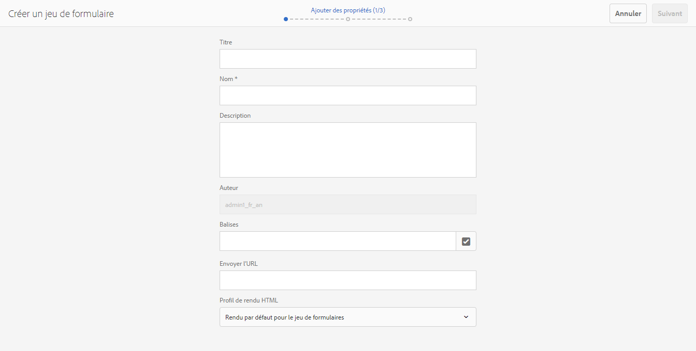
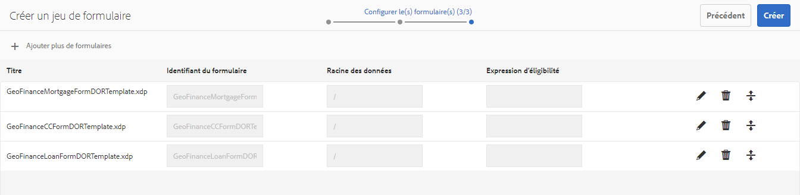
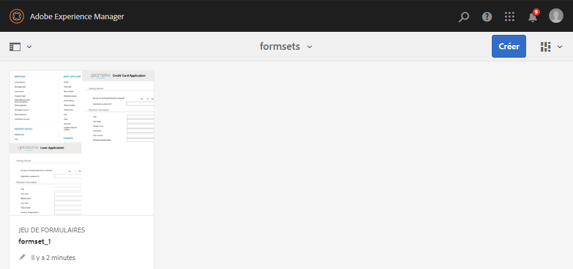

# Jeu de formulaires dans AEM Forms{#form-set-in-aem-forms}

## Présentation {#overview}

Vos clients sont souvent dans l’obligation d’envoyer plusieurs formulaires afin de solliciter un service ou un avantage. Cela implique de trouver tous les formulaires appropriés et de les remplir, les envoyer et les suivre séparément. En outre, il est nécessaire de remplir plusieurs fois des détails communs à plusieurs formulaires. L’ensemble du processus devient fastidieux et des erreurs sont susceptibles d’apparaître s’il implique un grand nombre de formulaires. La fonction de jeu de formulaires d’AEM Forms peut contribuer à simplifier l’expérience de l’utilisateur dans de telles situations.

Un jeu de formulaires est un assortiment de formulaires HTML5 regroupés et présentés comme un ensemble unique de formulaires aux utilisateurs finaux. Lorsque les utilisateurs finaux commencent à compléter un jeu de formulaires, ils passent facilement d’un formulaire à l’autre. A la fin, ils peuvent envoyer tous les formulaires en un seul clic.

AEM Forms fournit aux auteurs de formulaires une interface utilisateur intuitive pour créer, configurer et gérer des jeux de formulaires. En tant qu’auteur, vous pouvez organiser les formulaires de sorte que les utilisateurs finaux suivent un ordre particulier. Par ailleurs, vous pouvez appliquer des conditions ou des expressions d’éligibilité dans des formulaires individuels pour contrôler leur visibilité en fonction des entrées de l’utilisateur. Par exemple, vous pouvez configurer le formulaire des informations sur le conjoint afin qu’il apparaisse uniquement lorsque la valeur Marié(e) est saisie dans le statut de l’état civil.

Qui plus est, vous pouvez paramétrer les champs communs de différents formulaires pour qu’ils partagent des liaisons de données communes. Avec des liaisons de données appropriées, les utilisateurs finaux doivent remplir ces informations communes une seule fois. Ces dernières sont ensuite complétées automatiquement dans les formulaires suivants.

Les jeux de formulaires sont également pris en charge dans l’application AEM Forms, ce qui permet à vos collaborateurs sur le terrain de prendre un jeu de formulaires hors ligne, de rendre visite aux clients, d’entrer les données et d’effectuer une synchronisation ultérieurement avec le serveur AEM Forms pour envoyer des données de formulaires aux processus d’entreprise.

## Création et gestion de jeux de formulaires {#creating-and-managing-form-set}

Vous pouvez associer plusieurs XDP ou modèles de formulaire, créés à l’aide de Designer, à un jeu de formulaires. Les jeux de formulaires peuvent ensuite être utilisés pour effectuer un rendu sélectif des fichiers XDP en fonction des valeurs saisies par les utilisateurs dans les formulaires initiaux et leurs profils.

Utilisez [l’interface utilisateur AEM Forms](../../forms/using/introduction-managing-forms.md) pour gérer tous vos formulaires, jeux de formulaires et ressources connexes.

### Créer un jeu de formulaires {#create-a-form-set}

Pour créer un jeu de formulaires, procédez comme suit :

1. Sélectionnez formulaires > Formulaires &amp; Documents.
1. Sélectionnez Créer > Jeu de formulaires.

1. Dans la page Ajouter des propriétés, ajoutez les détails suivants et cliquez sur Suivant.

   * Titre : indique le titre du document. Le titre vous permet d’identifier le jeu de formulaires dans l’interface utilisateur d’AEM Forms.
   * Description : indique des informations détaillées relatives au document.
   * Balises : indique les balises pour individualiser le jeu de formulaires. Les balises aident à rechercher le jeu de formulaires. Pour créer des balises, saisissez les nouveaux noms de balise dans la boîte de dialogue Balises.
   * URL d’envoi : Indique l’URL où les données envoyées sont publiées pour le cas du rendu autonome du jeu de formulaires (cas d’utilisation d’applications non AEM Forms). Les données sont envoyées vers ce point de fin comme données de formulaire multiples avec le paramètre de requête suivant :
   * dataXML : ce paramètre contient une représentation XML des données du jeu de formulaires envoyé. Si tous les formulaires du jeu utilisent un schéma commun, le fichier XML est généré selon ce schéma. Sinon, la balise XML racine contient une balise enfant pour chaque formulaire rempli du jeu de formulaires contenant les données des pièces jointes du formulaire.
   * formsetPath : le chemin du jeu de formulaires dans CRXDE, qui a été envoyé.
   * Profil de rendu HTML : vous pouvez configurer certaines options telles que les champs flottants, les pièces jointes et la prise en charge de brouillon (pour le rendu d’un jeu de formulaires autonome) pour personnaliser l’apparence, le comportement et les interactions du jeu de formulaires. Vous pouvez personnaliser ou étendre le profil existant pour modifier n’importe quel paramètre du profil du formulaire HTML.

   

1. L’écran Sélectionner le(s) formulaire(s) affiche les formulaires ou les fichiers XDP disponibles. Recherchez et sélectionnez les formulaires à inclure dans le jeu de formulaires, puis cliquez sur Ajouter au jeu de formulaires. Si nécessaire, recherchez à nouveau des formulaires à ajouter. Après avoir ajouté tous les formulaires au jeu de formulaires, cliquez sur Suivant.

   >[!NOTE]
   >
   >Assurez-vous que les noms des champs dans les formulaires XDP ne contiennent pas de points. Dans le cas contraire, tous les scripts contenant des points essayant de résoudre les champs ne seront pas en mesure de le faire.

1. Dans la page Configurer le(s) formulaire(s), vous pouvez effectuer les opérations suivantes : 

   * Ordre des formulaires : faites glisser les formulaires pour les réorganiser. L’ordre des formulaires définit l’ordre dans lequel les formulaires se présentent à l’utilisateur final dans l’application AEM Forms et le rendu autonome.
   * Identifiant du formulaire : spécifie une identité unique pour les formulaires à utiliser dans des expressions d’éligibilité.
   * Racine des données : pour chaque formulaire du jeu, l’auteur peut configurer XPATH où les données d’un formulaire donné sont situées dans les données XML envoyées. Par défaut, la valeur est de /. Si tous les formulaires du jeu sont liés à un schéma et partagent le même schéma XML, vous pouvez modifier cette valeur. Il est recommandé que chaque champ du formulaire ait la liaison de données appropriée spécifiée dans XDP. Si deux champs de deux formulaires différents partagent la liaison de données commune, le champ du second formulaire est pré-rempli avec les valeurs du premier formulaire. Ne liez pas deux sous-formulaires avec le même contenu interne au même nœud XML. Pour plus d’informations sur la structure XML du jeu de formulaires, voir [Préremplissage XML du jeu de formulaires](../../forms/using/formset-in-aem-forms.md#p-prefill-xml-for-form-set-p).
   * Expression d’éligibilité : spécifie une expression JavaScript qui évalue une valeur booléenne et indique si un formulaire du jeu est éligible au remplissage. Si elle est fausse, l’utilisateur n’est pas invité ou le formulaire à remplir n’est pas affiché. En règle générale, l’expression est basée sur les valeurs des champs qui sont collectées avant ce formulaire. Les expressions contiennent également des appels à la valeur de fs.valueOf de l’API du jeu de formulaires pour extraire les valeurs renseignées par l’utilisateur dans un champ de formulaire du jeu de formulaires :

   *fs.valueOf(&lt;form Identifier=&quot;&quot;>,  &lt;fieldsom expression=&quot;&quot;>) >  &lt;value>*

   Par exemple, si vous avez deux formulaires dans le jeu de formulaires (les coûts d’exploitation et les frais de déplacement), vous pouvez ajouter un fragment de code JavaScript dans le champ Expression d’éligibilité pour ces deux formulaires pour contrôler l’entrée utilisateur du type de dépenses dans un formulaire. Si l’utilisateur sélectionne Frais d’exploitation, le formulaire Frais d’exploitation est présenté à l’utilisateur final. Si l’utilisateur sélectionne des frais de transport, un autre formulaire est présenté à l’utilisateur final. Pour plus d’informations, voir Expression d’éligibilité.

   En outre, l’utilisateur peut aussi choisir de supprimer un formulaire du jeu de formulaires à l’aide de l’icône Supprimer dans le coin droit de chaque ligne, ou ajouter un autre jeu de formulaires à l’aide de l’icône « **+** » dans la barre d’outils. L’icône « **+** » redirige l’utilisateur vers l’étape précédente dans l’assistant, qui était « Sélectionner le(s) formulaire(s) ». Les sélections existantes sont conservées et toute sélection supplémentaire doit être ajoutée au jeu de formulaires à l’aide de l’icône « Ajouter au jeu de formulaires » de cette page.

   

   >[!NOTE]
   >
   >Tous les formulaires qui sont utilisés dans le jeu de formulaires sont gérés par l’interface utilisateur d’AEM Forms.

### Gestion d’un jeu de formulaires  {#managing-a-form-set}

Une fois que le jeu de formulaires est créé, vous pouvez y effectuer les actions suivantes :

* Cliquer une fois : lorsque le jeu de formulaires est créé et répertorié sur la page principale des actifs, vous pouvez cliquer une seule fois sur le jeu de formulaires pour l’afficher. Un jeu de formulaires s’ouvre et affiche tous les modèles de formulaire (XPD) dans ce jeu de formulaires.
* Modifier : en cliquant sur « Modifier » après la sélection d’un jeu de formulaires, l’écran « Configurer le(s) formulaire(s) » illustré ci-dessus dans « Procédure de création d’un jeu de formulaires » s’ouvre. Vous pouvez exécuter toutes les fonctionnalités décrites dans cette section.
* Copier + Coller : vous permet de copier l’intégralité du jeu de formulaires depuis un emplacement et de coller le jeu du même emplacement ou dossier, ou ailleurs.
* Télécharger : vous pouvez télécharger le jeu de formulaires avec toutes ses dépendances.
* Lancer/Gérer la révision : une fois que le jeu de formulaires est créé, vous pouvez définir sa révision en cliquant sur Lancer la révision. Une fois la révision lancée pour un jeu de formulaires, l’option Gérer la révision s’affiche. Dans l’écran Gérer la révision, vous pouvez mettre à jour/terminer la révision. Pour les révisions que vous avez ajoutées, vous pouvez vérifier la révision et ajouter des commentaires, si nécessaire. 
* Supprimer : supprime le jeu de formulaires complet. Les formulaires du jeu supprimé demeurent dans le référentiel. 
* Publier/Annuler la publication : cette action publie ou annule la publication du jeu de formulaires avec tous les formulaires qu’il contient et les actifs associés à ces formulaires.
* Aperçu : l’aperçu offre deux options : Aperçu au format HTML (sans données) et Aperçu personnalisé avec des données d’exemple.
* Afficher/Modifier les propriétés : vous pouvez afficher ou modifier les propriétés des métadonnées d’un jeu de formulaires sélectionné.



### Modifier un jeu de formulaires {#edit-a-form-set}

Pour modifier un jeu de formulaires, procédez comme suit : 

1. Sélectionnez formulaires > Formulaires &amp; Documents.
1. Localisez le jeu de formulaires que vous souhaitez modifier. Passez la souris dessus et sélectionnez Modifier ( ).
1. Dans la page Configurer le(s) formulaire(s), vous pouvez modifier les éléments suivants : 

   * L’ordre des formulaires
   * Identifiant du formulaire
   * La racine des données
   * L’expression d’éligibilité

   Vous pouvez également cliquer sur l’icône Supprimer correspondante afin de supprimer le formulaire du jeu.

## Jeu de formulaires dans Process Management  {#form-set-in-process-management}

Une fois que vous avez créé un jeu de formulaires avec l’interface utilisateur de gestion d’AEM Forms, vous pouvez utiliser le jeu de formulaires dans l’activité Point de départ ou Affectation de tâches à l’aide de Workbench.

### Utilisation du jeu de formulaires dans Tâche ou Point de départ  {#using-form-set-in-task-or-start-point}

1. Lors de la conception d’un processus, sous la section Présentation et Données d’Assigner Tâche/Point de départ, sélectionnez **Utilisation d’un actif CRX**. Le navigateur de ressources CRX s’affiche.

   

1. Sélectionnez un jeu de formulaires afin de le filtrer dans le référentiel AEM (CRX).

   

1. Sélectionne un jeu de formulaires et cliquez sur OK.

## Expressions d’éligibilité {#eligibility-expressions}

Les expressions d’éligibilité dans un jeu de formulaires sont utilisées pour définir et contrôler dynamiquement les formulaires affichés à l’utilisateur. Par exemple, pour afficher un formulaire donné uniquement si l’utilisateur appartient à une tranche d’âge particulière. Spécifiez et modifiez une expression d’éligibilité à l’aide de Forms Manager.

Une expression d’éligibilité peut être n’importe quelle instruction JavaScript valide renvoyant une valeur booléenne. La dernière instruction dans le fragment de code JavaScript est traitée comme une valeur booléenne qui détermine l’éligibilité du formulaire basée sur le traitement du reste (lignes précédentes) du fragment de code JavaScript. Si la valeur de l’expression est vraie, le formulaire est éligible pour être affiché à l’utilisateur. Ces formulaires sont appelés formulaires éligibles.

>[!NOTE]
>
>L’expression d’éligibilité du premier formulaire dans le jeu de formulaires n’est pas exécutée. Le premier formulaire est toujours affiché, quelle que soit son expression d’éligibilité.

Outre les fonctions JavaScript standard, le jeu de formulaires expose également la valeur fs.valueOf de l’API qui permet d’accéder à la valeur d’un champ d’un formulaire dans un jeu de formulaires. Utilisez cette API pour accéder à la valeur d’un champ de formulaire dans un jeu de formulaires. La syntaxe API est fs.valueOf (formUid, fieldSOM), où :

* formUid (chaîne) : identifiant univoque d’un formulaire dans le jeu de formulaires. Vous pouvez le définir lors de la création du jeu de formulaires dans l’interface utilisateur de Forms Manager. Par défaut, il s’agit du nom du formulaire.
* fieldSOM (chaîne) : expression A SOM du champ du formulaire spécifié par le formUid. Une expression SOM ou une expression de modèle d’objet de script est utilisée pour référencer des valeurs, des propriétés et des méthodes dans un modèle d’objet de document (DOM) particulier. Vous pouvez l’afficher dans le concepteur de formulaire sous l’onglet Scripts lorsque le champ est sélectionné.

>[!NOTE]
>
>Les paramètres de formUid et de fieldSOM doivent être une chaîne littérale.

### Exemples {#examples}

Utilisation valide de l’API :

`fs.valueOf("form1", "xfa.form.form1.subform1.field1")`

Utilisation non valide de l’API :

```javascript
var formUid = "form1";
 var fieldSOM = “xfa.form.form1.subform1.field1"; fs.valueOf(formUid, fieldSOM);
```

## Préremplissage XML du jeu de formulaires {#prefill-xml-for-form-set}

Un jeu de formulaires est un ensemble de formulaires HTML5 multiples dont les schémas sont communs ou différents. Le jeu de formulaires prend en charge le préremplissage des champs de formulaire à l’aide d’un fichier XML. Vous pouvez associer un fichier XML à un jeu de formulaires. Ainsi, lorsque vous ouvrez un formulaire dans le jeu, certains champs du formulaire sont pré-remplis.

Le fichier XML de pré-remplissage est spécifié à l’aide du paramètre dataRef de l’URL du jeu de formulaires. Le paramètre dataRef spécifie le chemin absolu du fichier XML de données fusionné avec le jeu de formulaires.

Par exemple, vous avez trois formulaires (formulaire 1, formulaire 2 et formulaire 3) dans le jeu de formulaires dont la structure est la suivante :

formulaire1

champ champformulaire1 

formulaire2

champ champformulaire2 

formulaire3

champ champformulaire3 

Chaque formulaire présente un champ nommé communément « champ » et un champ nommé de manière unique « form&lt;i>Field ».

Vous pouvez pré-remplir ce jeu de formulaires à l’aide d’un XML dont la structure est la suivante :

```xml
<?xml version="1.0" encoding="UTF-8" ?>
<formSetRootTag>
 <field>common field value</field>
 <form1field>value1</form1field>
 <form2field>value2</form2field>
 <form3field>value3</form3field>
</formSetRootTag>
```

>[!NOTE]
>
>La balise racine XML peut porter un nom quelconque, mais les balises d’éléments correspondant aux champs doivent porter le même nom que le champ. La hiérarchie du XML doit imiter la hiérarchie du formulaire, ce qui signifie que le XML doit avoir des balises correspondantes pour envelopper les sous-formulaires.

L’extrait de code XML ci-dessus indique que le code XML de préremplissage du jeu de formulaires est une union des extraits de code XML prérempli des formulaires individuels. Si certains champs dans les différents formulaires présentent une hiérarchie de données/un schéma similaires entre eux, les champs sont préremplis avec les mêmes valeurs. Dans cet exemple, les trois formulaires sont préremplis avec la même valeur pour le champ commun, &quot;champ&quot;. Il s’agit d’un moyen facile de transférer des données d’un formulaire à un autre. Ceci peut également être réalisé en liant les champs à la même référence de schéma ou de données. Si vous souhaitez isoler les données du jeu de formulaires en fonction du schéma des formulaires. Ceci peut être réalisé en spécifiant l’attribut « racine de données » du formulaire pendant la création du jeu de formulaires (la valeur par défaut est « / », qui associe à la balise racine du jeu de formulaires). 

Dans l’exemple précédent, si vous spécifiez les racines de données : « /formulaire1 », « /formulaire2 », et « /formulaire3 » respectivement pour les trois formulaires, vous devez utiliser un code XML de préremplissage présentant la structure suivante :

```xml
<?xml version="1.0" encoding="UTF-8" ?>
<formSetRootTag>
 <form1>
  <field>field value1</field>
  <form1field>value1</form1field>
 </form1>
 <form2>
  <field>field value2</field>
  <form2field>value2</form2field>
 </form2>
 <form3>
  <field>field value3</field>
  <form3field>value3</form3field>
 </form3>
</formSetRootTag>
```

Dans un jeu de formulaires, le code XML a défini un schéma XML avec la syntaxe suivante :

```xml
<formset>
 <fs_data>
  <xdp:xdp xmlns:xdp="https://ns.adobe.com/xdp/">
  <xfa:datasets xmlns:xfa="https://www.xfa.org/schema/xfa-data/1.0/">
   <xfa:data>
   <rootElement>
    ... data ....
   </rootElement>
   </xfa:data>
  </xfa:datasets>
  </xdp:xdp>
 </fs_data>
 <fs_draft>
  ... private data...
 </fs_draft>
</formset>
```

>[!NOTE]
>
>S’il existe deux formes présentant des racines de données se chevauchant ou si la hiérarchie d’éléments d’un formulaire chevauche la hiérarchie de racine de données d’un autre formulaire, dans le xml de préremplissage, les valeurs des éléments chevauchés sont fusionnées. Le code XML envoyé est doté d’une structure semblable à celle du code XML de préremplissage, mais comporte plus de balises wrapper et certaines balises de données contextuelles de jeu de formulaires sont ajoutées à la fin.

### Description des éléments XML de pré-remplissage  {#prefill-xml-elements-description}

Règles de syntaxe pour créer un fichier XML de préremplissage :

* éléments parents : éléments pouvant être son parent, où la valeur null indique que l’élément peut être la racine du XML.
* cardinalité : représente le nombre de fois que l’élément peut être utilisé à l’intérieur de l’élément parent.
* submitXML : indique si l’élément est toujours présent (P) ou optionnel (O) dans le XML envoyé.
* prefillXML : indique si l’élément est requis (R) ou optionnel (O) dans le XML prérempli.
* enfants : indique les éléments qui peuvent être ses enfants.

### JEU DE FORMULAIRES  {#formset}

`parent elements:`

`null`

`cardinality: [0,1]`

`submitXML: P`

`prefillXML: O`

`children: fs_data`

Elément racine du XML du jeu de formulaires. Il est conseillé de ne pas utiliser ce mot comme nom de rootSubform d’un formulaire dans le jeu de formulaires.

### FS_DATA  {#fs-data}

`parent elements:`

`formset`

cardinalité : [1]

submitXML : P

prefillXML : O

`children: xdp:xdp/rootElement`

La sous-arborescence indique les données des formulaires dans le jeu de formulaires. L’élément est optionnel dans le XML prérempli uniquement si l’élément du jeu de formulaires n’est pas présent

### XDP :XDP {#xdp-xdp}

`parent elements: fs_data/null`

`cardinality: [0,1]`

`submitXML: O`

`prefillXML: O`

`children: xfa:datasets`

Cette balise indique le début du XML du formulaire HTML5. Cela est ajouté à l’envoi XML s’il est présent dans le XML prérempli ou il n’y a aucun XML prérempli. Cette balise peut être supprimée du XML prérempli.

### XFA : DATASETS {#xfa-datasets}

`parent elements: xdp:xdp`

`cardinality: [1]`

`submitXML: O`

`prefillXML: O`

`children: xfa:data`

### XFA : DATA {#xfa-data}

`parent elements: xfa:datasets`

`cardinality: [1]`

`submitXML: O`

`prefillXML: O`

`children: rootElement`

### ROOTELEMENT {#rootelement}

`parent elements: xfa:datasets/fs_data/null`

`cardinality: [0,1]`

`submitXML: P`

`prefillXML: O`

`children: controlled by the Forms in Form set`

Le rootElement du nom est simplement un espace réservé. Le nom réel est sélectionné dans les formulaires utilisés dans le jeu de formulaires. La sous-arborescence qui début avec rootElement contient les données des champs et des sous-formulaires à l’intérieur du Forms dans le jeu de formulaires. Des facteurs multiples déterminent la structure du rootElement et de ses enfants.

Dans le code XML de préremplissage, cette balise est optionnelle, mais si elle est manquante, le code XML entier est ignoré.

NOM DE LA BALISE DE L’ELEMENT RACINE 

Au cas où il y aurait un élément racine dans le XML prérempli, le nom de cet élément est également présent dans le XML envoyé. S’il n’existe aucun XML prérempli, le nom de l’élément rootElement est le nom du sous-formulaire racine du premier formulaire dans le jeu de formulaires dont la propriété dataRoot est définie sur « / ». En l’absence d’un tel formulaire, le nom de l’élément rootElement est **fs_dummy_root**, qui est un mot-clé réservé.

## Jeu de formulaires dans l’application AEM Forms  {#formset-in-workspace-app}

L’application AEM Forms permet aux agents de terrain de synchroniser leurs périphériques mobiles avec un serveur AEM Forms, puis de travailler sur leurs tâches. L’application est exécutée même lorsque le périphérique est hors ligne et que les données y sont enregistrées en local. A l’aide des fonctions d’annotation comme les photos, les agents de terrain peuvent fournir des informations précises à intégrer dans des processus d’entreprise.

<!-- Update link as it is a 404 - For more information on AEM Forms app, see [AEM Forms app overview](/help/forms/using/mobile-workspace-overview.md).-->

## Limites connues - Modèles qui ne sont pas pleinement pris en charge dans le jeu de formulaires {#known-limitations-patterns-not-fully-supported-in-form-set}

Les modèles de données suivants ne sont pas entièrement pris en charge dans le jeu de formulaires :

<table>
 <tbody>
  <tr>
   <td><strong>Modèle qui n’est pas intégralement pris en charge dans le jeu de formulaires</strong></td>
   <td><strong>Exemple</strong></td>
  </tr>
  <tr>
   <td>Non-concordance de la taille d’entrée et de modèle</td>
   <td><p>Lorsque modèle = num{z,zzz}</p> <p>Et entrée =</p> <p>12,345 ou</p> <p>1,23</p> </td>
  </tr>
  <tr>
   <td>Modèles de clause d’image avec crochets « (’’ ") »</td>
   <td>num{(zz,zzz)}</td>
  </tr>
  <tr>
   <td>Plusieurs modèles de données</td>
   <td>num{zz,zzz} | num{z,zzz,zzz}</td>
  </tr>
  <tr>
   <td>Modèles courts </td>
   <td><p>num.integer{},</p> <p>num.decimal{},</p> <p>num.percent{} ou</p> <p>num.currency{}</p> </td>
  </tr>
 </tbody>
</table>

