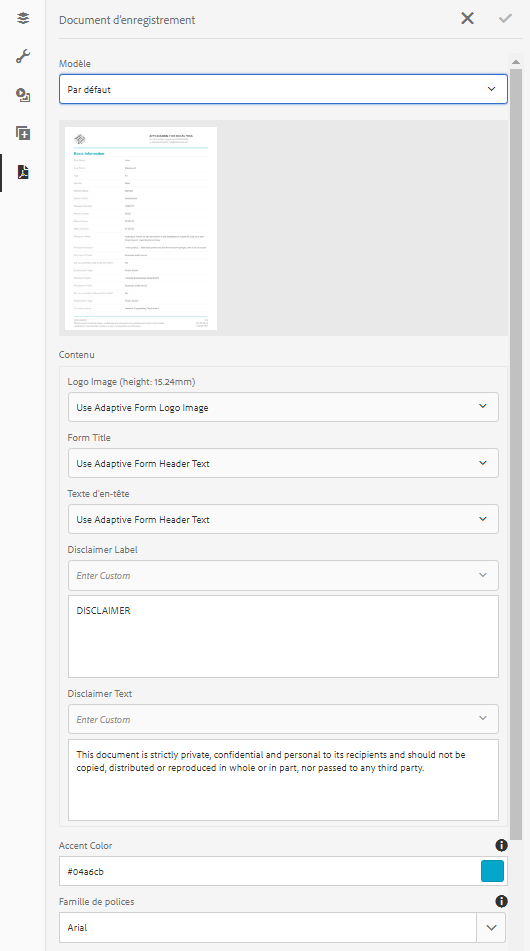

# Générer un document d’enregistrement pour les formulaires adaptatifs{#generate-document-of-record-for-adaptive-forms}

## Présentation {#overview}

Après l’envoi d’un formulaire, vos clients veulent généralement conserver un enregistrement, sous forme imprimée ou en tant que document, des informations qu’ils ont intégrées au formulaire à des fins de référence ultérieure. On parle ici de document d’enregistrement.

Cet article explique comment vous pouvez générer un document d’enregistrement pour les formulaires adaptatifs.

>[!NOTE]
>
>La génération automatique du document d’enregistrement n’est pas prise en charge pour les formulaires adaptatifs basés sur XFA. Cependant, vous pouvez vous servir du fichier XDP utilisé pour créer le formulaire adaptatif comme document d’enregistrement.

## Types de formulaire adaptatif et leurs documents d’enregistrement {#adaptive-form-types-and-their-documents-of-record}

Lorsque vous créez un formulaire adaptatif, vous pouvez sélectionner un modèle de formulaire. Vous avez le choix entre :

* [Modèles de formulaire](../../forms/using/creating-adaptive-form.md#create-an-adaptive-form-based-on-an-xfa-form-template) Vous permet de sélectionner un modèle XFA pour votre formulaire adaptatif. Lorsque vous sélectionnez un modèle XFA, vous pouvez utiliser le fichier XDP associé pour le document d’enregistrement, comme décrit ci-dessus.

* [Schéma XML](../../forms/using/creating-adaptive-form.md#create-an-adaptive-form-based-on-xml-or-json-schema) Vous permet de sélectionner une définition de schéma XML pour votre formulaire adaptatif. Lorsque vous sélectionnez un schéma XML pour votre formulaire adaptatif, vous pouvez :

   * Associer un modèle XFA pour créer un document d’enregistrement. Assurez-vous que ce modèle XFA associé utilise le même schéma XML que votre formulaire adaptatif.
   * Générer automatiquement le document d’enregistrement

* Aucun Vous permet de créer un formulaire adaptatif sans modèle de formulaire. Le document d’enregistrement est généré automatiquement pour votre formulaire adaptatif.

Lorsque vous sélectionnez un modèle de formulaire, configurez le document d’enregistrement à l’aide des options disponibles sous Configuration du modèle de Document d’enregistrement. See [Document of Record Template Configuration](#document-of-record-template-configuration).

## Document d’enregistrement automatiquement généré {#automatically-generated-document-of-record}

Un document d’enregistrement permet aux clients de conserver une copie du formulaire envoyé en vue de son impression. Lorsque vous générez automatiquement un document d’enregistrement, chaque fois que vous modifiez votre formulaire, son document d’enregistrement est immédiatement mis à jour. Par exemple, imaginons que vous supprimez le champ relatif à l’âge pour les clients qui sélectionnent Etats-Unis comme leur pays. Lorsque ces clients génèrent un document d’enregistrement, le champ relatif à l’âge ne leur est pas accessible.

Le document d’enregistrement généré automatiquement présente les avantages suivants :

* Il prend en charge la liaison de données.
* Elle masque automatiquement les champs marqués comme exclus du document d’enregistrement au moment de l’envoi. Aucune opération supplémentaire n’est requise.
* Cela permet de gagner du temps lors de la conception d’un modèle de document d’enregistrement.
* Il vous permet de tester des styles et des aspects différents à l’aide de divers modèles de base et de sélectionner les meilleurs style et aspect pour le document d’enregistrement. L’utilisation de styles est facultative. Si vous ne spécifiez aucun style, les styles du système sont définis comme valeur par défaut.
* De cette façon, toute modification appliquée au formulaire se répercute immédiatement dans le document d’enregistrement.

## Composants de génération automatique de document d’enregistrement {#components-to-automatically-generate-a-document-of-record}

Pour générer un document d’enregistrement pour les formulaires adaptatifs, vous avez besoin des composants suivants :

**Formulaire** adaptatif Formulaire adaptatif pour lequel vous souhaitez générer un document d’enregistrement.

**Modèle de base (recommandé)** modèle XFA (fichier XDP) créé dans AEM Designer. Le modèle de base permet de spécifier les informations de style et de marque pour le modèle de document d’enregistrement.

See [Base template of a document of record](#base-template-of-a-document-of-record)

>[!NOTE]
>
>Le modèle de base d&#39;un document d&#39;enregistrement est également appelé méta-modèle d&#39;un document d&#39;enregistrement.

**Document du modèle** d’enregistrement de modèle XFA (fichier XDP) généré à partir d’un formulaire adaptatif.

See [Document of Record Template Configuration](#document-of-record-template-configuration).

**Données** du formulaire Informations fournies par un utilisateur dans le formulaire adaptatif. Il fusionne avec le modèle document d’enregistrement pour générer le document d’enregistrement.

## Mappage des éléments du formulaire adaptatif {#mapping-of-adaptive-form-elements}

Les sections suivantes décrivent l’apparence des éléments du formulaire adaptatif dans un document d’enregistrement.

### Champs {#fields}

<table>
 <tbody>
  <tr>
   <th>Composant de formulaire adaptatif</th>
   <th>Composant XFA correspondant</th>
   <th>Inclus par défaut dans le modèle de document d’enregistrement ?</th>
   <th>Notes</th>
  </tr>
  <tr>
   <td>Bouton</td>
   <td>Bouton</td>
   <td>false</td>
   <td> </td>
  </tr>
  <tr>
   <td>Case à cocher</td>
   <td>Case à cocher</td>
   <td>true</td>
   <td> </td>
  </tr>
  <tr>
   <td>Sélecteur de date</td>
   <td>Date/Heure</td>
   <td>true</td>
   <td> </td>
  </tr>
  <tr>
   <td>Liste déroulante</td>
   <td>Liste déroulante</td>
   <td>true</td>
   <td> </td>
  </tr>
  <tr>
   <td>Signature tactile</td>
   <td>Signature tactile</td>
   <td>true</td>
   <td> </td>
  </tr>
  <tr>
   <td>Champ numérique</td>
   <td>Champ numérique</td>
   <td>true</td>
   <td> </td>
  </tr>
  <tr>
   <td>Champ de mot de passe</td>
   <td>Champ Mot de passe</td>
   <td>false</td>
   <td> </td>
  </tr>
  <tr>
   <td>Bouton radio</td>
   <td>Bouton radio</td>
   <td>true</td>
   <td> </td>
  </tr>
  <tr>
   <td>Zone de texte</td>
   <td>Champ de texte</td>
   <td>true</td>
   <td> </td>
  </tr>
  <tr>
   <td>Bouton Réinitialiser</td>
   <td>Bouton Réinitialiser</td>
   <td>false</td>
   <td> </td>
  </tr>
  <tr>
   <td>Bouton Envoyer</td>
   <td><p>Bouton Envoyer par messagerie</p> <p>Bouton Envoyer via HTTP</p> </td>
   <td>false</td>
   <td> </td>
  </tr>
  <tr>
   <td>Conditions d’utilisation</td>
   <td> </td>
   <td>true</td>
   <td> </td>
  </tr>
  <tr>
   <td>Pièce jointe</td>
   <td> </td>
   <td>false</td>
   <td>Non disponible dans le modèle document d’enregistrement. Disponible uniquement dans le document d'enregistrement par le biais de pièces jointes.</td>
  </tr>
 </tbody>
</table>

### Conteneurs {#containers}

<table>
 <tbody>
  <tr>
   <th>Composant de formulaire adaptatif</th>
   <th>Composant XFA correspondant</th>
   <th>Notes</th>
  </tr>
  <tr>
   <td>Panneau<br /> </td>
   <td>Sous-formulaire<br /> </td>
   <td>Le panneau répétable se mappe au sous-formulaire répétable.</td>
  </tr>
 </tbody>
</table>

### Composants statiques {#static-components}

| Composant de formulaire adaptatif | Composant XFA correspondant | Notes |
|---|---|---|
| Image | Image | Les composants TextDraw et Image, qu’ils soient liés ou non, apparaissent toujours dans le document d’enregistrement d’un formulaire adaptatif XSD, sauf si ils sont exclus à l’aide des paramètres de document d’enregistrement. |
| Text (Texte) | Text (Texte) |

>[!NOTE]
>
>Dans l’interface utilisateur classique, vous disposez de divers onglets pour modifier les propriétés des champs.

### Tables {#tables}

Composants tabulaires des formulaires adaptatifs (en-tête, pied de page et lignes) associés aux composants XFA correspondants. Vous pouvez mapper des panneaux répétables aux tableaux dans un document d’enregistrement.

## Modèle de base d’un document d’enregistrement {#base-template-of-a-document-of-record}

Le modèle de base fournit les informations relatives au style et à l’aspect du document d’enregistrement. Vous pouvez ainsi personnaliser l’aspect par défaut du document d’enregistrement généré automatiquement. Imaginons que vous souhaitez ajouter le logo de votre entreprise dans l’en-tête et les informations relatives au droit d’auteur dans le pied de page du document d’enregistrement. Le gabarit du modèle de base est utilisé comme gabarit de modèle de document d’enregistrement. Le gabarit peut comporter des informations telles que l’en-tête, le pied et le numéro de page, que vous pouvez appliquer au document d’enregistrement. Vous pouvez appliquer ces informations au document d’enregistrement à l’aide du modèle de base pour la génération automatique du document d’enregistrement. L’utilisation d’un modèle de base vous permet de modifier les propriétés par défaut des champs.

Respectez les [conventions relatives aux modèles de base](#base-template-conventions) lorsque vous créez un modèle de base.

## Conventions relatives aux modèles de base {#base-template-conventions}

Un modèle de base sert à définir l’en-tête, le pied de page, le style et l’aspect d’un document d’enregistrement. L’en-tête et le pied de page peuvent inclure des informations telles que le logo de l’entreprise et le texte de droit d’auteur. Le premier gabarit du modèle de base est copié et utilisé comme gabarit pour le document d’enregistrement, qui contient l’en-tête, le pied de page, le numéro de page ou toute autre information qui doit apparaître sur toutes les pages du document d’enregistrement. Si vous utilisez un modèle de base qui n’est pas conforme aux conventions relatives aux modèles de base, le premier gabarit du modèle de base est toujours utilisé dans le modèle de document d’enregistrement. Il vous est fortement recommandé de créer votre modèle de base en fonction des conventions correspondantes et de l’utiliser pour la génération automatique du document d’enregistrement.

**Conventions relatives aux gabarits**

* In the base template, you should name the root subform as `AF_METATEMPLATE` and the master page as `AF_MASTERPAGE`.

* The master page with the name `AF_MASTERPAGE` located under the `AF_METATEMPLATE` root subform is given preference for extracting header, footer, and styling information.

* En l’absence de gabarit `AF_MASTERPAGE`, le premier gabarit présent dans le modèle de base est utilisé.

**Conventions relatives au style des champs**

* Pour appliquer un style aux champs du document d’enregistrement, le modèle de base fournit les champs situés dans le sous-formulaire `AF_FIELDSSUBFORM` sous le sous-formulaire racine `AF_METATEMPLATE`.

* Les propriétés de ces champs sont appliquées aux champs du document d’enregistrement. Ces champs doivent respecter la convention d’ `AF_<name of field in all caps>_XFO` attribution des noms. For example, the field name for check box should be `AF_CHECKBOX_XFO`.

Pour créer un modèle de base, procédez comme suit dans AEM Designer.

1. Cliquez sur **Fichier > Nouveau**.
1. Sélectionnez l’option **Basé sur un modèle**.

1. Choisissez la catégorie **Formulaires - Document d’enregistrement**.
1. Sélectionnez **Modèle de base de DE**.
1. Cliquez sur **Suivant** et renseignez les informations requises.

1. (Facultatif) Modifiez le style et l’aspect que vous souhaitez appliquer aux champs du document d’enregistrement.
1. Enregistrez le formulaire.

Vous pouvez désormais utiliser le formulaire enregistré comme modèle de base de document d’enregistrement.
Ne modifiez ou ne supprimez aucun script du modèle de base.

**Modification du modèle de base**

* Si vous n’appliquez aucun style aux champs du modèle de base, il est recommandé de les supprimer afin que toutes les mises à niveau du modèle de base soient automatiquement reportées.
* Lors de la modification du modèle de base, ne supprimez, n’ajoutez ou ne modifiez pas les scripts.

>[!NOTE]
>
>Créez un modèle de base conforme aux conventions et en suivant scrupuleusement la procédure ci-dessus.

## Configuration du modèle de document d’enregistrement {#document-of-record-template-configuration}

Configurez le modèle de document d’enregistrement de votre formulaire pour permettre à vos clients de télécharger une copie imprimable du formulaire envoyé. Un fichier XDP sert de modèle de document d’enregistrement. Le document d’enregistrement téléchargé par les clients est formaté en fonction de la mise en page spécifiée dans le fichier XDP.

Effectuez les étapes suivantes pour configurer un document d’enregistrement pour les formulaires adaptatifs :

1. Dans l’instance d’auteur AEM, cliquez sur **formulaires > Formulaires et documents.**
1. Sélectionnez un formulaire, puis cliquez sur **Afficher les propriétés**.
1. In the Properties window, tap **Form Model**.
Vous pouvez également sélectionner un modèle de formulaire lorsque vous créez un formulaire.

   >[!NOTE]
   >
   >Dans l’onglet Modèle de formulaire, veillez à sélectionner **Schéma ** ou **Aucun** dans la liste déroulante **Sélectionner dans**. **[!UICONTROL Le document d’enregistrement n’est pas pris en charge pour les formulaires XFA ou les formulaires adaptatifs avec modèle de formulaire comme modèle de formulaire.]**

1. Dans la section Configuration du modèle de document d’enregistrement de l’onglet Modèle de formulaire, sélectionnez l’une des options suivantes :

   **Aucune** Sélectionnez cette option si vous ne souhaitez pas configurer le document d’enregistrement pour le formulaire.

   **Associer un modèle de formulaire comme modèle** de Document d’enregistrement Sélectionnez cette option si vous disposez d’un fichier XDP que vous souhaitez utiliser comme modèle pour le document d’enregistrement. Lorsque vous sélectionnez cette option, tous les fichiers XDP disponibles dans le référentiel AEM Forms s’affichent. Sélectionnez le fichier approprié.

   Le fichier XDP sélectionné est associé au formulaire adaptatif.

   **Générer un Document d&#39;enregistrement** Sélectionnez cette option pour utiliser un fichier XDP comme modèle de base pour définir le style et l&#39;aspect du document d&#39;enregistrement. Lorsque vous sélectionnez cette option, tous les fichiers XDP disponibles dans le référentiel AEM Forms s’affichent. Sélectionnez le fichier approprié.

   **[!UICONTROL Sélectionnez cette option pour utiliser un fichier XDP comme modèle de base pour définir le style et l’aspect du document d’enregistrement. Lorsque vous sélectionnez cette option, tous les fichiers XDP disponibles dans le référentiel AEM Forms s’affichent. Choisissez le type de fichier approprié.]**

   **Sélectionnez Modèle Forms comme modèle de base pour générer un Document d’enregistrement** Sélectionnez cette option pour utiliser un fichier XDP comme modèle de base pour définir le style et l’aspect du document d’enregistrement. Lorsque vous sélectionnez cette option, tous les fichiers XDP disponibles dans le référentiel AEM Forms s’affichent. Sélectionnez le fichier approprié.

   >[!NOTE]
   >
   >Assurez-vous que le schéma utilisé pour créer le formulaire adaptatif et le schéma (schéma de données) du formulaire XFA sont identiques si :
   >
   >
   >
   >    * Votre formulaire adaptatif est basé sur un schéma
   >    * You are using **Associate Form Template as the Document of Record Template** option for document of record


1. Cliquez sur **Terminé.**

## Personnaliser les informations d’identité graphique d’un document d’enregistrement {#customize-the-branding-information-in-document-of-record}

Lors de la génération d’un document d’enregistrement, vous pouvez modifier les informations d’identité graphique pour le document d’enregistrement dans l’onglet Document d’enregistrement. L’onglet Document d’enregistrement inclut des options telles que le logo, l’apparence, la mise en page, l’en-tête et le pied de page, la clause de non-responsabilité et si vous souhaitez inclure des options de case à cocher et de bouton radio désélectionnées.

Pour localiser les informations d’identité graphique que vous saisissez dans l’onglet Document d’enregistrement, vous devez vous assurer que le paramètre régional du navigateur est défini correctement. Pour personnaliser les informations d’identité graphique du document d’enregistrement, procédez comme suit :

1. Select a panel (root panel) in the document of record and then tap .
1. Appuyez sur . L’onglet Document d’enregistrement apparaît.
1. Sélectionnez le modèle par défaut ou un modèle personnalisé pour le rendu du document d’enregistrement. Si vous sélectionnez le modèle par défaut, une vignette d’aperçu du document d’enregistrement apparaît sous la liste déroulante Modèle.

   

   Si vous choisissez de sélectionner un modèle personnalisé, sélectionnez un fichier XDP sur votre serveur AEM Forms. Si vous souhaitez utiliser un modèle qui n’est pas sur votre serveur AEM Forms, vous devez au préalable télécharger le fichier XDP sur votre serveur AEM Forms.

1. Si vous sélectionnez un modèle par défaut ou un modèle personnalisé, certaines ou toutes les propriétés suivantes apparaissent dans l’onglet Document d’enregistrement. Spécifiez-les en conséquence :

   * **Image du logo** : vous pouvez choisir d’utiliser l’image du logo à partir du formulaire adaptatif, en choisir une dans le gestionnaire des actifs numériques ou en télécharger une depuis votre ordinateur.
   * **Titre du formulaire**
   * **Texte d’en-tête**
   * **Libellé de cause de non-responsabilité**
   * **Clause de non-responsabilité**
   * **Texte de la clause de non-responsabilité**
   * **Couleur d’accentuation** : la couleur dans laquelle le texte de l’en-tête et les lignes de séparation sont affichées dans le document ou l’enregistrement PDF
   * **Famille de polices** : la famille de polices du texte dans le document d’enregistrement PDF
   * **Pour les composants de case à cocher et de bouton radio, afficher uniquement les valeurs sélectionnées**
   * **Séparateur pour plusieurs valeurs sélectionnées**
   * **Inclure les objets de formulaire qui ne sont pas associés à un modèle de données**
   * **Exclure les champs masqués du document d’enregistrement**
   * **Masquer la description des panneaux**

   >[!NOTE]
   >
   >Si vous utilisez un modèle de formulaire adaptatif créé avec une version de Designer antérieure à 6.3, pour que les propriétés Couleur d’accentuation et Famille de polices fonctionnent, assurez-vous que les éléments suivants sont présents dans votre modèle de formulaire adaptatif sous le sous-formulaire racine :

   ```xml
   <proto>
   <font typeface="Arial"/>
   <fill>
   <color value="4,166,203"/>
   </fill>
   <edge>
   <color value="4,166,203"/>
   </edge>
   </proto>
   ```

1. Pour enregistrer les modifications d’identité graphique, appuyez sur Terminé.

## Mises en page de tableau et de colonne pour les panneaux d’un document d’enregistrement {#table-and-column-layouts-for-panels-in-document-of-record}

Votre formulaire adaptatif peut être long avec plusieurs champs de formulaire. Vous ne pouvez pas enregistrer un document d’enregistrement en tant que copie exacte du formulaire adaptatif. Vous pouvez maintenant choisir une mise en page de tableau ou de colonne pour enregistrer un ou plusieurs panneaux de formulaires adaptatifs dans le document d’enregistrement PDF.

Avant de générer un document d’enregistrement, dans les paramètres d’un panneau, sélectionnez Tableau ou Colonne pour Mise en page du document d’enregistrement pour ce panneau. Les champs du panneau sont organisés en conséquence dans le document d’enregistrement.


Champs dans un panneau rendu dans une mise en page de tableau dans le document d’enregistrement


Champs dans un panneau rendu dans une mise en page de colonne dans le document d’enregistrement

## Paramètres des documents d’enregistrement {#document-of-record-settings}

Les paramètres de document d’enregistrement vous permettent de choisir les options à inclure dans le document d’enregistrement. Par exemple, une banque accepte les informations suivantes dans un formulaire : nom, âge, numéro de sécurité sociale et numéro de téléphone. Le formulaire génère un numéro de compte bancaire et les informations sur la banque. Vous pouvez choisir de n’afficher que le nom, le numéro de sécurité sociale, le compte bancaire et les informations sur la banque dans le document d’enregistrement.

Le document des paramètres d’enregistrement d’un composant est disponible sous ses propriétés. To access the properties a component, select the component and click  in the overlay. Les propriétés sont répertoriées dans la barre latérale. Vous y trouvez les paramètres suivants.

**Paramètres sur le terrain**

* **Exclure du document d’enregistrement :** la définition de cette propriété sur true exclut le champ du document d’enregistrement. Il s’agit d’une propriété pouvant faire l’objet d’un script appelée `excludeFromDoR`. Son comportement dépend de la propriété au niveau du formulaire **Exclure des champs du document d’enregistrement (DE) s’il est masqué**.

* **Afficher le panneau sous forme de tableau :** La définition de la propriété affiche le panneau sous forme de tableau dans le document d’enregistrement si le panneau comporte moins de 6 champs. Applicable au panneau uniquement.
* **Exclure le titre du document d’enregistrement :** la définition de la propriété exclut le titre du panneau/tableau du document d’enregistrement. Applicable au panneau et à la table uniquement.
* **Exclure la description du document d’enregistrement :** la définition de la propriété exclut la description du panneau/tableau du document d’enregistrement. Applicable au panneau et à la table uniquement.

**Paramètres des niveaux de formulaires**

* **Inclure les champs non liés dans le document d’enregistrement :** la définition de la propriété comprend les champs non liés du schéma basé sur le formulaire adaptatif du document d’enregistrement. Par défaut, le paramètre est true.
* **Exclure des champs du document d’enregistrement (DE) s’il est masqué :** La définition de cette propriété remplace le comportement de la propriété de niveau de champ Exclure du document d’enregistrement lorsque le paramètre est différent de true. Si les champs sont masqués au moment de l’envoi du formulaire, ils seront exclus du document d’enregistrement si la propriété est définie sur true, à condition que la propriété &quot;Exclure du Document d’enregistrement&quot; ne soit pas définie.

## Considérations essentielles lors de l’utilisation de documents d’enregistrement {#key-considerations-when-working-with-document-of-record}

Gardez à l’esprit les points et limitations suivants lorsque vous travaillez sur un document d’enregistrement pour les formulaires adaptatifs.

* Le document des modèles d’enregistrement ne prend pas en charge le texte enrichi. Par conséquent, tout texte enrichi dans le formulaire adaptatif statique ou dans les informations renseignées par l’utilisateur final est remplacé par du texte brut dans le document d’enregistrement.
* Les fragments de document contenus dans un formulaire adaptatif n’apparaissent pas dans le document d’enregistrement. Les fragments de formulaire adaptatif sont toutefois pris en charge.
* Le document d&#39;enregistrement est utilisé à des fins d&#39;impression uniquement.
* La liaison de contenu dans le document de l’enregistrement généré pour le formulaire adaptatif de schéma XML n’est pas prise en charge.
* La liaison de contenu dans le document de l’enregistrement généré pour le formulaire adaptatif de schéma XML n’est pas prise en charge.
* La version localisée du document d’enregistrement est créée sur demande pour un paramètre régional lorsque l’utilisateur demande le rendu du document d’enregistrement. La localisation du document d’enregistrement est effectuée en même temps que la localisation du formulaire adaptatif. Pour plus d’informations sur la localisation du document d’enregistrement et des formulaires adaptatifs, voir [Utilisation de processus de traduction AEM pour la localisation des formulaires adaptatifs et du document d’enregistrement](/help/forms/using/using-aem-translation-workflow-to-localize-adaptive-forms.md).

