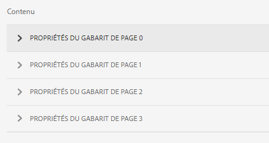

# Générer un document d’enregistrement pour les formulaires adaptatifs ou les fragments de formulaires adaptatifs {#generate-document-of-record-for-adaptive-forms}

<span class="preview"> Adobe recommande d’utiliser les [composants principaux](https://experienceleague.adobe.com/docs/experience-manager-core-components/using/adaptive-forms/introduction.html?lang=fr) de capture de données modernes et extensibles pour [créer de nouveaux formulaires adaptatifs](/help/forms/using/create-an-adaptive-form-core-components.md) ou [ajouter des formulaires adaptatifs à des pages AEM Sites](/help/forms/using/create-or-add-an-adaptive-form-to-aem-sites-page.md). Ces composants représentent une avancée significative dans la création de formulaires adaptatifs, ce qui garantit des expériences utilisateur impressionnantes. Cet article décrit l’ancienne approche de la création de formulaires adaptatifs à l’aide de composants de base. </span>

| Version | Lien de l’article |
| -------- | ---------------------------- |
| AEM as a Cloud Service | [Cliquez ici](https://experienceleague.adobe.com/docs/experience-manager-cloud-service/content/forms/adaptive-forms-authoring/authoring-adaptive-forms-foundation-components/generate-document-of-record-for-non-xfa-based-adaptive-forms.html) |
| AEM 6.5 | Cet article |


## Vue d’ensemble {#overview}

Après l’envoi d’un formulaire, vos clients veulent généralement conserver un enregistrement, sous forme imprimée ou de document, des informations qu’ils ont intégrées au formulaire pour s’y reporter ultérieurement. On parle ici de document d’enregistrement.

Cet article explique comment générer un document d’enregistrement pour les formulaires adaptatifs ou un fragment de formulaire adaptatif.

>[!NOTE]
>
> La prise en charge de la personnalisation de vos fragments de formulaire adaptatif et de ses champs dans l’éditeur de formulaire adaptatif a été introduite avec AEM 6.5 Forms Service Pack 19 (6.5.19.0).


>[!NOTE]
>
>La génération automatique de document d’enregistrement n’est pas prise en charge pour les formulaires adaptatifs XFA. Cependant, vous pouvez vous servir du fichier XDP utilisé pour créer le formulaire adaptatif comme document d’enregistrement.

## Types de formulaires adaptatifs et leurs documents d’enregistrement {#adaptive-form-types-and-their-documents-of-record}

Lorsque vous créez un formulaire adaptatif, vous pouvez sélectionner un modèle de formulaire. Vous avez le choix entre :

* [Modèles de formulaire](../../forms/using/creating-adaptive-form.md#create-an-adaptive-form-based-on-an-xfa-form-template) Vous permet de sélectionner un modèle XFA pour votre formulaire adaptatif. Lorsque vous sélectionnez un modèle XFA, vous pouvez utiliser le fichier XDP associé pour créer le document d’enregistrement, comme décrit ci-dessus.

* [Schéma XML](../../forms/using/creating-adaptive-form.md#create-an-adaptive-form-based-on-xml-or-json-schema) Vous permet de sélectionner une définition de schéma XML pour votre formulaire adaptatif. Lorsque vous sélectionnez un schéma XML pour votre formulaire adaptatif, vous pouvez :

   * associer un modèle XFA pour créer un document d’enregistrement. Assurez-vous que ce modèle XFA associé utilise le même schéma XML que votre formulaire adaptatif.
   * Générer automatiquement un document d’enregistrement

* Aucun Vous permet de créer un formulaire adaptatif sans modèle de formulaire. Le document d’enregistrement est généré automatiquement pour votre formulaire adaptatif.

Lorsque vous sélectionnez un modèle de formulaire, configurez le document d’enregistrement à l’aide des options disponibles sous Configuration du modèle de document d’enregistrement. Voir [Configuration du modèle de document d’enregistrement](#document-of-record-template-configuration).

## Document d’enregistrement automatiquement généré {#automatically-generated-document-of-record}

Un document d’enregistrement permet aux clients et clientes de conserver une copie du formulaire envoyé afin de l’imprimer. Lorsque vous générez automatiquement un document d’enregistrement, à chaque fois que vous modifiez votre formulaire, son document d’enregistrement est immédiatement mis à jour. Par exemple, imaginons que vous supprimez le champ concernant l’âge pour les clients qui ont sélectionné les États-Unis comme pays. Lorsque ces clients et ces clientes génèrent un document d’enregistrement, le champ relatif à l’âge ne leur est pas accessible.

Voici les avantages apportés par un document d’enregistrement automatiquement généré :

* Il prend en charge la liaison de données.
* Il masque automatiquement les champs marqués comme exclus du document d’enregistrement au moment de l’envoi. Aucune opération supplémentaire n’est nécessaire.
* Il permet de gagner du temps lors de la conception d’un modèle de document d’enregistrement.
* Il permet de tester des styles et des aspects différents à l’aide de différents modèles de base et de sélectionner les meilleurs style et aspect pour le document d’enregistrement. L’utilisation de styles est facultative. Si vous ne spécifiez pas de style, les styles du système sont définis comme valeur par défaut.
* De cette façon, toute modification appliquée au formulaire se répercute immédiatement dans le document d’enregistrement.

## Composants pour générer automatiquement un document d’enregistrement {#components-to-automatically-generate-a-document-of-record}

Pour générer un document d’enregistrement pour les formulaires adaptatifs, il vous faut les éléments suivants :

**Formulaire adaptatif** : un formulaire adaptatif pour lequel vous souhaitez générer un document d’enregistrement.

**Fragment de formulaire adaptatif** Un fragment de formulaire adaptatif pour lequel vous souhaitez générer un document d’enregistrement.

**Modèle de base (recommandé)** : modèle XFA (fichier XDP) créé dans AEM Designer. Le modèle de base est utilisé pour spécifier les informations en termes de style et d’identité graphique pour le modèle de document d’enregistrement.

Voir [Modèle de base d’un document d’enregistrement](#base-template-of-a-document-of-record).

>[!NOTE]
>
>Le modèle de base d’un document d’enregistrement est également appelé métamodèle de document d’enregistrement.

**Modèle de document d’enregistrement** : modèle XFA (fichier XDP) généré à partir d’un formulaire adaptatif.

Voir [Configuration du modèle de document d’enregistrement](#document-of-record-template-configuration).

**Données de formulaire** : informations renseignées par un utilisateur dans le formulaire adaptatif. Il fusionne avec le modèle de document d’enregistrement pour générer le document d’enregistrement.

## Mappage des éléments du formulaire adaptatif {#mapping-of-adaptive-form-elements}

Les sections ci-dessous décrivent l’apparence des éléments d’un formulaire adaptatif dans un document d’enregistrement.

### Champs {#fields}

<table>
 <tbody>
  <tr>
   <th>Composant de formulaire adaptatif</th>
   <th>Composant XFA correspondant</th>
   <th>Inclus par défaut dans le modèle de document d’enregistrement ?</th>
   <th>Remarques</th>
  </tr>
  <tr>
   <td>Bouton</td>
   <td>Bouton</td>
   <td>false</td>
   <td> </td>
  </tr>
  <tr>
   <td>Case à cocher</td>
   <td>Case à cocher</td>
   <td>true</td>
   <td> </td>
  </tr>
  <tr>
   <td>Sélecteur de date</td>
   <td>Champ Date/Heure</td>
   <td>true</td>
   <td> </td>
  </tr>
  <tr>
   <td>Liste déroulante</td>
   <td>Liste déroulante</td>
   <td>true</td>
   <td> </td>
  </tr>
  <tr>
   <td>Signature tactile</td>
   <td>Signature tactile</td>
   <td>true</td>
   <td> </td>
  </tr>
  <tr>
   <td>Zone numérique</td>
   <td>Champ numérique</td>
   <td>true</td>
   <td> </td>
  </tr>
  <tr>
   <td>Zone de mot de passe</td>
   <td>Champ Mot de passe</td>
   <td>false</td>
   <td> </td>
  </tr>
  <tr>
   <td>Bouton radio</td>
   <td>Bouton radio</td>
   <td>true</td>
   <td> </td>
  </tr>
  <tr>
   <td>Zone de texte</td>
   <td>Champ de texte</td>
   <td>true</td>
   <td> </td>
  </tr>
  <tr>
   <td>Bouton de réinitialisation</td>
   <td>Bouton de réinitialisation</td>
   <td>false</td>
   <td> </td>
  </tr>
  <tr>
   <td>Bouton Envoyer</td>
   <td><p>Bouton Envoyer par e-mail</p> <p>Bouton Envoyer via HTTP</p> </td>
   <td>false</td>
   <td> </td>
  </tr>
  <tr>
   <td>Termes et conditions</td>
   <td> </td>
   <td>true</td>
   <td> </td>
  </tr>
  <tr>
   <td>Pièce jointe</td>
   <td> </td>
   <td>false</td>
   <td>Non disponible dans le modèle de document d’enregistrement. Uniquement disponible dans le document d’enregistrement par les pièces jointes.</td>
  </tr>
 </tbody>
</table>

### Conteneurs {#containers}

<table>
 <tbody>
  <tr>
   <th>Composant de formulaire adaptatif</th>
   <th>Composant XFA correspondant</th>
   <th>Remarques</th>
  </tr>
  <tr>
   <td>Panneau<br /> </td>
   <td>Sous-formulaire<br /> </td>
   <td>Le panneau répétable est mappé à un sous-formulaire répétable.</td>
  </tr>
 </tbody>
</table>

### Composants statiques {#static-components}

| Composant de formulaire adaptatif | Composant XFA correspondant | Remarques |
|---|---|---|
| Image | Image | Qu’ils soient liés ou non, les composants TextDraw et Image apparaissent toujours dans le document d’enregistrement relatif à un formulaire adaptatif basé sur XSD, à moins que cela ne soit exclu dans les paramètres de document d’enregistrement. |
| Texte | Texte |

>[!NOTE]
>
>Dans l’interface utilisateur classique, vous disposez de différents onglets pour modifier les propriétés des champs.

### Tableaux {#tables}

Les composants des tableaux de formulaires adaptatifs, comme l’en-tête, le pied de page et les lignes sont mappés aux composants XFA correspondants. Vous pouvez mapper des panneaux répétables aux tableaux dans un document d’enregistrement.

## Modèle de base d’un document d’enregistrement {#base-template-of-a-document-of-record}

Le modèle de base fournit les informations de style et d’aspect au document d’enregistrement. Il permet de personnaliser l’aspect par défaut d’un document d’enregistrement généré automatiquement. Par exemple, imaginons que vous souhaitiez ajouter le logo de votre entreprise dans l’en-tête et les informations sur les droits d’auteur dans le pied de page du document d’enregistrement. Le gabarit de page du modèle de base est utilisé comme gabarit pour le modèle de document d’enregistrement. Le gabarit de page peut comporter des informations comme l’en-tête, le pied de page et le numéro de page, que vous pouvez appliquer au document d’enregistrement. Vous pouvez appliquer ces informations au document d’enregistrement à l’aide d’un modèle de base pour générer automatiquement un document d’enregistrement. L’utilisation d’un modèle de base permet de modifier les propriétés par défaut des champs.

Respectez toujours les [conventions relatives aux modèles de base](#base-template-conventions) lorsque vous concevez un modèle de base.

## Conventions relatives aux modèles de base {#base-template-conventions}

Un modèle de base sert à définir l’en-tête, le pied de page, le style et l’aspect d’un document d’enregistrement. L’en-tête et le pied de page peuvent comporter des informations, comme le logo de l’entreprise et la mention de droit d’auteur. Le gabarit de page du modèle de base est copié et utilisé comme gabarit de page du document d’enregistrement. Il contient l’en-tête, le pied de page, le numéro de page ainsi que toute autre information devant apparaître sur toutes les pages du document d’enregistrement. Même si vous utilisez un modèle de base non conforme aux conventions relatives aux modèles de base, le gabarit de page du modèle de base est quand même utilisé dans le modèle de document d’enregistrement. Il est vivement recommandé de créer votre modèle de base en fonction des conventions correspondantes et de l’utiliser pour générer automatiquement un document d’enregistrement.

**Conventions en matière de gabarits de page**

* Dans le modèle de base, il est conseillé de nommer le sous-formulaire racine `AF_METATEMPLATE` et le gabarit de page `AF_MASTERPAGE`.

* Le gabarit de page « `AF_MASTERPAGE` » et situé sous le sous-formulaire racine `AF_METATEMPLATE` est privilégié pour extraire les informations sur l’en-tête, le pied de page et le style.

* En l’absence de gabarit de page `AF_MASTERPAGE`, le premier gabarit de page présent dans le modèle de base est utilisé.

**Conventions an matière de style des champs**

* Pour appliquer un style aux champs du document d’enregistrement, sachez que le modèle de base fournit les champs situés dans le sous-formulaire `AF_FIELDSSUBFORM` sous le sous-formulaire racine `AF_METATEMPLATE`.

* Les propriétés de ces champs sont appliquées aux champs du document d’enregistrement. Ces champs doivent respecter la convention d’affectation des noms de `AF_<name of field in all caps>_XFO`. Par exemple, le champ contenant une case à cocher doit être nommé `AF_CHECKBOX_XFO`.

Pour créer un modèle de base, procédez comme suit dans AEM Designer.

1. Cliquez sur **Fichier > Nouveau**.
1. Sélectionnez l’option **Basé sur un modèle**.

1. Sélectionnez la catégorie **Forms - Document d’enregistrement**.
1. Sélectionnez **Modèle de base de DE**.
1. Cliquez sur **Suivant** et renseignez les informations nécessaires.

1. (Facultatif) Modifiez le style et l’aspect que vous souhaitez appliquer aux champs du document d’enregistrement.
1. Enregistrez le formulaire.

Vous pouvez désormais utiliser le formulaire enregistré comme modèle de base de document d’enregistrement.
Ne modifiez ou ne supprimez aucun des scripts du modèle de base.

**Modification du modèle de base**

* Si vous n’appliquez aucun style aux champs du modèle de base, il est recommandé de les supprimer afin que toutes les mises à niveau du modèle de base soient automatiquement reportées.
* Lors de la modification du modèle de base, ne supprimez, n’ajoutez ou ne modifiez pas les scripts.

>[!NOTE]
>
>Créez un modèle de base conforme aux conventions et en suivant scrupuleusement la procédure ci-dessus.

## Configuration du modèle de document d’enregistrement {#document-of-record-template-configuration}

Configurez le modèle de document d’enregistrement de votre formulaire pour permettre à vos clients de télécharger une copie imprimable du formulaire envoyé. Un fichier XDP fait office de modèle de document d’enregistrement. Le téléchargement des clients du document d’enregistrement est formaté selon la mise en page spécifiée dans le fichier XDP.

Effectuez les étapes suivantes pour configurer un document d’enregistrement pour les formulaires adaptatifs :

1. Dans l’instance d’auteur AEM, cliquez sur **Formulaires > Formulaires et documents**.
1. Sélectionnez un formulaire, puis cliquez sur **Afficher les propriétés**.
1. Dans la fenêtre Propriétés, sélectionnez **Modèle de formulaire**.
Vous pouvez également sélectionner un modèle de formulaire lorsque vous créez un formulaire.

   >[!NOTE]
   >
   >Sous l’onglet Modèle de formulaire, veillez à sélectionner **Schéma** ou **Aucun** dans la liste déroulante **Choisir parmi**. **[!UICONTROL Les documents d’enregistrement ne sont pas pris en charge dans le cadre de formulaires basés sur XFA ou de formulaires adaptatifs auxquels un modèle de formulaire est appliqué.]**

1. Dans la section Configuration du modèle de document d’enregistrement de l’onglet Modèle de formulaire, sélectionnez l’une des options suivantes :

   **Aucun** Sélectionnez cette option si vous ne souhaitez pas configurer de document d’enregistrement pour le formulaire.

   **Associer un modèle de formulaire comme modèle de document d’enregistrement** : sélectionnez cette option si vous disposez d’un fichier XDP que vous souhaitez utiliser comme modèle pour le document d’enregistrement. Lorsque vous sélectionnez cette option, tous les fichiers XDP disponibles dans le référentiel AEM Forms s’affichent. Sélectionnez le fichier approprié.

   Le fichier XDP sélectionné est associé au formulaire adaptatif.

   **Générer un document d’enregistrement** : cette option permet d’utiliser un fichier XDP comme modèle de base pour définir le style et l’aspect du document d’enregistrement. Lorsque vous sélectionnez cette option, tous les fichiers XDP disponibles dans le référentiel AEM Forms s’affichent. Sélectionnez le fichier approprié.

   >[!NOTE]
   >
   >Assurez-vous que le schéma utilisé pour créer le formulaire adaptatif et le schéma (schéma de données) du formulaire XFA sont identiques si :
   >
   >
   >
   >    * Votre formulaire adaptatif est basé sur un schéma
   >    * Vous utilisez l’option **Associer le modèle de formulaire comme modèle de document d’enregistrement** pour les documents d’enregistrement.
   >
   >

1. Cliquez sur **Terminé**.

## Personnaliser les informations d’image de marque d’un document d’enregistrement {#customize-the-branding-information-in-document-of-record}

Lors de la génération d’un document d’enregistrement, vous pouvez modifier les informations d’mage de marque pour le document d’enregistrement sous l’onglet Document d’enregistrement. L’onglet Document d’enregistrement inclut des options telles que le logo, l’apparence, la mise en page, l’en-tête et le pied de page, la clause de non-responsabilité et si vous souhaitez inclure des options de case à cocher et de bouton radio désélectionnées.

Pour localiser les informations d’image de marque que vous saisissez dans l’onglet Document d’enregistrement, assurez-vous que le paramètre régional du navigateur est défini correctement. Pour personnaliser les informations d’mage graphique du document d’enregistrement, procédez comme suit :

1. Sélectionnez un panneau (panneau racine) dans le document d’enregistrement, puis .
1. Sélectionnez . L’onglet Document d’enregistrement s’affiche.
1. Sélectionnez le modèle par défaut ou un modèle personnalisé pour le rendu du document d’enregistrement. Si vous sélectionnez le modèle par défaut, une vignette d’aperçu du document d’enregistrement apparaît sous la liste déroulante Modèle.

   

   Si vous choisissez de sélectionner un modèle personnalisé, sélectionnez un fichier XDP sur votre serveur AEM Forms. Si vous souhaitez utiliser un modèle qui n’est pas sur votre serveur AEM Forms, vous devez au préalable télécharger le fichier XDP sur votre serveur AEM Forms.

1. Si vous sélectionnez un modèle par défaut ou un modèle personnalisé, une partie ou la totalité des propriétés suivantes s’affiche dans l’onglet Document d’enregistrement. Spécifiez-les en conséquence :

   * **Image du logo** : vous pouvez choisir d’utiliser l’image du logo à partir du formulaire adaptatif, en choisir une dans le gestionnaire des actifs numériques ou en télécharger une depuis votre ordinateur.
   * **Titre du formulaire**
   * **Texte d&#39;en-tête**
   * **Libellé de clause de non-responsabilité**
   * **Clause de non-responsabilité**
   * **Texte de la clause de non-responsabilité**
   * **Couleur d’accentuation** : la couleur dans laquelle le texte de l’en-tête et les lignes de séparation sont affichés dans le document ou l’enregistrement PDF
   * **Famille de polices** : la famille de polices du texte dans le document d’enregistrement PDF
   * **Pour les composants Case à cocher et Bouton radio, afficher uniquement les valeurs sélectionnées**
   * **Séparateur pour plusieurs valeurs sélectionnées**
   * **Inclure les objets de formulaire qui ne sont pas associés à un modèle de données**
   * **Exclure les champs masqués du document d’enregistrement**
   * **Masquer la description des panneaux**

   Si le modèle XDP personnalisé que vous sélectionnez comprend plusieurs gabarits, les propriétés de ces pages apparaissent dans la section **[!UICONTROL contenu]** de l’onglet **[!UICONTROL Document d’enregistrement]**.

   

   Les propriétés du gabarit de page comprennent l’image du logo, le texte de l’en-tête, le titre du formulaire, l’étiquette de la clause de non-responsabilité et le texte de la clause de non-responsabilité. Vous pouvez appliquer les propriétés du formulaire adaptatif ou du modèle XDP au document d’enregistrement. AEM Forms applique par défaut les propriétés des modèles au document d’enregistrement. Vous pouvez également définir des valeurs personnalisées pour les propriétés du gabarit de page. Pour plus d’informations sur la façon d’appliquer plusieurs gabarits de pages dans un document d’enregistrement, voir [Appliquer plusieurs gabarits à un document d’enregistrement](#apply-multiple-master-pages-dor).

   >[!NOTE]
   >
   >Si vous utilisez un modèle de formulaire adaptatif créé avec une version de Designer antérieure à 6.3, pour que les propriétés Couleur d’accentuation et Famille de polices fonctionnent, assurez-vous que les éléments suivants sont présents dans votre modèle de formulaire adaptatif sous le sous-formulaire racine :

   ```xml
   <proto>
   <font typeface="Arial"/>
   <fill>
   <color value="4,166,203"/>
   </fill>
   <edge>
   <color value="4,166,203"/>
   </edge>
   </proto>
   ```

1. Pour enregistrer les modifications d’image de marque, appuyez sur Terminé.

## Dispositions de tableau et de colonne pour les panneaux d’un document d’enregistrement {#table-and-column-layouts-for-panels-in-document-of-record}

Votre formulaire adaptatif peut être long et comporter plusieurs champs. Vous ne voudrez peut-être pas enregistrer un document d’enregistrement comme copie exacte du formulaire adaptatif. Vous pouvez maintenant choisir une disposition de tableau ou de colonne pour enregistrer un ou plusieurs panneaux de formulaires adaptatifs dans le document d’enregistrement PDF.

Avant de générer un document d’enregistrement, dans les paramètres d’un panneau, sélectionnez Tableau ou Colonne pour Mise en page du document d’enregistrement pour ce panneau. Les champs du panneau sont organisés en conséquence dans le document d’enregistrement.


Champs dans un panneau rendu dans une mise en page de tableau dans le document d’enregistrement


Champs dans un panneau rendu dans une mise en page de colonne dans le document d’enregistrement

## Paramètres d’un document d’enregistrement {#document-of-record-settings}

Les paramètres du document d’enregistrement vous permettent de choisir les options que vous souhaitez inclure dans celui-ci. Par exemple, une banque accepte le nom, l’âge, le numéro de sécurité sociale et le numéro de téléphone dans un formulaire. Le formulaire génère un numéro de compte bancaire et les détails de la banque. Vous pouvez choisir de n’afficher que le nom, le numéro de sécurité sociale, le compte bancaire et les informations de l’agence bancaire dans le document d’enregistrement.

Les paramètres du document d’enregistrement d’un composant sont disponibles dans ses propriétés. Pour accéder aux propriétés d’un composant, sélectionnez le composant et cliquez sur  dans le recouvrement. Les propriétés sont répertoriées dans la barre latérale. Vous y trouvez les paramètres suivants.

**Paramètres sur le terrain**

* **Exclure du document d’enregistrement** : la définition de cette propriété sur true exclut le champ du document d’enregistrement. Il s’agit d’une propriété pouvant faire l’objet d’un script appelée « `excludeFromDoR` ». Son comportement dépend de la propriété au niveau du formulaire **Exclure des champs du document d’enregistrement (DE) s’il est masqué**.

* **Afficher le panneau sous forme de tableau :** la définition de cette propriété permet d’afficher le panneau sous forme de tableau dans le document d’enregistrement si le panneau contient moins de 6 champs. Applicable au panneau uniquement.
* **Exclure le titre du document d’enregistrement :** la définition de la propriété exclut le titre du panneau/tableau du document d’enregistrement. Applicable au panneau et à la table uniquement.
* **Exclure la description du document d’enregistrement :** la définition de la propriété exclut la description du panneau/tableau du document d’enregistrement. Applicable au panneau et à la table uniquement.
* **[!UICONTROL Pagination]** > **[!UICONTROL Placer :]** détermine l’emplacement où vous choisissez de placer le panneau.
   * **[!UICONTROL Placer]** > **[!UICONTROL Suivant le précédent :]** place le panneau après l’objet précédent dans le panneau parent.
   * **[!UICONTROL Placer]** > **[!UICONTROL Dans la zone de contenu]** > Nom de la zone de contenu : place le panneau dans la zone de contenu indiquée.
   * **[!UICONTROL Placer]** > **[!UICONTROL Haut de la zone de contenu suivante :]** place le panneau en haut de la zone de contenu suivante.
   * **[!UICONTROL Placer]** > **[!UICONTROL Haut de la zone de contenu]** > Nom de la zone de contenu : place le panneau en haut de la zone de contenu indiquée.
   * **[!UICONTROL Placer]** > **[!UICONTROL Sur la page]** > Nom du gabarit de page : place le panneau sur la page indiquée. Si un saut de page n’est pas inséré automatiquement, [!DNL AEM Forms] ajoute un saut de page.
   * **[!UICONTROL Placer]** > **[!UICONTROL Haut de la page suivante :]** place le panneau en haut de la page suivante. Si un saut de page n’est pas inséré automatiquement, [!DNL AEM Forms] ajoute un saut de page.
   * **[!UICONTROL Placer]** > **[!UICONTROL Haut de la page]** > Nom du gabarit de page : place le panneau en haut de la page, lorsque la page indiquée est générée. Si un saut de page n’est pas inséré automatiquement, [!DNL AEM Forms] ajoute un saut de page.
* **[!UICONTROL Pagination]** > **[!UICONTROL Après]** : détermine la zone à remplir une fois le panneau placé. Les champs suivants sont disponibles dans la section **[!UICONTROL Après]** :
   * **[!UICONTROL Après]** > **[!UICONTROL Continuer à remplir le parent]** : continue de fusionner les données de tous les objets à remplir dans le panneau parent.
   * **[!UICONTROL Après]** > **[!UICONTROL Aller à la zone de contenu suivante]** : commence à remplir la zone de contenu suivante après avoir placé le panneau.
   * **[!UICONTROL Après]** > **[!UICONTROL Aller à la zone de contenu]** > Nom de la zone de contenu : commence à remplir la zone de contenu spécifiée après avoir placé le panneau.
   * **[!UICONTROL Après]** > **[!UICONTROL Aller à la page suivante]** : commence à remplir la page suivante après avoir placé le panneau.
   * **[!UICONTROL Après]** > **[!UICONTROL Aller à la page]** > Nom de la page : commence à remplir la page spécifiée après avoir placé le panneau.
* **[!UICONTROL Pagination]** > **[!UICONTROL Débordement]** : détermine le mode de débordement d’un panneau ou d’un tableau s’étendant sur plusieurs pages. Les champs suivants sont disponibles dans la section **[!UICONTROL Débordement]** :
   * **[!UICONTROL Débordement]** > **[!UICONTROL Aucun]** : commence à remplir la page suivante. Si un saut de page n’est pas inséré automatiquement, [!DNL AEM Forms] ajoute un saut de page.
   * **[!UICONTROL Débordement]** > **[!UICONTROL Aller à la zone de contenu]** > Nom de la zone de contenu : commence à remplir la zone de contenu indiquée.
   * **[!UICONTROL Débordement]** > **[!UICONTROL Aller à la page]** > Nom de la page : commence à remplir la page indiquée.

  >[!NOTE]
  >
  > La propriété de pagination n’est pas disponible pour les fragments de formulaire adaptatif.

Pour plus d’informations sur la manière d’appliquer des sauts de page et d’appliquer plusieurs gabarits de page dans un document d’enregistrement, voir [Appliquer un saut de page dans un document d’enregistrement](#apply-page-breaks-in-dor) et [Appliquer plusieurs gabarits de page à un document d’enregistrement](#apply-multiple-master-pages-dor).

**Paramètres des niveaux de formulaires**

* **Inclure les champs non liés dans le document d’enregistrement :** la définition de la propriété comprend les champs non liés du schéma basé sur le formulaire adaptatif du document d’enregistrement. Par défaut, le paramètre est true.
* **Exclure les champs du document d’enregistrement s’ils sont masqués :** activez cette propriété pour exclure les champs masqués du [!UICONTROL document d’enregistrement] lors de l’envoi du formulaire. Lorsque vous activez [Revalider sur le serveur](/help/forms/using/configuring-submit-actions.md#server-side-revalidation-in-adaptive-form-server-side-revalidation-in-adaptive-form), le serveur recalcule les champs masqués avant de les exclure du [!UICONTROL document d’enregistrement].

## Appliquer un saut de page dans un document d’enregistrement {#apply-page-breaks-in-dor}

Vous pouvez appliquer des sauts de page dans un document d’enregistrement à l’aide de plusieurs méthodes.

Pour appliquer un saut de page à un document d’enregistrement :

1. Sélectionnez le panneau, puis .
1. Développez le **[!UICONTROL Document d’enregistrement]** pour afficher les propriétés.

1. Dans la section **[!UICONTROL Pagination]**, sélectionnez  dans le champ **[!UICONTROL Placer]**.
1. Sélectionnez **[!UICONTROL Haut de la page suivante]**, puis **[!UICONTROL Sélectionner]**. Vous pouvez également sélectionner **[!UICONTROL Haut de la page]**, sélectionnez le gabarit de page, puis **[!UICONTROL Sélectionner]** pour appliquer le saut de page.
1. Sélectionnez  pour enregistrer les propriétés.

Le panneau sélectionné passe à la page suivante.

## Appliquer plusieurs gabarits de page à un document d’enregistrement {#apply-multiple-master-pages-dor}

Si le modèle XDP personnalisé que vous sélectionnez comprend plusieurs gabarits de page, les propriétés de ces pages apparaissent dans la section [!UICONTROL Contenu] de l’onglet [!UICONTROL Document d’enregistrement]. Pour plus d’informations, voir [Personnaliser les informations d’identité graphique d’un document d’enregistrement](#customize-the-branding-information-in-document-of-record).

Vous pouvez appliquer plusieurs gabarits de page à un document d’enregistrement en appliquant différents gabarits de page aux composants d’un formulaire adaptatif. Utilisez la section [Pagination](#document-of-record-settings) des propriétés du document d’enregistrement pour appliquer plusieurs gabarits de page.

Voici un exemple d’application de plusieurs gabarits à un document d’enregistrement : 
vous téléchargez un modèle XDP qui comprend quatre gabarits de page dans le serveur [!DNL AEM Forms]. [!DNL AEM Forms] applique par défaut les propriétés du modèle au document d’enregistrement. [!DNL AEM Forms] applique également les propriétés du premier gabarit de page du modèle au document d’enregistrement.

Pour appliquer les propriétés du deuxième gabarit de page à un panneau et les propriétés du troisième gabarit de page aux panneaux qui suivent, procédez comme suit :

1. Sélectionnez le panneau pour appliquer le deuxième gabarit de page, puis sélectionnez .
1. Dans la section **[!UICONTROL Pagination]**, sélectionnez  dans le champ **[!UICONTROL Placer]**.
1. Sélectionnez **[!UICONTROL Sur la page]**, sélectionnez le deuxième gabarit de page, puis **[!UICONTROL Sélectionner]**.
AEM Forms applique le deuxième gabarit de page au panneau et à tous les panneaux suivants du formulaire adaptatif.
1. Dans la section **[!UICONTROL Pagination]**, sélectionnez  dans le champ **[!UICONTROL Après]**.
1. Sélectionnez **[!UICONTROL Atteindre la page]**, sélectionnez le troisième gabarit de page, puis **[!UICONTROL Sélectionner]**.
1. Sélectionnez  pour enregistrer les propriétés.
AEM Forms applique le troisième gabarit de page au panneau et à tous les panneaux suivants du formulaire adaptatif.

>[!NOTE]
>
> Vous ne pouvez pas appliquer plusieurs gabarits à un document d’enregistrement pour un fragment de formulaire adaptatif.

## Considérations essentielles lors de l’utilisation de documents d’enregistrement {#key-considerations-when-working-with-document-of-record}

Gardez à l’esprit les points et restrictions suivants lorsque vous utilisez un document d’enregistrement pour les formulaires adaptatifs.

* Les modèles de document d’enregistrement ne prennent pas en charge le texte enrichi. Par conséquent, tout texte enrichi dans le formulaire adaptatif statique ou dans les informations renseignées par l’utilisateur ou l’utilisatrice est remplacé par du texte brut dans le document d’enregistrement.
* Les fragments de document contenus dans un formulaire adaptatif n’apparaissent pas dans le document d’enregistrement. Les fragments de formulaire adaptatif sont toutefois pris en charge.
* La liaison de contenu dans le document de l’enregistrement généré pour le formulaire adaptatif de schéma XML n’est pas prise en charge.
* La version localisée du document d’enregistrement est créée sur demande pour un paramètre régional lorsque l’utilisateur ou l’utilisatrice demande le rendu du document d’enregistrement. La localisation du document d’enregistrement est effectuée en même temps que la localisation du formulaire adaptatif. Pour plus d’informations sur la localisation du document d’enregistrement et des formulaires adaptatifs, voir [Utilisation de processus de traduction AEM pour la localisation des formulaires adaptatifs et du document d’enregistrement](/help/forms/using/using-aem-translation-workflow-to-localize-adaptive-forms.md).

## Utiliser un fichier XCI personnalisé

Un fichier XCI permet de définir différentes propriétés d’un document. <!-- Forms as a Cloud Service has a master XCI file.--> Vous pouvez utiliser un fichier XCI personnalisé pour remplacer une ou plusieurs propriétés par défaut spécifiées dans le fichier XCI existant. Par exemple, vous pouvez choisir d’incorporer une police dans un document ou d’activer la propriété balisée pour tous les documents. Le tableau suivant indique les options XCI :

| Option XCI | Description |
|--- |--- |
| config/present/pdf/creator | Identifie le créateur du document à l’aide de l’entrée Créateur du dictionnaire d’informations sur le document. Pour plus d’informations sur ce dictionnaire, consultez le [guide de référence PDF](https://opensource.adobe.com/dc-acrobat-sdk-docs/acrobatsdk/). |
| config/present/pdf/producer | Identifie le producteur du document à l’aide de l’entrée Producteur du dictionnaire d’informations sur le document. Pour plus d’informations sur ce dictionnaire, consultez le [guide de référence PDF](https://opensource.adobe.com/dc-acrobat-sdk-docs/acrobatsdk/). |
| config/present/layout | Contrôle si la sortie est un panneau unique ou si elle est paginée. |
| config/present/pdf/compression/level | Indique le degré de compression à utiliser lors de la génération d’un document PDF. |
| config/present/pdf/fontInfo/embed | Contrôle l’incorporation des polices dans le document de sortie. |
| config/present/pdf/scriptModel | Contrôle si des informations spécifiques à XFA sont incluses dans le document PDF de sortie. |
| config/present/common/data/adjustData | Contrôle si l’application XFA ajuste les données après la fusion. |
| config/present/pdf/renderPolicy | Contrôle si la génération du contenu de la page est effectuée sur le serveur ou différée au client. |
| config/present/common/locale | Spécifie le paramètre régional par défaut utilisé dans le document de sortie. |
| config/present/destination | Lorsque contenu par un élément présent, indique le format de sortie. Lorsqu’il est contenu par un élément openAction, spécifie l’action à effectuer lors de l’ouverture du document dans un client interactif. |
| config/present/output/type | Spécifie le type de compression à appliquer à un fichier ou le type de sortie à produire. |
| config/present/common/temp/uri | Spécifie l’URI du formulaire. |
| config/present/common/template/base | Fournit un emplacement de base pour les URI dans le design de formulaire. Lorsque cet élément est absent ou vide, l’emplacement du design de formulaire est utilisé comme base. |
| config/present/common/log/to | Contrôle l’emplacement dans lequel les données du journal ou les données de sortie sont écrites. |
| config/present/output/to | Contrôle l’emplacement dans lequel les données du journal ou les données de sortie sont écrites. |
| config/present/script/currentPage | Indique la page initiale à l’ouverture du document. |
| config/present/script/exclude | Informe Forms as a Cloud Service des événements à ignorer. |
| config/present/pdf/linearized | Contrôle si le document PDF de sortie est linéarisé. |
| config/present/script/runScripts | Contrôle l’ensemble de scripts que Forms as a Cloud Service exécute. |
| config/present/pdf/tagged | Contrôle l’inclusion de balises dans le document PDF de sortie. Les balises, dans le contexte d’un PDF, sont des informations supplémentaires incluses dans un document afin d’exposer la structure logique du document. Les balises aident à l’accessibilité et au reformatage. Par exemple, un numéro de page peut être balisé en tant qu’artefact afin qu’un lecteur d’écran ne l’indique pas au milieu du texte. Bien que les balises rendent un document plus utile, elles augmentent également sa taille et le temps de traitement pour le créer. |
| config/present/pdf/fontInfo/alwaysEmbed | Spécifie une police incorporée dans le document de sortie. |
| config/present/pdf/fontInfo/neverEmbed | Spécifie une police qui ne doit jamais être incorporée dans le document de sortie. |
| config/present/pdf/pdfa/part | Spécifie le numéro de version de la spécification PDF/A à laquelle le document est conforme. |
| config/present/pdf/pdfa/amd | Spécifie le niveau de modification de la spécification PDF/A. |
| config/present/pdf/pdfa/conformance | Spécifie le niveau de conformité avec la spécification PDF/A. |
| config/present/pdf/version | Spécifie la version du document PDF à générer |
| config/present/pdf/version/map | Spécifie les polices de secours pour le document. |


<!--

### Use a custom XCI file in your AEM Forms environment

  1. Add the custom XCI file to your development project.
  1. Specify the following inline property:(/help/implementing/deploying/configuring-osgi.md)
  1. Deploy the project to your AEM Forms environment. <!--Cloud Service environment
  
-->

### Utiliser un fichier XCI personnalisé dans votre environnement de développement Forms local

1. Chargez le fichier XCI dans votre environnement de développement local.
1. Ouvrir <!--Cloud Service SDK--> configuration manager. <!--The default URL is: <http://localhost:4502/system/console/configMgr>.-->
1. Recherchez et ouvrez la configuration **[!UICONTROL du canal web pour la communication interactive et les formulaires adaptatifs]**.
1. Spécifiez le chemin d’accès du fichier XCI et cliquez sur **[!UICONTROL Enregistrer]**.


