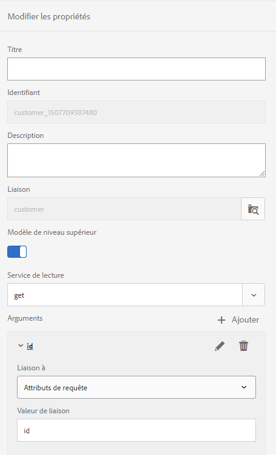

# Générer plusieurs communications interactives à l’aide de l’API de lot {#use-batch-api-to-generate-multiple-ic}

Vous pouvez utiliser l’API de traitement par lots pour produire plusieurs communications interactives à partir d’un modèle. Le modèle est une communication interactive sans données. L’API de traitement par lots combine les données avec un modèle pour produire une communication interactive. L&#39;API est utile pour la production de masse de communications interactives. Par exemple, factures de téléphone, relevés de carte de crédit pour plusieurs clients.

L’API de traitement par lot accepte les enregistrements (données) au format JSON et à partir d’un modèle de données de formulaire. Le nombre de communications interactives générées est égal aux enregistrements spécifiés dans le fichier JSON d’entrée dans le modèle de données de formulaire configuré. Vous pouvez utiliser l’API pour produire à la fois une impression et une sortie Web. L’option IMPRIMER produit un document PDF et l’option WEB produit des données au format JSON pour chaque enregistrement individuel.

## Utilisation de l’API de lot {#using-the-batch-api}

Vous pouvez utiliser l’API de traitement par lots conjointement avec les dossiers de contrôle ou en tant qu’API de repos autonome. Vous configurez un modèle, un type de sortie (HTML, PRINT ou Les deux), des paramètres régionaux, un service de préremplissage et le nom des communications interactives générées pour utiliser l’API de traitement par lot.

Vous combinez un enregistrement à un modèle de communication interactif pour produire une communication interactive. Les API par lot peuvent lire des enregistrements (données pour les modèles de communication interactifs) directement à partir d’un fichier JSON ou d’une source de données externe accessible via un modèle de données de formulaire. Vous pouvez conserver chaque enregistrement dans un fichier JSON distinct ou créer un tableau JSON pour conserver tous les enregistrements dans un seul fichier.

**Un enregistrement unique dans un fichier JSON**

```JSON
{
   "employee": {
       "name": "Sara",
       "id": 3,
       "mobileNo": 9871996463,
       "age": 37
   }
}
```

**Plusieurs enregistrements dans un fichier JSON**

```JSON
[{
   "employee": {
       "name": "John",
       "id": 1,
       "mobileNo": 9871996461,
       "age": 39
   }
},{
   "employee": {
       "name": "Jacob",
       "id": 2,
       "mobileNo": 9871996462,
       "age": 38
   }
},{
   "employee": {
       "name": "Sara",
       "id": 3,
       "mobileNo": 9871996463,
       "age": 37
   }
}]
```

### Utilisation de l’API de lot avec des dossiers de contrôle {#using-the-batch-api-watched-folders}

Pour faciliter l’expérience de l’API, les AEM Forms fournissent un service Watched Folder configuré pour utiliser l’API de traitement par lots, prêt à l’emploi. Vous pouvez accéder au service via l’interface utilisateur AEM Forms pour générer plusieurs communications interactives. Vous pouvez également créer des services personnalisés en fonction de vos besoins. Vous pouvez utiliser les méthodes répertoriées ci-dessous pour utiliser l’API de lot avec le dossier de contrôle :

* Spécifier les données d’entrée (enregistrements) au format de fichier JSON pour produire une communication interactive
* Utiliser les données d’entrée (enregistrements) enregistrées dans une source de données externe et accessibles via un modèle de données de formulaire pour produire une communication interactive

#### Spécifier des enregistrements de données d’entrée au format de fichier JSON pour produire une communication interactive {#specify-input-data-in-JSON-file-format}

Vous combinez un enregistrement à un modèle de communication interactif pour produire une communication interactive. Vous pouvez créer un fichier JSON distinct pour chaque enregistrement ou créer un tableau JSON pour conserver tous les enregistrements dans un seul fichier :

Pour créer une communication interactive à partir d’enregistrements enregistrés dans un fichier JSON :

1. Créez un dossier [de](https://docs.adobe.com/content/help/en/experience-manager-64/forms/publish-process-aem-forms/creating-configure-watched-folder.html) contrôle et configurez-le pour utiliser l’API de traitement par lot :
   1. Connectez-vous à l’instance d’auteur AEM Forms.
   1. Navigate to **[!UICONTROL Tools]** > **[!UICONTROL Forms]** > **[!UICONTROL Configure Watched Folder]**. Appuyez sur **[!UICONTROL Nouveau]**.
   1. Indiquez le **[!UICONTROL nom]** et le **[!UICONTROL chemin]** physique du dossier. Par exemple, `c:\batchprocessing`.
   1. Sélectionnez l’option **[!UICONTROL Service]** dans le champ **[!UICONTROL Traiter le fichier avec]** .
   1. Sélectionnez le **[!UICONTROL service com.adobe.fd.ccm.multichannel.batch.impl.service.InteractiveCommunicationBatchServiceImpl]** dans le champ Nom **[!UICONTROL du]** service.
   1. Spécifiez un modèle **[!UICONTROL de fichier]** de sortie. Par exemple, le [modèle](https://helpx.adobe.com/experience-manager/6-5/forms/using/admin-help/configuring-watched-folder-endpoints.html#about_file_patterns) %F/ spécifie que le dossier de contrôle peut trouver des fichiers d’entrée dans un sous-dossier du dossier Watched Folder\input.
1. Configurez les paramètres avancés :
   1. Ouvrez l’onglet **[!UICONTROL Avancé]** et ajoutez les propriétés personnalisées suivantes :

      | Propriétés | Type | Description |
      |--- |--- |--- |
      | templatePath | Chaîne | Spécifiez le chemin d’accès du modèle de communication interactif à utiliser. Par exemple, /content/dam/formsanddocuments/testsample/mediumic. Il s’agit d’une propriété obligatoire. |
      | recordPath | Chaîne | La valeur du champ recordPath permet de définir le nom d’une communication interactive. Vous pouvez définir le chemin d’un champ d’enregistrement comme valeur du champ recordPath. Par exemple, si vous spécifiez /employee/Id, la valeur du champ id devient le nom de la communication interactive correspondante. La valeur par défaut est un UUID [](https://docs.oracle.com/javase/7/docs/api/java/util/UUID.html#randomUUID())aléatoire. |
      | usePrefillService | Booléen | Définissez la valeur sur False. Vous pouvez utiliser le paramètre usePrefillService pour préremplir la communication interactive avec les données extraites du service de préremplissage configuré pour la communication interactive correspondante. Lorsque usePrefillService est défini sur true, les données JSON d’entrée (pour chaque enregistrement) sont traitées comme des arguments FDM. La valeur par défaut est false.  |
      | batchType | Chaîne | Définissez la valeur PRINT, WEB ou WEB_AND_PRINT. La valeur par défaut est WEB_AND_PRINT. |
      | paramètres régionaux | Chaîne | Spécifiez les paramètres régionaux de la communication interactive de sortie. Le service prêt à l’emploi n’utilise pas l’option locale, mais vous pouvez créer un service personnalisé pour générer des communications interactives localisées. La valeur par défaut est en_US |

   1. Appuyez sur **[!UICONTROL Créer]** le dossier de contrôle est créé.
1. Utilisez le dossier de contrôle pour générer une communication interactive :
   1. Ouvrez le dossier de contrôle. Accédez au dossier input.
   1. Créez un dossier dans le dossier input et importez le fichier JSON dans le dossier nouvellement créé.
   1. Attendez que le dossier de contrôle traite le fichier. Lorsque le début de traitement est utilisé, le fichier d’entrée et le sous-dossier contenant le fichier sont déplacés dans le dossier d’évaluation.
   1. Ouvrez le dossier output pour vue la sortie :
      * Lorsque vous spécifiez l’option IMPRESSION dans la configuration du dossier de contrôle, une sortie PDF pour la communication interactive est générée.
      * Lorsque vous définissez l’option WEB dans la configuration du dossier de contrôle, un fichier JSON par enregistrement est généré. Vous pouvez utiliser le fichier JSON pour [préremplir un modèle](#web-template)Web.
      * Lorsque vous définissez à la fois les options IMPRESSION et WEB, des documents PDF et un fichier JSON par enregistrement sont générés.

#### Utiliser les données d’entrée enregistrées dans une source de données externe et accessibles via un modèle de données de formulaire pour produire une communication interactive {#use-fdm-as-data-source}

Vous combinez des données (enregistrements) enregistrées dans une source de données externe avec un modèle de communication interactif pour produire une communication interactive. Lorsque vous créez une communication interactive, vous la connectez à une source de données externe via un modèle de données de formulaire (FDM) pour accéder aux données. Vous pouvez configurer le service de traitement par lots des dossiers de contrôle pour récupérer les données à l’aide du même modèle de données de formulaire à partir d’une source de données externe. Pour [créer une communication interactive à partir d&#39;enregistrements enregistrés dans une source](https://docs.adobe.com/content/help/en/experience-manager-64/forms/form-data-model/work-with-form-data-model.html)de données externe :

1. Configurez le modèle de données de formulaire du modèle :
   1. Ouvrez le modèle de données de formulaire associé au modèle de communication interactif.
   1. Sélectionnez l’OBJET DE MODÈLE DE NIVEAU SUPÉRIEUR et appuyez sur Modifier les propriétés.
   1. Sélectionnez votre extraction ou obtenez un service dans le champ Service de lecture situé sous le volet Modifier les propriétés.
   1. Appuyez sur l’icône représentant un crayon pour l’argument du service de lecture afin de lier l’argument à un attribut Request et de spécifier la valeur de liaison. Elle lie l’argument de service à la valeur d’attribut de liaison ou littérale spécifiée, qui est transmise au service en tant qu’argument pour extraire les détails associés à la valeur spécifiée de la source de données.

      <br>
        Dans cet exemple, l’argument id prend la valeur de l’attribut id du profil utilisateur et la transmet en tant qu’argument au service de lecture. Il lit et renvoie les valeurs des propriétés associées de l'objet de modèle de données employé pour l'identifiant spécifié. So, if you specify 00250 in the id field in the form, the read service will read details of the employee with 00250 employee id.
        <br>

      

   1. Enregistrez les propriétés et le modèle de données de formulaire.
1. Configurez la valeur pour l’attribut Request :
   1. Créez un fichier .json sur votre système de fichiers et ouvrez-le pour le modifier.
   1. Créez un tableau JSON et spécifiez l’attribut principal pour récupérer les données du modèle de données de formulaire. Par exemple, le fichier JSON suivant demande à FDM d’envoyer des données d’enregistrements dont l’ID est 27126 ou 27127 :

      ```json
          [
              {
                  "id": 27126
              },
              {
                  "id": 27127
              }
          ]
      ```

   1. Enregistrez et fermez le fichier 

1. Créez un dossier [de](https://docs.adobe.com/content/help/en/experience-manager-64/forms/publish-process-aem-forms/creating-configure-watched-folder.html) contrôle et configurez-le pour utiliser le service d’API de lot :
   1. Connectez-vous à l’instance d’auteur AEM Forms.
   1. Navigate to **[!UICONTROL Tools]** > **[!UICONTROL Forms]** > **[!UICONTROL Configure Watched Folder]**. Appuyez sur **[!UICONTROL Nouveau]**.
   1. Indiquez le **[!UICONTROL nom]** et le **[!UICONTROL chemin]** physique du dossier. Par exemple, `c:\batchprocessing`.
   1. Sélectionnez l’option **[!UICONTROL Service]** dans le champ **[!UICONTROL Traiter le fichier avec]** .
   1. Sélectionnez le **[!UICONTROL service com.adobe.fd.ccm.multichannel.batch.impl.service.InteractiveCommunicationBatchServiceImpl]** dans le champ Nom **[!UICONTROL du]** service.
   1. Spécifiez un modèle **[!UICONTROL de fichier]** de sortie. Par exemple, le [modèle](https://helpx.adobe.com/experience-manager/6-5/forms/using/admin-help/configuring-watched-folder-endpoints.html#about_file_patterns) %F/ spécifie que le dossier de contrôle peut trouver des fichiers d’entrée dans un sous-dossier du dossier Watched Folder\input.
1. Configurez les paramètres avancés :
   1. Ouvrez l’onglet **[!UICONTROL Avancé]** et ajoutez les propriétés personnalisées suivantes :

      | Propriétés | Type | Description |
      |--- |--- |--- |
      | templatePath | Chaîne | Spécifiez le chemin d’accès du modèle de communication interactif à utiliser. Par exemple, /content/dam/formsanddocuments/testsample/mediumic. Il s’agit d’une propriété obligatoire. |
      | recordPath | Chaîne | La valeur du champ recordPath permet de définir le nom d’une communication interactive. Vous pouvez définir le chemin d’un champ d’enregistrement comme valeur du champ recordPath. Par exemple, si vous spécifiez /employee/Id, la valeur du champ id devient le nom de la communication interactive correspondante. La valeur par défaut est un UUID [](https://docs.oracle.com/javase/7/docs/api/java/util/UUID.html#randomUUID())aléatoire. |  |
      | usePrefillService | Booléen | Définissez la valeur sur True. La valeur par défaut est false. Lorsque la valeur est définie sur true, l’API de traitement par lot lit les données du modèle de données de formulaire configuré et les remplit dans la communication interactive. Lorsque usePrefillService est défini sur true, les données JSON d’entrée (pour chaque enregistrement) sont traitées comme des arguments FDM. |
      | batchType | Chaîne | Définissez la valeur PRINT, WEB ou WEB_AND_PRINT. La valeur par défaut est WEB_AND_PRINT. |
      | paramètres régionaux | Chaîne | Spécifiez les paramètres régionaux de la communication interactive de sortie. Le service prêt à l’emploi n’utilise pas l’option locale, mais vous pouvez créer un service personnalisé pour générer des communications interactives localisées. La valeur par défaut est en_US. |

   1. Appuyez sur **[!UICONTROL Créer]** le dossier de contrôle est créé.
1. Utilisez le dossier de contrôle pour générer une communication interactive :
   1. Ouvrez le dossier de contrôle. Accédez au dossier input.
   1. Créez un dossier dans le dossier input. Placez le fichier JSON créé à l’étape 2 dans le dossier que vous venez de créer.
   1. Attendez que le dossier de contrôle traite le fichier. Lorsque le début de traitement est utilisé, le fichier d’entrée et le sous-dossier contenant le fichier sont déplacés dans le dossier d’évaluation.
   1. Ouvrez le dossier output pour vue la sortie :
      * Lorsque vous spécifiez l’option IMPRESSION dans la configuration du dossier de contrôle, une sortie PDF pour la communication interactive est générée.
      * Lorsque vous définissez l’option WEB dans la configuration du dossier de contrôle, un fichier JSON par enregistrement est généré. Vous pouvez utiliser le fichier JSON pour [préremplir un modèle](#web-template)Web.
      * Lorsque vous définissez à la fois les options IMPRESSION et WEB, des documents PDF et un fichier JSON par enregistrement sont générés.

## Appeler l’API de lot à l’aide des requêtes REST

Vous pouvez appeler [l’API](https://helpx.adobe.com/fr/experience-manager/6-5/forms/javadocs/index.html) de traitement par lots par l’intermédiaire de demandes REST (Representational State Transfer). Il vous permet de fournir un point de terminaison REST à d’autres utilisateurs pour accéder à l’API et de configurer vos propres méthodes de traitement, de stockage et de personnalisation des communications interactives. Vous pouvez développer votre propre servlet Java personnalisé pour déployer l’API sur votre instance AEM.

Avant de déployer la servlet Java, assurez-vous que vous disposez d’une communication interactive et que les fichiers de données correspondants sont prêts. Pour créer et déployer la servlet Java, procédez comme suit :

1. Connectez-vous à votre instance AEM et créez une communication interactive. Pour utiliser la communication interactive mentionnée dans l&#39;exemple de code ci-dessous, [cliquez ici](assets/SimpleMediumIC.zip).
1. [Créez et déployez un projet AEM à l’aide d’Apache Maven](https://helpx.adobe.com/experience-manager/using/maven_arch13.html) sur votre instance AEM.
1. Ajoutez le SDK client [AEM Forms version 6.0.12](https://repo.adobe.com/nexus/content/repositories/public/com/adobe/aemfd/aemfd-client-sdk/) ou ultérieure dans la liste des dépendances du fichier POM de votre projet AEM. Par exemple :

   ```XML
       <dependency>
           <groupId>com.adobe.aemfd</groupId>
           <artifactId>aemfd-client-sdk</artifactId>
           <version>6.0.122</version>
       </dependency>
   ```

1. Ouvrez le projet Java, créez un fichier .java, par exemple CCMBatchServlet.java. Ajoutez le code suivant au fichier 

   ```java
           package com.adobe.fd.ccm.multichannel.batch.integration;
   
           import java.io.File;
           import java.io.FileInputStream;
           import java.io.FileOutputStream;
           import java.io.IOException;
           import java.io.InputStream;
           import java.io.PrintWriter;
           import java.util.List;
           import javax.servlet.Servlet;
           import org.apache.commons.io.IOUtils;
           import org.apache.sling.api.SlingHttpServletRequest;
           import org.apache.sling.api.SlingHttpServletResponse;
           import org.apache.sling.api.servlets.SlingAllMethodsServlet;
           import org.json.JSONArray;
           import org.json.JSONObject;
           import org.osgi.service.component.annotations.Component;
           import org.osgi.service.component.annotations.Reference;
   
           import com.adobe.fd.ccm.multichannel.batch.api.builder.BatchConfigBuilder;
           import com.adobe.fd.ccm.multichannel.batch.api.factory.BatchComponentBuilderFactory;
           import com.adobe.fd.ccm.multichannel.batch.api.model.BatchConfig;
           import com.adobe.fd.ccm.multichannel.batch.api.model.BatchInput;
           import com.adobe.fd.ccm.multichannel.batch.api.model.BatchResult;
           import com.adobe.fd.ccm.multichannel.batch.api.model.BatchType;
           import com.adobe.fd.ccm.multichannel.batch.api.model.RecordResult;
           import com.adobe.fd.ccm.multichannel.batch.api.model.RenditionResult;
           import com.adobe.fd.ccm.multichannel.batch.api.service.BatchGeneratorService;
           import com.adobe.fd.ccm.multichannel.batch.util.BatchConstants;
           import java.util.Date;
   
   
           @Component(service=Servlet.class,
           property={
                   "sling.servlet.methods=GET",
                   "sling.servlet.paths="+ "/bin/batchServlet"
           })
           public class CCMBatchServlet extends SlingAllMethodsServlet {
   
               @Reference
               private BatchGeneratorService batchGeneratorService;
               @Reference
               private BatchComponentBuilderFactory batchBuilderFactory;
               public void doGet(SlingHttpServletRequest req, SlingHttpServletResponse resp) {
                   try {
                       executeBatch(req,resp);
                   } catch (Exception e) {
                       e.printStackTrace();
                   }
               }
               private void executeBatch(SlingHttpServletRequest req, SlingHttpServletResponse resp) throws Exception {
                   int count = 0;
                   JSONArray inputJSONArray = new JSONArray();
                   String filePath = req.getParameter("filePath");
                   InputStream is = new FileInputStream(filePath);
                   String data = IOUtils.toString(is);
                   try {
                       // If input file is json object, then create json object and add in json array, if not then try for json array
                       JSONObject inputJSON = new JSONObject(data);
                       inputJSONArray.put(inputJSON);
                   } catch (Exception e) {
                       try {
                           // If input file is json array, then iterate and add all objects into inputJsonArray otherwise throw exception
                           JSONArray inputArray = new JSONArray(data);
                           for(int i=0;i<inputArray.length();i++) {
                               inputJSONArray.put(inputArray.getJSONObject(i));
                           }
                       } catch (Exception ex) {
                           throw new Exception("Invalid JSON Data. File name : " + filePath, ex);
                       }
                   }
                   BatchInput batchInput = batchBuilderFactory.getBatchInputBuilder().setData(inputJSONArray).setTemplatePath("/content/dam/formsanddocuments/[path of the interactive communcation]").build();
                   BatchConfig batchConfig = batchBuilderFactory.getBatchConfigBuilder().setBatchType(BatchType.WEB_AND_PRINT).build();
                   BatchResult batchResult = batchGeneratorService.generateBatch(batchInput, batchConfig);
                   List<RecordResult> recordList = batchResult.getRecordResults();
                   JSONObject result = new JSONObject();
                   for (RecordResult recordResult : recordList) {
                       String recordId = recordResult.getRecordID();
                       for (RenditionResult renditionResult : recordResult.getRenditionResults()) {
                           if (renditionResult.isRecordPassed()) {
                               InputStream output = renditionResult.getDocumentStream().getInputStream();
                               result.put(recordId +"_"+renditionResult.getContentType(), output);
   
                               Date date= new Date();
                               long time = date.getTime();
   
                               // Print output
                               if(getFileExtension(renditionResult.getContentType()).equalsIgnoreCase(".json")) {
                                   File file = new File(time + getFileExtension(renditionResult.getContentType()));
                                   copyInputStreamToFile(output, file);
                               } else
                               {
                                   File file = new File(time + getFileExtension(renditionResult.getContentType()));
                                   copyInputStreamToFile(output, file);
                               }
                           }
                       }
                   }
                   PrintWriter writer = resp.getWriter();
                   JSONObject resultObj = new JSONObject();
                   resultObj.put("result", result);
                   writer.write(resultObj.toString());
               }
   
   
               private static void copyInputStreamToFile(InputStream inputStream, File file)
                       throws IOException {
   
                       try (FileOutputStream outputStream = new FileOutputStream(file)) {
   
                           int read;
                           byte[] bytes = new byte[1024];
   
                           while ((read = inputStream.read(bytes)) != -1) {
                               outputStream.write(bytes, 0, read);
                           }
   
                       }
   
                   }
   
   
               private String getFileExtension(String contentType) {
                   if (contentType.endsWith(BatchConstants.JSON)) {
                       return ".json";
                   } else return ".pdf";
               }
   
   
           }
   ```

1. Dans le code ci-dessus, remplacez le chemin d’accès du modèle (setTemplatePath) par le chemin d’accès du modèle et définissez la valeur de l’API setBatchType :
   * Lorsque vous spécifiez l’option IMPRIMER, la sortie PDF de la communication interactive est générée.
   * Lorsque vous définissez l’option WEB, un fichier JSON par enregistrement est généré. Vous pouvez utiliser le fichier JSON pour [préremplir un modèle](#web-template)Web.
   * Lorsque vous définissez à la fois les options IMPRESSION et WEB, des documents PDF et un fichier JSON par enregistrement sont générés.

1. [Utilisez maven pour déployer le code mis à jour sur votre instance](https://helpx.adobe.com/experience-manager/using/maven_arch13.html#BuildtheOSGibundleusingMaven)AEM.
1. Appelez l’API de traitement par lot pour générer la communication interactive. L’impression par lot de l’API renvoie un flux de fichiers PDF et .json en fonction du nombre d’enregistrements. Vous pouvez utiliser le fichier JSON pour [préremplir un modèle](#web-template)Web. Si vous utilisez le code ci-dessus, l’API est déployée sur `http://localhost:4502/bin/batchServlet`. Le code imprime et renvoie un flux de fichiers PDF et JSON.

### Préremplissage d’un modèle Web {#web-template}

Lorsque vous définissez batchType pour effectuer le rendu du Canal Web, l’API génère un fichier JSON pour chaque enregistrement de données. Vous pouvez utiliser la syntaxe suivante pour fusionner le fichier JSON avec le Canal Web correspondant afin de générer une communication interactive :

**Syntaxe**
`http://host:port/<template-path>/jcr:content?channel=web&mode=preview&guideMergedJsonPath=<guide-merged-json-path>`

**Exemple** Si votre fichier JSON se trouve à `C:\batch\mergedJsonPath.json` l’emplacement et que vous utilisez le modèle de communication interactif ci-dessous : `http://host:port/content/dam/formsanddocuments/testsample/mediumic/jcr:content?channel=web`

Ensuite, l’URL suivante sur le noeud de publication affiche le Canal Web de la communication interactive.
`http://host:port/<path-to-ic>/jcr:content?channel=web&mode=preview&guideMergedJsonPath=file:///C:/batch/mergedJsonData.json`

Outre l’enregistrement des données sur le système de fichiers, vous stockez des fichiers JSON dans le référentiel CRX, le système de fichiers, le serveur Web ou vous pouvez accéder aux données par le biais du service de préremplissage OSGI. La syntaxe de fusion des données à l’aide de différents protocoles est la suivante :

* **Protocole CRX**

   `http://host:port/<path-to-ic>/jcr:content?channel=web&mode=preview&guideMergedJsonPath=crx:///tmp/fd/af/mergedJsonData.json`

* **Protocole de fichier**

   `http://host:port/<path-to-ic>/jcr:content?channel=web&mode=preview&guideMergedJsonPath=file:///C:/Users/af/mergedJsonData.json`

* **Protocole du service de préremplissage**

   `http://host:port/<path-to-ic>/jcr:content?channel=web&mode=preview&guideMergedJsonPath=service://[SERVICE_NAME]/[IDENTIFIER]`

   SERVICE_NAME fait référence au nom du service de préremplissage OSGI. Voir Création et exécution d’un service de préremplissage.

   IDENTIFIER fait référence à toutes les métadonnées requises par le service de préremplissage OSGI pour récupérer les données de préremplissage. Un identifiant à l’utilisateur connecté est un exemple de métadonnées qui pourraient être utilisées.

* **Protocole HTTP**

   `http://host:port/<path-to-ic>/jcr:content?channel=web&mode=preview&guideMergedJsonPath=http://localhost:8000/somesamplexmlfile.xml`

>[!NOTE]
>
>Seul le protocole CRX est activé par défaut. Pour activer d’autres protocoles pris en charge, voir [Configuration du service de préremplissage à l’aide de Configuration Manager](https://helpx.adobe.com/experience-manager/6-5/forms/using/prepopulate-adaptive-form-fields.html#ConfiguringprefillserviceusingConfigurationManager).
