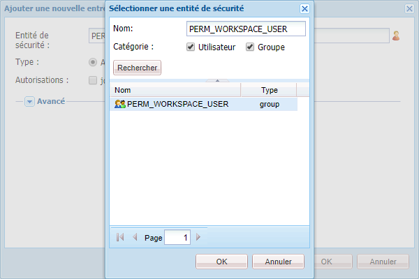

# Procédure générique de personnalisation de l’espace de travail AEM Forms{#generic-steps-for-aem-forms-workspace-customization}

Voici la procédure générique à suivre pour personnaliser Workspace HTML :

1. Connectez-vous à CRXDE Lite en accédant à `https://'[server]:[port]'/lc/crx/de/index.jsp`.
1. Create a folder named `ws`at `/apps`, if it does not exist. Cliquez sur **[!UICONTROL Enregistrer tout]**.
1. Browse to `/apps/ws`, and navigate to the **[!UICONTROL Access Control]** tab.
1. In the **[!UICONTROL Access Control]** list, click **[!UICONTROL +]** to add a new entry. Cliquez de nouveau sur **[!UICONTROL +]**.
1. Search and select the **PERM_WORKSPACE_USER** Principal.

   

1. Give `jcr:read` privilege to the Principal.
1. Cliquez sur **[!UICONTROL Enregistrer tout]**.
1. Copy the `GET.jsp` and `html.jsp`files from the `/libs/ws`folder to the `/apps/ws` folder.
1. Copiez le `/libs/ws/locales` dossier dans le `/apps/ws` dossier. Cliquez sur **[!UICONTROL Enregistrer tout]**.
1. Update the references and relative paths in the `GET.jsp` file, as shown below, and click **[!UICONTROL Save all]**.

   ```jsp
   <meta http-equiv="refresh" content="0;URL='/lc/apps/ws/index.html'" />
   ```

1. Procédez comme suit pour des personnalisations CSS :

   1. Navigate to the `/apps/ws` folder and create a new folder named `css`.

   1. Dans le dossier `css`,  , créez un fichier nommé `newStyle.css`.

   1. Open `/apps/ws/html`.jsp and change from

   ```css
   <link lang="en" rel="stylesheet" type="text/css" href="css/style.css" />
   <link lang="en" rel="stylesheet" type="text/css" href="css/jquery-ui.css"/>
   ```

   vers

   ```css
   <link lang="en" rel="stylesheet" type="text/css" href="../../libs/ws/css/style.css" />
   <link lang="en" rel="stylesheet" type="text/css" href="css/newStyle.css" />
   <link lang="en" rel="stylesheet" type="text/css" href="../../libs/ws/css/jquery-ui.css"/>
   ```

   >[!NOTE]
   >
   >placez l’entrée du fichier CSS défini par l’utilisateur après l’entrée de newStyle.css, comme indiqué ci-dessus.

1. Dans le fichier /apps/ws/html.jsp, changez

   ```css
   <script data-main="js/main" src="js/libs/require/require.js"></script>
   ```

   vers

   ```css
   <script data-main="js/main" src="../../libs/ws/js/libs/require/require.js"></script>
   ```

1. Procédez comme suit :

   1. Create a folder named `js`at `/apps/ws`. Cliquez sur **[!UICONTROL Enregistrer tout]**.

   1. Create a folder named `libs`at `/apps/ws/js`. Cliquez sur **[!UICONTROL Enregistrer tout]**.

   1. Create a folder named `jqueryui`at `/apps/ws/js/libs`. Cliquez sur **[!UICONTROL Enregistrer tout]**.

   1. Copiez `/libs/ws/js/libs/jqueryui/jquery.ui.datepicker-ja.js` dans `/apps/ws/js/libs/jqueryui`. Cliquez sur **[!UICONTROL Enregistrer tout]**.

1. Procédez comme suit pour des personnalisations HTML :

   1. Sous `/apps/ws/js`, créez un dossier nommé `runtime`. Cliquez sur **[!UICONTROL Enregistrer tout]**.

   1. Sous `/apps/ws/js/runtime`, créez un dossier nommé `templates`. Cliquez sur **[!UICONTROL Enregistrer tout]**.

   1. Copiez `/libs/ws/js/main.js` dans `/apps/ws/js/main.js`.

   1. Copy /libs/ws/js/registry.js to `/apps/ws/js/registry.js`.

1. Cliquez sur **[!UICONTROL Enregistrer tout]**, effacez le cache et actualisez l’espace de travail AEM Forms.

   Accédez à l’URL `https://'[server]:[port]'/lc/ws` et connectez-vous avec les informations d’identification d’administrateur/de mot de passe. Le navigateur redirige vers `https://'[server]:[port]'/lc/apps/ws/index.html`.
