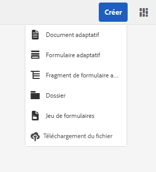
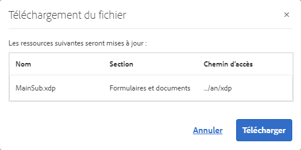
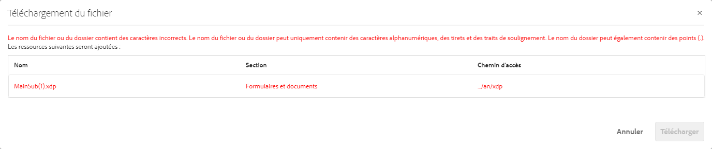
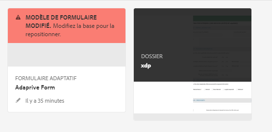
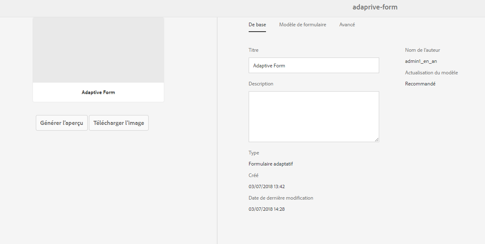

# Obtention de documents XDP et PDF dans AEM Forms{#getting-xdp-and-pdf-documents-in-aem-forms}

## Présentation {#overview}

Vous pouvez importer vos formulaires depuis votre système de fichiers local vers le référentiel CRX, en les transférant dans AEM Forms. L’opération de transfert est prise en charge pour les types de ressource suivants :

* Modèles de formulaire (formulaires XFA)
* Formulaires PDF
* Document (documents PDF aplatis)

Vous pouvez transférer les types de ressource pris en charge individuellement ou sous la forme d’une archive ZIP. You can upload an asset of the type `Resource`, only alongside an XFA form in a ZIP archive.

>[!NOTE]
>
>Assurez-vous d’être membre du groupe `form-power-users` pour pouvoir télécharger des fichiers XDP. Contactez votre administrateur pour devenir membre du groupe.

## Chargement de formulaires {#uploading-forms}

1. Connectez-vous à l’interface utilisateur d’AEM Forms en accédant à `https://'[server]:[port]'/aem/forms.html`.
1. Accédez au dossier vers lequel vous souhaitez transférer le formulaire ou le dossier contenant des formulaires.
1. Dans la barre d’outils des actions, appuyez sur **Créer > Chargement de fichier**.

   

1. La boîte de dialogue de formulaires ou package de téléchargement vous permet de rechercher et sélectionner le fichier à charger. L’explorateur de fichiers affiche uniquement les formats de fichier pris en charge (ZIP, XDP et PDF).

   >[!NOTE]
   >
   >Un nom de fichier ne peut contenir que des caractères alphanumériques, des traits d’union ou des caractères de soulignement.

1. Cliquez sur Transférer après avoir sélectionné des fichiers pour les transférer ou sur Annuler pour annuler le transfert. Une liste contextuelle affiche les éléments qui sont ajoutés et ceux-ci qui sont mis à jour à l’emplacement actuel.

   >[!NOTE]
   >
   >Dans le cas d’un fichier ZIP, les chemins relatifs de toutes les ressources prises en charge sont affichés. Les éléments non pris en charge à l’intérieur de l’archive ZIP sont ignorés et ne sont pas répertoriés. Cependant, si l’archive ZIP contient uniquement des éléments non pris en charge, un message d’erreur s’affiche à la place de la boîte de dialogue contextuelle.

   

1. Si le nom d’une ou de plusieurs ressources n’est pas valide, une erreur apparaît. Corrigez les noms de fichiers en surbrillance rouge et effectuez un nouveau transfert.

   

Une fois le transfert terminé, un processus d’arrière-plan génère des vignettes pour chaque ressource, en fonction de l’aperçu de cette dernière. Les nouvelles versions des ressources, si elles ont été transférées, écrasent les ressources existantes.

### Mode Protégé {#protected-mode}

Le serveur AEM Forms vous permet d’exécuter du code JavaScript. Du code JavaScript malveillant peut endommager un environnement AEM Forms. Le mode Protégé restreint AEM Forms afin d’exécuter les fichiers XDP uniquement à partir de ressources et d’emplacements approuvés. Tous les XDP disponibles dans l’interface utilisateur d’AEM Forms sont considérés comme des ressources approuvées.

Le mode Protégé est activé par défaut. Si nécessaire, vous pouvez désactiver le mode Protégé :

1. Connectez-vous à la console Web AEM en tant qu’administrateur. The URL is https://&#39;[server]:[port]&#39;/system/console/configMgr
1. Ouvrez les configurations de Mobile Forms pour l’édition.
1. Désélectionnez l’option Mode Protégé et cliquez sur **Enregistrer**. Le mode Protégé est désactivé.

## Mise à jour des formulaires XFA référencés {#updating-referenced-xfa-forms}

Dans AEM Forms, un modèle de formulaire XFA peut être référencé par un formulaire adaptatif ou un autre modèle de formulaire XFA. Un modèle peut, en outre, faire référence à une ressource ou à un autre modèle XFA.

Dans le cas d’un formulaire adaptatif qui fait référence à un formulaire XFA, les champs des deux éléments sont liés. Lors de la mise à jour d’un modèle de formulaire, le formulaire adaptatif associé tente de se synchroniser avec le formulaire XFA. Pour plus d’informations, voir [Synchronisation des formulaires adaptatifs avec le formulaire XFA associé](../../forms/using/synchronizing-adaptive-forms-xfa.md).

La suppression d’un modèle de formulaire altère le formulaire adaptatif ou le modèle de formulaire dépendant. Un tel formulaire adaptatif est parfois qualifié de « dirty form » en anglais. Dans l’interface utilisateur d’AEM Forms, vous pouvez accéder à ces formulaires de deux manières.

* Une icône d’avertissement s’affiche sur la miniature du formulaire adaptatif dans la liste des ressources et le message suivant s’affiche lorsque vous placez le pointeur sur cette icône.\
   `Schema/Form Template for this adaptive form has been updated so please go to Authoring mode and rebase it with new version.`

Un indicateur est conservé pour indiquer si un formulaire adaptatif est de type « dirty ». Ces informations sont disponibles sur la page de propriétés du formulaire, avec les métadonnées du formulaire. Only for dirty adaptive forms, a metadata property `Model Refresh` displays `Recommended` value.

