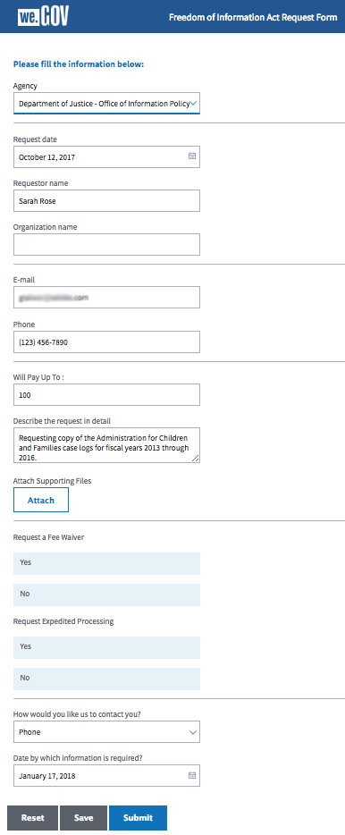
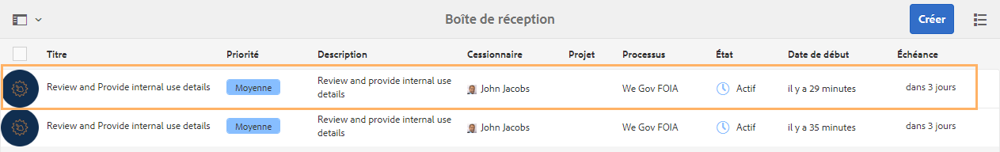
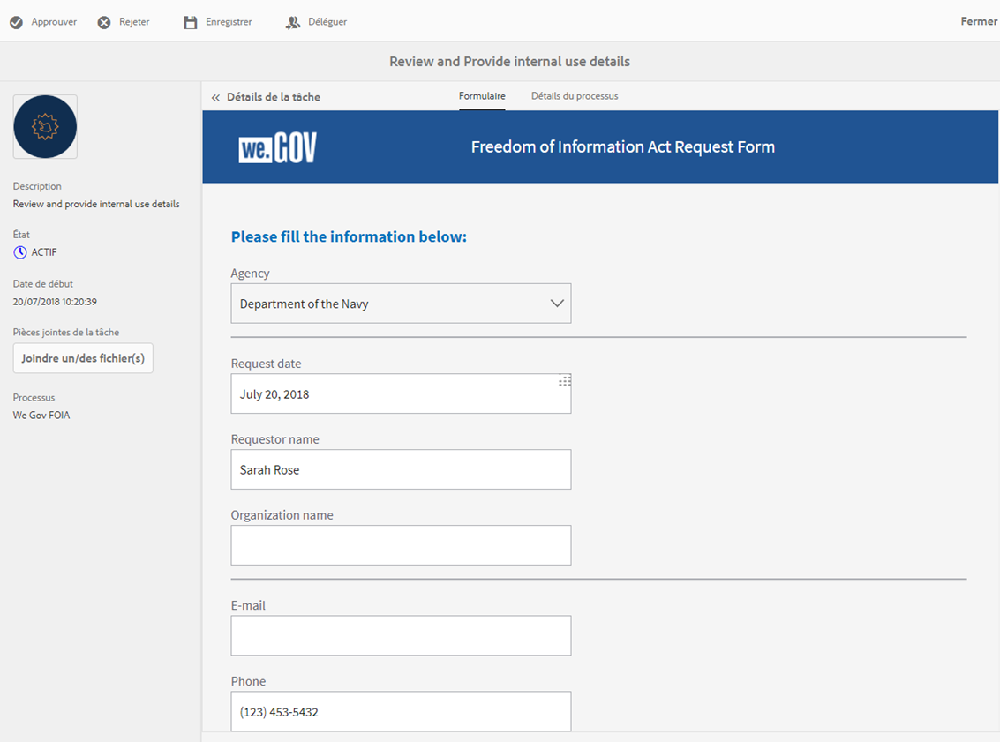
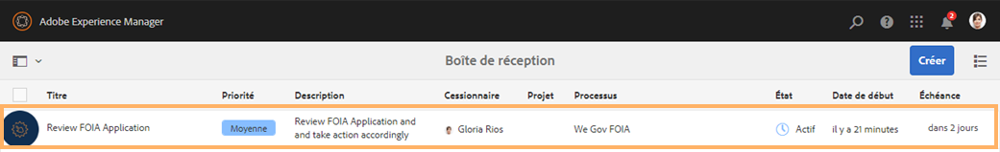
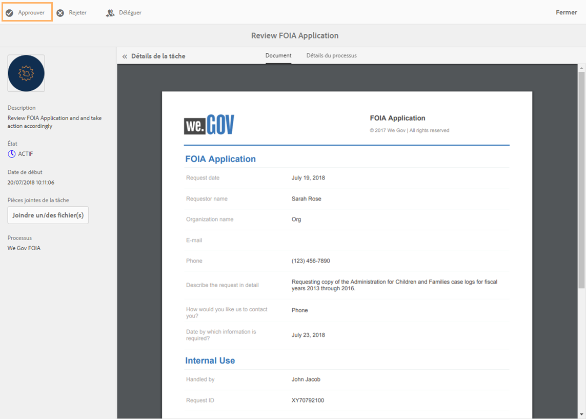

# Présentation de la loi sur l’accès à l’information pour le site de référence We.Gov {#we-gov-reference-site-foia-walkthrough}

## Scénario de la loi sur l’accès à l’information pour le site de référence {#reference-site-freedom-of-information-act-scenario}

We.Gov est un organisme dépendant de l’État qui permet aux parents adoptifs de s’inscrire pour obtenir une allocation familiale s’ils ont adopté un enfant. We.Gov permet également aux parents de demander des informations auprès des ministères suivants en vertu de la loi sur l’accès à l’information :

* Agence DLA (Defense Logistics Agency)
* Ministère de la Défense, bureau de l’Inspecteur général
* Ministère de la Justice, bureau de la politique de l’information
* Département de la Marine
* Agence de protection de l’environnement

Pour plus d&#39;informations sur la loi sur l&#39;accès à l&#39;information, voir [www.foia.gov](https://www.foia.gov).

Le scénario implique les personnages suivants :

* Sarah Rose, personne demandant des informations
* John Jacobs, la personne qui gère la demande et la fait suivre au service approprié
* Gloria Rios, la fonctionnaire du gouvernement qui fournit les informations de la demande

## Sarah lance la demande d’informations dans le cadre de la loi sur l’accès à l’information {#sarah-initiates-request-for-information-under-foia}

En vertu de la loi sur la liberté d&#39;information, Sarah demande une copie des dossiers de l&#39;Administration pour les enfants et les familles pour les années 2013 à 2016. Sarah envoie cette demande au bureau de la stratégie des informations du Ministère de la Justice et indique également qu’elle est prête à payer jusqu’à 100 dollars américains pour les frais d’impression et d’envoi.

### Fonctionnement {#how-it-works}

### Démonstration {#see-it-yourself}

Dans votre navigateur, ouvrez `https://<hostname>:<PublishPort>/wegov`. Sur le site We.Gov, appuyez sur Applications> Toutes les applications. Dans la page Toutes les applications, appuyez sur Appliquer sous Demande de demande de FOIA.

## Sarah commence sa demande d’informations dans le cadre de la loi sur l’accès à l’information {#sarah-starts-her-application-for-information-under-foia}

Sarah clique sur **Appliquer** et, dans la page Formulaire de demande de la loi sur l’accès à l’information, Sarah saisit les informations suivantes :

* **Agence :** Sarah indique l’agence à laquelle la demande a été adressée en tant que Ministère de la Justice - Bureau de la politique de l’information.

* **Versera jusqu’à** : Sarah indique qu’elle est prête à payer jusqu’à 100 dollars américains pour les frais d’impression et d’envoi.
* **Décrivez la demande en détail** : Sarah indique &quot;Demande de copie des dossiers de l’Administration pour les enfants et les familles pour les exercices 2013 à 2016&quot;.

Demande de copie des registres des cas de l’Administration pour les enfants et les familles pour les années 2013 à 2016

À tout moment, Sarah peut appuyer sur Enregistrer pour enregistrer le brouillon du formulaire et y revenir plus tard pour remplir le formulaire et l’envoyer. Sarah envoie le formulaire.

>[!NOTE]
>
>Le processus à partir d’un courrier électronique fonctionne avec les utilisateurs connectés uniquement. Dans le scénario de site de référence, assurez-vous que l’utilisateur Sarah Rose est ajouté. Les informations de connexion de Sarah sont `srose/password`.

## John Jacobs reçoit et approuve la demande {#john-jacobs-receives-and-approves-the-application}

John Jacobs reçoit les demandes et les fait suivre à la personne appropriée. La boîte de réception AEM lui permet de voir de manière centralisée toutes les demandes envoyées.

### Fonctionnement {#how-it-works-1}

Lorsque Sarah remplit et envoie la demande dans le cadre de la loi sur l’accès à l’information, un enregistrement de la demande est envoyé dans la boîte de réception John Jacobs. John Jacobs peut afficher la demande envoyée et l’accepter ou la refuser.

### Démonstration {#see-it-yourself-1}

Vous pouvez accéder à la boîte de réception AEM à l’adresse https://&quot;a0/>hostname ***:&quot;a2/>PublishPort&lt;a3/&quot;/content/we-finance/global/en/login.html?resource=/aem/inbox.html.********* Connectez-vous à la boîte de réception AEM, en utilisant jjacobs/password comme nom d’utilisateur/mot de passe pour John Jacobs, puis consultez l’application FOIA. Pour plus d’informations sur l’utilisation de AEM boîte de réception pour les tâches de processus centrées sur les formulaires, voir [Gestion des applications et tâches Forms dans AEM Boîte de réception](/help/forms/using/manage-applications-inbox.md).

John Jacobs peut voir, approuver ou refuser la demande à partir du tableau de bord des demandes. John Jacobs sélectionne et ouvre les détails de la demande et, après avoir examiné la demande, l’approuve.

### <strong>Sarah reçoit un courrier électronique d’accusé de réception</strong> {#strong-sarah-receives-an-acknowledgement-email-strong}

Une fois que John Jacobs approuve la demande, Sarah reçoit une confirmation par courrier électronique provenant du site We.Gov. Sarah est informée des frais et du temps requis pour le traitement de sa demande. Le courrier électronique contient également des informations (adresse électronique et téléphone) que Sarah peut utiliser pour obtenir des mises à jour sur sa demande.

## Gloria reçoit la requête dans le cadre de la loi sur l’accès à l’information pour le second niveau d’approbation {#gloria-receives-the-foia-request-for-second-level-approval}

Une fois que John Jacobs a complété les informations requises et a approuvé la demande de Sarah, la demande est envoyée à Gloria Rios pour l’approbation finale. Gloria consulte le document joint de l’enregistrement et approuve la demande.

### Fonctionnement {#how-it-works-2}

Lorsque John Jacobs approuve la demande dans le cadre de la loi sur l’accès à l’information, un document PDF ou un document d’enregistrement de la demande est créé et envoyé dans la boîte de réception de Gloria Rios. Gloria peut afficher la demande envoyée et l’accepter ou la refuser.

### Jugez-en par vous-même {#see-for-yourself}

Vous pouvez accéder à la boîte de réception AEM à l’adresse https://&quot;a0/>hostname ***:&quot;a2/>PublishPort&lt;a3/&quot;/content/we-finance/global/en/login.html?resource=/aem/inbox.html.********* Connectez-vous à la boîte de réception AEM à l’aide de grios/password en tant que nom d’utilisateur/mot de passe pour Gloria Rios et consultez la demande FOIS.

Gloria ouvre la demande et examine les détails de la demande dans le cadre de la loi sur l’accès à l’information. Après avoir consulté les détails de la demande et vérifié la possibilité de fournir les documents requis, Gloria approuve la demande.

## Sarah reçoit la notification que sa demande est approuvée {#sarah-receives-notification-that-her-request-is-approved}

Après que Gloria a approuvé la demande dans le cadre de la loi sur l’accès à l’information, Sarah reçoit un courriel l’informant que sa demande est approuvée. Le courrier électronique comprend également des informations sur le délai d’attente attendu pour la fourniture du document et des coordonnées pour le suivi de la demande.

