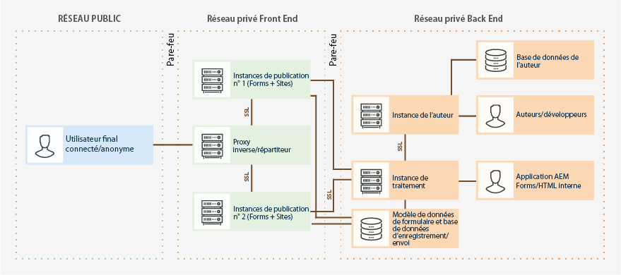

# Renforcement et sécurisation d’AEM Forms dans un environnement OSGi {#hardening-and-securing-aem-forms-on-osgi-environment}

Découvrez des conseils et des pratiques recommandées pour sécuriser AEM Forms sur un serveur OSGi.

La sécurisation d’un environnement serveur est d’une importance primordiale pour une entreprise. Cet article fournit des conseils et des pratiques recommandées de sécurisation des serveurs exécutant AEM Forms. Il ne vise pas à expliquer de manière exhaustive comment renforcer des hôtes pour votre système d’exploitation. Au lieu de cela, cet article décrit les différents paramètres de renforcement de la sécurité que vous pouvez implémenter pour améliorer la sécurité de votre application déployée. Toutefois, pour que les serveurs d’applications restent sécurisés, vous devez également mettre en œuvre des procédures de surveillance, de détection et de réponse de sécurité, en plus des recommandations décrites dans cet article. Le document contient également les meilleures pratiques et les lignes directrices pour la sécurisation des informations personnelles identifiables (PII).

Cet article est destiné aux consultants, aux spécialistes de la sécurité, aux architectes de systèmes et aux professionnels de l’informatique chargés de planifier le développement et le déploiement d’application ou d’infrastructure d’AEM Forms. Ces postes incluent les rôles communs suivants :

* Les ingénieurs informatiques et d’exploitation, qui doivent déployer des applications et des serveurs Web sécurisés dans leur entreprise ou celle de leurs clients.
* Les architectes et les planificateurs, qui sont chargés de planifier les efforts architecturaux des clients dans leur entreprise.
* Les spécialistes de la sécurité informatique, qui sont responsables de la protection des plateformes de leur entreprise.
* Les consultants d’Adobe et de partenaires, qui ont besoin de ressources détaillées pour les clients et les partenaires.

L’image suivante affiche les composants et les protocoles utilisés dans un déploiement AEM Forms standard, y compris la topologie de pare-feu appropriée :

AEM Forms est hautement personnalisable et compatible avec de nombreux environnements. Certaines recommandations peuvent ne pas s’appliquer à votre entreprise.

## Couche de transport sécurisée {#secure-transport-layer}

Les vulnérabilités de sécurité de couche de transport comptent parmi les premières menaces qui affectent les serveurs d’applications accessibles par Internet ou par un intranet. Cette section décrit le processus de renforcement des hôtes du réseau contre ces vulnérabilités. Elle traite de la segmentation du réseau, du renforcement de la pile TCP/IP (Transmission Control Protocol/Internet Protocol) et de l’utilisation de pare-feu pour protéger les hôtes.

### Limiter les points de fin ouverts  {#limit-open-endpoints}

Une entreprise peut configurer un pare-feu externe pour limiter l’accès entre un utilisateur final et une batterie de publication AEM Forms. L’entreprise peut également avoir un pare-feu interne pour limiter l’accès entre une batterie de publication et d’autres dans des éléments d’entreprise (par exemple, instance d’auteur, instance de traitement, bases de données). Autoriser les pare-feu à autoriser l’accès à un nombre limité d’URL AEM Forms pour les utilisateurs finaux et au sein des éléments d’entreprise :

#### Configurer le pare-feu externe  {#configure-external-firewall}

Vous pouvez configurer un pare-feu externe pour activer certaines URL AEM Forms pour accéder à Internet. L’accès à ces URL est nécessaire pour remplir ou envoyer un formulaire adaptatif, HTML5, une lettre Correspondence Management ou pour se connecter à un serveur AEM Forms :

<table> 
 <tbody>
  <tr>
   <td>Composant</td> 
   <td>URI</td> 
  </tr>
  <tr>
   <td>Formulaires adaptatifs</td> 
   <td>
    <ul> 
     <li>/content/dam/formsanddocuments/AF_PATH/jcr:content</li> 
     <li>/etc/clientlibs/fd/</li> 
     <li>/content/forms/af/AF_PATH</li> 
     <li>/libs/granite/csrf/</li> 
    </ul> </td> 
  </tr>
  <tr>
   <td>Formulaires HTML5</td> 
   <td>
    <ul> 
     <li>/content/forms/formsets/profiles/</li> 
    </ul> </td> 
  </tr>
  <tr>
   <td>Gestion des correspondances </td> 
   <td>
    <ul> 
     <li>/aem/forms/createcorrespondence* </li> 
    </ul> </td> 
  </tr>
  <tr>
   <td>Portail Formulaires </td> 
   <td>
    <ul> 
     <li>/content/forms/portal/</li> 
     <li>/libs/cq/ui/widgets*</li> 
     <li>/libs/cq/security/</li> 
    </ul> </td> 
  </tr>
  <tr>
   <td> Application AEM Forms</td> 
   <td>
    <ul> 
     <li>/j_security_check*</li> 
     <li>/soap/services/AuthenticationManagerService</li> 
    </ul> </td> 
  </tr>
 </tbody>
</table>

#### Configurer le pare-feu interne   {#configure-internal-firewall}

Vous pouvez configurer le pare-feu interne pour autoriser certains composants AEM Forms (par exemple, instance d’auteur, instance de traitement, bases de données) à communiquer avec la batterie de publication et d’autres composants internes mentionnés dans le diagramme de topologie :

<table> 
 <tbody>
  <tr>
   <td>Hôte  </td> 
   <td>URI</td> 
  </tr>
  <tr>
   <td>Batterie de publication (nœuds de publication)</td> 
   <td>/bin/receive</td> 
  </tr>
  <tr>
   <td>Serveur de traitement</td> 
   <td>/content/forms/fp/*</td> 
  </tr>
  <tr>
   <td>Serveur du module complémentaire Forms Workflow (serveur AEM forms on JEE)</td> 
   <td>/soap/sdk</td> 
  </tr>
 </tbody>
</table>

#### Configurer les autorisations de référentiel et les listes de contrôle d’accès (ACL) {#setup-repository-permissions-and-access-control-lists-acls}

Par défaut, les actifs disponibles sur des nœuds de publication sont accessibles à tous. L’accès en lecture seule est activé pour tous les actifs. Il est nécessaire pour autoriser l’accès anonyme. Si vous envisagez de restreindre l’affichage des formulaires et d’autoriser l’accès uniquement aux utilisateurs authentifiés, utilisez un groupe commun pour autoriser uniquement les utilisateurs authentifiés à accéder en lecture seule aux actifs disponibles sur les nœuds de publication. Les répertoires/emplacements suivants contiennent des actifs de formulaires qui nécessitent un renforcement (accès en lecture seule pour les utilisateurs authentifiés) :

* /content/&amp;ast;
* /etc.clientlibs/fd/&amp;ast;
* /libs/fd/&amp;ast;

## Traitement sécurisé des formulaires de données  {#securely-handle-forms-data}

AEM Forms stocke les données dans des emplacements prédéfinis et des dossiers temporaires. Vous devez sécuriser les données pour empêcher une utilisation non autorisée.

### Configurer le nettoyage régulier du dossier temporaire {#setup-periodic-cleanup-of-temporary-folder}

Lorsque vous configurez des formulaires pour les pièces jointes, les composants de vérification ou d’aperçu, les données correspondantes sont stockées sur les nœuds de publication à l’adresse /tmp/fd/. Les données sont purgées régulièrement. Vous pouvez modifier la tâche de purge de données par défaut afin de la rendre plus agressive. Pour modifier la tâche planifiée de purge des données, ouvrez la console web AEM, ouvrez la tâche de nettoyage de stockage temporaire AEM Forms et modifiez l’expression Cron.

Dans les scénarios ci-dessus, les données sont enregistrées uniquement pour les utilisateurs authentifiés. De plus, les données sont protégées avec des listes de contrôle d’accès (LCA). Par conséquent, la modification de la purge des données est une étape supplémentaire qui vise à sécuriser les informations.

### Données sécurisées enregistrées via une action d’envoi sur le portail de formulaires  {#secure-data-saved-by-forms-portal-submit-action}

Par défaut, l’action d’envoi de formulaires adaptatifs via le portail de formulaires enregistre les données dans le référentiel local du nœud de publication. Les données sont enregistrées sous /content/forms/fp. **Il n’est pas recommandé de stocker des données sur une instance de publication.**

Vous pouvez configurer le service de stockage pour envoyer en mode filaire à la grappe de traitement sans rien sauvegarder localement sur le nœud de publication. La grappe de traitement se trouve dans une zone sécurisée située derrière le pare-feu privé et les données restent en sécurité.

Utilisez les informations d’identification du serveur de traitement pour le service de paramètres AEM DS pour publier les données du nœud de publication sur le serveur de traitement. Il est recommandé d’utiliser les informations d’identification d’un utilisateur non administratif restreint avec un accès en lecture/écriture au référentiel du serveur de traitement. Pour plus d’informations, voir [Configuration des services de stockage pour les brouillons et les envois](/help/forms/using/configuring-draft-submission-storage.md).

### Données sécurisées gérées par le modèle de données du formulaire (FDM)  {#secure-data-handled-by-form-data-model-fdm}

Utilisez les comptes d’utilisateur avec les privilèges requis minimum pour configurer les sources de données pour le modèle de données de formulaire (FDM). L’utilisation d’un compte administratif peut fournir un accès ouvert aux métadonnées et aux entités de schéma à des utilisateurs non autorisés.\
L’intégration de données fournit également des méthodes pour autoriser les demandes de service FDM. Vous pouvez insérer des mécanismes d’autorisation avant et après l’exécution pour valider une demande. Les demandes de service sont générées lors du pré-remplissage d’un formulaire, de l’envoi d’un formulaire et de l’appel de services via une règle.

**Autorisation de pré-traitement :** vous pouvez utiliser l’autorisation de pré-traitement pour valider l’authenticité d’une requête avant de l’exécuter. Vous pouvez utiliser les entrées, et les détails du service et de la requête pour autoriser ou arrêter l’exécution de la demande. Vous pouvez renvoyer une exception d’intégration de données OPERATION_ACCESS_DENIED si l’exécution est arrêtée. Vous pouvez également modifier la requête client avant de l’envoyer pour exécution. Par exemple, vous pouvez changer l’entrée et ajouter des informations supplémentaires.

**Autorisation de post-traitement :** vous pouvez utiliser l’autorisation de post-traitement pour valider et contrôler les résultats avant de renvoyer les résultats à l’auteur de la requête. Vous pouvez également filtrer, supprimer et insérer des données dans les résultats.

### Limiter l’accès utilisateur  {#limit-user-access}

Un ensemble différent de rôles utilisateur est requis pour les instances d’auteur, de publication et de traitement. N’exécutez aucune instance avec des informations d’identification d’administrateur.

**Sur une instance de publication :**

* Seuls les utilisateurs du groupe utilisateurs-formulaires peuvent prévisualiser, créer un brouillon et envoyer des formulaires.
* Seuls les utilisateurs du groupe cm-utilisateur-agent peuvent prévisualiser les lettres de gestion de la correspondance.
* Désactivation de tous les accès anonymes non indispensables.

**Sur une instance d’auteur :**

* Il existe un ensemble différent de groupes prédéfinis avec des privilèges spécifiques pour chaque rôle. Attribuer des utilisateurs au groupe.

   * Un utilisateur du groupe formulaires-utilisateur :

      * peut créer, remplir, publier et envoyer un formulaire.
      * impossible de créer un formulaire adaptatif basé sur XDP.
      * n’est pas autorisé à écrire des scripts pour les formulaires adaptatifs.
      * ne peut importer XDP ni aucun package contenant XDP
   * Un utilisateur du groupe formulaires-utilisateur-avancé crée, remplit, publie et envoie tous les types de formulaires, écrit des scripts pour les formulaires adaptatifs, importe des packages contenant XDP.
   * Un utilisateur du groupe modèle-auteurs et modèle-utilisateur-avancé peut prévisualiser et créer un modèle.
   * Un utilisateur fdm-auteurs peut créer et modifier un modèle de données de formulaire.
   * Un utilisateur du groupe cm-utilisateur-agent peut créer, prévisualiser et publier des lettres de gestion de la correspondance.
   * Un utilisateur du groupe processus-éditeurs peut créer une application de boîte de réception et un modèle de processus.

**Sur un auteur de traitement :** 

* Pour enregistrer à distance et envoyer des cas d’utilisation, créez un utilisateur disposant d’autorisations de droits de lecture, de création et de modification sur le chemin d’accès content/form/fp du référentiel crx.
* Ajoutez un utilisateur au groupe processus-utilisateur pour permettre à un utilisateur d’utiliser les applications de boîte de réception AEM.

## Éléments Intranet sécurisés d’un environnement AEM Forms  {#secure-intranet-elements-of-an-aem-forms-environment}

En règle générale, les grappes de traitement et le module complémentaire Forms Workflow (AEM Forms on JEE) s’exécutent derrière un pare-feu. Par conséquent, ils sont considérés comme étant sécurisés. Vous pouvez toujours effectuer quelques étapes pour renforcer ces environnements :

### Grappe de traitement sécurisée {#secure-processing-cluster}

Une grappe de traitement s’exécute en mode auteur mais ne l’utilise pas pour les activités de développement. N’autorisez pas un utilisateur normal à être inclus dans les groupes contenu-auteurs et formulaire-utilisateurs d’une grappe de traitement.

### Utiliser les meilleures pratiques AEM afin de sécuriser un environnement AEM Forms {#use-aem-best-practices-to-secure-an-aem-forms-environment}

Ce document fournit des instructions spécifiques à l’environnement AEM Forms. Vous devez vous assurer que votre installation AEM sous-jacente est sécurisée une fois déployée. Pour obtenir des instructions détaillées, voir la documentation [Liste de contrôle de la sécurité](/help/sites-administering/security-checklist.md) d’AEM. 
