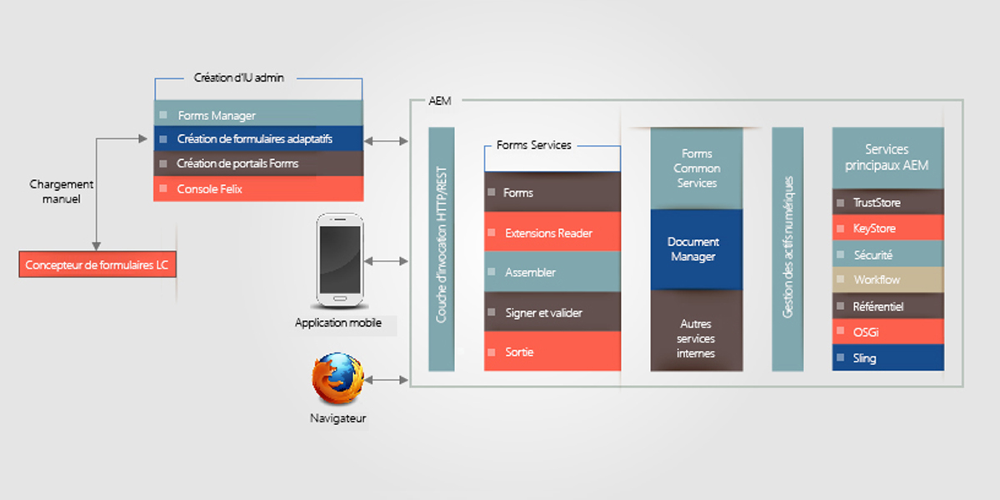
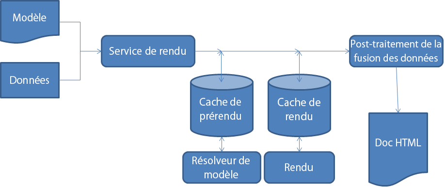

# Architecture de formulaires HTML5{#architecture-of-html-forms}

## Architecture {#architecture}

La fonctionnalité de formulaires HTML5 est déployée sous la forme d’un package au sein de l’instance d’AEM intégrée et exposée sous la forme d’un point de terminaison REST sur HTTP/S à l’aide de RESTful [Apache Sling Architecture](https://sling.apache.org/).

### Utilisation de la structure Sling {#using-sling-framework}

[Apache Sling](https://sling.apache.org/) est centré sur la ressource. Elle commence par utiliser une URL de requête pour résoudre la ressource. Chaque ressource possède une propriété **sling:resourceType** (ou **sling:resourceSuperType**). Suivant cette propriété, la méthode de requête et les propriétés de l’URL de requête, un script sling est sélectionné pour gérer la requête. Ce script sling peut être un JSP ou un servlet. Pour les formulaires HTML5, les nœuds de **Profil** agissent en tant que ressources sling et le **Rendu de profil** a le rôle du script sling qui gère la demande pour générer un formulaire pour périphériques mobiles avec un profil particulier. Un **Rendu de profil** est un JSP qui lit les paramètres depuis une requête et appelle le service Forms OSGi.

Pour plus d’informations sur le point de terminaison REST et les paramètres de requête pris en charge, voir [Rendu du modèle de formulaire](/help/forms/using/rendering-form-template.md).

Lorsqu’un utilisateur effectue une requête à partir d’un périphérique client tel qu’un navigateur iOS ou Android, Sling résout d’abord le noeud de Profil en fonction de l’URL de requête. Dans ce nœud de profil, il lit **sling:resourceSuperType** et **sling:resourceType** pour déterminer tous les scripts disponibles capables de gérer cette requête de rendu de formulaire. Il utilise ensuite les sélecteurs de requête Sling avec la méthode de requête pour identifier le script le mieux adapté pour traiter cette requête. Une fois que la requête atteint un JSP de rendu du profil, le JSP appelle le service Forms OSGi.

Pour plus d’informations sur la résolution du script sling, reportez-vous à [Aide-mémoire sur AEM Sling](https://docs.adobe.com/content/docs/en/cq/current/developing/sling_cheatsheet.html) ou à [Décomposition de l’URL d’Apache Sling](https://sling.apache.org/site/url-decomposition.html).

#### Flux d’appel de traitement de formulaire usuel {#typical-form-processing-call-flow}

HTML5 forms masque tous les objets intermédiaires requis pour le traitement (génération ou envoi) d’un formulaire dans la première requête. Il ne met pas en cache les objets qui dépendent des données car ces objets sont susceptibles d’être modifiés.

Mobile Form conserve deux niveaux différents de caches, le cache de prérendu (preRender) et le cache de rendu (Render). Le cache de prérendu contient tous les fragments et images d’un modèle résolu et le cache de rendu est composé du contenu rendu tel que le code HTML.

Processus HTML5 forms

HTML5 forms ne met pas en cache les modèles avec des références d’images ou de fragments manquantes. Si HTML5 forms a besoin de plus de temps que d’habitude, alors vérifiez les journaux du serveur pour voir les références et avertissements manquants. Assurez-vous également que l’objet n’a pas encore atteint la taille maximale.

Le service Forms OSGi traite une requête en deux étapes :

* **Génération de mises en page et d’état de formulaire initial ** : le service de rendu Forms OSGi appelle le composant Forms Cache pour déterminer si le formulaire a déjà été mis en cache et s’il n’a pas été invalidé. Si le formulaire est mis en cache et valide, il sert la sortie HTML du cache. Si le formulaire est invalidé, le service de rendu Forms OSGi génère la mise en page et l’état initial du formulaire au format XML. Ce fichier XML est transformé en mise en page HTML et en état de formulaire JSON initial par le service Forms OSGi, puis mis en mémoire cache pour les requêtes suivantes.
* **Forms** prérempli : Lors du rendu, si un utilisateur demande des formulaires contenant des données préremplies, le service de rendu Forms OSGi appelle le conteneur de service Forms et génère un nouvel état de formulaire avec des données fusionnées. Toutefois, dans la mesure où une mise en page est déjà créée à l’étape précédente, cet appel est plus rapide que le premier. Cet appel exécute uniquement la fusion des données et les scripts sur les données.

S’il existe une mise à jour dans le formulaire ou l’un des actifs utilisés dans le formulaire, le composant de cache de formulaire la détecte et le cache de ce formulaire particulier est invalidé. Une fois que le service Forms OSGi a terminé le traitement, le JSP du rendu du profil ajoute les références à la bibliothèque JavaScript et le style à ce formulaire et renvoie la réponse au client. Un serveur Web standard tel qu’[Apache](https://httpd.apache.org/) peut être utilisé ici avec la compression HTML activée. Un serveur Web réduirait considérablement la taille de réponse, le trafic réseau et le temps nécessaire pour diffuser les données entre le serveur et l’ordinateur client.

Lorsqu’un utilisateur envoie le formulaire, le navigateur envoie l’état du formulaire au format JSON au [proxy de service d’envoi](../../forms/using/service-proxy.md); ensuite, le proxy de service d’envoi génère un fichier XML de données à l’aide de données JSON et envoie ce fichier XML au point de terminaison d’envoi.

## Composants {#components}

Vous avez besoin du package de module complémentaire d’AEM Forms pour autoriser les formulaires HTML5. Pour plus d’informations sur l’installation du module complémentaire AEM Forms, voir [Installation et configuration d’AEM Forms](../../forms/using/installing-configuring-aem-forms-osgi.md).

### Composants OSGi (adobe-lc-forms-core.jar)  {#osgi-components-adobe-lc-forms-core-jar}

**L’Adobe XFA Forms Renderer (com.adobe.livecycle.adobe-lc-forms-core)** est le nom d’affichage du lot OSGi des formulaires HTML5 lorsqu’il est affiché à partir de la Vue d’assemblage de la console d’administration Felix (https://[hôte]:[port]/system/console/bundles).

Ce composant contient les composants OSGi pour le rendu, la gestion de la mémoire cache et les paramètres de configuration.

#### Service Forms OSGi  {#forms-osgi-service}

Ce service OSGi contient la logique de génération d’un XDP au format HTML et gère l’envoi d’un formulaire pour générer des données XML. Ce service utilise le conteneur de services de formulaires. Le conteneur de services de formulaires appelle en interne le composant natif `XMLFormService.exe` qui effectue le traitement.

Si une demande de rendu est reçue, ce composant appelle le conteneur de service Forms pour générer des informations de mise en page et d’état qui sont ensuite traitées pour générer des états DOM de formulaire HTML et JSON.

Ce composant est également responsable de la génération de données XML à partir de l’état du formulaire au format JSON envoyé.

#### Composant en mémoire cache {#cache-component}

HTML5 Forms utilise la mise en mémoire cache pour optimiser le débit et le temps de réponse. Vous pouvez configurer le niveau du service de la mémoire cache pour régler avec précision le compromis entre les performances et l’utilisation de l’espace.

<table>
 <tbody>
  <tr>
   <th>Stratégie de la mise en mémoire cache</th>
   <th>Description</th>
  </tr>
  <tr>
   <td>Aucune</td>
   <td>Les artefacts ne sont pas mis en mémoire cache  </td>
  </tr>
  <tr>
   <td>Conservatrice</td>
   <td>Seuls les artefacts intermédiaires générés avant le rendu du formulaire comme le modèle contenant les fragments et les images en ligne sont mis en mémoire cache.</td>
  </tr>
  <tr>
   <td>Agressive</td>
   <td>Contenu HTML rendu en mémoire cache  Cache tous les artefacts mis en cache dans le cadre d’une stratégie conservatrice.  <strong>Remarque</strong> : Cette stratégie permet d’obtenir de meilleures performances, mais utilise davantage de mémoire pour la conservation des artefacts en mémoire cache.</td>
  </tr>
 </tbody>
</table>

HTML5 forms effectue la mise en mémoire cache à l’aide de la stratégie LRU. Si la stratégie de cache est définie sur Aucune, le cache ne sera pas créé et les données existantes en mémoire cache seront effacées. Outre la stratégie de mise en mémoire cache, vous pouvez également configurer la taille du cache en mémoire, ce qui permet de disposer plus facilement de la taille maximale de cache ; en cas de dépassement, le mode LRU sera utilisé pour supprimer des ressources de la mémoire cache.

>[!NOTE]
>
>Le cache en mémoire n’est pas partagé entre les nœuds de la grappe.

#### Service de configuration {#configuration-service}

Le service de configuration permet l’optimisation des paramètres de configuration et des paramètres de la mémoire cache pour HTML5 forms.

Pour mettre à jour ces paramètres, accédez au Admin Console CQ Felix (disponible à l’adresse https://&lt;&#39;[server]:[port]&#39;/system/console/configMgr), recherchez et sélectionnez Mobile Forms Configuration.

Vous pouvez configurer la taille de la mémoire cache ou désactiver la mémoire cache à l’aide du service de configuration. Vous pouvez également activer le débogage à l’aide du paramètre Options de débogage. Pour plus d’informations sur le débogage des formulaires, voir [Débogage des formulaires HTML5](/help/forms/using/debug.md).

### Composants d’exécution (adobe-lc-forms-runtime-pkg.zip) {#runtime-components-adobe-lc-forms-runtime-pkg-zip}

Le package d’exécution contient les bibliothèques côté client utilisées pour générer les formulaires HTML.

**Composants importants disponibles dans le package d’exécution :**

#### Moteur de script  {#scripting-engine}

L’implémentation d’Adobe XFA prend en charge deux types de langage de script pour activer l’exécution de la logique définie par l’utilisateur dans les formulaires : JavaScript et FormCalc.

Le moteur de script des formulaires HTML est écrit en langage JavaScript pour prendre en charge l’API de script XFA dans ces deux langages.

Lors du rendu, le script FormCalc est traduit (et mis en mémoire cache) en JavaScript sur le serveur de manière transparente pour l’utilisateur ou le concepteur.

Ce moteur de script utilise certaines fonctionnalités d’ECMAScript5 comme Object.defineProperty. Le moteur et/ou la bibliothèque sont délivrés en tant que bibliothèques client CQ avec pour nom de catégorie **xfaforms.profile**.  Il fournit également **API FormBridge** pour permettre aux portails ou applications externes d’interagir avec le formulaire. A l’aide de FormBridge, une application externe peut masquer certains éléments, obtenir ou définir leurs valeurs, ou modifier leurs attributs de manière programmée.

Pour plus d’informations, voir l’article sur [Form Bridge](/help/forms/using/form-bridge-apis.md).

#### Moteur de mise en page {#layout-engine}

La mise en page et l’aspect visuel de formulaires HTML5 reposent sur les fonctionnalités SVG 1.1, jQuery, BackBone et CSS3. L’aspect initial d’un formulaire est généré et mis en mémoire cache sur le serveur. Les ajustements de cette mise en page initiale et toutes les modifications incrémentielles supplémentaires apportées à la mise en page du formulaire sont gérés sur le client. Pour ce faire, le package d’exécution contient un moteur de mise en page écrit dans Javascript et basé sur jQuery/Backbone. Ce moteur gère l’intégralité du comportement dynamique, comme l’ajout/la suppression des instances répétables, la mise en page évolutive d’un objet. Ce moteur de mise en page génère un formulaire page par page. L’utilisateur ne voit qu’une page au début, et la barre de défilement horizontale ne prend qu’une page en compte. Cependant, lorsqu’un utilisateur défile vers le bas, le rendu de la page suivante commence. Ce rendu page par page réduit la quantité de temps nécessaire pour effectuer le rendu de la première page dans un navigateur et améliore les performances perçues du formulaire. Ce moteur ou cette bibliothèque fait partie de la bibliothèque client CQ avec pour nom de catégorie **xfaforms.profile**.

Le moteur de mise en page contient également un ensemble de widgets utilisés pour capturer la valeur des champs de formulaire à partir d’un utilisateur. Ces widgets sont modélisés en tant que [widgets UI jQuery](https://api.jqueryui.com/jQuery.widget/) qui implémentent certains contrats supplémentaires pour travailler en toute transparence avec le moteur de mise en page.

Pour plus d’informations sur les widgets et les contrats correspondants, voir [Widgets personnalisés pour les formulaires HTML5](/help/forms/using/introduction-widgets.md).

#### Style {#styling}

Le style associé aux éléments HTML est ajouté en ligne ou en fonction du bloc CSS incorporé. Certains styles courants qui ne dépendent pas du formulaire font partie de la bibliothèque cliente CQ avec le nom de catégorie xfaforms.profil.

En plus des propriétés de style par défaut, chaque élément du formulaire contient également certaines classes CSS en fonction du type d’élément, du nom et d’autres propriétés. A l’aide de ces classes, vous pouvez redéfinir le style des éléments en spécifiant leur propre CSS.

Pour plus d’informations sur le style et les classes par défaut, voir [Introduction aux styles](/help/forms/using/css-styles.md).

#### Script côté serveur et services Web  {#server-side-script-and-web-services}

Tous les scripts marqués pour exécution sur le serveur ou pour appeler un service Web (quel que soit l’endroit où il est marqué pour exécution) sont toujours exécutés sur le serveur.

Le moteur de script client :

1. Passe un appel synchrone au serveur transmettant l’état actuel du formulaire sous la forme de JSON ;
1. Exécute le script ou le service Web sur le serveur ;
1. Génère un nouvel état JSON ;
1. Fusionne le nouvel état JSON sur le client lorsque la réponse est renvoyée.

#### Lots des ressources de localisation  {#localization-resource-bundles}

Les formulaires HTML5 prennent en charge l’italien (it), l’espagnol (es), le portugais brésilien (pt_BR), le chinois simplifié (zh_CN), le chinois traditionnel (prise en charge limitée uniquement) (zh_TW), le coréen (ko_KR), l’anglais (fr_FR), le français (fr_FR), l’allemand (de_DE) et le japonais (ja). En fonction du jeu de paramètres régionaux reçus dans l’en-tête de requête, le lot de ressources correspondant est envoyé au client. Ce lot de ressources est ajouté au profil JSP sous la forme d’une bibliothèque cliente CQ sous le nom de catégorie **xfaforms.I18N**. Vous pouvez remplacer la logique du profil consistant à prendre les packages avec paramètres régionaux.

### Composants Sling (adobe-lc-forms-content-pkg.zip) {#sling-components-adobe-lc-forms-content-pkg-zip}

Le package Sling contient le contenu associé aux profils et au rendu des profils.

#### Profils {#profiles}

Les profils sont les nœuds de ressources dans sling qui représentent un formulaire ou une famille de formulaires. Au niveau CQ, ces profils sont des nœuds JCR. Les nœuds se trouvent sous le dossier **/content** dans le référentiel JCR et peuvent figurer dans n’importe quel sous-dossier sous le dossier **/content**.

#### Rendus des profils {#profile-renderers}

Le nœud de profil possède une propriété **sling:resourceSuperType** avec la valeur **xfaforms/profile**. Cette propriété envoie en interne des requêtes de transfert au script sling pour les noeuds de Profil situés dans le dossier **/libs/xfaforms/profil**. Ces scripts sont des pages JSP, qui sont des conteneurs permettant de rassembler des formulaires HTML et des artefacts JS/CSS obligatoires. Les pages comportent des références à :

* **xfaforms. I18N.&lt;locale>** : cette bibliothèque contient des données localisées.
* **xfaforms.profile** : cette bibliothèque contient l’implémentation pour les moteurs de script XFA et de mise en page.

Ces bibliothèques sont modélisées sous la forme de bibliothèques clientes CQ qui tirent profit des fonctions de concaténation, réduction et compression automatiques des bibliothèques JavaScript de la structure CQ.
Pour plus d’informations sur les bibliothèques clientes CQ, voir [Documentation sur les bibliothèques clientes CQ](https://docs.adobe.com/docs/en/cq/current/developing/components/clientlibs.html).

Comme décrit ci-dessus, le rendu de profil JSP appelle le service de formulaires grâce à une inclusion sling. Ce JSP définit également diverses options de débogage en fonction de la configuration de l’administrateur ou des paramètres de requête.

HTML5 forms permet aux développeurs de créer un profil et un rendu du profil pour personnaliser l’aspect des formulaires. Par exemple, les formulaires HTML permettent aux développeurs d’intégrer des formulaires dans un panneau ou une section &lt;div> d’un portail HTML existant.
Pour plus d’informations sur la création de profils personnalisés, reportez-vous à [Création d’un profil personnalisé](/help/forms/using/custom-profile.md).
