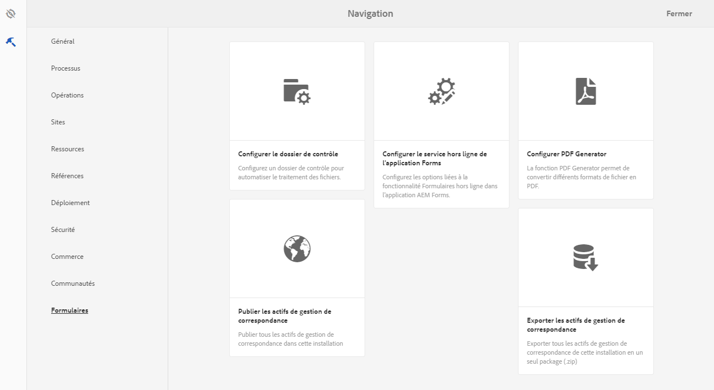
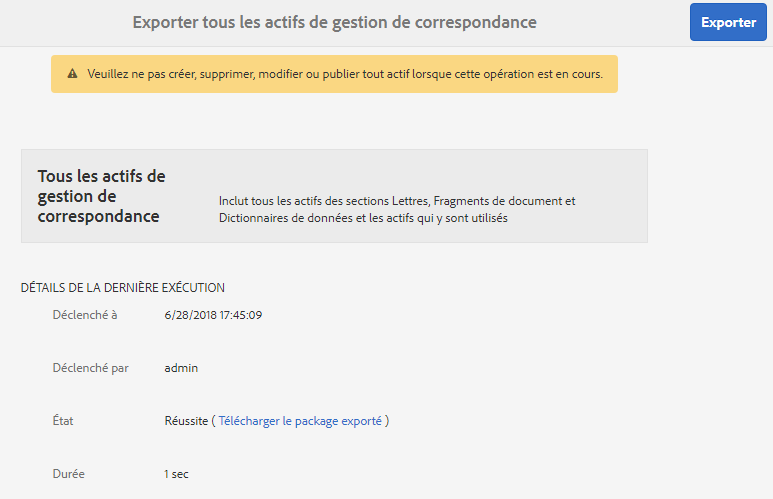
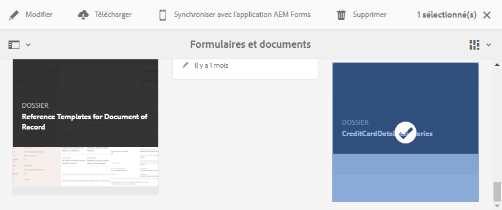
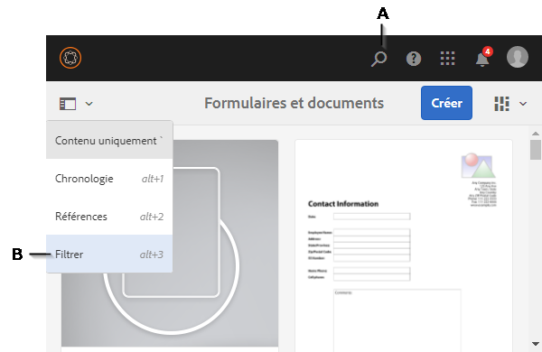
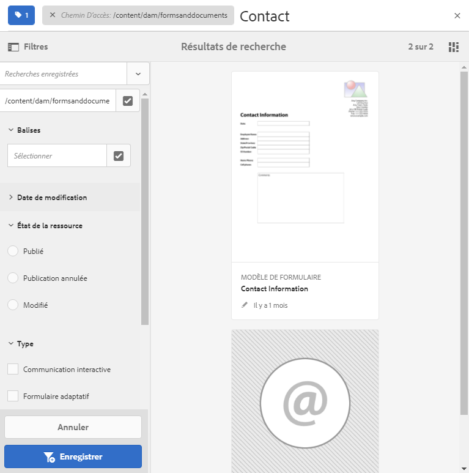

# Importation et exportation des actifs dans AEM Forms{#importing-and-exporting-assets-to-aem-forms}

Vous pouvez déplacer des formulaires et des ressources, thèmes, dictionnaires de données, fragments de document et lettres associés entre différentes instances AEM Forms. Ce déplacement est nécessaire lors de la migration des systèmes ou du déplacement des formulaires d’un serveur d’étape à un serveur de production. En ce qui concerne les actifs pour lesquels le téléchargement et l’importation via l’interface utilisateur AEM Forms sont pris en charge, l’utilisation de l’interface utilisateur Forms est recommandée pour l’exportation ou l’importation. L’utilisation d’AEM Package Manager pour l’exportation ou l’importation de ces actifs n’est pas recommandée.

>[!NOTE]
>
>* Dans AEM 6.4 Forms, la structure et les chemins d&#39;accès de crx-repository ont changé. Si vous importez des actifs d’une version précédente vers AEM Forms 6.4 et que le formulaire est dépendant de l’ancienne structure, vous devez exporter manuellement les dépendances. Pour plus d&#39;informations sur les modifications apportées à la structure et aux chemins d&#39;accès du référentiel, consultez la section [Restructuration du référentiel dans AEM](/help/sites-deploying/repository-restructuring.md).

>

## Téléchargement et chargement d’actifs de Formulaires et documents {#download-or-upload-forms-amp-documents-assets}

L’interface utilisateur d’AEM Forms vous permet d’exporter des actifs d’une instance AEM en les téléchargeant sous forme de package CRX ou de fichiers binaires AEM. Vous pouvez ensuite importer le package CRX ou le fichier binaire AEM téléchargé dans une autre instance AEM.

L’exportation et l’importation via l’interface utilisateur AEM Forms sont prises en charge pour tous les actifs, à l’exception des modèles de formulaire adaptatif et des stratégies de contenu de formulaire adaptatif. Par conséquent, lors de l’exportation d’un formulaire adaptatif depuis l’interface utilisateur d’AEM Forms, le modèle de formulaire adaptatif associé et les stratégies de contenus ne sont pas automatiquement exportés comme d’autres actifs associés.

Pour ces types d’actifs, vous devez utiliser AEM Package Manager pour créer un package CRX sur le serveur AEM source et pour installer le package sur le serveur de destination. Pour plus d’informations sur la création et l’installation des packages, voir [Utilisation des packages](/help/sites-administering/package-manager.md).

### Téléchargement des actifs Formulaires et documents {#download-forms-amp-documents-assets}

Pour télécharger des ressources Forms &amp; Documents :

1. Connectez-vous à l’instance AEM Forms.
1. Appuyez sur l’icône Experience Manager  > navigation 
1. Sélectionnez les actifs de formulaires et cliquez sur l’**icône de téléchargement**.
1. Dans Télécharger les ressources, sélectionnez l’une des options suivantes, puis appuyez sur **Télécharger**.

   * **Télécharger sous forme de package CRX :** utilisez l’option pour télécharger et déplacer tous les actifs sélectionnés et les dépendances connexes d’une instance AEM Forms vers une autre. Toutes les ressources et tous les dossiers sont téléchargés sous forme de package CRX. Toutes les ressources de formulaire, y compris les formulaires créés dans AEM (formulaires adaptatifs, communications interactives et fragments de formulaires adaptatifs), les ensembles de formulaires, les modèles de formulaires, les documents PDF et les ressources (fichiers XSD, XFS et images), peuvent être téléchargés en tant que packages depuis l’interface utilisateur d’AEM Forms.
L’avantage du téléchargement des actifs en tant que package est le téléchargement des actifs qui ont été utilisés par l’actif à télécharger. Par exemple, si vous avez un formulaire adaptatif qui utilise un modèle de formulaire, le schéma XSD et l’image. Lorsque vous sélectionnez ce formulaire adaptatif et vous le téléchargez sous forme de package, le package téléchargé contient également le modèle de formulaire, le schéma XSD et l’image. Toutes les propriétés de métadonnées (propriétés personnalisées incluses) associées à l’actif sont également téléchargées.

   * **Télécharger le/les actifs sous forme de fichiers binaires :** utilisez l’option pour télécharger uniquement les modèles de formulaire (XDP), les formulaires PDF (PDF), les documents (PDF) et les ressources (images, schémas, feuilles de style). Vous pouvez modifier ces actifs dans des applications externes. Cette option permet de télécharger les ressources de formulaires qui possèdent des fichiers binaires, telles que des fichiers XSD, XDP, des images, des fichiers PDF et XDP comme un fichier .zip.
Vous ne pouvez pas télécharger de formulaires adaptatifs, de communications interactives, de fragments de formulaire adaptatif, de thèmes et de jeux de formulaires avec **Télécharger les ressources sous forme de fichiers binaires** option. Pour télécharger ces actifs, vous devez utiliser l’option **Télécharger sous forme de package CRX**.

   Les actifs sélectionnés sont téléchargés sous forme d’archive (fichier .zip).

   >[!NOTE]
   >
   >Le package et les fichiers binaires AEM sont téléchargés sous forme d’archive (fichier .zip). Les modèles des ressources ne sont pas téléchargés avec les ressources. Vous devez exporter les modèles des ressources séparément.

### Téléchargement d’actifs Formulaires et documents {#upload-forms-amp-documents-assets}

Pour télécharger des actifs Formulaires et documents :

>[!VIDEO](https://vimeo.com/)

1. Connectez-vous à l’instance AEM Forms.
1. Appuyez sur l’icône Experience Manager  > navigation 
1. Appuyez sur **Create** (Créer) > **File Upload** (Téléchargement de fichier). Une boîte de dialogue de téléchargement de formulaires ou de package apparaît.
1. Dans la boîte de dialogue, recherchez et sélectionnez le package ou l’archive à importer. Vous pouvez également sélectionner document PDF, schémas XSD, images, feuilles de style et formulaires XDP. Appuyez sur **Ouvrir**. Le dossier ou le nom de fichier que vous sélectionnez ne doit pas contenir de caractères spéciaux.

   Dans la boîte de dialogue, vérifiez les détails des fichiers en cours de téléchargement et appuyez sur **Télécharger**.

   Si vous téléchargez un actif de formulaires existants, il est mis à jour.

   >[!NOTE]
   >
   >Le téléchargement du package ne remplace pas la hiérarchie des dossiers existante. Par exemple, si vous avez un formulaire adaptatif nommé « formation » à l’emplacement /content/dam/formsanddocuments sur un serveur. Téléchargez le formulaire adaptatif et téléchargez le formulaire sur un autre serveur. Le deuxième serveur dispose également d’un dossier nommé « Training » au même emplacement /content/dam/formsanddocuments. Le téléchargement échoue.

## Téléchargement ou chargement d’un thème {#downloading-or-uploading-a-theme}

Avec AEM Forms, vous pouvez créer, télécharger ou charger des thèmes. Un thème est créé comme d’autres actifs tels que les formulaires, les documents et les lettres. Vous pouvez créer un thème, le télécharger, puis le charger sur une instance distincte pour le réutiliser. Pour plus d’informations sur les thèmes, consultez la section [Thèmes dans AEM Forms](../../forms/using/themes.md).

### Téléchargement d’un thème  {#downloading-a-theme}

Vous pouvez exporter des thèmes dans AEM Forms, que vous pouvez utiliser dans d’autres projets ou instances. AEM vous permet de télécharger le thème sous la forme d’un fichier zip, que vous pouvez charger sur l’instance.

Pour télécharger un thème :

1. Connectez-vous à l’instance AEM Forms.
1. Appuyez sur Experience Manager  icône > navigation  icône> Forms> Thèmes.
1. Sélectionnez le composant et appuyez sur **Télécharger**. Le thème est téléchargé sous forme d’archive (fichier .zip).

### Chargement d’un thème {#uploading-a-theme}

Vous pouvez utiliser les thèmes créés avec des paramètres prédéfinis de style sur votre projet. Vous pouvez importer des packages de thème que d’autres créent en les chargeant sur votre projet.

Pour charger un thème :

1. Dans Experience Manager, accédez à **Forms > Thèmes**.
1. Sur la page Thèmes, cliquez sur **Créer > Chargement de fichier**.
1. Dans l’invite de téléchargement de fichier, recherchez et sélectionnez un package de thème sur votre ordinateur et cliquez sur **Charger**.
Le thème chargé est disponible dans la page Thèmes.

1. Connectez-vous à l’instance AEM Forms.
1. Appuyez sur Experience Manager  icône > navigation  icône> Forms> Thèmes.
1. Cliquez sur **Créer**> **Chargement de fichier**. Dans l’invite de téléchargement de fichier, recherchez et sélectionnez un package de thème sur votre ordinateur et cliquez sur **Charger**. Le thème est chargé.

## Importation et importation des actifs dans Correspondance Management  {#import-and-export-assets-in-correspondence-management}

Pour partager des actifs, tels que des dictionnaires de données, lettres et fragments de document, entre deux implémentations différentes de Correspondance Management, vous pouvez créer et partager des fichiers .cmp. Un fichier .cmp peut inclure des dictionnaires de données, des lettres, des fragments de document et des formulaires.

### Exporter des fragments de document, des lettres et/ou des dictionnaires de données {#export-document-fragments-letters-and-or-data-dictionaries}

1. Dans les lettres, les fragments de document ou les pages de dictionnaire de données, cliquez sur les actifs à exporter dans un package unique pour les sélectionner, puis cliquez sur Ajouter à la file d’attente de téléchargement. Les actifs sont placés en file d’attente pour l’exportation.
1. Si nécessaire, répétez les étapes ci-dessus pour ajouter des lettres, des fragments de document et des dictionnaires de données.
1. Appuyez sur **Download** (Télécharger). 
1. Correspondence Management affiche la boîte de dialogue Télécharger les ressources avec une liste de ressources dans la liste d’exportation.

   

1. Pour visualiser les dépendances qui sont exportées, appuyez sur Résoudre. Sinon, passez à l’étape suivante. Même si vous n’appuyez pas sur Résoudre, les dépendances sont toujours exportées.
1. Pour télécharger le fichier .cmp, appuyez sur **OK**.
1. Correspondance Management télécharge un fichier .cmp sur votre ordinateur.

   Le fichier.cmp comprend les actifs exportés. Vous pouvez partager le fichier.cmp avec d’autres personnes. Les autres utilisateurs peuvent importer le fichier.cmp dans un serveur différent pour récupérer tous les actifs dans le nouveau serveur.

### Exportation de tous les actifs de Correspondence Management sous forme de package  {#export-all-the-correspondence-management-assets-as-a-package}

Utilisez cette option pour télécharger tous les actifs de Correspondence Management et les dépendances connexes sous la forme d’un package depuis une instance AEM Forms.

Si par exemple, Correspondence Management contient une lettre qui utilise une image et un texte, le package téléchargé contient également l’image et le texte relatif à la lettre. Toutes les propriétés de métadonnées (propriétés personnalisées incluses) associées à l’actif sont également téléchargées. Une fois que vous avez téléchargé le package (.cmp), vous pouvez [importer le package vers une autre instance d’AEM Forms](../../forms/using/import-export-forms-templates.md#p-upload-forms-documents-assets-p).

Pour télécharger tous les actifs de Correspondence Management et les dépendances connexes sous la forme d’un package, procédez comme suit :

1. Connectez-vous au serveur AEM Forms en tant qu’utilisateur de formulaires.
1. Appuyez sur **Adobe Experience Manager** dans la barre de navigation globale.
1. Appuyez sur outils ( ), puis sur **Forms**.
1. Appuyez sur **Exporter les actifs de Correspondence Management**.

   

   ( &quot;La page Exporter tous les actifs de Correspondence Management s’affiche et affiche les informations sur la dernière tentative d’exportation et un lien pour télécharger le dernier package exporté avec succès.

   

1. Appuyez sur **Exporter** et, dans le message de confirmation, appuyez sur **OK**.

   À la fin du traitement par lot, les détails de la dernière exécution et un lien de téléchargement du package s’affichent. Ces informations indiquent la session administrateur et si le traitement du lot a réussi ou échoué. Les actifs sont exportés vers un package et le lien Télécharger le package exporté s’affiche.

   >[!NOTE]
   >
   >Le processus Exporter tous les actifs ne peut pas être annulé une fois lancé. En outre, pendant que le processus d’exportation est en cours, ne procédez à aucune création, suppression, modification ou publication d’actifs. N’entamez pas de processus Publier tous les actifs.

1. Appuyez sur le lien **Télécharger le package exporté** pour télécharger le fichier du package.

   Pour ajouter les actifs du package à une autre instance de Correspondence Management, [importez le package vers une instance AEM Forms](../../forms/using/import-export-forms-templates.md#p-upload-forms-documents-assets-p).

### Importation de fragments de document, lettres et/ou dictionnaires de données dans Correspondence Management {#import-document-fragments-letters-and-or-data-dictionaries-into-correspondence-management}

Vous pouvez importer des ressources qui sont exportées dans un fichier .cmp. Un fichier .cmp peut comporter une ou plusieurs lettres, des dictionnaires de données, des fragments de documents et des actifs dépendants.

>[!NOTE]
>
>Lors de l’importation d’anciens actifs de Correspondence Management pour la migration, connectez-vous à l’aide d’un compte administrateur. Pour plus d’informations sur la migration d’anciens actifs de Correspondence Management, voir [Migration des ressources de Correspondence Management vers AEM Forms 6.1](/help/forms/using/migration-utility.md).

1. Sur la page de fragments de dictionnaire de données, de lettres ou de document, appuyez sur **Créer > Télécharger le fichier** et sélectionnez le fichier .cmp.
1. Correspondance Management affiche la boîte de dialogue d’importation des actifs avec la liste des actifs qui sont importés. Appuyez sur **Importer**.

   Après avoir importé les actifs, les propriétés suivantes des actifs sont mises à jour tandis que les autres propriétés restent les mêmes :

   * Auteur : affiche l’ID de l’utilisateur qui a importé l’actif dans le serveur
   * Modifié : l’heure à laquelle l’actif a été importé dans le serveur

   >[!NOTE]
   >
   >Pour que vous puissiez télécharger des fichiers XDP (comme partie du fichier cmp ou autre), vous devez faire partie du groupe forms-power-users. Pour obtenir les droits d’accès, contactez l’administrateur.

## Exporter une application de processus  {#export-a-workflow-application}

Vous pouvez utiliser le gestionnaire de packages AEM pour exporter des applications de processus. Pour ce faire, procédez comme suit :

1. Ouvrez le gestionnaire de packages AEM Forms. L’URL du gestionnaire de packages est https://&lt;serveur>:&lt;port>/crx/packmgr.
1. Cliquez sur **[!UICONTROL Créer un package]**. La boîte de dialogue **[!UICONTROL Nouveau package]** apparaît.
1. Indiquez le nom, la version et le groupe du package. Cliquez sur **[!UICONTROL OK]**.
1. Cliquez sur **[!UICONTROL Modifier]** et ouvrez l’onglet **[!UICONTROL Filtres]**. Cliquez sur **[!UICONTROL Add Filter]** (Ajouter un filtre). Indiquez le chemin de l’application de processus. Par exemple, /etc/fd/dashboard/startpoints/homemortgage. Cliquez sur **[!UICONTROL Ajouter une règle]**.

1. Ouvrez l’onglet **[!UICONTROL Avancé.]** Sélectionnez **[!UICONTROL Fusionner]** ou **[!UICONTROL Remplacer]** dans le champ Gestion de l’ACL. Cliquez sur **[!UICONTROL Enregistrer]**.
1. Cliquez sur **[!UICONTROL Générer]** pour créer le package.

   Une fois le package créé, vous pouvez le télécharger et l’importer sur l’autre serveur. L’application de processus apparaît sur le serveur sur lequel le package est téléchargé.

   >[!NOTE]
   >
   >Pour que l’application de processus fonctionne correctement, exportez également le formulaire adaptatif et le modèle de processus correspondants avec l’application de travail.

## Dossiers et organisation des actifs  {#folders-and-organizing-assets}

L’interface utilisateur d’AEM Forms utilise des dossiers pour classer les actifs. Ces dossiers sont utilisés pour classer les actifs créés dans l’interface utilisateur AEM Forms. Vous pouvez renommer, créer des sous-dossiers et stocker des actifs et des documents dans ces dossiers. L’organisation des documents et des actifs dans un dossier vous permet de regrouper les fichiers pour une gestion simplifiée. Vous pouvez sélectionner un dossier et choisir de le télécharger ou de le supprimer.

Pour créer un dossier, procédez comme suit :

### Créer un dossier {#create-a-folder}

1. Connectez-vous à l’interface utilisateur AEM Forms à l’adresse `https://<server>:<port>/aem/forms.html`.
1. Accédez à l’emplacement où vous souhaitez créer un dossier.
1. Appuyez sur Créer > Dossier.
1. Saisissez les informations suivantes :

   * **Titre : nom** d’affichage du dossier
   * **Nom :** *(Obligatoire)* nom du nœud sous lequel vous souhaitez stocker le dossier dans le référentiel.

   >[!NOTE]
   >
   >Par défaut, la valeur du champ de nom est automatiquement renseignée à partir du titre. Le nom peut contenir uniquement des caractères alphanumériques, des tirets (-) et des traits de soulignement (_). Tout autre caractère spécial saisi dans le titre est automatiquement remplacé par un tiret. Vous êtes alors invité à confirmer le nouveau nom. Vous pouvez choisir de conserver le nom proposé ou de le modifier.

1. Un nouveau dossier avec le titre que vous avez défini s’affiche à l’emplacement spécifié dans la liste des ressources.

   Si un dossier portant le même nom que celui spécifié existe déjà, l’envoi échoue avec une erreur. Vous pouvez vue le message d’erreur en passant la souris sur l’icône  qui s’affiche en regard du champ de nom.

   Vous pouvez appuyer sur le dossier que vous venez de créer afin de l’ouvrir et de créer des actifs ou des dossiers dans ce dossier. En outre, vous pouvez sélectionner un dossier et choisir de le mettre en file d’attente pour le téléchargement, de le supprimer ou de modifier son nom.

   

### Créer des copies d’un ou de plusieurs actifs ou lettres {#create-copies-of-one-or-more-assets-or-letters}

Vous pouvez utiliser des lettres et des actifs existants pour créer rapidement des actifs et des lettres avec des propriétés, du contenu et des actifs hérités similaires. Vous pouvez copier et coller des dictionnaires de données, des fragments de document et des lettres.

Effectuez les étapes suivantes pour créer des copies d’actifs et de lettres :

1. Dans la page Actifs ou Lettres appropriée, sélectionnez un ou plusieurs actifs/lettres. L’interface utilisateur affiche l’icône Copier.
1. Appuyez sur Copier. L’interface utilisateur affiche l’icône Coller. Vous pouvez également choisir d’accéder/de naviguer dans un dossier avant de le coller. Des dossiers différents peuvent contenir des actifs avec les mêmes noms. Pour plus d’informations sur les dossiers, voir [Dossiers et organisation des actifs](#folders-and-organizing-assets).
1. Appuyez sur Coller. La boîte de dialogue Coller s’affiche. Le système génère automatiquement des noms et des titres pour les nouvelles copies d’actifs/de lettres, mais vous pouvez modifier les titres et les noms des actifs/lettres.

   Si vous copiez et collez les actifs/lettres au même endroit, un suffixe &quot;-CopyXX&quot; est ajouté au nom existant de la ressource/lettre. Si aucun titre n’existe pour la lettre/l’actif copié, le champ de titre généré automatiquement reste vide.

1. Si nécessaire, modifiez le titre et le nom sous lesquels vous souhaitez enregistrer la copie de la lettre/de l’actif.
1. Appuyez sur Coller. De nouvelles copies des actifs copiés sont créées.

## Recherche {#search-forms}

L’interface utilisateur d’AEM Forms vous permet de rechercher votre contenu. A l’aide de la barre supérieure, vous pouvez appuyer sur Rechercher **[A]** pour rechercher dans votre contenu des ressources telles que des ressources et des documents.

Lorsque vous recherchez des actifs, AEM Forms affiche le panneau latéral. Vous pouvez également appuyer sur  > Filtre **[B]** pour appeler le panneau latéral. À l’aide des divers filtres disponibles dans le panneau latéral, vous pouvez affiner votre recherche. Le panneau latéral permet également d’enregistrer vos recherches.

**A.** Recherche  **B.** Filter

Panneau latéral : filtres

Sur le panneau latéral, vous pouvez utiliser les éléments suivants pour affiner les résultats de votre recherche :

* Répertoire de recherche
* Balises
* Critères de recherche, par exemple, les dates de modification, l’état de publication, l’état LiveCopy. 

Le panneau latéral vous permet également d’enregistrer vos paramètres de recherche avec les noms de votre choix.

Pour plus d’informations et d’instructions sur l’utilisation de la recherche, des filtres, de la recherche enregistrée et du panneau latéral, voir [Recherche](/help/sites-authoring/search.md).
