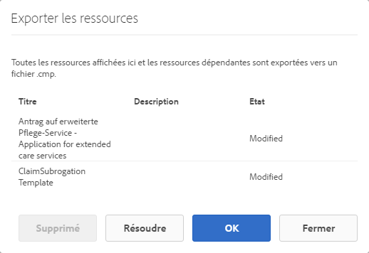

# Importer et exporter des ressources dans AEM Forms{#importing-and-exporting-assets-to-aem-forms}

Vous pouvez déplacer des formulaires ainsi que les ressources, thèmes, dictionnaires de données, fragments de document et lettres associés entre différentes instances AEM Forms. Ce déplacement est nécessaire lors de la migration des systèmes ou du déplacement des formulaires d’un serveur d’étape à un serveur de production. En ce qui concerne les ressources pour lesquelles le téléchargement et l’importation via l’interface utilisateur AEM Forms sont pris en charge, l’utilisation de l’interface utilisateur de Forms est recommandée pour l’exportation ou l’importation. L’utilisation du gestionnaire de packages d’AEM pour l’exportation ou l’importation de ces ressources n’est pas recommandée.

>[!NOTE]
>
>* Dans AEM 6.4 Forms, la structure ainsi que les chemins d’accès du référentiel crx ont changé. Si vous importez des ressources d’une version précédente vers AEM 6.4 Forms et que le formulaire comporte certaines dépendances sur l’ancienne structure, vous devez exporter manuellement les dépendances. Pour plus d’informations sur les modifications apportées à la structure et aux chemins du référentiel, voir [Restructurer les référentiels dans AEM](/help/sites-deploying/repository-restructuring.md).
>

## Téléchargement et chargement de ressources de formulaires et documents {#download-or-upload-forms-amp-documents-assets}

L’interface utilisateur d’AEM Forms vous permet d’exporter des ressources d’une instance AEM en les téléchargeant sous forme de package CRX ou de fichiers binaires AEM. Vous pouvez ensuite importer le package CRX ou le fichier binaire AEM téléchargé dans une autre instance AEM.

L’exportation et l’importation via l’interface utilisateur AEM Forms sont prises en charge pour toutes les ressources, à l’exception des modèles et des politiques de contenu de formulaires adaptatifs. Par conséquent, lors de l’export d’un formulaire adaptatif depuis l’interface utilisateur d’AEM Forms, le modèle de formulaire adaptatif associé et les politiques de contenus ne sont pas automatiquement exportés comme d’autres ressources associées.

Pour ces types de ressources, vous devez utiliser le gestionnaire de modules d’AEM pour créer un package CRX sur le serveur AEM source et pour installer le module sur le serveur de destination. Pour plus d’informations sur la création et l’installation des packages, voir [Utilisation des packages](/help/sites-administering/package-manager.md).

### Téléchargement des ressources de formulaires et documents {#download-forms-amp-documents-assets}

Pour télécharger des ressources de formulaires et de documents :

1. Connectez-vous à l’instance AEM Forms.
1. Sélectionnez l’icône Experience Manager  > Icône de navigation  > Formulaires > Formulaires et documents.
1. Sélectionnez les ressources de formulaires et sélectionnez l’icône **Télécharger**.
1. Dans la/les ressources de téléchargement, choisissez l’une des options suivantes, puis sélectionnez **Télécharger**.

   * **Télécharger sous forme de package CRX :** utilisez cette option pour télécharger et déplacer toutes les ressources sélectionnées et les dépendances connexes d’une instance AEM Forms vers une autre. Toutes les ressources et tous les dossiers sont téléchargés sous forme de package CRX. Toutes les ressources de formulaires, y compris les formulaires créés dans AEM (formulaires adaptatifs, communications interactives et fragments de formulaires adaptatifs), les ensembles de formulaires, les modèles de formulaires, les documents PDF et les ressources (fichiers XSD, XFS et images), peuvent être téléchargés en tant que packages depuis l’interface utilisateur d’AEM Forms.
L’avantage du téléchargement des ressources sous forme de package est le téléchargement des ressources qui ont été utilisées par la ressource à télécharger. Par exemple, si vous avez un formulaire adaptatif qui utilise un modèle de formulaire, le schéma XSD et une image. Lorsque vous sélectionnez ce formulaire adaptatif et le téléchargez sous forme de package, le package téléchargé contient également le modèle de formulaire, le schéma XSD et l’image. Toutes les propriétés de métadonnées (propriétés personnalisées incluses) associées à la ressource sont également téléchargées.

   * **Télécharger la/les ressources sous forme de fichiers binaires :** utilisez cette option pour télécharger uniquement les modèles de formulaire (XDP), les formulaires PDF (PDF), les documents (PDF) et les ressources (images, schémas, feuilles de style). Vous pouvez modifier ces ressources dans des applications externes. Cette option permet de télécharger les ressources de formulaires qui possèdent des fichiers binaires, telles que des fichiers XSD, XDP, des images, des fichiers PDF et XDP comme un fichier .zip.
Vous ne pouvez pas télécharger de formulaires adaptatifs, de communications interactives, de fragments de formulaires adaptatifs, de thèmes ni de jeux de formulaires avec l’option **Télécharger des ressources en tant que fichiers binaires**. Pour télécharger ces ressources, vous devez utiliser l’option **Télécharger sous forme de package CRX**.

   Les ressources sélectionnées sont téléchargées sous forme d’archive (fichier .zip).

   >[!NOTE]
   >
   >Le package et les fichiers binaires AEM sont téléchargés sous forme d’archive (fichier .zip). Les modèles des ressources ne sont pas téléchargés avec les ressources. Vous devez exporter les modèles de ressources séparément.

### Pour charger des ressources de formulaires et documents : {#upload-forms-amp-documents-assets}

Pour télécharger des ressources Formulaires et documents :

<!--[!VIDEO](https://vimeo.com/)-->

1. Connectez-vous à l’instance AEM Forms.
1. Sélectionnez l’icône Experience Manager  > Icône de navigation  > Formulaires > Formulaires et documents.
1. Sélectionnez **Créer** > **Charger des fichiers**. Une boîte de dialogue de téléchargement de formulaires ou de package apparaît.
1. Dans la boîte de dialogue, recherchez et sélectionnez le package ou l’archive à importer. Vous pouvez également sélectionner le document PDF, les fichiers XSD, les images, les feuilles de style et les formulaires XDP. Sélectionnez **Ouvrir**. Le nom de dossier ou de fichier que vous sélectionnez ne doit pas contenir de caractères spéciaux.

   Dans la boîte de dialogue, vérifiez les détails des ressources à charger, puis sélectionnez **Charger**.

   Si vous chargez une ressource de formulaires existants, la ressource est mise à jour.

   >[!NOTE]
   >
   >Le téléchargement du package ne remplace pas la hiérarchie des dossiers existante. Par exemple, si vous avez un formulaire adaptatif nommé « Training » à l’emplacement /content/dam/formsanddocuments sur un serveur. Téléchargez le formulaire adaptatif et chargez le formulaire sur un autre serveur. Le deuxième serveur dispose également d’un dossier nommé « Training » au même emplacement /content/dam/formsanddocuments. Le chargement échoue.

## Téléchargement ou chargement d’un thème {#downloading-or-uploading-a-theme}

Avec AEM Forms, vous pouvez créer, télécharger ou charger des thèmes. Un thème est créé comme d’autres ressources tels que les formulaires, les documents et les lettres. Vous pouvez créer un thème, le télécharger, puis le charger sur une instance distincte pour le réutiliser. Pour plus d’informations sur les thèmes, consultez la section [Thèmes dans AEM Forms](../../forms/using/themes.md).

### Téléchargement d’un thème {#downloading-a-theme}

Vous pouvez exporter des thèmes dans AEM Forms, que vous pouvez utiliser dans d’autres projets ou instances. AEM vous permet de télécharger le thème sous la forme d’un fichier zip, que vous pouvez charger sur l’instance.

Pour télécharger un thème :

1. Connectez-vous à l’instance AEM Forms.
1. Sélectionnez l’icône Experience Manager  > Icône de navigation  > Formulaires > Thèmes.
1. Sélectionnez le thème et sélectionnez **Télécharger**. Le thème est téléchargé sous forme d’archive (fichier .zip).

### Chargement d’un thème {#uploading-a-theme}

Vous pouvez utiliser les thèmes créés avec des paramètres prédéfinis de style sur votre projet. Vous pouvez importer des packages de thème que d’autres créent en les chargeant sur votre projet.

Pour charger un thème :

1. Dans Experience Manager, accédez à **Formulaires > Thèmes**.
1. Sur la page Thèmes, cliquez sur **Créer > Chargement de fichier**.
1. Dans l’invite de téléchargement de fichier, recherchez et sélectionnez un package de thème sur votre ordinateur et cliquez sur **Charger**.
Le thème chargé est disponible dans la page Thèmes.

1. Connectez-vous à l’instance AEM Forms.
1. Sélectionnez l’icône Experience Manager  > Icône de navigation  > Formulaires > Thèmes.
1. Cliquez sur **Créer** > **Chargement de fichier**. Dans l’invite de chargement de fichier, recherchez et sélectionnez un package de thème sur votre ordinateur et cliquez sur **Charger**. Le thème est chargé.

## Importer et exporter des ressources dans Correspondence Management {#import-and-export-assets-in-correspondence-management}

Pour partager des ressources, telles que des dictionnaires de données, des lettres, et des fragments de document, entre deux implémentations différentes de Correspondance Management, vous pouvez créer et partager des fichiers .cmp. Un fichier .cmp peut inclure des dictionnaires de données, des lettres, des fragments de document et des formulaires.

### Exporter des fragments de document, des lettres et/ou des dictionnaires de données {#export-document-fragments-letters-and-or-data-dictionaries}

1. Dans les lettres, les fragments de document ou les pages de dictionnaire de données, cliquez sur les ressources à exporter dans un package unique pour les sélectionner, puis cliquez sur Ajouter à la file d’attente de téléchargement. Les ressources sont placées en file d’attente pour l’export.
1. Si nécessaire, répétez les étapes ci-dessus pour ajouter des lettres, des fragments de document et des dictionnaires de données.
1. Sélectionnez **Télécharger**.
1. Correspondance Management affiche la boîte de dialogue Télécharger la/les ressource(s) avec une liste de ressources se trouvant dans la liste d’exportation.

   

1. Pour visualiser les dépendances qui sont exportées, sélectionnez Résoudre. Sinon, passez à l’étape suivante. Même si vous ne sélectionnez pas Résoudre, les dépendances sont toujours exportées.
1. Pour télécharger le fichier .cmp, sélectionnez **OK**.
1. Correspondance Management télécharge un fichier .cmp sur votre ordinateur.

   Le fichier.cmp comprend les ressources exportées. Vous pouvez partager le fichier .cmp avec d’autres utilisateurs et utilisatrices. D’autres utilisateurs et utilisatrices peuvent importer le fichier .cmp dans un autre serveur pour obtenir toutes les ressources du nouveau serveur.

### Exporter toutes les ressources de Correspondence Management sous la forme d’un package {#export-all-the-correspondence-management-assets-as-a-package}

Utilisez cette option pour télécharger toutes les ressources de Correspondence Management et les dépendances connexes sous la forme d’un package à partir d’une instance AEM Forms.

Par exemple, si Correspondence Management comporte une lettre qui utilise une image et du texte, le package téléchargé contient également l’image et le texte associés à la lettre. Toutes les propriétés de métadonnées (propriétés personnalisées incluses) associées à la ressource sont également téléchargées. Une fois que vous avez téléchargé le package (.cmp), vous pouvez [importer le package vers une autre instance d’AEM Forms](../../forms/using/import-export-forms-templates.md#p-upload-forms-documents-assets-p).

Pour télécharger toutes les ressources de Correspondence Management et les dépendances connexes sous la forme d’un package, procédez comme suit :

1. Connectez-vous au serveur AEM Forms en tant qu’utilisateur ou utilisatrice de formulaires.
1. Sélectionnez **Adobe Experience Manager** dans la barre de navigation générale.
1. Sélectionnez Outils (), puis **Formulaires**.
1. Sélectionnez **Exporter les ressources Correspondence Management**.

   

   La page Exporter toutes les ressources Correspondence Management apparaît et affiche les informations sur le dernier processus d’exportation en date, ainsi qu’un lien de téléchargement du dernier package dont l’exportation a réussi.

   

1. Sélectionnez **Exporter**, puis **OK** dans le message de confirmation.

   Une fois le traitement par lot terminé, les détails de la dernière exécution et le lien de téléchargement du package sont mis à jour. Cela inclut des informations telles que la connexion de l’administrateur ou l’administratrice et si le lot a réussi ou échoué. Les ressources sont exportées vers un package et le lien « Télécharger le package exporté » s’affiche.

   >[!NOTE]
   >
   >Le processus « Exporter toutes les ressources » ne peut pas être annulé une fois lancé. En outre, pendant que l’opération « Tout exporter » est en cours, ne procédez à aucune création, suppression, modification ou publication de ressources et ne lancez aucune opération d’export de toutes les ressources.

1. Sélectionnez le lien **Télécharger le package exporté** pour télécharger le fichier de package.

   Pour ajouter des ressources du package à une autre instance de Correspondence Management, [importez le package vers une instance AEM Forms](../../forms/using/import-export-forms-templates.md#p-upload-forms-documents-assets-p).

### Importer des fragments de document, des lettres et/ou des dictionnaires de données dans Correspondence Management {#import-document-fragments-letters-and-or-data-dictionaries-into-correspondence-management}

Vous pouvez importer des ressources qui sont exportées dans un fichier .cmp. Un fichier .cmp peut comporter une ou plusieurs lettres et ressources dépendantes, et un ou plusieurs dictionnaires de données et fragments de document.

>[!NOTE]
>
>Lors de l’importation d’anciens actifs de Correspondence Management pour la migration, connectez-vous à l’aide d’un compte administrateur. Pour plus d’informations sur la migration d’anciens actifs de Correspondence Management, voir [Migration des ressources de Correspondence Management vers AEM Forms 6.1](/help/forms/using/migration-utility.md).

1. Dans le dictionnaire de données, les lettres, ou la page de fragments de documents, sélectionnez **Créer > Chargement de fichier** et sélectionnez le fichier .cmp.
1. Correspondance Management affiche la boîte de dialogue d’importation des ressources avec la liste des ressources qui sont importées. Sélectionnez **Importer**.

   Après l’import des ressources, les propriétés suivantes des ressources sont mises à jour, tandis que les autres propriétés restent les mêmes :

   * Auteur/Autrice : affiche l’identifiant de l’utilisateur ou l’utilisatrice qui a importé la ressource sur le serveur
   * Modifié : heure à laquelle la ressource a été importée sur le serveur

   >[!NOTE]
   >
   >Pour que vous puissiez charger des fichiers XDP (dans le fichier cmp ou autre), vous devez faire partie du groupe forms-power-users. Pour obtenir les droits d’accès, contactez l’administrateur ou l’administratrice.

## Exporter une application de workflow {#export-a-workflow-application}

Vous pouvez utiliser le gestionnaire de packages AEM pour exporter des applications de workflow. Pour ce faire, procédez comme suit :

1. Ouvrez le gestionnaire de packages AEM Forms. L’URL du gestionnaire de packages est https://&lt;server>:&lt;port>/crx/packmgr.
1. Cliquez sur **[!UICONTROL Créer un package]**. La boîte de dialogue **[!UICONTROL Nouveau package]** apparaît.
1. Indiquez le nom, la version et le groupe du package. Cliquez sur **[!UICONTROL OK]**.
1. Cliquez sur **[!UICONTROL Modifier]** et ouvrez l’onglet **[!UICONTROL Filtres]**. Cliquez sur **[!UICONTROL Ajouter un filtre]**. Spécifiez le chemin d’accès de l’application du workflow. Par exemple, /etc/fd/dashboard/startpoints/homemortgage. Cliquez sur **[!UICONTROL Ajouter une règle]**.

1. Ouvrez l’onglet **[!UICONTROL Avancé]**. Sélectionnez **[!UICONTROL Fusionner]** ou **[!UICONTROL Remplacer]** dans le champ Gestion de l’ACL. Cliquez sur **[!UICONTROL Enregistrer]**.
1. Cliquez sur **[!UICONTROL Générer]** pour créer le package.

   Une fois le package créé, vous pouvez le télécharger et l’importer sur l’autre serveur. L’application de workflow apparaît sur le serveur sur lequel le package est téléchargé.

   >[!NOTE]
   >
   >Pour que l’application du workflow fonctionne correctement, exportez le formulaire adaptatif et le modèle de workflow correspondants avec l’application de travail.

## Dossiers et organisation des ressources {#folders-and-organizing-assets}

L’interface utilisateur d’AEM Forms utilise des dossiers pour classer les ressources. Ces dossiers sont utilisés pour classer les ressources créées dans l’interface utilisateur AEM Forms. Vous pouvez renommer, créer des sous-dossiers et stocker des ressources et des documents dans ces dossiers. L’organisation des documents et des ressources dans un dossier vous permet de regrouper les fichiers pour une gestion simplifiée. Vous pouvez sélectionner un fichier et choisir de le télécharger ou de le supprimer.

Pour créer un dossier, procédez comme suit :

### Créer un dossier {#create-a-folder}

1. Connectez-vous à l’interface utilisateur d’AEM Forms à l’adresse `https://<server>:<port>/aem/forms.html`.
1. Accédez à l’emplacement où vous souhaitez créer un dossier.
1. Sélectionnez Créer > Dossier.
1. Saisissez les informations suivantes :

   * **Titre** : nom d’affichage du dossier.
   * **Nom** : *(Obligatoire)* nom du nœud sous lequel vous souhaitez stocker le dossier dans le référentiel.

   >[!NOTE]
   >
   >par défaut, la valeur du champ Nom est automatiquement renseignée à partir du titre. Le nom ne peut contenir que des caractères alphanumériques ou des tirets (-) et des traits de soulignement (_). Tous les autres caractères spéciaux saisis dans le titre sont automatiquement remplacés par un trait d’union. Il vous est demandé de confirmer le nouveau nom. Vous pouvez choisir de conserver le nom proposé ou de le modifier.

1. Un nouveau dossier avec le titre que vous avez défini s’affiche à l’emplacement spécifié dans la liste des ressources.

   Si un dossier portant le même nom que celui spécifié existe déjà, l’envoi échoue avec une erreur. Vous pouvez afficher le message d’erreur en pointant sur l’icône d’erreur  qui s’affiche en regard du champ Nom.

   Vous pouvez sélectionner le dossier que vous venez de créer afin de l’ouvrir et de créer des ressources ou des dossiers dans ce même dossier. De plus, vous pouvez sélectionner un dossier et choisir de le mettre en file d’attente pour le télécharger, le supprimer ou modifier son nom.

   

### Création de copies d’une ou de plusieurs ressources ou lettres {#create-copies-of-one-or-more-assets-or-letters}

Vous pouvez utiliser des ressources et des lettres existantes pour créer rapidement des ressources et des lettres avec des propriétés, du contenu et des ressources héritées similaires. Vous pouvez copier et coller des dictionnaires de données, des fragments de document et des lettres.

Procédez comme suit pour créer des copies de ressources et de lettres :

1. Dans la page Ressources ou Lettres, sélectionnez une ou plusieurs ressources/lettres. L’interface utilisateur affiche l’icône Copier.
1. Sélectionnez Copier. L’interface utilisateur affiche l’icône Coller. Vous pouvez également choisir d’accéder à un dossier avant de le coller. Différents dossiers peuvent contenir des ressources portant le même nom. Pour plus d’informations sur les dossiers, voir [Dossiers et organisation des actifs](#folders-and-organizing-assets).
1. Sélectionnez Coller. La boîte de dialogue Coller s’affiche. Le système génère automatiquement des noms et des titres pour les nouvelles copies d’actifs/de lettres, mais vous pouvez modifier les titres et les noms des actifs/lettres.

   Si vous copiez et collez les ressources/lettres dans le même emplacement, un suffixe « -CopieXX » est ajouté au nom existant de la ressource/lettre. Si aucun titre n’existait pour la ressource/lettre copiée, le champ de titre généré automatiquement reste vide.

1. Si nécessaire, modifiez le titre et le nom sous lesquels vous souhaitez enregistrer la copie de la lettre/de la ressource.
1. Sélectionnez Coller. De nouvelles copies des ressources copiées sont créées.

## Rechercher {#search-forms}

L’interface utilisateur d’AEM Forms vous permet de rechercher du contenu. Dans la barre supérieure, vous pouvez sélectionnez Rechercher **[A]** pour rechercher des éléments tels que des ressources et des documents dans votre contenu.

Lorsque vous recherchez des ressources, AEM Forms affiche le panneau latéral. Vous pouvez également sélectionner  > Filtrer **[B]** pour déployer le panneau latéral. En utilisant les différents filtres du panneau latéral, vous pouvez affiner votre recherche. Le panneau latéral vous permet également d’enregistrer vos recherches.

**A.** Rechercher **B.** Filtrer

Panneau latéral : filtres

Dans le panneau latéral, vous pouvez utiliser les éléments suivants pour affiner les résultats de la recherche :

* Répertoire de recherche
* Balises
* Critères de recherche, par exemple, les dates de modification, l’état de publication, l’état LiveCopy.

Le panneau latéral vous permet également d’enregistrer vos paramètres de recherche avec les noms de votre choix.

Pour plus d’informations et d’instructions sur l’utilisation de la recherche, des filtres, de la recherche enregistrée et du panneau latéral, voir [Recherche](/help/sites-authoring/search.md).
