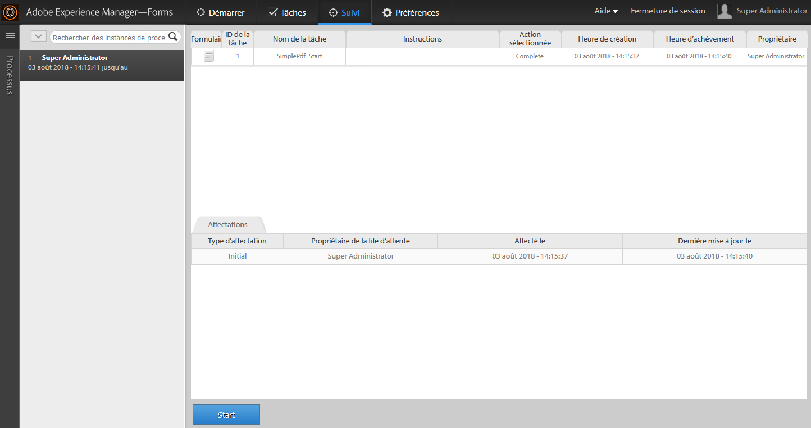

# Démarrer un nouveau processus avec les données de processus existantes dans l’espace de travail AEM Forms{#initiating-a-new-process-with-existing-process-data-in-aem-forms-workspace}

Vous pouvez lancer un nouveau processus à l’aide des données d’un processus existant. La nécessité d’initier un nouveau processus à partir des données de processus existantes survient lorsque nous devons fréquemment utiliser le même formulaire avec peu de modifications de contenu, comme les formulaires pour congés payés. Cette fonctionnalité permet aux utilisateurs et utilisatrices de gagner du temps et de faire des efforts, en particulier lorsque le processus a un long formulaire à remplir.

Voici les étapes pour lancer un nouveau processus à partir des données de processus existantes :

1. Effectuez l’une des actions suivantes :

   * Dans Tracking, cliquez sur l’instance de processus dont vous souhaitez utiliser les données. Dans la vue Historique des processus du volet de droite, cliquez sur la ligne de tâche correspondant au point de départ.
   * Dans Tracking, sélectionnez un modèle de recherche pour afficher une liste des instances de processus. Sélectionnez l’instance dont vous souhaitez utiliser les données.
   * Dans l’onglet **[!UICONTROL Tâches]**, sélectionnez la tâche. Cliquez sur le bouton **[!UICONTROL Historique]** et sélectionnez la tâche qui a lancé l’instance de processus.

    

1. Dans la barre d’outils de l’action Tâche, cliquez sur **[!UICONTROL Démarrer]**. Un formulaire adaptatif pour la nouvelle instance de processus est affiché avec des données préremplies.

1. Mettez à jour les données le cas échéant, et cliquez sur **[!UICONTROL Terminer]** ou sur le bouton approprié dans le formulaire.
