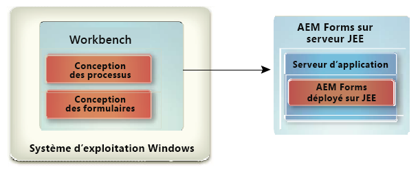

# Installer Workbench {#install-workbench}

Ce document fournit des instructions sur l’installation et la configuration d’AEM Forms Workbench. Le programme d’installation installe également Forms Designer.

## Qui devrait lire ce document ? {#who-should-read-this-doc}

Ce document est destiné aux administrateurs ou développeurs chargés de l’installation, de la configuration, de l’administration ou du déploiement de Workbench. Il contient également les informations nécessaires à la configuration de votre système pour prendre en charge vos processus AEM Forms mis à niveau. Les informations fournies partent du principe que quiconque lit ce document connaît bien le système d&#39;exploitation Microsoft® Windows®.

## Informations complémentaires {#additional-information}

Les ressources indiquées dans le tableau ci-dessous peuvent vous aider à en savoir plus sur AEM Forms et à vous aider à commencer à l’utiliser.
<table>
 <tbody>
  <tr>
   <td>
<strong>Pour plus d’informations sur</strong>
 </td>
   <td>
<strong>Voir</strong>
 </td>
  </tr>
  <tr>
   <td>
Informations de procédure pour Workbench
 </td>
   <td>
<a href="https://helpx.adobe.com/content/dam/help/en/experience-manager/6-5/forms/pdf/WorkbenchHelp.pdf">Aide de Workbench</a>    
 </td>
  </tr>
  <tr>
   <td>
Informations générales sur AEM Forms et son intégration à d’autres produits d’Adobe
 </td>
   <td>
<a href="http://adobe.com/go/learn_aemforms_introduction_65">Présentation d’AEM Forms</a>    
 </td>
  </tr>
  <tr>
   <td>
Toute la documentation disponible pour AEM Forms
 </td>
   <td>
<a href="http://adobe.com/go/learn_aemforms_introduction_65">Documentation AEM Forms</a>    
 </td>
  </tr>
  <tr>
   <td>
Les mises à jour des correctifs, les explications techniques et les informations complémentaires sur cette version du produit
 </td>
   <td>
Contactez le support aux entreprises d’Adobe</a>    
 </td>
  </tr>
 </tbody>
</table>

>[!NOTE]
>
>Flex Workspace est obsolète pour AEM Forms. Il est disponible pour la version AEM Forms.

## Avant l’installation {#before-you-install}

### Présentation de l’installation de Workbench {#workbench-installation-overview}

Workbench est un environnement de développement intégré (IDE) que les développeurs et les auteurs de formulaires utilisent pour créer des processus et des formulaires d’entreprise automatisés. Il permet aussi de gérer les ressources et les services que les processus et les formulaires utilisent.

L’illustration suivante illustre l’installation de Workbench, notamment :
* Création de processus via Workbench
* Conception de formulaire dans Designer

>[!NOTE]
>
>Le serveur AEM Forms requiert un programme d&#39;installation distinct. Pour plus d’informations, voir la documentation d’installation d’AEM Forms on JEE.

## Configuration système requise {#system-prerequisites}

Cette section décrit le configuration matérielle et logicielle requise et les plates-formes prises en charge.

### Configuration matérielle et logicielle minimale  {#minimum-hardware-software-requirements}

****
WorkbenchLes exigences suivantes sont recommandées au minimum : Espace disque pour l&#39;installation :
* 680 Mo pour Workbench seul.
* 2.15 Go sur un seul disque pour une installation complète de Workbench , Designer et des exemples.
* 400 Mo pour les répertoires d&#39;installation temporaires - 200 Mo dans le répertoire utilisateur temporaire et 200 Mo dans le répertoire temporaire Windows.

>[!NOTE]
>
>Si tous ces emplacements se trouvent sur un seul disque, l’installation doit disposer de 1,5 Go d’espace. Les fichiers copiés dans les répertoires temporaires sont supprimés à la fin de l’installation.

* Configuration matérielle requise : Processeur Intel® Pentium® 4 ou AMD équivalent, processeur cadencé à 1 GHz.
* Mise à jour de Java™ Runtime Environnement (JRE) 7.0 51 ou mises à jour ultérieures vers 7.0.
* Résolution d’affichage de 1024 X 768 pixels au minimum, écran couleur de 16 bits minimum.
* Connexion réseau TCP/IPv4 ou TCP/IPv6 au serveur AEM Forms.
* Installez Visual C++ Redistributable Runtime Packages 2012 32 bits.
* Installez Visual C++ Redistributable Runtime Packages 2013 32 bits.

>[!NOTE]
>
>Vous devez disposer des droits d’administrateur pour pouvoir installer Workbench. Si vous effectuez une installation à partir d’un compte non administrateur, le programme d’installation vous demandera les informations d’identification d’un compte administrateur.

### Plateformes prises en charge {#supported-platforms}

Consultez la liste complète des plateformes prises en charge pour Workbench à l’adresse [AEM Forms Supported Platforms](http://adobe.com/go/learn_aemforms_supportedplatforms_65_fr).

## Considérations sur l’installation de Designer {#designer-installation-considerations}

Par défaut, l’installation de Workbench comprend une version correspondante de Designer uniquement en anglais. Si l’application d’installation de Workbench détecte une version existante de Designer sur votre ordinateur, l’installation peut se terminer et vous devrez supprimer la version actuelle de Designer avant de pouvoir continuer.
Le tableau ci-dessous contient une liste complète des scénarios possibles d’installation de Designer que vous pouvez rencontrer, ainsi que des mesures à prendre lorsque vous installez Workbench.

<table>
 <tbody>
  <tr>
   <td>
<strong>Version de Designer installée</strong>
 </td>
   <td>
<strong>Actions requises</strong>
 </td>
  </tr>
  <tr>
   <td>
Acrobat Pro ou Acrobat Pro Extended (comprend Designer)
 </td>
   <td>
Aucune.  
L’installation de Workbench détecte une instance de Designer sur votre ordinateur qui a été installée avec Acrobat Pro ou Acrobat Pro Extended. 
Différentes versions de Designer peuvent coexister sur le même système, par exemple Designer 6.4.x pour Workbench 6.4 et Designer 6.5.0.x pour Workbench 6.5. Il n’est pas nécessaire de désinstaller la version de Designer installée avec Acrobat 10 Pro ou Acrobat 10 Pro Extended ou version ultérieure.
 
 </td>
  </tr>
  <tr>
   <td>
Designer (autonome)
 </td>
   <td>
Aucune.  La version de Designer incluse avec Workbench est en anglais uniquement.  Le programme d’installation de Workbench ne réinstallera pas une nouvelle version de Designer. À la place, une version mise à jour, fournie avec le programme d’installation de Workbench, est corrigée. Cela vous permet également d’utiliser votre version traduite de Designer dans Workbench.  
 </td>
  </tr>
 </tbody>
</table>

### Pour désinstaller Designer (autonome) sous Windows 10 {#uninstall-designer-standalone-windows10}

1. Accédez à **Panneau de Contrôle > Programmes > Programmes et fonctionnalités**
1. Dans la liste Programmes actuellement installés, sélectionnez **Adobe Designer**.
1. Cliquez sur **Désinstaller**, puis sur **Oui**.

## Installation de Workbench {#installing-workbench}

Ce chapitre explique comment installer Workbench.

### Installation et exécution de Workbench {#installing-and-running-workbench}

Avant d’installer Workbench, vous devez vous assurer que votre environnement comprend les logiciels et le matériel nécessaires à son exécution (voir la section : **Avant l’installation**).

**Pour installer et exécuter Workbench :**

1. Effectuez l’une des tâches suivantes :
   * Accédez au répertoire \workbench sur le support d’installation et cliquez deux fois sur le fichier run_windows_installer.bat.
   * Téléchargez et décompressez Workbench sur votre système de fichiers. Une fois Workbench téléchargé, accédez au répertoire \workbench et cliquez deux fois sur le fichier run_windows_installer.bat.

   >[!IMPORTANT]
   >
   >Le programme d’installation de Workbench s’exécute uniquement à partir d’un lecteur local. Il ne peut pas être exécutée à partir d’un site distant.

   >[!NOTE]
   >
   >Si vous rencontrez une erreur &quot;Impossible de créer la machine virtuelle Java&quot;, créez une variable d’environnement nommée _JAVA_OPTIONS avec la valeur -Xmx512M et exécutez le programme d’installation.

1. Dans l’écran d’introduction, cliquez sur Suivant.
1. Lisez le contrat de licence du produit, cochez la case J’accepte les termes du contrat, puis cliquez sur Suivant.
1. (Facultatif) Sélectionnez Installer Adobe Designer si vous avez besoin de cet outil pour créer et modifier des formulaires.

   >[!NOTE]
   >
   >Vous pouvez continuer à utiliser Designer installé avec Acrobat 10 en laissant cette option désactivée.

1. Acceptez le répertoire par défaut tel que répertorié ou   cliquez sur Choisir, accédez au répertoire dans lequel vous allez installer Workbench, puis cliquez sur Suivant.

   >[!NOTE]
   >
   >Le chemin d’accès du répertoire d’installation ne doit pas contenir les caractères # (livre) et $ (dollar).

1. Vérifiez le compte-rendu de préinstallation, puis cliquez sur Installer. Le programme d’installation affiche la progression de l’installation.
1. Vérifiez le récapitulatif de l’installation. Sélectionnez Début AEM Forms Workbench pour lancer Workbench et cliquez sur Suivant.
1. Passez en revue les notes de mise à jour, puis cliquez sur Terminé.
1. Les éléments suivants sont désormais installés sur votre ordinateur :
   * **Workbench** : Pour exécuter Workbench à partir du menu Début, sélectionnez Tous les Programmes > AEM Forms > Workbench, si vous avez choisi d’y stocker le dossier de raccourcis. Pour plus d’informations,   voir la documentation <a href="https://helpx.adobe.com/content/dam/help/en/experience-manager/6-5/forms/pdf/WorkbenchHelp.pdf">Utilisation de Workbench</a>.
   * **Designer** : Vous pouvez accéder à Designer à partir de Workbench. Pour plus d’informations, voir la rubrique Prise en main dans <a href="https://helpx.adobe.com/content/dam/help/en/experience-manager/6-5/forms/pdf/using-designer.pdf">Aide de Designer</a>.
   * **SDK** AEM Forms : Pour plus d’informations sur l’utilisation du SDK, voir  <a href="http://www.adobe.com/go/learn_aemforms_programming_65">Programmation avec AEM Forms</a>.

## Processus de mise à niveau {#upgrading-processes}

Les processus AEM Forms on JEE peuvent être mis à niveau vers les applications AEM Forms à l’aide de l’Assistant Mise à niveau. Pour plus d’informations, voir Mise à niveau de la documentation sur les artefacts hérités dans l’aide de Workbench.

### Configuration d’un serveur et connexion à ce serveur {#configuring-and-logging-server}

Pour utiliser Workbench, vous devez disposer d’une instance de AEM Forms en cours d’exécution, généralement sur un ordinateur distinct. Vous devez disposer d’un nom d’utilisateur et d’un mot de passe pour vous connecter à AEM Forms, ainsi que d’informations sur l’emplacement du serveur.

>[!NOTE]
>
>Si vous avez configuré AEM Forms pour utiliser le fournisseur de référentiel EMC Documentum ou IBM FileNet et que vous souhaitez vous connecter à un référentiel autre que le référentiel configuré par défaut dans AEM Console d’administration des formulaires, indiquez le nom d’utilisateur username@Repository.

### Configuration des paramètres de délai d’expiration {#configuring-timeout-settings}

Par défaut, Workbench arrive à expiration après deux heures, peu importe l’activité ou l’inactivité. Pour modifier le paramètre de délai d’expiration, voir &quot;Configuration de User Management > Configurer des attributs système avancés&quot; dans l’<a href="https://docs.adobe.com/content/help/en/experience-manager-65/forms/administrator-help/configure-user-management/configure-advanced-system-attributes.html">Aide d’Administration Console</a>.

### Configuration de Workbench pour une connexion via HTTPS {#configuring-workbench-to-connect-over-HTTPS}

Pour connecter Workbench à un serveur AEM Forms via HTTPS, vous devez vous assurer que l’autorité de certification qui a émis la clé publique sera reconnue comme approuvée par Workbench. Si le certificat n’est pas reconnu comme provenant d’une source approuvée, vous devez mettre à jour le fichier cacert situé dans le répertoire [Workbench_HOME]/workbench/jre/lib/security directory.

>[!NOTE]
>
>[Workbench_] HOMEreprésente le répertoire dans lequel vous avez installé Workbench. L’emplacement par défaut est C:\Program Files (x86)\Adobe Experience Manager forms Workbench.

Assurez-vous que vous vous connectez à HTTPS en utilisant le nom spécifié dans le certificat. Ce nom est généralement le nom d’hôte complet.

**Pour mettre à jour le fichier** cacert :
1. Assurez-vous que vous disposez d’une copie du certificat SSL (Secure Sockets Layer). Contactez l’administrateur qui a configuré le serveur SSL ou exportez le certificat à l’aide d’un navigateur Web.

   >[!NOTE]
   >
   >Pour exporter le certificat, ouvrez un navigateur Web et connectez-vous à Administration Console, installez le certificat dans le navigateur, puis exportez le certificat du navigateur vers un emplacement d’enregistrement temporaire (ou directement dans le répertoire [Workbench_HOME]/workbench/jre/lib/security directory).

1. Copiez le certificat dans le répertoire [Workbench_HOME]/workbench/jre/lib/security directory.

1. Ouvrez une fenêtre d’invite de commande, accédez à [Workbench_HOME]/workbench/jre/bin, puis saisissez la commande suivante :
   `keytool -import -storepass changeit -file [Workbench_HOME]\workbench\jre\lib\security\ssl_cert_for_certname.cer -keystore [Workbench_HOME]\workbench\jre\lib\security\cacerts -alias example`Où :
   * changeit est le mot de passe par défaut du stockage des clés cacerts.
   * certname est le certificat sélectionné à l’étape 1.
   * example est l’alias que vous avez choisi pour le certificat. Cette valeur peut être changée

1. Une fois invité à approuver le certificat, tapez Oui et appuyez sur la touche Entrée. L’outil keytool procède à l’importation du fichier cacerts dans le répertoire [Workbench_HOME]/workbench/jre/lib/security directory.

1. Fermez et redémarrez Workbench pour appliquer les modifications.

### Configuration des paramètres du cache pour les modèles générés dynamiquement {#configuring-cache-settings-for-dynamically-generated-templates}

Les aspects suivants du fonctionnement du cache doivent être pris en compte si votre application génère des modèles uniques à la volée en mettant automatiquement à jour le contenu XFA. En effet, chaque transaction utilise un modèle nouveau et unique.

Lorsque le générateur ou la sortie des formulaires recherche ou met à jour les entrées du cache pour un modèle de formulaire spécifique, il utilise plusieurs valeurs clés pour localiser l’entrée de cache spécifique à laquelle il sera fait accès.

* **Nom de fichier modèle** : Emplacement et nom du modèle utilisé comme identifiant unique principal du formulaire mis en cache.
* **Horodatage** : Le fichier modèle contient un horodatage utilisé pour déterminer l’heure de la dernière mise à jour du formulaire.
* **UUID modèle** : Designer insère dans chaque modèle un identifiant unique (UUID) pour le formulaire et sa version. Chaque fois que le formulaire est mis à jour, l’identifiant UUID incorporé est mis à jour. Par exemple, un modèle XDP peut afficher le contenu suivant :

   `<?xml version="1.0" encoding="UTF-8"?>`
   `<?xfa generator="AdobeAEM formsDesignerES_V8.2" APIVersion="2.6.7185.0"?><xdp:xdp xmlns:xdp=http://ns.adobe.com/xdp/ timeStamp="2008-07-29T21:22:12Z" uuid="823e538f-ff6c-4961-b759-f7626978a223"><template xmlns="http://www.xfa.org/schema/xfa-template/2.6/">`

* **Options de rendu** : Dans le cache de formulaire rendu, les contenus de cache sont stockés séparément pour chaque ensemble d’options de rendu uniques.

Le service Forms reçoit des modèles par référence au nom de fichier ou à l’emplacement de référentiel ou par valeur en tant qu’objet XML en mémoire.
* **Modèles transmis par référence** : Utilise la racine de contenu et le nom de formulaire. Si des modèles uniques avec différents noms de fichier sont transmis dans chaque requête à l’aide de cette méthode, le cache de disque grandit sans fin et n’est jamais réutilisé. Pour éviter cela, les modèles uniques doivent être transmis avec le même nom de fichier pour garantir que le même cache est mis à jour pour toutes les requêtes.
* **Modèles transmis par valeur** : Utilise les octets de modèle transmis avec les données à l’aide du paramètre theinDataDoc. Si des modèles uniques avec un identifiant UUID différent sont transmis à l’aide de cette méthode, le cache de disque grandit sans fin et n’est jamais réutilisé. Pour éviter ceci, l’attribut UUID doit être supprimé de tous les modèles afin de garantir qu’aucun cache n’est créé pour le modèle. Sinon, transmettre le même identifiant UUID non nul permet de créer les objets de cache, mais garantit que le même cache est mis à jour à chaque demande.

Pour empêcher la croissance du cache sans fin, tenez compte des facteurs suivants pour le rendu des modèles générés de manière dynamique à l’aide des nouvelles API AEM Forms, à savoir renderHTMLForm2 et renderPDFForm2.

Lors de l’utilisation des nouvelles API, le modèle est transmis en tant qu’objet de document, qui est géré dans le service Forms selon qu’il est passivé ou non.

Pour les documents passivés dans lesquels l’identifiant UUID et la racine de contenu font office de clé de cache, tenez compte des points suivants :
* Le cache n’est pas créé pour les modèles d’entrée passivés sans identifiant UUID.
* Si plusieurs modèles d’entrée passivés portant le même identifiant UUID et la même racine de contenu sont transmis, le même cache est remplacé.

Pour les documents non passivés dans lesquels le nom de fichier et la racine de contenu font office de clé de cache, considérez l’aspect suivant :
* Pour les modèles d’entrée non passivés, la mise en cache dépend de la racine de contenu et du nom de fichier à partir desquels le document a été généré.
Le même cache sera utilisé uniquement pour les requêtes présentant la même racine de contenu et le même nom de fichier de modèle.
Les meilleures pratiques suivantes garantissent que le cache ne grandit pas sans fin lorsque des modèles générés de manière dynamique sont transmis au service Forms :
   * Éliminez l’identifiant UUID ou transmettez le même identifiant UUID dans tous les modèles générés dynamiquement.
   * Générez le document à partir des octets de modèle ou du même nom de fichier sur disque.

### Désinstallation de Workbench  {#uninstalling-workbench}

Utilisez la fonction Ajouter ou supprimer des Programmes du Panneau de Contrôle pour début au programme de désinstallation. Les applications Workbench et Designer ont des programmes de désinstallation distincts.

## Configuration de AEM Forms XDC Editor {#configuring-aem-forms-xdc-editor}

Avec XDC Editor, les administrateurs d’imprimantes réseau peuvent créer et modifier des fichiers XML Forms Architecture Device Configuration (XDC). Les fichiers XDC décrivent les fonctionnalités des imprimantes, telles que la langue d’imprimante ou la corrélation entre le format de papier et l’emplacement du bac.

Pour que votre administrateur d’imprimantes réseau utilise XDC Editor, déplacez les fichiers XDC échantillons et reportez-vous à la section Création de profils de périphériques à l’aide de XDC Editor.

**Pour obtenir des exemples de fichiers** XDC :
1. Sur le serveur AEM Forms, recherchez le dossier XDC dans [racine AEM Forms]\sdk\samples\Output\IVS.
1. Copiez le contenu de ce dossier dans un répertoire accessible à partir du système Workbench ou Eclipse.

**Pour obtenir l’aide** de XDC Editor :
1. Accédez au site Web de documentation AEM Forms.
1. Cliquez sur l’onglet **Développer** et accédez à Création de profils de périphériques à l’aide de XDC Editor. Téléchargez le fichier xdc_editor_help_web.zip et installez les fichiers d’aide en suivant les instructions fournies dans le fichier Lisez-moi.

