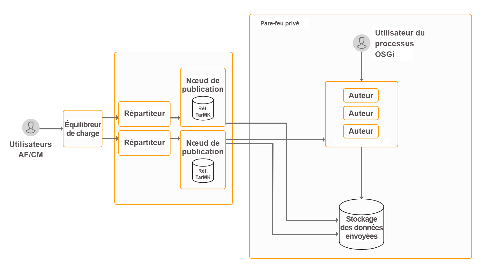

# Installation et configuration des fonctionnalités de capture de données{#install-and-configure-data-capture-capabilities}

## Présentation {#introduction}

AEM Forms fournit un ensemble de formulaires permettant d’obtenir des données de l’utilisateur final : formulaires adaptatifs, formulaires HTML5 et formulaires PDF. Ce logiciel fournit également des outils pour répertorier tous les formulaires disponibles sur une page Web, analyser l’utilisation des formulaires et cibler les utilisateurs en fonction de leur profil. Ces fonctionnalités sont incluses dans le package du module complémentaire AEM Forms. Le package du module complémentaire est déployé sur une instance de création ou de publication d’AEM.

**Formulaires adaptatifs :** ces formulaires changent d’apparence en fonction de la taille de l’écran de l’appareil, sont engageants et par nature interactifs. Les formulaires adaptatifs peuvent également s’intégrer à Adobe Analytics, Adobe Sign et Adobe Target. Ils vous ont permis de fournir aux utilisateurs des formulaires personnalisés et des expériences axées sur les processus en fonction de leur démographie et d’autres fonctionnalités. Vous pouvez également intégrer des formulaires adaptatifs à Adobe Sign.

**Les formulaires PDF** conviennent à l’impression parfaitement nette et à la capture d’informations numériques dans un document PDF. Dans l’avatar numérique, vous pouvez utiliser Adobe Acrobat ou Acrobat Reader pour remplir ces formulaires. Vous pouvez héberger ces formulaires sur votre site Web ou utiliser le portail de formulaires pour répertorier ces formulaires sur un site AEM. Vous pouvez également envoyer ces formulaires en pièces jointes par email à d’autres destinataires. Ces formulaires sont les mieux adaptés aux environnements de bureau.

Les **formulaires HTML5** sont la version la mieux adaptée au navigateur pour les formulaires PDF. Les formulaires HTML5 conviennent aux environnements qui ne prennent pas en charge les modules externes PDF. Les formulaires HTML5 permettent le rendu des formulaires basés sur XFA sur les périphériques mobiles et les navigateurs de bureau ne prenant pas en charge les documents XFA en PDF. Ces formulaires sont les mieux adaptés aux tablettes et aux environnements de bureau.

AEM Forms est une plate-forme d’entreprise performante. La capture de données (formulaires adaptatifs, formulaires PDF et formulaires HTML5) n’est que l’une des fonctionnalités d’AEM Forms. Pour obtenir la liste complète des fonctionnalités, voir [Présentation d’AEM Forms](/help/forms/using/introduction-aem-forms.md).

## Topologie de déploiement {#deployment-topology}

Le package du module complémentaire AEM Forms est une application déployée sur AEM. Vous n’avez besoin que d’un minimum d’une instance de création AEM et d’une instance de publication AEM pour exécuter les fonctionnalités de capture de données AEM Forms. La topologie suivante est suggérée pour exécuter les fonctionnalités de capture de données AEM Forms. Pour plus d’informations sur la topologie, voir [Topologies d’architecture et de déploiement pour AEM Forms](/help/forms/using/aem-forms-architecture-deployment.md).



## Configuration requise {#system-requirements}

Avant de commencer à installer et à configurer la fonctionnalité de capture de données des AEM Forms, assurez-vous que :

* Le matériel et l’infrastructure logicielle sont en place. Pour obtenir une liste détaillée des matériels et logiciels pris en charge, voir [Conditions techniques applicables](/help/sites-deploying/technical-requirements.md).

* Le chemin d’installation de l’instance AEM ne contient aucun espace blanc.
* Une instance AEM est en cours d’utilisation. Dans la terminologie AEM, une « instance » est une copie d’AEM s’exécutant sur un serveur en mode de création ou de publication. Vous avez besoin d’au moins deux instances [AEM (une instance de création et une instance de publication) ](/help/sites-deploying/deploy.md) pour exécuter les fonctionnalités de capture de données AEM Forms :

   * **Création** : instance AEM utilisée pour créer, télécharger et modifier du contenu et assurer l’administration du site Web. Une fois que le contenu est publié, il est répliqué sur l’instance de publication.
   * **Publication** : instance AEM qui diffuse le contenu publié au public sur Internet ou sur un réseau interne.

* Les besoins en mémoire sont satisfaits. Le module complémentaire AEM Forms  nécessite :

   * 15 Go d’espace temporaire pour les installations Microsoft Windows.
   * 6 Go d’espace temporaire pour les installations Unix.

* La réplication et la réplication inversée pour les instances de création et de publication sont définies. Pour plus de détails, voir [Réplication](/help/sites-deploying/replication.md).
* Pour les systèmes UNIX :

   * Installez les packages 32 bits suivants à partir du support d’installation :

<table>
 <tbody>
  <tr>
   <td>expat</td>
   <td>fontconfig</td>
   <td>freetype</td>
   <td>glibc</td>
  </tr>
  <tr>
   <td>libcurl</td>
   <td>libICE</td>
   <td>libicu</td>
   <td>libSM</td>
  </tr>
  <tr>
   <td>libuuid</td>
   <td>libX11</td>
   <td><p>libXau</p> </td>
   <td>libxcb</td>
  </tr>
  <tr>
   <td>libXext</td>
   <td>libXinerama</td>
   <td>libXrandr</td>
   <td>libXrender</td>
  </tr>
  <tr>
   <td>nss-softokn-freebl</td>
   <td>OpenSSL</td>
   <td>zlib</td>
   <td> </td>
  </tr>
 </tbody>
</table>

>[!NOTE]
>
>* Si OpenSSL est déjà installé sur le serveur, mettez-le à niveau vers la dernière version.
>* Créez des liens symboliques libcurl.so, libcrypto.so et libssl.so pointant vers la dernière version des bibliothèques libcurl, libcrypto et libssl, respectivement.

>


* Installez le package 64 bits suivant à partir du support d’installation :

   * libicu

## Installation du module complémentaire AEM Forms {#install-aem-forms-add-on-package}

Le package du module complémentaire AEM Forms est une application déployée sur AEM. Le package contient des captures de données AEM Forms et d’autres fonctionnalités. Suivez les étapes ci-après pour installer le package du module complémentaire :

1. Distribution [](https://experience.adobe.com/downloads)de logiciels ouverts. Vous avez besoin d&#39;un Adobe ID pour vous connecter à la distribution de logiciels.
1. Appuyez sur **[!UICONTROL Adobe Experience Manager]** disponible dans le menu d’en-tête.
1. In the **[!UICONTROL Filters]** section:
   1. Sélectionnez **[!UICONTROL Forms]** dans la liste déroulante **[!UICONTROL Solution]** .
   2. Sélectionnez la version et le type du package. Vous pouvez également utiliser l’option Téléchargements **[!UICONTROL de]** recherche pour filtrer les résultats.
1. Appuyez sur le nom du pack applicable à votre système d’exploitation, sélectionnez **[!UICONTROL Accepter les termes]** du contrat de licence de l’utilisateur final et appuyez sur **[!UICONTROL Télécharger]**.
1. Ouvrez [Package Manager](https://docs.adobe.com/content/help/fr-FR/experience-manager-65/administering/contentmanagement/package-manager.html) et cliquez sur **[!UICONTROL Télécharger le package]** pour télécharger le package.
1. Select the package and click **[!UICONTROL Install]**.

   Vous pouvez également télécharger le package via le lien direct répertorié dans l’article [AEM Forms Release](https://helpx.adobe.com/fr/aem-forms/kb/aem-forms-releases.html) .
1. Une fois le package installé, vous êtes invité à redémarrer l’instance AEM. **Ne redémarrez pas immédiatement le serveur.** Avant d&#39;arrêter le serveur AEM Forms, patientez jusqu&#39;à ce que les messages ServiceEvent REGISTERED et ServiceEvent UNREGISTERED cessent d&#39;apparaître dans le `[AEM-Installation-Directory]/crx-quickstart/logs/error.log` fichier et que le journal soit stable.
1. Répétez les étapes 1 à 7 sur toutes les instances de création et de publication.

## Configurations post-installation {#post-installation-configurations}

AEM Forms comporte quelques configurations obligatoires et facultatives. Les configurations obligatoires incluent la configuration des bibliothèques BouncyCastle et de l’agent de sérialisation. Les configurations facultatives incluent la configuration du répartiteur, du portail de formulaires, d’Adobe Sign, d’Adobe Analytics et d’Adobe Target.

### Configurations post-installation obligatoires {#mandatory-post-installation-configurations}

#### Configuration des bibliothèques RSA et BouncyCastle  {#configure-rsa-and-bouncycastle-libraries}

Effectuez les étapes suivantes sur toutes les instances d’auteur et de publication pour démarrer et déléguer les bibliothèques :

1. Arrêtez l’instance AEM sous-jacente.
1. Open the `[AEM installation directory]\crx-quickstart\conf\sling.properties` file for editing.

   If you used `[AEM installation directory]\crx-quickstart\bin\start.bat` to start AEM, then edit the sling.properties located at `[AEM_root]\crx-quickstart\`.

1. Ajoutez les propriétés suivantes au fichier sling.properties :

   ```shell
   sling.bootdelegation.class.com.rsa.jsafe.provider.JsafeJCE=com.rsa.*
   sling.bootdelegation.class.org.bouncycastle.jce.provider.BouncyCastleProvider=org.bouncycastle.*
   ```

1. Enregistrez et fermez le fichier, puis démarrez l’instance AEM.
1. Répétez les étapes 1 à 4 sur toutes les instances de création et de publication.

#### Configurer l’agent de sérialisation {#configure-the-serialization-agent}

Effectuez les étapes suivantes sur toutes les instances d’auteur et de publication pour ajouter le package à la liste autorisée :

1. Ouvrez AEM Configuration Manager dans une fenêtre de navigateur. L’URL par défaut est `https://'[server]:[port]'/system/console/configMgr`.
1. Recherchez **com.adobe.cq.deserfw.impl.DeserializationFirewallImpl.name** et ouvrez la configuration.
1. Add the **sun.util.calendar** package to the **allowlist** field. Cliquez sur **Enregistrer**.
1. Répétez les étapes 1 à 3 sur toutes les instances de création et de publication.

### Configurations post-installation facultatives {#optional-post-installation-configurations}

#### La configuration de Dispatcher {#configure-dispatcher}

Le répartiteur est l’outil de mise en cache et d’équilibrage de charge pour AEM. Le répartiteur AEM aide également à protéger le serveur AEM des attaques.  Vous pouvez augmenter la sécurité de votre instance AEM en utilisant le répartiteur conjointement avec un serveur Web de niveau élevé. If you use [Dispatcher](https://helpx.adobe.com/fr/experience-manager/dispatcher/using/dispatcher-configuration.html), then perform the following configurations for AEM Forms:

1. Configurez l’accès à AEM Forms:

   Ouvrez le fichier dispatcher.any en mode d’édition. Accédez à la section des filtres et ajoutez le filtre suivant à la section des filtres :

   `/0025 { /type "allow" /glob "* /bin/xfaforms/submitaction*" } # to enable AEM Forms submission`

   Enregistrez et fermez le fichier. Pour des informations détaillées sur les filtres, voir la [documentation du répartiteur](https://helpx.adobe.com/fr/experience-manager/dispatcher/using/dispatcher-configuration.html).

1. Configurez le service de filtrage des référents :

   Connectez-vous à Configuration Manager d’Apache Felix en tant qu’administrateur. L’URL par défaut du gestionnaire de configuration est `https://[server]:[port_number]/system/console/configMgr`. Dans le menu **Configurations**, sélectionnez l’option **Apache Sling Referrer Filter.** Dans le champ Allow Hosts, saisissez le nom d’hôte du répartiteur afin de l’activer comme référent et cliquez sur **Enregistrer**. The format of the entry is `https://[server]:[port]&#39;.

#### Configuration du cache {#configure-cache}

La mise en cache est un mécanisme qui permet de raccourcir les temps d’accès aux données, réduire le temps de réponse et améliorer les vitesses d’entrée/sortie (E/S). Le cache de formulaires adaptatifs stocke uniquement le contenu HTML et la structure JSON d’un formulaire adaptatif sans enregistrer les données pré-renseignées. Cela permet de réduire le temps nécessaire pour effectuer le rendu d’un formulaire adaptatif.

* Lorsque vous utilisez le cache de formulaires adaptatifs, utilisez le [répartiteur AEM](https://helpx.adobe.com/fr/experience-manager/dispatcher/using/dispatcher-configuration.html) pour mettre en cache les bibliothèques client (CSS et Javascript) d’un formulaire adaptatif. 
* Lors du développement des composants personnalisés, sur le serveur utilisé pour le développement, gardez le cache de formulaires adaptatifs désactivé.

Effectuez les étapes suivantes pour configurer le cache de formulaires adaptatifs :

1. Go to AEM web console configuration manager at https://&#39;[server]:[port]&#39;/system/console/configMgr.
1. Cliquez sur la **configuration de canal web de communication interactive de formulaire adaptatif** pour éditer ses valeurs de configuration. In the edit configuration values dialog, specify the maximum number of forms or documents an instance of the AEM Forms server can cache in the **Number of Adaptive Forms** field. La valeur par défaut est 100.   Cliquez sur **Enregistrer**.

   >[!NOTE]
   >
   >Pour désactiver le cache, définissez la valeur du champ Nombre de formulaires adaptatifs sur **0**. Le cache est réinitialisé, et tous les formulaires et documents sont supprimés du cache lorsque vous désactivez ou modifiez la configuration du cache.

#### Configuration de la communication SSL pour le modèle de données de formulaire {#configure-ssl-communcation-for-form-data-model}

Vous pouvez activer la communication SSL pour le modèle de données de formulaire. Pour activer la communication SSL pour le modèle de données de formulaire, avant de démarrer une instance AEM Forms, ajoutez des certificats au Trust Store Java de toutes les instances. Vous pouvez exécuter la commande suivante pour ajouter les certificats : &quot;

`keytool -import -alias <alias-name> -file <pathTo .cer certificate file> -keystore <<pathToJRE>\lib\security\cacerts>`

#### Configuration d’Adobe Sign {#configure-adobe-sign}

Adobe Sign autorise les processus de signature électronique pour les formulaires adaptatifs. Les signatures électroniques améliorent les processus de traitement des documents pour les services juridiques, commercial, des ressources humaines, et bien d’autres domaines.

Dans un scénario Adobe Sign et de formulaires adaptatifs standard, un utilisateur remplit un formulaire adaptatif pour effectuer une **demande de service**. Par exemple, un formulaire de demande de carte de paiement et d’allocation. Lorsqu’un utilisateur remplit, envoie et signe le formulaire de demande, le formulaire est envoyé au prestataire de services qui décidera des actions à entreprise. Le prestataire de services passe en revue la demande et utilise Adobe Sign pour marquer la demande approuvée. Pour activer les processus de signature électronique similaires, vous pouvez intégrer Adobe Sign à AEM Forms.

Pour utiliser Adobe Sign avec AEM Forms, [intégrez Adobe Sign à AEM Forms](/help/forms/using/adobe-sign-integration-adaptive-forms.md).

#### Configuration d’Adobe Analytics {#configure-adobe-analytics}

AEM Forms s’intègre à Adobe Analytics, ce qui permet la capture et le suivi des mesures de performances des formulaires et des documents que vous avez publiés. L’analyse de ces mesures contribue à une prise de décisions éclairée fondée sur les données, eu égard aux modifications requises pour concevoir des formulaires ou des documents plus faciles à utiliser.

Pour utiliser Adobe Analytics avec AEM Forms, voir [Configuration des analyses et des rapports](/help/forms/using/configure-analytics-forms-documents.md).

#### Intégration d’Adobe Target {#integrate-adobe-target}

Vos clients sont susceptibles d’abandonner un formulaire si l’expérience qu’ils en font n’est pas satisfaisante. Si elle est frustrante pour les clients, elle peut aussi bouleverser le volume et les coûts d’assistance de votre entreprise. Il est aussi primordial que difficile d’identifier et d’offrir une bonne expérience client qui augmente le taux de conversion. AEM Forms détient la clé de ce problème.

AEM Forms s’intègre à Adobe Target, une solution Adobe Marketing Cloud, afin de fournir des expériences client personnalisées et attrayantes par le biais de plusieurs canaux numériques. Pour utiliser Adobe Target avec des formulaires adaptatifs de test A/B, [intégrez Adobe Target à AEM Forms](/help/forms/using/ab-testing-adaptive-forms.md#setupandintegratetargetinaemforms).

## Étapes suivantes {#next-steps}

Vous avez configuré un environnement pour utiliser les fonctionnalités de capture de données AEM Forms. Maintenant, les prochaines étapes pour utiliser cette fonctionnalité sont les suivantes :

* [Création de votre premier formulaire adaptatif](/help/forms/using/create-your-first-adaptive-form.md)
* [Création de votre premier formulaire PDF](http://www.adobe.com/go/learn_aemforms_designer_quick_start_65_fr)
* [Présentation des formulaires HTML5](/help/forms/using/introduction.md)

