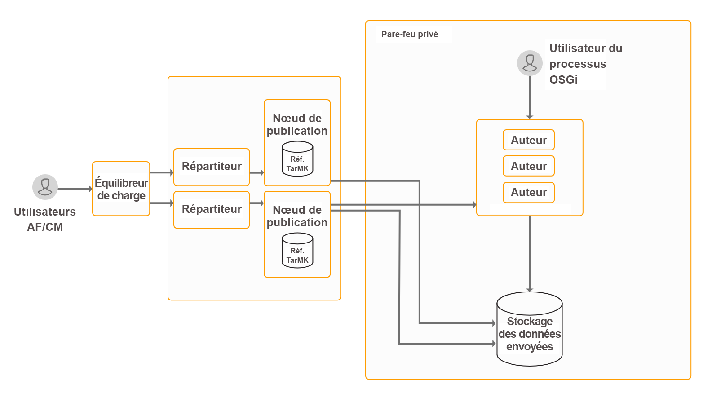

# Installation et configuration d’un workflow basé sur l’utilisation de Forms sur OSGi{#installing-and-configuring-forms-centric-workflow-on-osgi}

## Présentation {#introduction}

Les entreprises collectent et traitent des données à partir de plusieurs formulaires, systèmes d’arrière-plan et autres sources de données. Le traitement des données implique des procédures de révision et d’approbation, des tâches répétitives et l’archivage données. Par exemple, lʼexamen d’un formulaire et sa conversion en document PDF. Lorsquʼelles sont effectuées manuellement, les tâches répétitives peuvent prendre beaucoup de temps et de ressources.

Vous pouvez utiliser le [Workflow basé sur lʼutilisation de Forms sur OSGi](../../forms/using/aem-forms-workflow.md) pour créer rapidement des workflows basés sur des formulaires adaptatifs. Ces workflows peuvent vous aider à automatiser les workflows de révision et d’approbation, les workflows de gestion commerciale et d’autres tâches répétitives. Ces workflows permettent également de traiter des documents (création, assemblage, distribution et archivage de documents PDF, ajout de signatures numériques pour limiter l’accès aux documents, décodage de formulaires à code-barres, etc.) et dʼutiliser le workflow de signature Adobe Sign avec des formulaires et des documents.

Une fois configurés, ces workflows peuvent être déclenchés manuellement pour terminer un processus ou une exécution défini par programmation lorsque les utilisateurs envoient un formulaire ou une communication interactive. Cette fonctionnalité est incluse dans le package du module complémentaire AEM Forms.

AEM Forms est une plateforme d’entreprise performante. Le workflow basé sur lʼutilisation de Forms sur OSGi n’est qu’une des fonctionnalités d’AEM Forms. Pour obtenir la liste complète des fonctionnalités, voir [Présentation d’AEM Forms](introduction-aem-forms.md).

>[!NOTE]
>
>Avec le processus basé sur l’utilisation de Forms sur OSGi, vous pouvez rapidement créer et déployer des processus pour différentes tâches sur la pile OSGi, sans avoir à installer la fonctionnalité Process Management complète sur la pile JEE. Regardez une [comparaison](capabilities-osgi-jee-workflows.md) des workflows AEM basés sur lʼutilisation de Forms sur OSGi et la gestion des processus sur JEE pour découvrir les différences et les similitudes entre les fonctionnalités.
>
>Après la comparaison, si vous choisissez d’installer la fonctionnalité de gestion des processus sur la pile JEE, consultez la section [Installation ou mise à niveau d’AEM Forms sur JEE](/help/forms/using/introduction-aem-forms.md) pour obtenir des informations détaillées sur l’installation et la configuration de la pile JEE et des fonctionnalités de gestion des processus.

## Topologie de déploiement {#deployment-topology}

Le module complémentaire AEM Forms est une application déployée sur AEM. Une instance dʼauteur ou de traitement AEM (auteur de production) suffit pour exécuter le workflow basé sur lʼutilisation de Forms sur OSGi. Une instance de traitement est une instance dʼ[auteur AEM sécurisée de manière renforcée](/help/forms/using/hardening-securing-aem-forms-environment.md). Nʼeffectuez pas de création réelle, comme la création de workflows ou de formulaires adaptatifs, sur lʼauteur de production.

La topologie suivante est fournie à titre indicatif pour exécuter les fonctionnalités de communications interactives AEM Forms, Correspondence Management, capture de données AEM Forms et des workflows basés sur des formulaires sur OSGi. Pour plus d’informations sur la topologie, voir [Topologies d’architecture et de déploiement pour AEM Forms](/help/forms/using/aem-forms-architecture-deployment.md).



Le workflow basé sur lʼutilisation de Forms AEM Forms sur OSGi exécute la boîte de réception AEM et l’interface utilisateur de création de modèle de workflow AEM sur les instances d’auteur d’AEM Forms.

## Configuration requise {#system-requirements}

>[!NOTE]
>
>Passez à la section [Étapes suivantes](../../forms/using/installing-configuring-forms-centric-workflow-on-osgi.md#next-steps) du document si vous avez déjà installé AEM Forms sur OSGi, comme détaillé dans lʼarticle [Installation et configuration des fonctionnalités de capture de données](../../forms/using/installing-configuring-aem-forms-osgi.md).

Avant dʼinstaller et de configurer le workflow basé sur lʼutilisation de Forms sur OSGi, assurez-vous de disposer des éléments suivants :

* Le matériel et l’infrastructure logicielle sont en place. Pour obtenir une liste détaillée des matériels et logiciels pris en charge, voir [Conditions techniques applicables](/help/sites-deploying/technical-requirements.md).

* Le chemin d’installation de l’instance AEM ne contient pas d’espaces.
* Une instance AEM est en cours d’exécution. Dans la terminologie AEM, une « instance » est une copie d’AEM s’exécutant sur un serveur en mode de création ou de publication. Vous avez besoin d’au moins une instance AEM (auteur ou traitement) pour exécuter un workflow basé sur lʼutilisation de Forms sur OSGi :

   * **Création** : instance AEM utilisée pour créer, télécharger et modifier du contenu et assurer l’administration du site web. Une fois que le contenu est publié, il est répliqué sur l’instance de publication.
   * **Traitement :** une instance de [création AEM renforcée](/help/forms/using/hardening-securing-aem-forms-environment.md). Vous pouvez configurer une instance de création et renforcer sa sécurité après avoir effectué l’installation.

   * **Publication** : une instance AEM qui diffuse le contenu publié au public sur Internet ou sur un réseau interne.

* Les exigences de mémoire sont respectées. Le package complémentaire AEM Forms nécessite :

   * 15 Go d’espace temporaire pour les installations Microsoft Windows.
   * 6 Go d’espace temporaire pour les installations Unix.

* Configuration requise supplémentaire pour les systèmes UNIX : si vous utilisez un système d’exploitation UNIX, installez les packages suivants à partir du support d’installation du système d’exploitation correspondant.

<table>
 <tbody>
  <tr>
   <td>expat</td>
   <td>libxcb</td>
   <td>freetype</td>
   <td>libXau</td>
  </tr>
  <tr>
   <td>libSM</td>
   <td>zlib</td>
   <td>libICE</td>
   <td>libuuid</td>
  </tr>
  <tr>
   <td>glibc</td>
   <td>libXext</td>
   <td><p>nss-softokn-freebl</p> </td>
   <td>fontconfig</td>
  </tr>
  <tr>
   <td>libX11</td>
   <td>libXrender</td>
   <td>libXrandr</td>
   <td>libXinerama</td>
  </tr>
 </tbody>
</table>

## Installation du package complémentaire AEM Forms {#install-aem-forms-add-on-package}

Le module complémentaire AEM Forms est une application déployée sur AEM. Le package contient un workflow basé sur l’utilisation de Forms sur OSGi ainsi que d’autres fonctionnalités. Suivez les étapes ci-après pour installer le package du module complémentaire :

1. Ouvrez la [Distribution de logiciels](https://experience.adobe.com/downloads). Vous avez besoin d’un Adobe ID pour vous connecter à la Distribution de logiciels.
1. Sélectionnez **[!UICONTROL Adobe Experience Manager]** situé dans le menu d’en-tête.
1. Dans la section **[!UICONTROL Filtres]** :
   1. Sélectionnez **[!UICONTROL Forms]** dans la liste déroulante **[!UICONTROL Solution]**.
   2. Sélectionnez la version et le type du package. Vous pouvez également utiliser l’option **[!UICONTROL Rechercher des téléchargements]** pour filtrer les résultats.
1. Sélectionnez le nom de package applicable à votre système d’exploitation, sélectionnez **[!UICONTROL Accepter les conditions du CLUF]**, puis sélectionnez **[!UICONTROL Télécharger]**.
1. Ouvrez [Package Manager](https://experienceleague.adobe.com/docs/experience-manager-65/administering/contentmanagement/package-manager.html?lang=fr) et cliquez sur **[!UICONTROL Télécharger le package]** pour télécharger le package.
1. Sélectionnez le package et cliquez sur **[!UICONTROL Installer]**.

   Vous pouvez également télécharger le package via le lien direct répertorié dans l’article [Version d’AEM Forms](https://experienceleague.adobe.com/docs/experience-manager-release-information/aem-release-updates/forms-updates/aem-forms-releases.html?lang=fr).

1. Une fois le package installé, vous êtes invité à redémarrer l’instance AEM. **Ne redémarrez pas immédiatement le serveur.** Avant d’arrêter le serveur AEM Forms, attendez que les messages ServiceEvent REGISTERED et ServiceEvent UNREGISTERED cessent d’apparaître dans le fichier [repertoire-installation-AEM]/crx-quickstart/logs/error.log et que le journal soit stable.

   >[!NOTE]
   >
   > Il est recommandé d’utiliser la commande « Ctrl + C » pour redémarrer le SDK. Le redémarrage du SDK AEM à l’aide de méthodes alternatives, par exemple l’arrêt des processus Java, peut entraîner des incohérences dans l’environnement de développement AEM.

1. Répétez les étapes 1 à 7 sur toutes les instances de création et de publication.

## Configurations post-installation {#post-installation-configurations}

AEM Forms comporte des configurations obligatoires et facultatives. Les configurations obligatoires incluent la configuration des bibliothèques BouncyCastle et de l’agent de sérialisation. Les configurations facultatives incluent la configuration du répartiteur et d’Adobe Target.

### Configurations post-installation obligatoires {#mandatory-post-installation-configurations}

#### Configuration des bibliothèques RSA et BouncyCastle  {#configure-rsa-and-bouncycastle-libraries}

Pour déléguer le démarrage des bibliothèques, procédez comme suit sur toutes les instances dʼauteur et de publication :

1. Arrêtez l’instance AEM sous-jacente.
1. Ouvrez le fichier [répertoire d’installation AEM]\crx-quickstart\conf\sling.properties pour le modifier.

   Si vous utilisiez [répertoire d’installation AEM]\crx-quickstart\bin\start.bat pour démarrer AEM, modifiez le fichier sling.properties dans [racine_AEM]\crx-quickstart\.

1. Ajoutez les propriétés suivantes au fichier sling.properties :

   ```shell
   sling.bootdelegation.class.com.rsa.jsafe.provider.JsafeJCE=com.rsa.*  
   ```

1. Enregistrez et fermez le fichier, puis démarrez l’instance AEM.
1. Répétez les étapes 1 à 4 sur toutes les instances de création et de publication.

#### Configurer l’agent de sérialisation {#configure-the-serialization-agent}

Pour autoriser le package, procédez comme suit sur toutes les instances dʼauteur et de publication :

1. Ouvrez AEM Configuration Manager dans une fenêtre de navigateur. L’URL par défaut est https://&#39;[server]:[port]&#39;/system/console/configMgr.
1. Recherchez et ouvrez la **configuration du pare-feu de désérialisation**.
1. Ajoutez le package **sun.util.calendar** au champ **Placer sur la liste autorisée**. Cliquez sur Enregistrer.
1. Répétez les étapes 1 à 3 sur toutes les instances de création et de publication.

### Configurations facultatives après l’installation {#optional-post-installation-configurations}

#### La configuration de Dispatcher {#configure-dispatcher}

Dispatcher est un outil de mise en cache et d’équilibrage de charge pour AEM. Le répartiteur AEM aide également à protéger le serveur AEM des attaques. Vous pouvez augmenter la sécurité de votre instance AEM en utilisant le répartiteur conjointement avec un serveur Web de niveau élevé. Si vous utilisez [Dispatcher](https://helpx.adobe.com/fr/experience-manager/dispatcher/using/dispatcher-configuration.html), effectuez les configurations suivantes pour AEM Forms :

1. Configurez l’accès à AEM Forms:

   Ouvrez le fichier dispatcher.any en mode d’édition. Accédez à la section des filtres et ajoutez le filtre suivant à la section des filtres :

   `/0025 { /type "allow" /glob "* /bin/xfaforms/submitaction*" } # to enable AEM Forms submission`

   Enregistrez et fermez le fichier. Pour plus d’informations sur les filtres, consultez la [documentation relative à Dispatcher](https://helpx.adobe.com/fr/experience-manager/dispatcher/using/dispatcher-configuration.html).

1. Pour configurer le service de filtrage de référent, procédez comme suit :

   Connectez-vous au gestionnaire de configuration Apache Felix en tant qu’administrateur ou administratrice. L’URL par défaut du gestionnaire de configuration est https://&#39;server&#39;:[port_number]/system/console/configMgr. Dans le menu **Configurations**, sélectionnez l’option **Apache Sling Referrer Filter.** Dans le champ Allow Hosts, saisissez le nom d’hôte du répartiteur afin de l’activer comme référent et cliquez sur **Enregistrer**. Le format de l’entrée est `https://'[server]:[port]'`.

#### Configurer le cache {#configure-cache}

Le cache est un mécanisme qui permet de raccourcir les temps d’accès aux données, réduire le temps de réponse et améliorer les vitesses d’entrée/sortie (E/S). Le cache de formulaires adaptatifs stocke uniquement le contenu HTML et la structure JSON d’un formulaire adaptatif sans enregistrer les données pré-renseignées. Cela permet de réduire le temps nécessaire pour effectuer le rendu d’un formulaire adaptatif.

* Lorsque vous utilisez le cache de formulaires adaptatifs, utilisez le [répartiteur AEM](https://helpx.adobe.com/fr/experience-manager/dispatcher/using/dispatcher-configuration.html) pour mettre en cache les bibliothèques client (CSS et Javascript) d’un formulaire adaptatif.
* Lors du développement des composants personnalisés, sur le serveur utilisé pour le développement, gardez le cache de formulaires adaptatifs désactivé.

Pour configurer la mise en cache des formulaires adaptatifs, procédez comme suit :

1. Accédez à la page de configuration de la console web AEM à l’adresse `https://'[server]:[port]'/system/console/configMgr`.
1. Cliquez sur la **[!UICONTROL configuration de canal web de communication interactive de formulaire adaptatif]** pour éditer ses valeurs de configuration. Dans la boîte de dialogue Modifier les valeurs de configuration, spécifiez le nombre maximal de formulaires ou de documents qu’une instance du serveur AEM Forms peut mettre en cache le champ **Nombre de formulaires adaptatifs**. La valeur par défaut est 100. Cliquez sur **Enregistrer**.

   >[!NOTE]
   >
   >Pour désactiver le cache, définissez la valeur du champ Nombre de formulaires adaptatifs sur **0**. Le cache est réinitialisé, et tous les formulaires et documents sont supprimés du cache lorsque vous désactivez ou modifiez la configuration du cache.

#### Configurer Adobe Sign {#configure-adobe-sign}

Adobe Sign autorise les workflows de signature électronique pour les formulaires adaptatifs. Les signatures électroniques améliorent les processus de traitement des documents pour les services juridiques, commercial, des ressources humaines, et bien d’autres domaines.

Dans un scénario typique de workflow centré sur l’utilisation d’Adobe Sign et de Forms sur OSGi, un utilisateur remplit un formulaire adaptatif pour **demander un service**. Par exemple, un formulaire de demande de carte de paiement et d’allocation. Lorsqu’un utilisateur remplit, envoie et signe le formulaire de demande, un workflow d’approbation / de rejet est lancé. Le fournisseur examine la demande dans la boîte de réception AEM et utilise Adobe Sign pour la signer électroniquement. Pour activer les processus de signature électronique similaires, vous pouvez intégrer Adobe Sign à AEM Forms.

Pour utiliser Adobe Sign avec AEM Forms, [intégrez Adobe Sign à AEM Forms](../../forms/using/adobe-sign-integration-adaptive-forms.md).

## Étapes suivantes {#next-steps}

Un environnement a été configuré pour utiliser le workflow centré sur l’utilisation de Forms en fonction des fonctionnalités OSGi. Maintenant, les prochaines étapes pour utiliser cette fonctionnalité sont les suivantes :

* [Utiliser un workflow centré sur les formulaires sur OSGi](../../forms/using/aem-forms-workflow.md)
* [Référence sur les étapes de workflow](/help/sites-developing/workflows-step-ref.md)
* [Post-traitement des lettres et communications interactives](../../forms/using/submit-letter-topostprocess.md)
