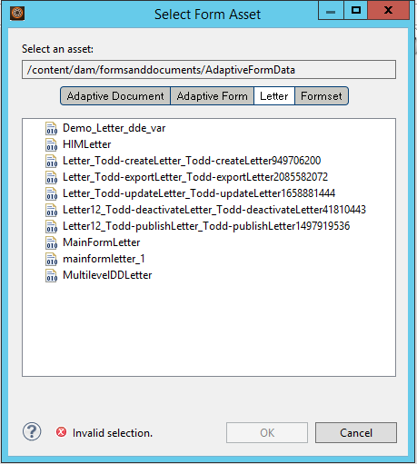

# Intégration d’applications tierces à l’espace de travail AEM Forms{#integrating-third-party-applications-in-aem-forms-workspace}

L’espace de travail AEM Forms prend en charge la gestion d’affectation de tâches et d’activités d’exécution pour les formulaires et les documents. Ces formulaires et documents peuvent être des formulaires XDP, Flex®, ou des guides (déconseillé) qui ont été rendus aux formats XDP, PDF, HTML ou Flex.

Ces fonctionnalités ont été améliorées. AEM Forms prend désormais en charge la collaboration avec des applications tierces comprenant des fonctionnalités semblables à l’espace de travail AEM Forms. Une partie courante de cette fonctionnalité est le flux de travail d’affectation et d’approbation ultérieure d’une tâche. AEM Forms offre une expérience unique et unifiée pour les utilisateurs de l’entreprise AEM Forms afin que toutes ces affectations ou approbations de tâches pour les applications prises en charge puissent être gérées via l’espace de travail AEM Forms.

Par exemple, considérons Correspondence Management comme exemple de candidat pour l’intégration à l’espace de travail AEM Forms. Correspondence Management possède le concept d’une « Lettre », qui peut être rendue et autorise des actions.

## Création d’actifs de Correspondence Management {#create-correspondence-management-assets}

Début en créant un exemple de modèle Correspondence Management qui est rendu dans l’espace de travail AEM Forms. Pour plus d’informations, voir [Création d’un modèle de lettre](../../forms/using/create-letter.md).

Accédez au modèle Correspondence Management à l’adresse URL correspondante pour vérifier si le modèle Correspondence Management peut être rendu correctement. L’URL a un modèle similaire à `https://'[server]:[port]'/lc/content/cm/createcorrespondence.html?cmLetterId=encodedLetterId&cmUseTestData=1&cmPreview=0;`

où `encodedLetterId` correspond à l’ID de lettre codé URL. Spécifiez le même identifiant de lettre lors de la définition du processus de rendu pour une tâche d’espace de travail dans Workbench.

## Création d’une tâche pour le rendu et l’envoi d’une lettre dans l’espace de travail AEM {#create-a-task-to-render-and-submit-a-letter-in-aem-workspace}

Avant d’exécuter ces étapes, assurez-vous d’être membre des groupes suivants :

* cm-agent-users
* Utilisateurs de l’espace de travail

Pour plus d’informations, voir [Ajouter et configurer des utilisateurs](/help/forms/using/admin-help/adding-configuring-users.md).

Procédez comme suit pour créer une tâche pour le rendu et l’envoi d’une lettre dans l’espace de travail AEM :

1. Lancez Workbench. Connectez-vous à localhost en tant qu’administrateur.
1. Cliquez sur Fichier > Nouveau > Application. Dans le champ Nom de l’application, saisissez `CMDemoSample`, puis cliquez sur Terminer.
1. Sélectionnez `CMDemoSample/1.0` et cliquez avec le bouton droit de la souris `NewProcess`. Dans le champ Nom, saisissez `CMRenderer`, puis cliquez sur Terminer.
1. Faites glisser le sélecteur d’activité du point de départ et configurez-le :

   1. Dans Données de présentation, sélectionnez Utiliser un actif CRX.

      

   1. Recherchez une ressource. Dans la boîte de dialogue Sélection de l’actif de formulaire, l’onglet de lettres répertorie toutes les lettres sur le serveur.

      

   1. Sélectionnez la lettre appropriée et cliquez sur **OK**.

1. Cliquez sur Gérer les profils d’action. La boîte de dialogue Gérer les profils d’action apparaît. Assurez-vous que le processus de rendu et le processus d’envoi sont correctement sélectionnés.
1. Pour ouvrir la lettre avec un fichier XML de données, recherchez et sélectionnez le fichier de données approprié dans un processus de préparation des données.
1. Cliquez sur OK.
1. Définissez les variables pour Sortie de point de départ et Pièces jointes de tâche. Les variables définies contiendront les données Sortie de point de départ et Pièces jointes de tâche.
1. (Facultatif) Pour ajouter un autre utilisateur dans le flux de travail, faites glisser le sélecteur d’activité, configurez-le, puis affectez-le à un utilisateur. Enregistrez un wrapper personnalisé (exemple ci-dessous) ou téléchargez et installez le DSC (ci-dessous) pour extraire le modèle Lettre, la sortie de point de départ et la pièce jointe de la tâche.

   Voici un exemple de wrapper personnalisé :

   ```javascript
   public LetterInstanceInfo getLetterInstanceInfo(Document dataXML) throws Exception {
   try {
   if(dataXML == null)
   throw new Exception("dataXML is missing");
   
   CoreService coreService = getRemoteCoreService();
   if (coreService == null)
   throw new Exception("Unable to retrive service. Please verify connection details.");
   Map<String, Object> result = coreService.getLetterInstanceInfo(IOUtils.toString(dataXML.getInputStream(), "UTF-8"));
   LetterInstanceInfo letterInstanceInfo = new LetterInstanceInfo();
   
   List<Document> attachmentDocs = new ArrayList<Document>();
   List<byte[]> attachments = (List<byte[]>)result.get(CoreService.ATTACHMENT_KEY);
   if (attachments != null){
   for (byte[] attachment : attachments)
   { attachmentDocs.add(new Document(attachment)); }
   
   }
   letterInstanceInfo.setLetterAttachments(attachmentDocs);
   
   byte[] updateLayout = (byte[])result.get(CoreService.LAYOUT_TEMPLATE_KEY);
   if (updateLayout != null)
   { letterInstanceInfo.setLetterTemplate(new Document(updateLayout)); }
   
   else
   { throw new Exception("template bytes missing while getting Letter instance Info."); }
   
   return letterInstanceInfo;
   } catch (Exception e)
   { throw new Exception(e); }
   
   }
   ```

   [Get ](assets/dscsample.zip)
FileDownload DSC : Un exemple de DSC est disponible dans le fichier DSCSample.zip joint ci-dessus. Téléchargez et décompressez l’archive ce fichier. Avant d’utiliser le service DSC, vous devez le configurer. Pour plus d’informations, [Configuration du service DSC](../../forms/using/add-action-button-in-create-correspondence-ui.md#p-configure-the-dsc-service-p).

   Dans la boîte de dialogue Définir l’activité, sélectionnez l’activité appropriée tel que GetLetterInstanceInfo et cliquez sur **OK**.

1. Déployer l’application. Si vous y êtes invité, connectez-vous et enregistrez les actifs.
1. Connectez-vous à l’espace de travail AEM forms à l’adresse https://&#39;[server]:[port]&#39;/lc/content/ws.
1. Ouvrez la tâche que vous avez ajoutée, CMRenderer. La lettre Correspondence Management s’affiche.

   

1. Renseignez les données requises et envoyez la lettre. La fenêtre se ferme. Au cours de ce processus, la tâche est affectée à l’utilisateur spécifié dans le flux de travail à l’étape 9.

   >[!NOTE]
   >
   >Le bouton d’envoi n’est pas activé tant que toutes les variables requises dans la lettre ne sont renseignées.
