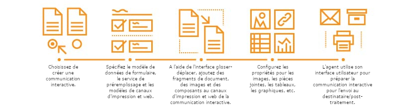

# Présentation des communications interactives {#interactive-communications-overview}

Cet article comprend une présentation, des exemples de cas d’utilisation, un processus de création et les différences entre les communications interactives et les lettres.

Interactive Communications centralise et gère la création, l&#39;assemblage et la diffusion de correspondances sécurisées, personnalisées et interactives telles que la correspondance d&#39;affaires, les documents, les relevés, les avis d&#39;avantages, les courriels marketing, les factures et les kits de bienvenue.

## Fonctionnalités essentielles {#key-capabilities}

Voici les fonctionnalités principales des communications interactives :

* Intégration en standard avec modèle de données de formulaire pour permettre un accès facile et rapide aux bases de données back end et à d’autres systèmes CRM tels que MS® Dynamics
* Interface de création intégrée pour les canaux d’impression et web avec fonction de génération automatique du canal web à partir du canal d’impression
* Graphiques de présentation de l’information dans des formats visuels facilement compréhensibles sur papier et sur le Web
* Éditeur de règles de support de fragments de document et modèle de données de formulaire
* L&#39;interface utilisateur de l&#39;agent affiche l&#39;impression et la prévisualisation Web de la communication interactive.
* Glisser-déposer les composants pour construire rapidement les canaux web et d’impression

## Création de la communication interactive  {#interactive-communication-creation}

### Workflow {#workflow}

To create an Interactive Communication, have the [building blocks](#buildingblocks) for Interactive Communication ready and then complete the following steps:

1. Choisissez de [créer une communication interactive](/help/forms/using/create-interactive-communication.md).

1. Spécifiez le [modèle de données de formulaire](/help/forms/using/data-integration.md), le service de préremplissage et les [modèles des canaux d’impression et web](/help/forms/using/web-channel-print-channel.md). Vous pouvez choisir de générer le canal web à partir du canal d’impression.

1. Via [l’interface glisser-déposer](/help/forms/using/introduction-interactive-communication-authoring.md), ajoutez des fragments de document, des images, des composants des canaux d’impression et web de la communication interactive selon les besoins.
1. Configurez les propriétés suivantes des composants insérés :

   1. [Images](/help/forms/using/create-interactive-communication.md#step2)
   1. [Tableaux](/help/forms/using/create-interactive-communication.md#tables) (y compris les fragments de mise en page)
   1. [Graphiques](/help/forms/using/chart-component-interactive-communications.md)
   1. [Fragments de document](/help/forms/using/create-interactive-communication.md#document-fragment-properties)

1. Prévisualisez les canaux web et d’impression et, si nécessaire, modifiez la communication interactive.
1. L’agent utilise l’interface utilisateur de l’agent pour [préparer la communication interactive](/help/forms/using/prepare-send-interactive-communication.md) en vue de son envoi au destinataire/en post-traitement.

### Blocs de création {#buildingblocks}

Les blocs de construction requis pour la création d’une communication interactive sont les suivants :

* [Modèle de données de formulaire](/help/forms/using/data-integration.md)
* [Modèles de canaux web et d’impression](/help/forms/using/web-channel-print-channel.md)
* [Fragments de document](/help/forms/using/document-fragments.md)
* Images
* [Thèmes](/help/forms/using/themes.md) pour le canal Web

## Comparaison entre les communications interactives et Correspondence Management {#interactive-communications-vs-correspondence-management}

La communication interactive est l’approche recommandée par défaut pour créer des communications client. Pour continuer à utiliser la création de lettres dans AEM 6.3 Forms et AEM 6.2 Forms, vous devez [installer un package de compatibilité](/help/forms/using/compatibility-package.md). Vous trouverez ci-dessous une comparaison entre les fonctionnalités de la communication interactive et de la lettre.

<table>
 <tbody>
  <tr>
   <td><strong>Fonction</strong></td>
   <td><strong>Communication interactive</strong></td>
   <td><strong>Lettre</strong></td>
  </tr>
  <tr>
   <td>Sortie</td>
   <td>Impression et web</td>
   <td>Imprimer</td>
  </tr>
  <tr>
   <td>Schéma</td>
   <td>Modèle de données de formulaire </td>
   <td>Dictionnaire de données </td>
  </tr>
  <tr>
   <td>Localisation</td>
   <td>Non pris en charge dans le modèle de données de formulaire</td>
   <td>Pris en charge dans le dictionnaire de données</td>
  </tr>
  <tr>
   <td>Éditeur de règles</td>
   <td>
    <ul>
     <li>Éditeur de règles de support de texte et de conditions pour la création de conditions en ligne</li>
     <li>L’éditeur de communication interactive prend en charge l’application des règles sur les composants du canal web</li>
    </ul> </td>
   <td>Aucune interface utilisateur pour la création d’une expression conditionnelle</td>
  </tr>
  <tr>
   <td>Création  </td>
   <td>Interface glisser-déposer pour la construction des canaux web et d’impression</td>
   <td>Aucun mécanisme de glisser-déposer </td>
  </tr>
  <tr>
   <td>Graphiques</td>
   <td>Graphiques pris en charge dans les canaux web et d’impression</td>
   <td>pas de prise en charge</td>
  </tr>
  <tr>
   <td>Thèmes</td>
   <td>Utilise des thèmes pour définir l’aspect du canal web</td>
   <td>Ne prend pas en charge les thèmes</td>
  </tr>
  <tr>
   <td>Contrôle et création de version</td>
   <td>pas de prise en charge</td>
   <td>Pris en charge</td>
  </tr>
  <tr>
   <td>Brouillons et gestion d’une instance</td>
   <td>pas de prise en charge</td>
   <td>Pris en charge</td>
  </tr>
  <tr>
   <td>le traitement par lot ;</td>
   <td>Pris en charge </td>
   <td>Pris en charge</td>
  </tr>
  <tr>
   <td>Signature de l’agent</td>
   <td>pas de prise en charge</td>
   <td>Pris en charge</td>
  </tr>
  <tr>
   <td>Fonctions distantes</td>
   <td>pas de prise en charge</td>
   <td>Pris en charge</td>
  </tr>
 </tbody>
</table>

