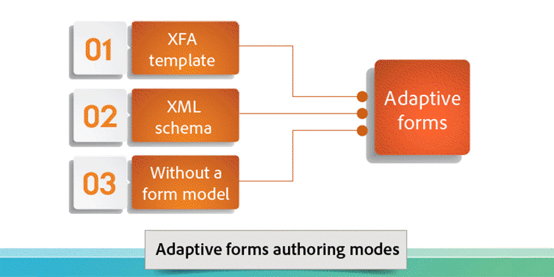

# Présentation d’AEM Forms{#introduction-to-aem-forms}

| Version | Lien de l’article |
| -------- | ---------------------------- |
| AEM as a Cloud Service | [Cliquez ici](https://experienceleague.adobe.com/docs/experience-manager-cloud-service/content/forms/forms-overview/home.html?lang=fr) |
| AEM 6.5 | Cet article |

Pour en savoir plus sur les dernières fonctionnalités et améliorations d’AEM Forms, voir [Nouveautés d’AEM Forms](../../forms/using/whats-new.md).

## À propos d’AEM Forms {#about-aem-forms}

Adobe Experience Manager (AEM) offre une solution conviviale pour créer, gérer, publier et mettre à jour des formulaires numériques complexes tout en s’intégrant aux processus back-end, aux règles métier et aux données.

AEM Forms associe des outils de création, de gestion et de publication à des fonctionnalités de gestion des correspondances, de sécurité des documents et d’analytique intégré pour offrir un environnement complet et convivial. Conçu pour fonctionner sur des canaux Web et mobiles, AEM Forms peut être efficacement intégré à vos processus métier, ce qui réduit les processus papier et les erreurs tout en améliorant l’efficacité.

Dans les grandes entreprises, les formulaires sont souvent créés et réutilisés en les copiant dans un système de gestion de contenu. Conserver à jour une base de données volumineuse de formulaires et rendre les formulaires détectables peut se révéler un défi de taille. AEM propose un portail Formulaires personnalisable qui permet aux clientes et clients de rechercher les formulaires dont ils ou elles ont besoin et d’y accéder via les canaux Web et mobiles.

AEM Forms offre des outils de gestion de formulaires qui vous permettent non seulement de gérer les formulaires adaptatifs, mais aussi les formulaires XFA, les formulaires PDF et les actifs associés. Pour en savoir plus, voir [Présentation de la gestion des formulaires](../../forms/using/introduction-managing-forms.md).

>[!NOTE]
>
>La fonctionnalité de formulaires adaptatifs, disponible dans [AEM 6.5 QuickStart](https://experienceleague.adobe.com/docs/experience-manager-65/deploying/deploying/deploy.html?lang=fr), est conçue à des fins d’exploration et d’évaluation uniquement. Pour une utilisation à des fins de production, il est essentiel d’obtenir une licence valide pour AEM Forms, car la fonctionnalité de formulaires adaptatifs nécessite une licence appropriée.

### Fonctionnalités essentielles {#key-capabilities}

En résumé, AEM Forms offre des fonctionnalités puissantes de gestion des formulaires, comme celles présentées ci-après, qui réduisent les processus manuels et augmentent la satisfaction des clientes et clients.

* Portail Formulaires centralisé pour la conception et le déploiement de formulaires dynamiques, notamment des formulaires PDF, HTML5 et adaptatifs
* Interface utilisateur graphique conviviale pour permettre à la clientèle professionnelle d’importer, gérer, prévisualiser et publier facilement des formulaires
* Répertoire de formulaires réactif avec fonctionnalités de recherche puissantes utilisant des mots-clés, des balises et des métadonnées
* Détection dynamique de l’appareil et de l’emplacement d’une personne pour le rendu approprié du formulaire sur des canaux web et mobiles
* Intégration à Adobe Analytics pour mesurer efficacement les mesures d’utilisation des formulaires
* Intégration aux services Adobe Document Cloud eSign ou saisie tactile pour signer électroniquement des documents contenant des informations confidentielles
* Publication automatisée des formulaires et possibilité de diffuser des messages personnalisés, en temps voulu, et cohérents sur plusieurs canaux

## Types de formulaires AEM {#aem-form-types}

AEM Forms permet d’étendre les formulaires nouveaux et existants pour créer :

* des formulaires PDF et HTML paginés, aux pixels parfaits qui ressemblent à des formulaires papier ; ou
* des formulaires adaptatifs dont le rendu s’effectue automatiquement sur l’appareil et le navigateur d’une personne.

**Formulaires PDF**

Les formulaires PDF peuvent être remplis hors ligne et enregistrés en local. Les données de formulaire sont envoyées lorsque vous vous connectez ensuite. Vous pouvez utiliser des codes à barres 2D pour capturer des données de formulaire et utiliser des signatures numériques pour confirmer l’authenticité des utilisateurs et utilisatrices.

**Formulaires HTML**

Les formulaires de navigateur HTML5 peuvent être affichés sur des appareils mobiles et dans des navigateurs de bureau. Vous pouvez signer électroniquement des formulaires HTML à l’aide de la saisie tactile ou des services eSign.

**Formulaires adaptatifs**

Les formulaires adaptatifs peuvent s’adapter de manière dynamique aux réponses des utilisateurs et utilisatrices en ajoutant ou supprimant des champs ou des sections selon les besoins. AEM permet de réutiliser des modèles de formulaires XML Adobe pour créer des formulaires adaptatifs.

### Fonctionnalités prises en charge {#supported-features}

Tous les types de formulaires prennent en charge les fonctionnalités suivantes :

* Disposition dynamique
* Validation des champs de formulaire
* Aide contextuelle
* Scripting et gestion des données XML
* Conception et vérification de l’accessibilité
* Possibilité d’enregistrer les formulaires côté serveur
* Prise en charge des pièces jointes
* Intégration à Workspace HTML pour la capture de données

## Collecte des données hors ligne {#offline-data-collection}

Une fois les données de formulaire envoyées, Adobe Experience Manager les associe aux systèmes existants, aux règles métier et aux personnes requises.

AEM Forms fournit Forms Workspace, une application mobile qui étend vos processus métier numériques aux appareils mobiles. A l’aide de l’espace de travail AEM Forms, vous pouvez collecter et enregistrer des données hors ligne. L’espace de travail Forms utilise les fonctionnalités de votre appareil mobile et vous permet de capturer des photos, des vidéos et de collecter des données telles que des horodatages et d’autres informations. La prochaine fois que vous vous connecterez à un réseau, vous pourrez synchroniser les données collectées.

La capture des données hors ligne et la synchronisation de celles-ci une fois en ligne s’avèrent particulièrement utiles pour les personnes travaillant sur le terrain. Ces fonctionnalités améliorent la productivité et réduisent les erreurs.

**Avantages de l’utilisation de l’espace de travail Forms pour la collecte de données hors ligne**

* Application d’espace de travail HTML conviviale pour l’affectation de tâches et le suivi
* Environnement de conception de workflow par glisser-déposer
* Connecteurs de gestion de contenu d’entreprise (ECM)
* Prise en charge des normes ouvertes, notamment XML et SOAP, pour associer les données de formulaire aux systèmes d’entreprise
* Rapports HTML prêts à l’emploi pour surveiller les backlogs, les files d’attente de travaux et les indicateurs de performances clés (KPI)
* Tableaux de bord personnalisables pour un aperçu en temps réel des opérations métier
* API pour la connexion à des outils de création de rapports tiers

## Communication personnalisée {#personalized-communication}

Une composante importante d’une expérience numérique de libre-service efficace est la diffusion d’informations personnalisées en temps voulu, accessibles n’importe où et depuis n’importe quel périphérique. Les messages personnalisés diffusés en temps voulu peuvent améliorer les taux de conversion et la satisfaction des utilisateurs.

A l’aide d’AEM Forms, les utilisateurs professionnels peuvent créer des expériences utilisateur personnalisées attrayantes en personnalisant les modèles de document, en incorporant les informations des processus principaux et en incluant des composants interactifs. Une interface utilisateur intuitive permet aux utilisateurs et aux utilisatrices sans connaissance informatique de créer des règles métier qui déterminent à quel moment générer un message selon une demande ou demander une réponse de l’utilisateur ou de l’utilisatrice.

Des documents personnalisés tels que des reçus, des kits de bienvenue et des instructions peuvent être facilement diffusés sur plusieurs canaux. Les entreprises peuvent rediriger le trafic vers des portails web personnalisés suite à une inscription ou à l’achat de services supplémentaires.

**Fonctions clés**

* Environnement de création de correspondance avec prise en charge des modèles, des blocs de contenu, des règles métier, etc.
* Conversion et assemblage de documents
* Prise en charge de la remise de documents par lots ou à la demande via plusieurs canaux, notamment le web, la messagerie et le papier
* Journaux d’audit avec historique des modifications
* Prise en charge des signatures numériques pour garantir l’intégrité du contenu et l’identité du ou de la signataire
* Module complémentaire de sécurité des documents pour AEM Forms comprenant le chiffrement, les politiques d’utilisation, le suivi et l’audit

Workflow de communication personnalisée rationalisé

