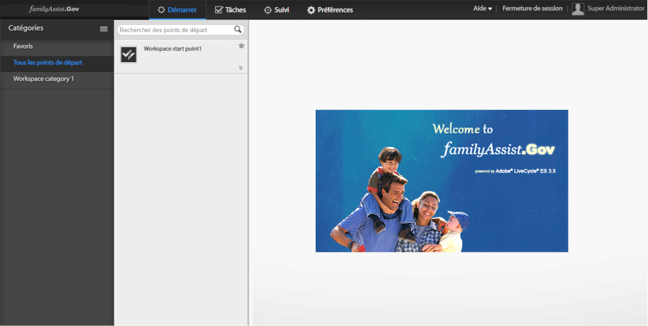

# Introduction à la personnalisation de l’espace de travail AEM Forms{#introduction-to-customizing-aem-form-workspace}

L’espace de travail AEM forms permet de modifier la sémantique de la présentation et les fonctionnalités de son interface. Les types de personnalisations pour modifier le style, la mise en page, le formatage, la marque et les principales fonctionnalités sont décrits ci-dessous.

Exemple d’espace de travail personnalisé

## Types de personnalisation {#types-of-customizations}

L’espace de travail AEM Forms prend en charge un large éventail de personnalisations pour mettre à jour la mise en page de l’interface utilisateur, son aspect, sa fonctionnalité et bien plus encore. Les personnalisations impliquent la mise à jour d’un ou plusieurs des éléments suivants :

* l’aspect de l’interface utilisateur ;
* la fonctionnalité à l’aide des personnalisations sémantiques ;
* la réutilisation des composants HTML dans d’autres applications.

### Modifications de l’interface utilisateur {#user-interface-changes}

Vous pouvez modifier l’aspect, la mise en page et la sémantique d’une autre présentation de l’espace de travail AEM Forms. Modifiez l’espace de travail en personnalisant le CSS, les modèles HTML et les fichiers JavaScript™. Tous les fichiers par défaut sont fournis dans l’installation par défaut.

The most commonly applicable steps are covered in [Generic steps for AEM Forms workspace customization](../../forms/using/generic-steps-html-workspace-customization.md). Pour des exemples spécifiques de ces personnalisations, y compris les étapes détaillées, voir les articles connexes à la fin de cet article.

#### Présentation de la feuille de style {#understanding-the-style-sheet}

Avant de personnaliser l’espace de travail, familiarisez-vous avec la feuille de style par défaut fournie avec AEM Forms sous /libs/ws/css/style.css.

Pour personnaliser l’espace de travail, nous vous recommandons de vous familiariser avec la feuille de style existante, style.css, disponible dans le dossier /libs/ws/css. Certains composants principaux sont décrits ci-dessous.

<table>
 <tbody>
  <tr>
   <th>
Elément CSS
 </th>
   <th>
Composant de l’interface utilisateur modifié
 </th>
  </tr>
  <tr>
   <td>
#header
 </td>
   <td>
En-tête de l'espace de travail AEM Forms
 </td>
  </tr>
  <tr>
   <td>
.categoryList
 </td>
   <td>
Liste de catégories 
 </td>
  </tr>
  <tr>
   <td>
.categoryList .header
 </td>
   <td>
En-tête de la liste de catégories
 </td>
  </tr>
  <tr>
   <td>
.categories, .filters
 </td>
   <td>
Espace sous la liste de catégories
 </td>
  </tr>
  <tr>
   <td>
.category, .filter
 </td>
   <td>
Catégorie
 </td>
  </tr>
  <tr>
   <td>
.category:hover, .category.selected, .filter:hover, .filter.selected
 </td>
   <td>
Catégorie sélectionnée et style de survol de souris de la catégorie
 </td>
  </tr>
  <tr>
   <td>
categoryListBar .tool, categoryListBar .content
 </td>
   <td>
Page de démarrage (liste de catégories fermée)
 </td>
  </tr>
  <tr>
   <td>
filterListBar .tool, filterListBar .content
 </td>
   <td>
Page de tâches (liste de filtres fermée)
 </td>
  </tr>
  <tr>
   <td>
processNameListBar .tool, processNameListBar .content
 </td>
   <td>
Page de suivi (liste de noms de processus fermée)
 </td>
  </tr>
  <tr>
   <td>
.startPointList, .tasklist
 </td>
   <td>
Liste de points de départ ou liste de tâches
 </td>
  </tr>
  <tr>
   <td>
.startPointList .header, .tasklist .header
 </td>
   <td>
En-tête d’une liste de points de départ ou d’une liste de tâches
 </td>
  </tr>
  <tr>
   <td>
.startpoint.selected, .task.selected
 </td>
   <td>
Tâche ou point de départ sélectionné
 </td>
  </tr>
  <tr>
   <td>
.startpoint.selected .description, .task.selected description
 </td>
   <td>
Description de la tâche ou du point de départ sélectionné
 </td>
  </tr>
  <tr>
   <td>
#taskarea
 </td>
   <td>
Zone de tâche
 </td>
  </tr>
  <tr>
   <td>
#header .dropdown
 </td>
   <td>
Liste déroulante utilisateur dans l’en-tête
 </td>
  </tr>
  <tr>
   <td>
.sortDrop dd ul
 </td>
   <td>
Liste déroulante de tâche de tri
 </td>
  </tr>
 </tbody>
</table>

#### CSS {#css}

L’aspect de l’espace de travail AEM Forms emprunte son aspect à une page CSS. En personnalisant le CSS, vous pouvez modifier la sémantique de présentation de l’espace de travail comme les polices, les couleurs, les marques et la mise en page.

Les étapes de niveau supérieur pour une personnalisation CSS sont les suivantes :

* Créez un fichier CSS.
* Ajoutez des éléments de style dans ce fichier CSS. Voir Description des styles CSS pour plus d’informations.
* Update its references in `html.jsp`.

For the exact steps to do these customizations, see [Generic steps for AEM Forms workspace customization](../../forms/using/generic-steps-html-workspace-customization.md). Le fichier CSS fourni avec l&#39;espace de travail AEM Forms se trouve dans /libs/ws/css/. Pour les personnalisations CSS, utilisez la commande [Ship Package](../../forms/using/introduction-customizing-html-workspace.md#p-crx-package-p). Vous trouverez des exemples spécifiques de personnalisations CSS dans les rubriques d’aide connexes à la fin de cet article.

#### Image {#image}

Vous pouvez personnaliser l’espace de travail AEM Forms pour ajouter des avatars d’utilisateurs ou pour ajouter le logo de votre organisation. Pour ces personnalisations, utilisez la commande [Ship Package](../../forms/using/introduction-customizing-html-workspace.md#p-crx-package-p).

Les étapes de niveau supérieur pour des personnalisations des images sont les suivantes :

* Installez et configurez WebDAV.
* Ajoutez de nouvelles images.
* Ajoutez de nouveaux styles correspondant aux images ajoutées.
* Etablissez le lien vers le nouveau fichier CSS dans le fichier `html.jsp`.

To get started with customizing the images in AEM Forms workspace, follow the [Generic steps for AEM Forms workspace customization](../../forms/using/generic-steps-html-workspace-customization.md). Vous trouverez des exemples spécifiques de personnalisations d’images dans les rubriques d’aide connexes à la fin de cet article.

#### Contrôleur HTML {#html-template}

Les modèles HTML permettent de définir l’aspect et la mise en page de l’interface utilisateur de l’espace de travail. Lors de la mise à jour des contrôleurs HTML par défaut, vous pouvez personnaliser l’interface de l’utilisateur par défaut de la mise en page.

Les étapes de niveau supérieur pour les personnalisations du contrôleur HTML sont les suivantes :

* Dans un dossier créé par l’utilisateur, effectuez des copies des fichiers par défaut requis.
* Ajoutez de nouveaux contrôleurs dans le dossier défini par l’utilisateur.
* Effectuez les mises à jour appropriées des fichiers copiés tels que le chemin d’accès du nouveau contrôleur.

Vous trouverez des exemples spécifiques de ces personnalisations dans les rubriques d’aide fournies à la fin de cet article. Choisissez entre [Exécution de la commande Ship](../../forms/using/introduction-customizing-html-workspace.md#p-crx-package-p) ou [Exécution de la commande Dev](../../forms/using/introduction-customizing-html-workspace.md#p-crx-package-p), selon le modèle à personnaliser.

### Modifications sémantiques {#semantic-changes}

Pour modifier la fonctionnalité de l’espace de travail AEM Forms, modifiez le code source JavaScript. Les modifications dans les principales fonctionnalités ne sont pas libellées comme modifications sémantiques. Vous modifiez des modèles, des vues et des contrôleurs fournis en tant que partie intégrante du code source de l’espace de travail AEM Forms.

Les étapes de niveau supérieur permettant d’effectuer des modifications sémantiques pour modifier les fonctionnalités de l’espace de travail AEM Forms sont les suivantes :

* Dans un dossier créé par l’utilisateur, effectuez des copies des fichiers par défaut appropriés.
* Ajoutez de nouveaux modèles et de nouvelles vues dans le dossier défini par l’utilisateur.
* Effectuez les mises à jour appropriées telles que la mise à jour des chemins des nouveaux modèles et des vues dans les fichiers JavaScript par défaut.
* Minifiez le paquet pour optimiser les performances.

Pour plus d’informations conceptuelles sur les composants qui font partie du code source, voir [Description des composants réutilisables](/help/forms/using/description-reusable-components.md). Pour ces personnalisations, utilisez la commande Dev.

### Composants réutilisables {#reusable-components}

Comme l&#39;espace de travail AEM Forms est un logiciel basé sur des composants, il peut être facilement personnalisé et réutilisé. Vous pouvez intégrer facilement les composants de l’espace de travail avec vos applications Web.

For more conceptual information, see the [Description of reusable components](/help/forms/using/description-reusable-components.md) and for instruction about using the components, see [Integrating AEM Forms workspace components in web applications](/help/forms/using/description-reusable-components.md).

## Conception de code de l’espace de travail AEM Forms {#building-html-workspace-code}

### Paquet SDK {#sdk-package}

Le paquet contient le code source de l’espace de travail AEM Forms. Le forfait est disponible à `[LC root]\sdk\html-workspace\adobe-lc-workspace-src.zip`l&#39;adresse.

Il est essentiellement destiné aux personnalisations, car il permet de générer les éléments suivants :

* paquets CRX pour les profils Ship, Debug et Dev (mentionnés ci-dessous dans [Paquets CRX](../../forms/using/introduction-customizing-html-workspace.md#p-crx-package-p)).
* Version minifiée de code personnalisé (pour les modifications sémantiques).

#### Contenu du dossier WS {#ws-content}

* client-pkg :

   * src - contient les artefacts nécessaires pour créer des nœuds CRX.
   * pom.xml - script pour créer des paquets de déploiement pour différents profils WS-Deploy Package

* client-html :

   * assembly : contient le fichier zip.xml utilisé par le script pour créer le SDK de l’espace de travail AEM Forms.
   * src/main/webapp -

      * CSS - contient les feuilles de style de l’espace de travail AEM Forms.
      * images - contient les images utilisées dans l’espace de travail AEM Forms.
      * js:

         * libs - contient toutes les bibliothèques tierces utilisées dans l’espace de travail AEM Forms.
         * licenses - contient les licences pour les fichiers HTML et JS, ainsi que le code pour préfixer ces licences en fonction des fichiers sources respectifs.
         * minifier - Utilisé pour la combinaison, la minification et l’utilisation d’un code JavaScript personnalisé.
         * resourcejs_optimizer - Utilisé pour la combinaison, la minification et l’utilisation de la source JavaScript.
         * resource_generator - utilisé pour générer register.js et modelcontrollerpath.js.
         * runtime:

            * initializer - contient le fichier initializer.js utilisé pour initialiser les vues et les modèles Backbone utilisés dans l’espace de travail AEM Forms.
            * models - contient les modèles Backbone de tous les composants présents dans l’espace de travail AEM Forms.
            * routes - contient des fichiers JavaScript et HTML qui chargent les processus de début, les tâches, le suivi et les préférences dans l’espace de travail AEM Forms.
            * services - contient le fichier service.js utilisé dans l’espace de travail AEM Forms. Tous les appels de serveur sont effectués via service.js.
            * templates - contient tous les contrôleurs, c’est-à-dire les fichiers HTML de toutes les vues dans l’espace de travail AEM Forms.
            * util - contient tous les fichiers d’utilitaire (JavaScript) utilisés dans l’espace de travail AEM Forms.
            * views - contient les vues Backbone de tous les composants dans l’espace de travail AEM Forms.
         * main.js
         * router.js
      * libs/ws : pdf.html et pluginPing.pdf sont utilisés pour charger des PDF forms dans l’espace de travail AEM Forms et WSNextAdapter.swf est utilisé pour charger des formulaires SWF et des guides dans l’espace de travail AEM Forms.
      * locales :

         * de-DE : contient translation.json pour l’allemand.
         * en-EN : contient translation.json pour l’anglais.
         * fr-FR : contient translation.json pour le français.
         * ja-JP : contient translation.json pour le japonais.
         * html.jsp : contient le code permettant de trouver les paramètres régionaux du navigateur actuel.
      * html.jsp
      * GET.jsp

### Package CRX {#crx-package}

Le paquet CRX peut être déployé sur le référentiel CRX™. It is available at `[LC root]\crx-repository\install\adobe-lc-workspace-pkg.zip`.

Ce paquet peut être créé à l’aide des trois profils décrits ci-dessous.

| **Profil** | **Description** | **Utilisation** |
|---|---|---|
| Profil Ship | Ce profil crée un paquet CRX de la plus petite taille possible à l’aide de la minification. Ce paquet est le plus efficace. Tous les fichiers JavaScript™ sont combinés et minifiés dans un seul fichier JS. | Utilisez ce profil si aucune modification sémantique supplémentaire n’est nécessaire dans des fichiers JS. |
| Profil Debug | Ce profil crée un paquet CRX modérément efficace. La taille du paquet est légèrement supérieure à celle du paquet créé à l’aide du profil Ship. Ce paquet a la plupart des fichiers JavaScript combinés dans un seul fichier JS. | Utilisez ce profil pour le débogage. |
| Profil Dev | Ce profil crée un paquet CRX de la plus grande taille possible. Tous les fichiers JavaScript sont disponibles séparément, car ils sont dans le paquet SDK. | Utilisez ce profil lors de l’incorporation de modifications sémantiques. |

#### Profil Ship {#ship-profile}

#### Commande {#command}

* mvn clean -P Ship install sur le dossier client-pkg du package Source fourni au client.
* L’exécution de la commande Ship profil fonctionne uniquement sur une JVM 64 bits.

#### Contenu du dossier WS {#ws-content-1}

* css - contient style.css, ie.css et jquery-ui.css.
* images : contient toutes les images.
* js:

   * libs:

      * require : contient require.js.
      * jqueryui : contient jquery.ui.datepicker.ja.js.
   * runtime:

      * templates - contient tous les modèles, c’est-à-dire les fichiers HTML de tous les composants dans l’espace de travail AEM Forms.
   * main.js (combiné, minifié, et utilisé avec Uglifier).
   * registry.js

* libs:

   * ws - contient pluginPing.pdf, pdf.html et WSNextAdapter.swf.

* locale : contient .content.xml.
* locales :

   * de-DE : contient translation.json pour l’allemand.
   * en-EN : contient translation.json pour l’anglais.
   * fr-FR : contient translation.json pour le français.
   * ja-JP : contient translation.json pour le japonais.
   * html.jsp : contient le code permettant de trouver les paramètres régionaux du navigateur actuel.

* Index : contient .content.xml
* profile : contient offline.jsp.
* GET.jsp
* html.jsp
* content.xml
* _rep_policy.xml

#### Profil Debug {#debug-profile}

#### Commande {#command-1}

* mvn clean -P Debug install sur client-pkg
* L’exécution de la commande du profil Debug fonctionne uniquement sur un JVM de 64 bits.

#### Contenu du dossier WS {#ws-content-2}

* css - contient style.css, ie.css et jquery-ui.css.
* images : contient toutes les images.
* js:

   * libs:

      * require : contient require.js.
      * jqueryui : contient jquery.ui.datepicker.ja.js.
   * runtime:

      * templates - contient tous les modèles, c’est-à-dire les fichiers HTML de tous les composants dans l’espace de travail AEM Forms.
   * main.js (combiné).
   * registry.js

* libs:

   * ws - contient pluginPing.pdf, pdf.html et WSNextAdapter.swf.

* locale : contient .content.xml.
* locales :

   * de-DE : contient translation.json pour l’allemand.
   * en-EN : contient translation.json pour l’anglais.
   * fr-FR : contient translation.json pour le français.
   * ja-JP : contient translation.json pour le japonais.
   * html.jsp : contient le code permettant de trouver les paramètres régionaux du navigateur actuel.

* Index : contient .content.xml
* profile : contient offline.jsp.
* GET.jsp
* html.jsp
* content.xml
* _rep_policy.xml

#### Profil Dev {#dev-profile}

#### Commande {#command-2}

mvn clean -P Dev install sur client-pkg

#### Contenu du dossier WS {#ws-content-3}

* css - contient style.css, ie.css et jquery-ui.css.
* images : contient toutes les images.
* js:

   * libs - contient toutes les bibliothèques utilisées dans l’espace de travail AEM Forms.
   * require : contient require.js.
   * jqueryui : contient jquery.ui.datepicker.ja.js
   * runtime:

      * initializer : contient initializer.js et modelcontrollerpath.js.
      * models : contient les modèles de tous les composants de l’espace de travail AEM Forms.
      * routes - contient des fichiers JavaScript et HTML qui chargent les processus de début, les tâches, le suivi et les préférences dans l’espace de travail AEM Forms.
      * services - contient le fichier service.js utilisé dans l’espace de travail AEM Forms. 
      * templates - contient tous les modèles, c’est-à-dire les fichiers HTML de tous les composants dans l’espace de travail AEM Forms.
      * util - contient tous les fichiers d’utilitaire (JavaScript) utilisés dans l’espace de travail AEM Forms.
      * views - contient les vues de tous les composants de l’espace de travail AEM Forms.
   * main.js
   * registry.js
   * router.js

* libs:

   * ws - contient pluginPing.pdf, pdf.html et WSNextAdapter.swf.

* locale : contient .content.xml.
* locales :

   * de-DE : contient translation.json pour l’allemand.
   * en-EN : contient translation.json pour l’anglais.
   * fr-FR : contient translation.json pour le français.
   * ja-JP : contient translation.json pour le japonais.
   * html.jsp : contient le code permettant de trouver les paramètres régionaux du navigateur actuel.

* Index : contient .content.xml
* profile : contient offline.jsp.
* GET.jsp
* html.jsp
* content.xml
* _rep_policy.xml
