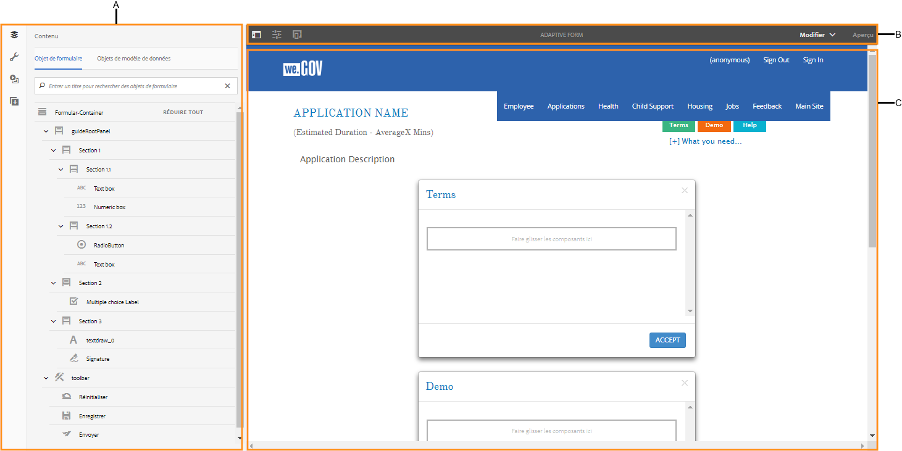
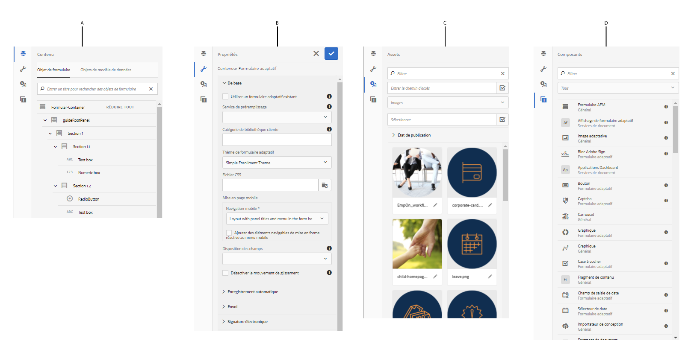
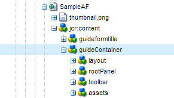

# Présentation de la création de formulaires adaptatifs {#introduction-to-authoring-adaptive-forms}

## Présentation {#overview}

Les formulaires adaptatifs vous permettent de créer des formulaires attrayants, réactifs, dynamiques et adaptatifs. AEM Forms fournit une interface utilisateur intuitive et des composants prêts à l’emploi pour la création et l’utilisation de formulaires adaptatifs. Vous pouvez choisir de créer un formulaire adaptatif basé sur un modèle de formulaire ou un schéma ou sans modèle de formulaire. Il est important de choisir avec soin le modèle de formulaire qui convient non seulement à vos besoins, mais qui étend également vos investissements et vos actifs d’infrastructure existants. Vous pouvez choisir parmi les options suivantes pour créer un formulaire adaptatif :

* **Utilisation d’un modèle de données de formulaire**
   [L’intégration](../../forms/using/data-integration.md) des données vous permet d’intégrer des entités et des services provenant de sources de données disparates dans un modèle de données de formulaire que vous pouvez utiliser pour créer des formulaires adaptatifs. Choisissez le modèle de données de formulaire si le formulaire adaptatif que vous créez implique l’extraction et l’écriture de données depuis et vers plusieurs sources de données.

* **Utilisation d’un modèle de formulaire XDP** Il s’agit d’un modèle de formulaire idéal si vous investissez dans des formulaires XFA ou XDP. Il fournit une méthode directe de conversion des formulaires de type XFA en formulaires adaptatifs. Toutes les règles XFA existantes sont conservées dans les formulaires adaptatifs associés. Les formulaires adaptatifs qui en résultent prennent en charge les éléments XFA, tels que les validations, les événements, les propriétés et les motifs.

* **Utilisation d’une définition de schéma XML (XSD) ou d’un schéma JSON** Les schémas XML et JSON représentent la structure dans laquelle les données sont produites ou consommées par le système principal de votre entreprise. Vous pouvez associer le schéma à un formulaire adaptatif et utiliser ses éléments pour ajouter du contenu dynamique à un formulaire adaptatif. Les éléments du schéma peuvent être utilisés dans l’onglet Objets du modèle de données de l’explorateur de contenu lors de la création de formulaires adaptatifs.

* **Sans ou aucun modèle de formulaire** Les formulaires adaptatifs créés avec cette option n’utilisent aucun modèle de formulaire. Les données XML générées à partir de ce type de formulaire présentent une structure plate avec des champs et des valeurs correspondantes.

Pour en savoir plus sur la création d’un formulaire adaptatif, consultez [Création d’un formulaire adaptatif](../../forms/using/creating-adaptive-form.md).

## Interface de création de formulaires adaptatifs {#adaptive-form-authoring-ui}

L’interface utilisateur optimisée pour les écrans tactiles permet de créer des formulaires adaptatifs de manière intuitive et offre les avantages suivants :

* Fonctionnalité glisser-déposer 
* Composants standard de formulaire 
* Référentiel intégré de ressources

Lorsque vous créez ou modifiez un formulaire adaptatif, vous utilisez les éléments suivants de l’interface utilisateur :

* [Barre latérale](#sidebar)
* [Barre d’outils Page](#page-toolbar)
* [Barre d’outils de composants](#component-toolbar)
* [Page de formulaires adaptatifs](#af-page)

**A.** Barre latérale **B.** Barre d&#39;outils de la page **C.** Page de formulaire adaptatif

### Barre latérale {#sidebar}

La barre latérale vous permet de

* Voir le contenu du formulaire tel que les panneaux, les composants, les champs et la mise en page.
* Modifier les propriétés du composant.
* Rechercher, afficher et utiliser des ressources dans votre référentiel de gestion des actifs numériques AEM. 
* Ajouter des composants dans le formulaire.

**A.** Explorateur de contenu **B.** Explorateur de propriétés **C.** Explorateur de ressources **D.** Explorateur de composants

<!--Click to enlarge

](assets/sidebar-comps-1.png) -->

La barre latérale comprend les explorateurs suivants :

* **Explorateur de contenu** Dans l’explorateur de contenu, vous pouvez voir 

   * **Objets de formulaire** Affiche la hiérarchie des objets du formulaire. L’auteur peut accéder au composant spécifique du formulaire en appuyant sur cet élément dans l’arborescence de l’objet de formulaire. L’auteur peut alors rechercher des objets et les réorganiser depuis l’arborescence.

   * **Objets de modèle de données** Permet de voir la hiérarchie des modèles de formulaire.
Il vous permet de faire glisser des éléments du modèle de formulaire sur le formulaire adaptatif. Les éléments ajoutés sont automatiquement convertis en composants de formulaire, tout en conservant leurs propriétés d’origine. Vous pouvez voir les objets de modèle de données lorsque votre formulaire utilise un schéma XML, un schéma JSON ou un modèle XDP.

* **Explorateur de propriétés**

   Permet de modifier les propriétés d’un composant. Les propriétés affichées varient en fonction d’un composant. Pour afficher les propriétés du conteneur de formulaire adaptatif :

   Sélectionnez un composant, puis appuyez sur au niveau  champ > Conteneur **[!UICONTROL de formulaire]** adaptatif, puis sur .

* **Explorateur de ressources**

   Sépare différents types de contenu, tels que des images, des documents, des pages, des films, etc.

* **Explorateur de composants**

   Inclut des composants que vous pouvez utiliser pour créer un formulaire adaptatif. Vous pouvez faire glisser des composants sur le formulaire adaptatif afin d’ajouter des éléments de formulaire, puis configurer les éléments ajoutés conformément aux exigences. Le tableau ci-dessous décrit les composants répertoriés dans l’explorateur de composants.

<table>
 <tbody>
  <tr>
   <th><strong>Composant</strong></th>
   <th><strong>Fonctionnalité</strong></th>
  </tr>
  <tr>
   <td>Bloc Adobe Sign</td>
   <td>Ajoute un bloc de texte avec des espaces réservés pour que les champs soient remplis lors de la signature à l’aide d’Adobe Sign.</td>
  </tr>
  <tr>
   <td>Bouton</td>
   <td>Ajoute un bouton que vous pouvez configurer afin d’effectuer des actions telles que Enregistrer, Réinitialiser, Passer au suivant, Revenir au précédent, etc..</td>
  </tr>
  <tr>
   <td>Captcha</td>
   <td>Ajoutez une validation CAPTCHA en utilisant le service reCAPTCHA de Google. Pour plus d’informations, voir <a href="../../forms/using/captcha-adaptive-forms.md" target="_blank">Utilisation de CAPTCHA dans les formulaires adaptatifs</a>.</td>
  </tr>
  <tr>
   <td>Graphique</td>
   <td>Ajoute un diagramme que vous pouvez utiliser dans des formulaires et des documents adaptatifs pour la représentation visuelle des données bidimensionnelles dans les panneaux et les lignes de tableau répétables.</td>
  </tr>
  <tr>
   <td>Case à cocher</td>
   <td>Ajoute une case à cocher..</td>
  </tr>
  <tr>
   <td>Champ de saisie de date</td>
   <td>Le composant de champ de saisie de date permet aux utilisateurs de saisir dans trois zones séparées le jour, le mois et l’année. Vous pouvez personnaliser l’apparence du composant et modifier le format de date. Ainsi, la date peut être saisie au format MM/JJ/AAAA ou JJ/MM/AAAA.</td>
  </tr>
  <tr>
   <td>Sélecteur de date</td>
   <td>Ajoute un champ de calendrier pour sélectionner une date..</td>
  </tr>
  <tr>
   <td>Fragment de document</td>
   <td>Ajoute des composants réutilisables d’une correspondance.</td>
  </tr>
  <tr>
   <td>Groupe de fragments de document</td>
   <td>Ajoute le groupe de fragments de document associés que vous pouvez utiliser dans un modèle de lettre en tant que même unité.</td>
  </tr>
  <tr>
   <td>Liste déroulante</td>
   <td>Ajoute une liste déroulante, à sélection simple ou multiple.</td>
  </tr>
  <tr>
   <td>Courrier électronique</td>
   <td>
Ajoute un champ pour capturer une adresse électronique. Le composant Courrier électronique, par défaut, valide les adresses électroniques à l’aide de l’expression régulière suivante.
 
<code>^[a-zA-Z0-9.!#$%&amp;’*+/=?^_`{|}~-]+@[a-zA-Z0-9-]+(?:.[a-zA-Z0-9-]+)*$</code>
 </td>
  </tr>
  <tr>
   <td>Fichier en pièce jointe</td>
   <td>
Ajoute un bouton qui permet aux utilisateurs de rechercher et de joindre des documents annexes au formulaire.
 
<strong>Remarque :</strong> le composant Pièce jointe prend en charge un ensemble prédéfini de formats de fichiers dans des formulaires adaptatifs activés pour Adobe Sign. Pour plus d’informations, voir <a href="https://helpx.adobe.com/document-cloud/help/supported-file-formats-fill-sign.html#main-pars_text">Formats de fichiers pris en charge</a>.
 </td>
  </tr>
  <tr>
   <td>Liste des pièces jointes</td>
   <td>Ajoute un champ qui répertorie toutes les pièces jointes téléchargées à l’aide du composant Pièce jointe.</td>
  </tr>
  <tr>
   <td>Pied de page  </td>
   <td>Ajoute un en-tête qui contient habituellement le logo d’une société, le titre du formulaire et le résumé.   </td>
  </tr>
  <tr>
   <td>En-tête</td>
   <td>Ajoute le pied de page qui contient généralement des informations de copyright, ainsi que des liens vers d’autres pages. </td>
  </tr>
  <tr>
   <td>Image</td>
   <td>Permet d’insérer une image.</td>
  </tr>
  <tr>
   <td>Choix d’image</td>
   <td>Permet à vos clients de sélectionner une image pour fournir des informations. Vous pouvez utiliser ces informations pour fournir des services personnalisés à vos clients. </td>
  </tr>
  <tr>
   <td>Bouton Suivant</td>
   <td>Ajoute un bouton pour accéder au panneau suivant dans un formulaire.</td>
  </tr>
  <tr>
   <td>Champ numérique</td>
   <td>Ajoute un champ destiné à la saisie de valeurs numériques.</td>
  </tr>
  <tr>
   <td>Procédure pas à pas numérique</td>
   <td>Utilisez la procédure pas à pas numérique pour permettre à vos clients d’indiquer une valeur numérique, qu’ils peuvent augmenter ou diminuer en fonction d’une étape prédéfinie. </td>
  </tr>
  <tr>
   <td>Panneau</td>
   <td>
Ajoute un panneau ou un sous-panneau..
 
Vous pouvez également ajouter un composant de panneau à partir de la barre d’outils du panneau parent à l’aide du bouton Add Child Panel</code> (Ajouter un panneau enfant). Similarly, you can add a panel-specific toolbar using the Add Panel Toolbar</code> button. Vous pouvez configurer la position de la barre d’outils du panneau à l’aide de la boîte de dialogue Modifier le panneau.</code></code>
 </td>
  </tr>
  <tr>
   <td>Zone de mot de passe</td>
   <td>Ajoute un champ destiné à la saisie d’un mot de passe..</td>
  </tr>
  <tr>
   <td>Bouton Précédent</td>
   <td>Ajoute un bouton permettant de revenir à la page ou au panneau précédents. </td>
  </tr>
  <tr>
   <td>Bouton radio</td>
   <td>Ajoute des cases d’option..</td>
  </tr>
  <tr>
   <td>Bouton Réinitialiser</td>
   <td>Ajoute un bouton permettant de réinitialiser des champs de formulaire..</td>
  </tr>
  <tr>
   <td>Bouton Enregistrer</td>
   <td>Ajoute un bouton pour enregistrer les données de formulaire.</td>
  </tr>
  <tr>
   <td>Signature tactile</td>
   <td>Ajoute un champ destiné à la saisie de signatures tactiles..</td>
  </tr>
  <tr>
   <td>Séparateur</td>
   <td>Active la ségrégation visuelle des panneaux dans le formulaire.</td>
  </tr>
  <tr>
   <td>Étape de signature</td>
   <td>Affiche les informations fournies dans le formulaire et les champs de signature pour que l’utilisateur puisse vérifier et signer le formulaire.</td>
  </tr>
  <tr>
   <td>Text (Texte)</td>
   <td>Permet de spécifier du texte statique.</td>
  </tr>
  <tr>
   <td>Bouton Envoyer</td>
   <td>Ajoute un bouton d’envoi permettant d’envoyer le formulaire à l’action d’envoi configurée.</td>
  </tr>
  <tr>
   <td>Résumé Étape</td>
   <td>Soumet le formulaire et affiche le texte récapitulatif spécifié par les auteurs après la soumission du formulaire. </td>
  </tr>
  <tr>
   <td>Basculer</td>
   <td>Ajoute un bouton bascule qui exécute une opération de bascule ou active/désactive une action. Vous ne pouvez pas ajouter plus de deux options dans le composant Basculer. Un bouton ne peut avoir que deux valeurs : Activé ou Désactivé, obligatoire ne s’applique pas. Au moins une valeur est enregistrée, quelle que soit la saisie utilisateur.   </td>
  </tr>
  <tr>
   <td>Tableau</td>
   <td>Ajoute un tableau qui permet de classer les données par lignes et par colonnes. </td>
  </tr>
  <tr>
   <td>Téléphone</td>
   <td>
Ajoute un champ pour capturer le numéro de téléphone. Le composant Téléphone permet aux auteurs de configurer l’un des types de numéros de téléphone suivants. Chaque type est associé à une expression régulière par défaut pour la validation.

    <ul>
     <li>Le type International est validé par <code>^[+][0-9]{0,14}$</code>.</li>
     <li>Le type USPhoneNumber est validé par <code>{'+1 ('999') '999-9999}</code>.</li>
     <li>Type UKPhoneNumber is validated by <code>text{'+'99 999 999 9999}</code>.</li>
     <li>Le type Custom ne fournit pas de modèle de validation par défaut. Il prend la valeur du dernier type de numéro de téléphone sélectionné. Vous pouvez également spécifier votre propre motif de validation personnalisé.</li>
    </ul> </td>
  </tr>
  <tr>
   <td>Termes et conditions  </td>
   <td>Ajoute un champ que les auteurs peuvent utiliser pour spécifier les conditions générales que les utilisateurs doivent consulter avant de remplir le formulaire.</td>
  </tr>
  <tr>
   <td>Zone de texte </td>
   <td>
Ajoute une zone de texte dans laquelle un utilisateur peut spécifier les informations nécessaires.. 
 
Par défaut, le composant de zone de texte accepte uniquement du texte brut. Vous pouvez activer un composant de zone de texte afin de permettre la prise en charge du texte brut. Un composant de texte compatible avec le texte brut permet d’ajouter des en-têtes, de modifier les styles de caractère (gras, italique, souligné), de créer les listes ordonnées et non ordonnées, de modifier l’arrière-plan et la couleur du texte et d’ajouter des hyperliens. To enable rich text for a text box, enable the<strong> Allow Rich Text</strong> option in the component properties.
 </td>
  </tr>
  <tr>
   <td>Title (Titre)</td>
   <td>Spécifie un titre pour le formulaire adaptatif.</td>
  </tr>
  <tr>
   <td>Étape de vérification</td>
   <td>
Ajoute un espace réservé pour afficher le formulaire rempli à des fins de vérification par l’utilisateur.
 
<strong>Remarque </strong>: le formulaire adaptatif contenant le composant Vérifier ne prend pas en charge les utilisateurs anonymes. En outre, il n’est pas recommandé d’utiliser le composant Vérifier dans un fragment de formulaire adaptatif.
 </td>
  </tr>
 </tbody>
</table>

#### Meilleures pratiques pour l’utilisation avec des composants {#best-practices}

Les meilleures pratiques et les points clés suivants sont à prendre en compte lors de l’utilisation de composants de formulaire adaptatifs :

* Chaque composant est associé à des propriétés qui contrôlent son apparence et ses fonctionnalités. To configure the properties of a component, tap the component and tap  to open the component properties in the Properties browser.
* Un composant est identifié par son nom d’élément. When you tap , you can change the name of the component by changing the **[!UICONTROL Element Name]** field value in the properties browser. Vous pouvez saisir uniquement des lettres, des chiffres, des traits d’union (-) et des traits de soulignement (_) dans le champ Nom de l’élément. D’autres caractères spéciaux ne sont pas autorisés et le nom de l’élément doit commencer par une lettre.

* Vous pouvez modifier la propriété de titre d’un composant de formulaire adaptatif en ligne dans l’éditeur de formulaire sans ouvrir le navigateur de propriétés tant que le titre est visible sur le formulaire. Pour ce faire :

   1. Appuyez pour sélectionner un composant qui a une propriété **[!UICONTROL Titre]** et dont la propriété **[!UICONTROL Masquer le titre]** est désactivée.

   1. Appuyez sur  pour rendre le titre modifiable.

   1. Modifiez le titre et appuyez sur la touche Retour ou appuyez n’importe où en dehors du composant pour enregistrer les modifications. Appuyez sur la touche Échap pour annuler les modifications.

* Certains composants de formulaire adaptatifs, tels que Courrier électronique et Téléphone, incluent des modèles de validation prêts à l’emploi. Toutefois, vous pouvez spécifier une validation personnalisée en mettant à jour le champ **[!UICONTROL Modèle de validation]** sous l’accordéon Modèles dans les propriétés du composant. Voir les descriptions des composants dans le tableau ci-dessus pour plus d’informations sur les validations par défaut.

* Les champs de formulaires adaptatifs, tels que Zone numérique et Adresse électronique, peuvent être configurés de façon à inclure des types spécifiques d’entrée HTML5. Lorsque ces champs sont actifs sur les appareils mobiles et les tablettes, le clavier affiche un alphabet, des chiffres et des caractères spécifiques qui sont généralement utilisés pour saisir des informations dans les champs. Cela permet aux utilisateurs de saisir les informations rapidement sans avoir à basculer entre les jeux de caractères sur le clavier. To allow specialized input for a component, enable the **[!UICONTROL Use HTML Type Number]** check box in its component properties.

* Vous pouvez activer un composant de zone de texte afin de permettre la prise en charge du texte brut. To enable rich text for a text box, enable the **[!UICONTROL Allow Rich Text]** check box in the component properties.

* Vous pouvez activer les composants Zone de texte, Adresse électronique et Téléphone pour remplir automatiquement les champs tels que le nom, l’adresse, la carte de crédit, le téléphone et l’adresse électronique à partir des informations stockées dans les paramètres de remplissage automatique du navigateur. To enable this feature, select **[!UICONTROL Enable Autofill]** in the component properties and select an **[!UICONTROL Autofill Attribute]**. Lorsqu’un utilisateur remplit un formulaire adaptatif, les valeurs sont suggérées à partir du profil de remplissage automatique dans le navigateur ou en fonction des valeurs précédemment renseignées par l’utilisateur. Notez que le remplissage automatique fonctionne si les paramètres de remplissage automatique dans le navigateur de l’utilisateur sont activés.

* Specify values for Radio Button and Check Box items in `{value}={text}` format in component properties.
* Le composant de pièce jointe, par défaut, permet à un utilisateur de joindre un seul fichier. Toutefois, vous pouvez configurer les propriétés du composant pour prendre en charge plusieurs pièces jointes. En outre, si un utilisateur joint plusieurs fichiers avec le même nom de fichier, les pièces jointes peuvent provoquer des problèmes. Par conséquent, il est recommandé d’associer un identificateur unique pour chaque pièce jointe envoyée à l’envoi du formulaire. Pour ce faire :

   1. On your AEM Forms server, navigate to **[!UICONTROL Adobe Experience Manager]** > **[!UICONTROL Tools]** > **[!UICONTROL Operations]** > **[!UICONTROL Web Console]**.
   1. Find and tap **[!UICONTROL Adaptive Forms Configuration Service]**.
   1. In the Adaptive Forms Configuration Service dialog, enable **[!UICONTROL Make File Names Unique]**. Par défaut, elle est désactivée.

* Pour permettre aux utilisateurs de joindre un fichier PDF à l’aide du navigateur Safari, veillez à ajouter **application/pdf** à la propriété Types de fichiers pris en charge du composant Pièce jointe. Les formulaires adaptatifs créés avec la version précédente d’AEM Forms peuvent contenir **.pdf** au lieu de **application/pdf** dans la propriété Types de fichiers pris en charge.

For more best practices around adaptive forms, see [Best practices for working with adaptive forms](/help/forms/using/adaptive-forms-best-practices.md).

>[!NOTE]
>
>Les composants de formulaire adaptatif ne prennent pas en charge les langues de droite à gauche (RTL). Par exemple, hébreu.

### Barre d’outils Page {#page-toolbar}

La barre d’outils de la page, située en haut de l’écran, propose des options permettant d’afficher un aperçu du formulaire, d’en modifier les propriétés, puis d’en modifier la disposition. Vous pouvez prévisualiser le formulaire lors de son écriture et apporter des modifications en conséquence. Dans la barre d’outils de la page, vous voyez :

* **Activer/désactiver le panneau** latéral latéral : Permet d’afficher ou de masquer la barre latérale.

* **Informations** sur la page : Permet de vue des propriétés de page, de publier/annuler la publication d’un formulaire, de début d’un processus de formulaire et d’ouvrir le formulaire dans l’interface utilisateur classique.

* **** Règle : Vous permet d’imiter l’aspect de votre formulaire pour différentes tailles d’affichage, telles que les tablettes et les smartphones.

* **Modifier**: Permet de sélectionner d’autres modes, tels que : **[!UICONTROL Edition]**, **[!UICONTROL Style]**, **[!UICONTROL Développeur]** et **[!UICONTROL Conception]**.

   * **Modifier** : Modifie les propriétés du formulaire et de ses composants. Exemple : l’ajout d’un composant, le dépôt d’une image et l’indication des champs obligatoires.
   * **Style** : Définit l’aspect des composants de votre formulaire. Par exemple, en mode Style, vous pouvez sélectionner un panneau et définir sa couleur d’arrière-plan.

   * **Développeur**: Permet aux développeurs de :

      * Découvrir la composition des formulaires.
      * Déboguer en temps réel afin de mieux résoudre les problèmes.
   * **Concevoir**. Permet d’activer ou de désactiver les composants personnalisés ou les composants prêts à l’emploi qui ne sont pas répertoriés dans la barre latérale.

* **Aperçu** : Permet de prévisualiser le formulaire avant de le publier. 

### Barre d’outils de composants {#component-toolbar}

Lorsque vous sélectionnez un composant, une barre d’outils s’affiche, vous permettant de l’utiliser. Vous avez la possibilité de couper, coller, déplacer et spécifier les propriétés des composants. Vous avez le choix entre :

A.**Configurer** : Permet d’afficher les propriétés du composant dans la barre latérale. ****, La configuration de ces propriétés permet de personnaliser la saisie de données. Vous pouvez changer le nom de l’élément du composant et indiquer le texte d’étiquette du champ Titre du composant. Le nom d’élément permet de capturer des valeurs que les utilisateurs saisissent à l’aide du composant. Dans les propriétés du composant, vous indiquez le comportement du composant et gérez l’entrée de l’utilisateur. Configurez les propriétés de la barre latérale pour capturer les données utilisateur et les utiliser ultérieurement. Les propriétés du conteneur de formulaires adaptatifs permettent de spécifier des bibliothèques clients, des mises en page, des thèmes, des documents d’enregistrement, des paramètres d’enregistrement, des paramètres d’envoi et des paramètres de métadonnées.

B.**Copier** : Permet de copier un composant et le coller ailleurs dans le formulaire. Lorsque vous collez un composant, ce dernier obtient un nouveau nom d’élément mais conserve les propriétés du composant copié.

C.**Couper** : Permet de déplacer un composant d’un endroit à un autre dans le formulaire adaptatif.

D.**Supprimer** : Permet de supprimer le composant du formulaire.

E.**Insérer** : Permet d’insérer un composant au-dessus du composant sélectionné.

F.**Coller** : Permet de coller du composant coupé ou copié à l’aide des options décrites ci-dessus.

G.**Éditeur de règles** : Permet d’ouvrir l’éditeur de règles. Pour plus d’informations, voir [Éditeur de règles](../../forms/using/rule-editor.md).

H. **Groupe** : permet de sélectionner plusieurs composants permettant de couper, copier ou coller plusieurs composants ensemble.

I.**Parent** : Permet de sélectionner le parent d’un composant. Par exemple, un champ de texte se trouve dans une sous-section, qui réside elle-même dans une section. La section réside dans le panneau racine de guide et le conteneur du formulaire adaptatif est le parent d’un panneau racine de guide. Pour chaque composant s’affichent toutes les options avec la hiérarchie triée de bas en haut.

For example, if you tap **[!UICONTROL Parent]** for a text box, you can see:

* Sous-section
* Section
* guideRootPanel
* Conteneur de formulaires adaptatifs

J.**Autres** : Fournit des options permettant d’utiliser le composant sélectionné.

* Afficher l’expression SOM
* Enregistrer un panneau en tant que fragment (pour les panneaux uniquement)
* Ajouter un panneau enfant (pour les panneaux uniquement)
* Ajouter une barre d’outils de panneau (pour les panneaux uniquement)
* Remplacer (pas pour les panneaux)

### Page de formulaires adaptatifs {#af-page}

La page de formulaires adaptatifs est le formulaire proprement dit. Elle est identique à toute autre page de gestion de contenu Web modélisée en tant que composant de gestion de contenu Web `cq:Page`. L’illustration suivante présente la structure de contenu d’un formulaire adaptatif standard.

La structure de contenu contient généralement les composants principaux ci-dessous :

* **guideContainer** : racine d’un formulaire adaptatif, indiquée sous la forme **[!UICONTROL Début du formulaire adaptatif]** dans l’interface utilisateur du formulaire. Dansce composant, vous pouvez spécifier les éléments suivants :

   * *Mise en page du formulaire adaptatif pour mobiles* : définit l’apparence du formulaire sur les appareils mobiles.
   * *Page de remerciement* : définit la page vers laquelle l’utilisateur est redirigé après l’envoi du formulaire.
   * *Action d’envoi* : définit la manière dont le formulaire est traité sur le serveur lorsque l’utilisateur l’envoie.
   * *Style* : indique le chemin d’accès au fichier CSS utilisé pour personnaliser l’apparence du formulaire.

* **rootPanel** : panneau racine d’un formulaire adaptatif. Il peut contenir des sous-panneaux sous le nœud d’éléments. Une mise en page peut être associée à chaque panneau qui comprend le panneau racine. La mise en page du panneau détermine la disposition du formulaire. Par exemple, dans la mise en page en accordéon, les éléments constitutifs sont disposés sous la forme d’étapes en accordéon.

* **barre d’outils** : une barre d’outils globale est associée à un conteneur de formulaires adaptatifs. Il s’agit d’une barre d’outils à l’échelle du formulaire. This toolbar can be added using the **[!UICONTROL Add Toolbar]** action in the edit bar, which allows authors to add actions, such as Submit, Save, Reset, and so on.

* **ressources** : ce nœud contient des informations supplémentaires au sujet de la création de formulaires. Il s’agit, par exemple, de détails sur le modèle de formulaire, de détails de localisation, etc.

