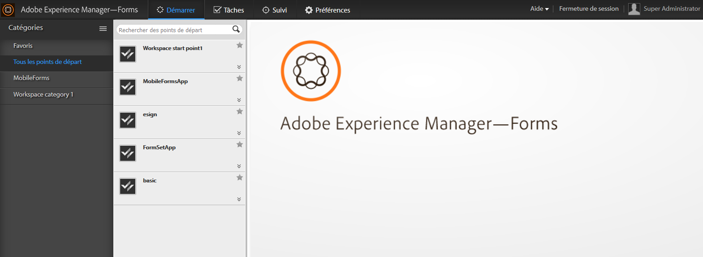

# Présentation de l’espace de travail AEM Forms{#introduction-to-aem-forms-workspace}

Le processus Forms améliore l’efficacité organisationnelle en automatisant et en fournissant une visibilité sur les processus métier critiques liés aux documents et aux formulaires. À l’aide du module Process Management, vous pouvez construire des workflows complets simplifiés incluant des personnes, des systèmes, du contenu et des règles de gestion. Le workflow Forms inclut l’espace de travail AEM Forms. L’espace de travail AEM Forms ajoute de nouvelles fonctionnalités pour étendre et intégrer l’espace de travail et le rendre plus convivial.

L’espace de travail AEM Forms est compatible avec davantage d’appareils et de facteurs de formulaire. Il permet la gestion des tâches sur les clients sans Flash® lecteur et Adobe® Reader®. Il facilite le rendu de Forms de HTML en plus des PDF forms.

**Fonctionnalités essentielles** :

* Impliquez les participants aux processus partout avec des PDF forms dynamiques, des interfaces mobiles et des applications web.
* Intégrez facilement les composants de l’espace de travail à vos applications web. Étant donné que l’espace de travail AEM Forms est un logiciel basé sur des composants, il peut être facilement personnalisé et réutilisé.
* Étendez les processus d’entreprise aux travailleurs mobiles en ligne et hors ligne avec l’application d’espace de travail AEM Forms.
* Affichez les rapports pour contrôler les retards, les files d’attente de travaux et les indicateurs de performances clés (KPI). Vous pouvez utiliser des API pour extraire des données en vue d’une analyse plus approfondie à l’aide d’outils de création de rapports tiers.
