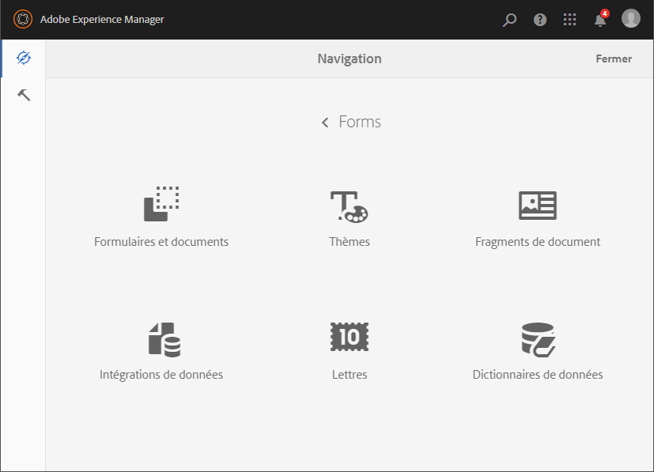
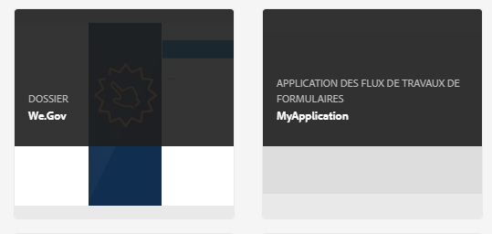

# Présentation de la gestion des formulaires {#introduction-to-managing-forms}

AEM [!DNL Forms] offre une interface utilisateur simplifiée mais puissante pour créer et gérer des formulaires, des documents, des thèmes, des lettres, des fragments de document, des dictionnaires de données et des ressources connexes. Cela leur permet de gérer le cycle de vie complet des formulaires, des documents et des ressources associées, depuis le bureau du développeur jusqu’à sa publication sur un serveur de portail pour les utilisateurs finaux. Vous pouvez utiliser l&#39;interface utilisateur AEM [!DNL Forms] pour :

* Accéder aux composants [!DNL Forms] AEM
* Accéder aux configurations AEM [!DNL Forms]

>[!NOTE]
>
>Pour plus d’informations sur les autres outils et options AEM, voir [Création](/help/sites-authoring/author.md).

## Accéder aux composants AEM Forms {#access-aem-forms-components}

Outre des options permettant de créer des formulaires, des documents et des ressources associées, AEM fournit des options qui permettent de créer des sites, des ressources, de gérer une instance AEM, etc. Vous pouvez cliquer sur le logo du Experience Manager  pour accéder à tous les outils disponibles. Outre des liens donnant accès aux consoles d’autres composants, il contient également des liens pour AEM [!DNL Forms]. Pour accéder à AEM [!DNL Forms], cliquez sur le logo du Experience Manager  > navigation  > **[!UICONTROL Forms]**. Les liens des consoles suivantes sont affichés :

* Formulaires et documents
* Thèmes
* Lettres
* Fragments de document
* Dictionnaires de données

   

### Formulaires et documents  {#forms-documents}

Formulaires et documents fournit des options permettant de créer une communication interactive, un formulaire adaptatif, un fragment de formulaire adaptatif et un ensemble de formulaires. Uniquement pour l’AEM [!DNL Forms] sur JEE, Forms &amp; Documents offre une option permettant d’importer des fichiers à partir d’un enregistrement local et de synchroniser AEM ressources [!DNL Forms] avec Workbench.

Le bouton de création est le point de départ du processus de création ou de téléchargement d’AEM [!DNL Forms] fichier. Vous disposez des options de création suivantes :

* **Communication** interactive : Une communication interactive est une correspondance, un relevé ou un document numérique HTML personnalisé, interactif et compatible avec les périphériques. Réactives par nature, les communications interactives modifient automatiquement leur mise en forme et leur conception en fonction du périphérique et des paramètres de l’utilisateur. Pour en savoir plus, consultez la section [Aperçu des communications interactives](/help/forms/using/interactive-communications-overview.md)

* **Formulaire adaptatif :** un formulaire adaptatif est un formulaire engageant et réactif. Vous pouvez créer un formulaire adaptatif pour l’adapter de manière dynamique aux entrées utilisateur en ajoutant ou en supprimant des sections de formulaire en fonction de la réponse de l’utilisateur, du périphérique ou de l’environnement de travail. L’article [Introduction à la création de formulaires adaptatifs](../../forms/using/introduction-forms-authoring.md) fournit plus d’informations sur les formulaires adaptatifs.

* **Fragment de formulaire adaptatif :** bien que chaque formulaire soit conçu pour un rôle spécifique, certains segments sont communs à la plupart des formulaires, comme les informations personnelles telles que le nom et l’adresse, les informations relatives à la famille et aux revenus, etc. Vous pouvez créer un actif pour les sections de ce type.  Ces segments réutilisables et autonomes sont appelés fragments de formulaire adaptatif. Pour plus de détails, l’article relatif aux [fragments de formulaire adaptatif](../../forms/using/adaptive-form-fragments.md).

* **Jeu de formulaires :** un jeu de formulaires est un assortiment de formulaires HTML5 regroupés et présentés aux utilisateurs finaux comme un ensemble unique de formulaires. Lorsque les utilisateurs finaux commencent à compléter un jeu de formulaires, les formulaires passent facilement d’un formulaire à l’autre. À la fin, un utilisateur peut envoyer tous les formulaires, en un seul clic, en tant qu’entité. Pour plus d’informations, voir [Jeu de formulaires dans AEM Forms](../../forms/using/formset-in-aem-forms.md).

* **Dossier :**[!DNL Forms]l’interface utilisateur d’AEM utilise des dossiers pour classer les ressources. Elle prend en charge deux types de dossiers :

   * **Dossier Général :**[!DNL Forms]ces fichiers sont utilisés pour les ressources créées dans l’interface utilisateur AEM  Ces dossiers n’ont pas de structure de dossiers stricte. Vous pouvez renommer, créer des sous-dossiers et stocker des formulaires adaptatifs, des communications interactives, des fragments de formulaire adaptatif, des modèles de formulaire (XDP), des formulaires PDF, des documents et les ressources associées dans ces dossiers.
   * **Dossiers de processus de formulaires**[!DNL Forms] : ces dossiers sont créés lorsque des processus Workbench (archives LiveCycle) sont migrés et synchronisés avec l’interface utilisateur d’AEM  Il est interdit de renommer, de créer un sous-dossier, de créer une communication interactive ou un fragment de formulaire adaptatif. Il n’est pas non plus autorisé de supprimer un dossier de version ou de créer et de télécharger un formulaire adaptatif, un fragment de formulaire adaptatif ou une communication interactive en parallèle du dossier de version.

   

   **Dossier A.** General,  **B.** Forms Workflow

Le panneau Formulaires et document fournit également des options pour effectuer les actions suivantes :

* **importer des fichiers à partir du stockage local :** vous pouvez importer des formulaires et des documents PDF, des modèles de formulaire (formulaires XFA) et d’autre ressources (schéma image et XML pour les fichiers XSD). Pour des instructions détaillées, voir [Importation et exportation des ressources dans AEM Forms](../../forms/using/import-export-forms-templates.md).
* **synchroniser les ressources AEM Forms avec Workbench :** vous pouvez utiliser l’option Fichiers de Workbench pour synchroniser les ressources entre l’interface utilisateur d’AEM Forms et Workbench. Il s’assure que tous les actifs sont disponibles dans l’interface utilisateur AEM [!DNL Forms] et que Workbench sélectionne les actifs crx-repository.

### Thèmes  {#themes}

Un thème contient des détails de style pour les composants et les panneaux. Les thèmes possèdent une identité indépendante. Ainsi, vous pouvez réutiliser un thème dans plusieurs formulaires adaptatifs. Vous pouvez définir des styles pour un composant ou modifier les propriétés CSS des différents composants utilisés dans l’ensemble de vos formulaires. Ces styles incluent les propriétés telles que les couleurs d’arrière-plan, les couleurs d’état, la transparence et la taille. Vous pouvez enregistrer les personnalisations dans un thème et les déplacer sur les composants de votre formulaire sous la forme d’un paramètre prédéfini. Lorsque vous ajoutez un thème à votre formulaire, le style spécifié se reflète sur des composants correspondants de votre formulaire. Avec AEM 6.2 [!DNL Forms], vous pouvez créer des thèmes et les appliquer à vos formulaires.

Pour plus d’informations sur la création et l’utilisation des thèmes, voir [Thèmes dans AEM Forms](../../forms/using/themes.md).

### Lettres  {#letters}

Une lettre [!DNL Forms] AEM est une correspondance sécurisée, personnalisée et interactive. Vous pouvez utiliser AEM [!DNL Forms] pour assembler rapidement des lettres (également appelées correspondances) à partir de contenu préapprouvé et personnalisé dans le cadre d’un processus simplifié.

Pour plus d’informations sur la création et l’utilisation de lettres, voir [Créer une lettre](../../forms/using/create-letter.md).

### Fragments de document {#document-fragments}

Les fragments de document sont des éléments ou composants réutilisables d’une correspondance qui permettent de composer des lettres. Les fragments de document sont des fragments de texte, liste, condition et mise en forme. Pour plus d’informations sur la création et l’utilisation de fragments de document, voir [Créer des fragments de document](/help/forms/using/document-fragments.md).

### Dictionnaires de données {#data-dictionaries}

En règle générale, les utilisateurs professionnels n’ont pas besoin de connaître les représentations de métadonnées telles que le schéma XSD (schéma XML) et les classes Java. Cependant, ils ont le plus souvent besoin de l’accès à ces structures de données et à leurs attributs dans le but de créer des solutions. AEM [!DNL Forms] utilise un dictionnaire de données qui permet aux utilisateurs professionnels d’utiliser des informations provenant de sources de données dorsales sans connaître les détails techniques de leurs modèles de données sous-jacents.

Pour plus d’informations sur la création et l’utilisation de dictionnaires de données, voir l’article [Créer un dictionnaire de données](../../forms/using/data-dictionary.md).

## Accès à AEM [!DNL Forms] Configurations {#accessing-aem-forms-configurations}

Le panneau d’outils AEM contient des outils pour divers composants. Pour accéder aux outils spécifiques à AEM Forms, cliquez sur le logo du Experience Manager  > outils  > **[!UICONTROL Forms]**. Les outils affichés permettent d’effectuer les opérations suivantes :

* **Configurer le dossier de contrôle :** un administrateur peut configurer un dossier réseau, appelé dossier de contrôle, de sorte que lorsqu’un utilisateur y place un fichier (par exemple un fichier PDF), une opération pré-configurée est lancée et manipule le fichier. Pour de plus amples informations, voir [Créer et configurer un dossier de contrôle](/help/forms/using/creating-configure-watched-folder.md).
* **Configuration du service hors ligne de l’application Forms :** le service hors ligne de l’ [!DNL Forms] application AEM met en cache les chemins ou les URL des ressources utilisées dans un formulaire. La mise en cache des chemins ou des URL des ressources utilisées dans un formulaire améliore les performances côté serveur. Pour configurer le composant hors ligne côté serveur de l’application AEM Forms, voir [Utilisation en mode hors ligne](/help/forms/using/work-offline-mode.md).

   

* **Configurer PDF Generator :**[!DNL Forms] un administrateur peut configurer les paramètres PDF AEM , ajouter des comptes utilisateur, et importer ou exporter la configuration dans PDF Generator.
* **Publier les actifs de gestion de correspondance :**[!DNL Forms] AEM  permet de publier l’ensemble des lettres, des fragments de document et des dictionnaires de données et les dépendances associées d’une instance d’auteur simultanément. Les éléments publiés comportent tous les actifs de Correspondence Management et dépendances connexes. Pour plus d’informations, voir [Publication et annulation de publication de formulaires et de documents](../../forms/using/publishing-unpublishing-forms.md#publishallthecorrespondencemanagementassets).
* **Exporter les actifs de gestion de correspondance :**[!DNL Forms] vous pouvez télécharger tous les actifs Correspondence Management et les dépendances connexes sous la forme d’un package depuis une instance AEM  Pour la procédure détaillée, voir [Importation et exportation des actifs dans AEM Forms](../../forms/using/import-export-forms-templates.md#importandexportassetsincorrespondencemanagement)

## Éléments courants de l’interface utilisateur {#commonelements}

* **Rail de gauche :** vous pouvez cliquer sur l’icône de rail de gauche   rail ftpngpour afficher les fonctionnalités Chronologie et Références de l’AEM  [!DNL Forms].

   * **Montage :** vous pouvez ajouter et afficher un commentaire sur un actif qui est disponible à des fins d’examen dans le montage. Pour des instructions détaillées, voir [Création et gestion de révisions des actifs d’un formulaire](../../forms/using/create-reviews-forms.md).
   * **Références :**[!DNL Forms] un actif AEM peut être utilisé dans plusieurs actifs AEM [!DNL Forms] Par exemple, un fragment de document peut être utilisé dans plusieurs lettres. Les références sont une liste des actifs (d’autres formulaires ou ressources) dans lesquels l’actif sélectionné est utilisé et également la liste des autres actifs que l’actif sélectionné utilise.

* **Chemins de navigation :** un chemin de navigation représente le titre de la console ou du dossier actif. Vous pouvez cliquer sur l’option Chemin de navigation pour naviguer entre le niveau des dossiers qui sont plus élevés dans la hiérarchie.
* **Navigateur de vues :** vous pouvez cliquer sur l’icône de permutation de Vues   de la visionneuse de liste   de visionneuses pour basculer rapidement entre la liste et la vue de cartes. Pour plus d’informations sur les composants d’interface utilisateur courants, voir [Création](/help/sites-authoring/author.md).
* **Recherche :** l&#39;option de recherche   recherche permet de rechercher rapidement le contenu et les outils dont vous avez besoin et d&#39;y accéder. Tapez le nom du contenu ou de la fonctionnalité du produit et sélectionnez une option parmi les suggestions, par exemple, tapez &quot;Documents&quot; pour rechercher rapidement **[!UICONTROL Forms &amp; Documents]** ou la console Fragments de Document. Pour plus de détails sur la recherche, voir l’article sur la [recherche](/help/sites-authoring/search.md) AEM 6.2.

* **Barre d’outils Actions** : lors de la sélection d’un actif, la barre d’outils des actions s’affiche au-dessus de la liste des actifs. Elle contient tous les outils de gestion pour l’actif sélectionné. Vous pouvez placer votre curseur sur l’icône d’outil pour afficher l’info-bulle qui en décrit la fonctionnalité

>[!NOTE]
>
>Lorsqu’un utilisateur effectue une recherche dans l’une des consoles Formulaires et documents, le rail contient uniquement **Filtres et options**. Vous pouvez utiliser Filtres et options pour effectuer une recherche avancée.

* **Barre d’outils Actions** : lors de la sélection d’un actif, la barre d’outils des actions s’affiche au-dessus de la liste des actifs. Elle contient tous les outils de gestion pour l’actif sélectionné. Vous pouvez placer votre curseur sur l’icône d’outil pour afficher l’info-bulle qui en décrit la fonctionnalité

   

   Barre d’outils Action pour un formulaire adaptatif.
