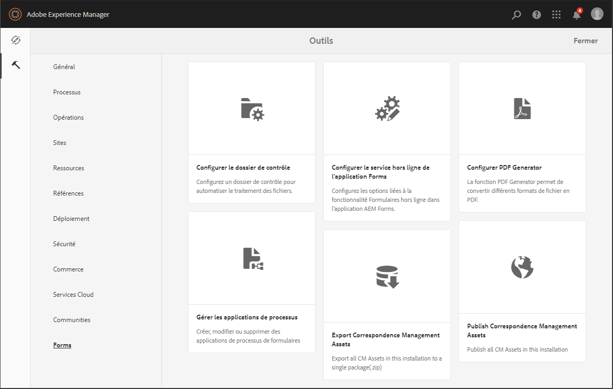

# Présentation de la gestion des formulaires {#introduction-to-managing-forms}

AEM [!DNL Forms] fournit une interface utilisateur simplifiée et puissante pour créer et gérer des formulaires, des documents, des thèmes, des lettres, des fragments de document, des dictionnaires de données et des ressources associées. Cela leur permet de gérer le cycle de vie complet des formulaires, des documents et des ressources associées, depuis le bureau du développeur jusqu’à sa publication sur un serveur de portail pour les utilisateurs finaux. Vous pouvez utiliser l’interface utilisateur AEM [!DNL Forms] pour :

* Accéder aux composants AEM [!DNL Forms].
* Accéder aux configurations AEM [!DNL Forms].

>[!NOTE]
>
>Pour plus d’informations sur les autres outils et options d’AEM, voir [Création](/help/sites-authoring/author.md).

## Accéder aux composants AEM Forms {#access-aem-forms-components}

Outre les options permettant de créer des formulaires, des documents et des ressources connexes, AEM propose des options pour créer des sites, des ressources, gérer une instance AEM, etc. Vous pouvez cliquer sur le logo  Experience Manager pour accéder à tous les outils disponibles. Outre des liens donnant accès aux consoles d’autres composants, il contient également des liens pour AEM [!DNL Forms]. Pour accéder à AEM [!DNL Forms], cliquez sur le logo Experience Manager  > navigation  > **[!UICONTROL Forms]**. Les liens des consoles suivantes sont affichés :

* Formulaires et documents
* Thèmes
* Lettres
* Fragments de document
* Dictionnaires de données

  

### Formulaires et documents  {#forms-documents}

Formulaires et documents fournit des options pour créer une communication interactive, un formulaire adaptatif, un fragment de formulaire adaptatif et un jeu de formulaires. Exclusivement pour AEM [!DNL Forms] on JEE, Formulaires et documents propose une option permettant d’importer des fichiers du stockage local et de synchroniser les ressources AEM [!DNL Forms] avec Workbench.

Le bouton Créer est le point de départ du processus de création ou de chargement d’une ressource AEM [!DNL Forms]. Il permet de créer : 

* **Communication interactive** : une communication interactive est une correspondance, une déclaration ou un document numérique HTML personnalisé, interactif et bien adapté aux appareils. Réactives par nature, les communications interactives modifient automatiquement leur mise en page et leur conception en fonction du périphérique et des paramètres de l’utilisateur. Pour en savoir plus, consultez la section [Aperçu des communications interactives](/help/forms/using/interactive-communications-overview.md)

* **Formulaire adaptatif :** un formulaire adaptatif est un formulaire engageant et réactif. Vous pouvez en outre créer un formulaire adaptatif qui s’adapte dynamiquement aux entrées utilisateur en ajoutant ou en supprimant des sections de formulaire en fonction des réponses, des appareils et de l’environnement de travail des utilisateurs. L’article [Introduction à la création de formulaires adaptatifs](../../forms/using/introduction-forms-authoring.md) fournit plus d’informations sur les formulaires adaptatifs.

* **Fragment de formulaire adaptatif :** bien que chaque formulaire soit conçu pour un rôle spécifique, certains segments sont communs à la plupart des formulaires, comme les informations personnelles tels que le nom et l’adresse, les informations relatives à la famille et aux revenus, etc. Vous pouvez créer un actif pour les sections de ce type. Ces segments réutilisables et autonomes s’appellent des fragments de formulaire adaptatif. Pour plus de détails, l’article relatif aux [fragments de formulaire adaptatif](../../forms/using/adaptive-form-fragments.md).

* **Jeu de formulaires :** un jeu de formulaires est un ensemble de formulaires HTML5 regroupés et présentés aux utilisateurs et utilisatrices finaux sous la forme d’un jeu unique de formulaires. Lorsque les utilisateurs et utilisatrices finaux commencent à remplir un jeu de formulaires, le passage d’un formulaire à un autre est simple. À la fin, l’utilisateur peut envoyer tous les formulaires en un seul clic, sous forme d’entité unique. Pour plus d’informations, voir [Jeu de formulaires dans AEM Forms](../../forms/using/formset-in-aem-forms.md).

* **Dossier :** l’interface utilisateur d’AEM [!DNL Forms] utilise des dossiers pour classer les ressources. Elle prend en charge deux types de dossiers :

   * **Dossier Général :** ces fichiers sont utilisés pour les ressources créées dans l’interface utilisateur AEM [!DNL Forms] Ces dossiers n’ont pas de structure de dossiers stricte. Vous pouvez renommer, créer des sous-dossiers et stocker des formulaires adaptatifs, des communications interactives, des fragments de formulaire adaptatif, des modèles de formulaire (XDP), des formulaires PDF, des documents et les ressources associées dans ces dossiers.
   * **Dossiers de processus de formulaires** : ces dossiers sont créés lorsque des processus Workbench (archives LiveCycle) sont migrés et synchronisés avec l’interface utilisateur d’AEM [!DNL Forms] Il est interdit de renommer, de créer un sous-dossier, de créer une communication interactive ou un fragment de formulaire adaptatif. Il est interdit de supprimer un dossier de version ou de créer et charger un formulaire adaptatif, un fragment de formulaire adaptatif ou une communication interactive parallèlement au dossier de version.

  

  **A.** Dossier général **B.** Dossier Forms Workflow

Le panneau Formulaires et documents propose également des options pour effectuer les actions suivantes :

* **Importez des fichiers depuis le stockage local :** vous pouvez importer des formulaires et des documents PDF, des modèles de formulaire (formulaires XFA) et d’autres ressources (schémas d’image et XML pour les schémas XSD). Pour des instructions détaillées, voir [Importation et exportation des ressources dans AEM Forms](../../forms/using/import-export-forms-templates.md).
* **Synchronisation des ressources AEM Forms avec Workbench :** vous pouvez utiliser l’option Fichiers de Workbench pour synchroniser les ressources entre l’interface utilisateur d’AEM Forms et Workbench. Elle garantit que toutes les ressources sont disponibles dans AEM [!DNL Forms] l’interface utilisateur et la sélection de ressources crx-repository de Workbench.

### Thèmes  {#themes}

Un thème contient des détails de style pour les composants et les panneaux. Les thèmes ont une identité indépendante. Ainsi, vous pouvez réutiliser un thème sur plusieurs formulaires adaptatifs. Vous pouvez spécifier des styles pour un composant ou modifier les propriétés CSS pour différents composants utilisés dans vos formulaires. Ces styles incluent les propriétés telles que les couleurs d’arrière-plan, les couleurs d’état, la transparence, l’alignement et la taille. Vous pouvez enregistrer les personnalisations dans un thème et les déplacer sur les composants de votre formulaire sous la forme d&#39;un paramètre prédéfini. Lorsque vous appliquez un thème à votre formulaire, le style spécifié se reflète sur des composants correspondants de votre formulaire. Avec AEM 6.2 [!DNL Forms], vous pouvez créer des thèmes et les appliquer à vos formulaires.

Pour plus d’informations sur la création et l’utilisation des thèmes, voir [Thèmes dans AEM Forms](../../forms/using/themes.md).

### Lettres  {#letters}

Une lettre AEM [!DNL Forms] est une correspondance sécurisée, personnalisée et interactive. AEM [!DNL Forms] vous permet d’assembler rapidement des lettres (également appelées correspondances) à partir de contenu prévalidé et personnalisé dans le cadre d’un processus simplifié.

Pour plus d’informations sur la création et l’utilisation de lettres, voir [Créer une lettre](../../forms/using/create-letter.md).

### Fragments de document {#document-fragments}

Les fragments de document sont des éléments ou composants réutilisables d’une correspondance qui permettent de composer des lettres. Les fragments de document sont de type texte, liste, condition et fragment de disposition. Pour plus d’informations sur la création et l’utilisation de fragments de document, voir [création de fragments de document](/help/forms/using/document-fragments.md).

### Dictionnaires de données {#data-dictionaries}

En règle générale, les utilisateurs et utilisatrices professionnelles n’ont pas besoin de connaître les représentations de métadonnées telles que le schéma XSD (schéma XML) et les classes Java. Cependant, ils ont le plus souvent besoin de l’accès à ces structures de données et à leurs attributs dans le but de créer des solutions. AEM [!DNL Forms] utilise un dictionnaire de données permet aux utilisateurs professionnels d’utiliser des informations provenant de sources de données en arrière-plan sans connaître les détails techniques de leurs modèles de données sous-jacents.

Pour plus d’informations sur la création et l’utilisation de dictionnaires de données, voir l’article [Créer un dictionnaire de données](../../forms/using/data-dictionary.md).

## Accéder aux configurations AEM [!DNL Forms] {#accessing-aem-forms-configurations}

Le panneau d’outils AEM contient des outils pour divers composants. Pour accéder aux outils spécifiques à AEM Forms, cliquez sur le logo Experience Manager  > outils  > **[!UICONTROL Forms]**. Les outils permettant d’exécuter les fonctions suivantes s’affichent :

* **Configurer le dossier de contrôle :** un administrateur ou une administratrice peut configurer un dossier réseau, appelé dossier de contrôle, de sorte que lorsqu’une personne y place un fichier (par exemple un fichier PDF), une opération préconfigurée est lancée et manipule le fichier. Pour de plus amples informations, voir [Créer et configurer un dossier de contrôle](/help/forms/using/creating-configure-watched-folder.md).
* **Configurer le service hors ligne de l’application :** le service AEM [!DNL Forms] hors ligne de l’application met en cache les chemins ou les URL des ressources utilisées dans un formulaire. La mise en cache des chemins ou des URL des ressources utilisées dans un formulaire améliore les performances côté serveur. Pour configurer le composant hors ligne côté serveur de l’application AEM Forms, voir [Travailler en mode hors ligne](/help/forms/using/work-offline-mode.md).

  

* **Configurer PDF Generator** : un administrateur ou une administratrice peut configurer les paramètres PDF AEM [!DNL Forms], ajouter des comptes d’utilisateurs, et importer ou exporter la configuration dans PDF Generator.
* **Publier les actifs de gestion de correspondance :** AEM [!DNL Forms] permet de publier l’ensemble des lettres, des fragments de document et des dictionnaires de données et les dépendances associées d’une instance d’auteur simultanément. Les éléments publiés comportent tous les éléments de Correspondence Management et dépendances connexes. Pour plus d’informations, voir [Publier et dépublier des formulaires et des documents](../../forms/using/publishing-unpublishing-forms.md#publishallthecorrespondencemanagementassets).
* **Exporter les actifs de gestion de correspondance :** vous pouvez télécharger tous les actifs Correspondence Management et les dépendances connexes sous la forme d’un package depuis une instance AEM [!DNL Forms] Pour la procédure détaillée, voir [Importation et exportation des actifs dans AEM Forms](../../forms/using/import-export-forms-templates.md#importandexportassetsincorrespondencemanagement)

## Éléments courants de l’interface utilisateur {#commonelements}

* **Icône de rail de gauche :** vous pouvez cliquer sur l’icône de rail gauche  afin d’afficher les fonctionnalités de montage et de références d’AEM [!DNL Forms].

   * **Montage :** vous pouvez ajouter et afficher un commentaire sur un actif qui est disponible à des fins d’examen dans le montage. Pour des instructions détaillées, voir [Création et gestion de révisions des actifs d’un formulaire](../../forms/using/create-reviews-forms.md).
   * **Références :**  un actif AEM [!DNL Forms] peut être utilisé dans plusieurs actifs AEM [!DNL Forms] Par exemple, un fragment de document peut être utilisé dans plusieurs lettres. Les références sont une liste des actifs (d’autres formulaires ou ressources) dans lesquels l’actif sélectionné est utilisé et également la liste des autres actifs que l’actif sélectionné utilise.

* **Chemin de navigation :** un chemin de navigation représente le titre de la console active ou du dossier actif. Vous pouvez cliquer sur l’option Chemin de navigation pour naviguer entre les niveaux de dossiers supérieurs dans la hiérarchie.
* **Sélecteur d’affichage :** vous pouvez cliquer sur l’icône du sélecteur d’affichage  ou  pour passer rapidement d’un affichage sous forme de liste et à un affichage sous forme de carte. Pour plus d’informations sur les composants communs de l’interface utilisateur, consultez la section [Création](/help/sites-authoring/author.md).
* **Rechercher :** l’option de recherche  permet de rechercher le contenu et les outils dont vous avez besoin et d’y accéder rapidement. Saisissez le nom de la fonctionnalité de contenu ou de produit, puis sélectionnez l’une des suggestions. Par exemple, saisissez « Documents » pour rechercher et accéder rapidement à la console **[!UICONTROL Formes et documents]** ou Fragments de document. Pour plus de détails sur la recherche, voir l’article sur la [recherche](/help/sites-authoring/search.md) AEM 6.2.

* **Barre d’outils Actions** : lors de la sélection d’une ressource, la barre d’outils des actions s’affiche au-dessus de la liste des ressources. Elle contient tous les outils de gestion pour la ressource sélectionnée. Vous pouvez placer votre curseur sur l’icône d’outil pour afficher l’info-bulle qui en décrit la fonctionnalité

>[!NOTE]
>
>Lorsqu’un utilisateur ou une utilisatrice effectue une recherche dans n’importe quelle console Formulaires et documents, le rail contient uniquement **Filtres et options**. Vous pouvez utiliser Filtres et options pour effectuer une recherche avancée.

* **Barre d’outils Actions** : lors de la sélection d’une ressource, la barre d’outils des actions s’affiche au-dessus de la liste des ressources. Elle contient tous les outils de gestion pour la ressource sélectionnée. Vous pouvez placer votre curseur sur l’icône d’outil pour afficher l’info-bulle qui en décrit la fonctionnalité

  

  Barre d’outils Action pour un formulaire adaptatif.
