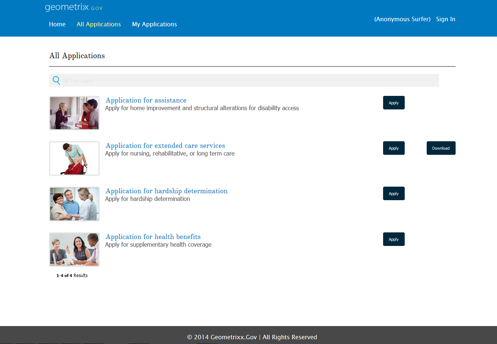

# Présentation de la publication de formulaires sur un portail{#introduction-to-publishing-forms-on-a-portal}

| Version | Lien de l’article |
| -------- | ---------------------------- |
| AEM as a Cloud Service | [Cliquez ici](https://experienceleague.adobe.com/docs/experience-manager-cloud-service/content/forms/adaptive-forms-authoring/authoring-adaptive-forms-foundation-components/configure-forms-portal.html) |
| AEM 6.5 | Cet article |

## Présentation des composants du portail AEM Forms {#aem-forms-portal-components-overview}

Dans un scénario de déploiement de portail basé sur l’utilisation de formulaires standard, le développement de formulaires et le développement de portail sont deux activités distinctes. Pendant que les concepteurs de formulaires créent et stockent des formulaires dans un référentiel, les développeurs Web créent une application Web pour répertorier les formulaires et gérer l’envoi de formulaires. Forms est copié sur la plateforme web, car il n’existe aucune communication entre le référentiel de formulaires et l’application web.

De tels scénarios entraînent souvent des problèmes de gestion et des retards de production. Par exemple, si une version plus récente d’un formulaire est disponible dans le référentiel, vous devez remplacer le formulaire sur la plateforme web, modifier l’application web et redéployer le formulaire sur le site public. Le redéploiement de l’application web peut entraîner un temps d’arrêt du serveur. En règle générale, le temps d’arrêt du serveur est une activité planifiée et les modifications ne peuvent donc pas être transmises instantanément au site public.

AEM Forms fournit des composants de portail qui réduisent les frais de gestion et les délais de production. Les composants permettent aux développeurs Web de créer et de personnaliser un portail Formulaires sur les sites Web créés à l’aide d’Adobe Experience Manager (AEM).

Les composants de Forms Portal permettent d’ajouter les fonctionnalités suivantes :

* Créez une liste de formulaires dans des mises en page personnalisées. Mises en page de vues Liste, Carte et Panneau prêtes à l’emploi. Vous pouvez créer vos propres mises en page personnalisées.
* Permet d’afficher des métadonnées et des actions personnalisées lors de leur mise en liste.
* Créez des listes de formulaires publiés par l’interface utilisateur d’AEM Forms sur l’instance de publication où sont utilisés les composants du portail Formulaires.
* Autorisez les utilisateurs finaux à afficher les formulaires aux formats HTML et PDF.
* Utilisation d’un profil HTML personnalisé pour le rendu des formulaires.
* Activation de la recherche de formulaires en fonction de différents critères, tels que les propriétés, les métadonnées et les balises du formulaire.
* Envoi de données de formulaire vers une servlet.
* Utilisation de feuilles CSS pour la personnalisation de l’apparence du portail.
* Création de liens vers des formulaires.
* Répertorie les brouillons et les envois liés au formulaire adaptatif créé par l’utilisateur final.

## Composants AEM Forms Portal disponibles {#available-aem-forms-portal-components}

AEM Forms fournit les composants de portail suivants prêts à l’emploi, regroupés sous **Document Services** et **Prédicats de services de document** groupes de composants :

### Search &amp; Lister {#search-amp-lister}

Le composant Search &amp; Lister vous permet de répertorier les formulaires du référentiel de formulaires sur votre page de portail et fournit des options de configuration pour répertorier les formulaires selon des critères spécifiés. Il vous permet également de spécifier des critères de recherche pour permettre aux utilisateurs de votre portail de rechercher dans la liste des formulaires.

### Brouillons et soumissions {#drafts-amp-submissions}

Tandis que le composant Search &amp; Lister affiche les formulaires rendus publics par l’auteur Forms, le composant Drafts &amp; Submissions (Brouillons et envois) affiche les formulaires enregistrés en tant que brouillons en vue de les compléter ultérieurement et les formulaires envoyés. Ce composant fournit une expérience personnalisée à tout utilisateur connecté.

### Lien {#link}

Le composant Lien permet de créer un lien vers un formulaire n’importe où sur la page. Supposons que vous proposiez un programme de formation et que vous souhaitiez que vos utilisateurs envoient un formulaire pour s’inscrire à la formation. Sur votre site web, vous avez publié les détails du programme. Vous trouverez ci-dessous les détails du formulaire d&#39;inscription. Le composant Lien peut vous aider à créer ce lien.

## Workflow du portail Formulaires {#forms-portal-workflow}

Forms Portal vous permet de répertorier les formulaires du référentiel de formulaires sur votre page de portail. Il vous permet également de spécifier des critères de recherche pour permettre aux utilisateurs de votre portail de rechercher dans la liste des formulaires. Vous pouvez également utiliser le composant Brouillons et envois pour afficher les formulaires enregistrés en tant que brouillon en vue de les remplir ultérieurement et de formulaires envoyés. Vous effectuez un certain ensemble d’opérations avant que ces fonctionnalités ne soient disponibles sur une page Sites. Suivez les étapes de la séquence répertoriée pour rendre les composants et les fonctionnalités correspondantes disponibles sur une page de Sites :

1. **Activation des composants du portail Forms**: les composants Forms Portal prêts à l’emploi ne sont pas disponibles. [Activez les composants depuis AEM sidekick](/help/forms/using/enabling-forms-portal-components.md) pour une page AEM Sites.
1. **Répertorier les formulaires sur une page (créer une page du portail Forms) :** Vous pouvez répertorier les formulaires sur les pages AEM Sites et non AEM Site. La liste contient les formulaires disponibles sur l’instance de publication. Un utilisateur peut ouvrir des formulaires et commencer à les remplir. Chaque fois qu’un utilisateur ouvre un formulaire, une nouvelle instance de formulaire est créée :

   1. **Répertorier les formulaires sur une page AEM Sites** : ajoutez le composant **[Search &amp; Lister](../../forms/using/creating-form-portal-page.md)** à la page et configurez le **[Volet Liste](../../forms/using/creating-form-portal-page.md#p-list-pane-p)** dans la page pour répertorier les formulaires y contenus. Ajoutez et configurez le composant **Volet Recherche** au composant **Search &amp; Lister** pour ajouter également la fonctionnalité de recherche à la page. La page avec le composant Forms Portal est appelée [Page du portail Forms](../../forms/using/creating-form-portal-page.md).

   1. **Répertorier les formulaires sur une page non AEM Sites :** Utilisez la variable [API de recherche du portail Forms](/help/forms/using/listing-forms-webpage-using-apis.md) pour interroger, récupérer et répertorier des formulaires sur des pages non AEM Sites.

1. **Répertorier les formulaires sous forme de brouillons et envoyés sur une page Forms Portal**: ajoutez et configurez le composant Drafts &amp; Submissions (Brouillons et envois) sur la page du portail Forms. Le composant dresse la liste de tous les formulaires qui sont à l’état de brouillon et des formulaires déjà envoyés.

   Pour activer l’affichage d’un formulaire adaptatif envoyé dans l’onglet des envois, définissez **Action d’envoi** sur **[Action d’envoi du portail Formulaires](configuring-submit-actions.md).** Vous pouvez également activer l’option Envoyer du portail Formulaires. Lorsqu’un utilisateur envoie un formulaire, ce dernier est ajouté à l’onglet des envois.

1. **Configurez le stockage pour les données de brouillons de formulaires et formulaires envoyés :** par défaut, les données des brouillons et des envois sont stockées dans le référentiel AEM. Dans un environnement de production, il est recommandé de ne pas stocker des données de formulaire de brouillon ou envoyées dans le référentiel AEM. [Configuration du composant Portail Forms pour l’enregistrement de données à un emplacement sécurisé](../../forms/using/draft-submission-component.md#customizing-the-storage).
1. **(Facultatif) Personnalisation des composants du portail Forms :** [Personnalisation des modèles de page du portail Forms](../../forms/using/customizing-templates-forms-portal-components.md) pour donner un aspect distinctif aux composants.
1. **(Facultatif) Ajouter des métadonnées personnalisées aux formulaires :** [ajoutez des métadonnées personnalisées aux formulaires](../../forms/using/customizing-templates-forms-portal-components.md) pour améliorer l’expérience de recherche et de mise en liste.
1. **Publiez la page du portail Forms :** Votre page Forms Portal est maintenant prête. Publiez la page.

## Articles connexes {#related-articles}

* [Activer des composants Portail Formulaires](/help/forms/using/enabling-forms-portal-components.md)
* [Page Créer un portail Forms](../../forms/using/creating-form-portal-page.md)
* [Affichage de la liste des formulaires sur une page Web à l’aide d’API](/help/forms/using/listing-forms-webpage-using-apis.md)
* [Utiliser le composant Brouillons et Envois](../../forms/using/draft-submission-component.md)
* [Personnaliser le stockage des brouillons de formulaires et des formulaires envoyés](../../forms/using/draft-submission-component.md#customizing-the-storage)
* [Exemple d’intégration d’un composant brouillons &amp; envois à la base de données](integrate-draft-submission-database.md)
* [Personnalisation de modèles pour les composants Forms Portal](../../forms/using/customizing-templates-forms-portal-components.md)
* [Présentation de la publication de formulaires sur un portail](../../forms/using/introduction-publishing-forms.md)
