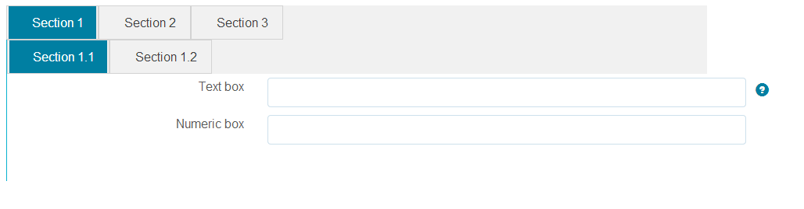
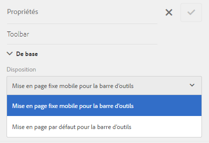

# Fonctionnalités de disposition des formulaires adaptatifs{#layout-capabilities-of-adaptive-forms}

Adobe Experience Manager (AEM) vous permet de créer des formulaires adaptatifs simples d’emploi qui offrent des expériences dynamiques aux utilisateurs finaux. La disposition détermine l’affichage des ressources et composants sur un formulaire adaptatif.

## Connaissances préalables {#prerequisite-knowledge}

Avant de découvrir les différentes fonctionnalités de disposition des formulaires adaptatifs, consultez les articles suivants pour en savoir plus sur les formulaires de ce type.

[Présentation d’AEM Forms](../../forms/using/introduction-aem-forms.md)

[Présentation de la création de formulaires](../../forms/using/introduction-forms-authoring.md)

## Types de disposition {#types-of-layouts}

Un formulaire adaptatif vous propose les types de disposition suivants :

**Disposition de panneau** : contrôle l’affichage des éléments ou des composants d’un panneau sur un appareil.

**Disposition mobile** : contrôle la navigation d’un formulaire sur un appareil mobile. Si la largeur de l’écran d’un périphérique est supérieure ou égale à 768 pixels, la disposition est considérée comme étant adaptée à un appareil mobile et optimisée en conséquence.

**Disposition de barre d’outils** : contrôle le positionnement des boutons d’action dans la barre d’outils ou la barre d’outils du panneau d’un formulaire.

Toutes ces dispositions de panneau sont définies à l’emplacement suivant :

`/libs/fd/af/layouts`.

>[!NOTE]
>
>Pour modifier la disposition d’un formulaire adaptatif, utilisez le mode de création dans AEM.


## Disposition de panneau {#panel-layout}

Un auteur de formulaire peut associer une disposition à chaque panneau d’un formulaire adaptatif, y compris le panneau racine.

Les dispositions de panneau sont disponibles à l’emplacement `/libs/fd/af/layouts/panel`suivant.


Liste des dispositions de panneau dans des formulaires adaptatifs

### Réactif : tout sur une page sans navigation {#responsive-everything-on-one-page-without-navigation-br}

Utilisez cette disposition de panneau pour créer une disposition réactive, qui s’adapte à la taille d’écran de votre appareil sans avoir à recourir à une navigation spécialisée.

Cette disposition vous permet de placer plusieurs **[!UICONTROL composants de formulaire adaptatif de panneau]** l’un après l’autre dans le panneau.


Formulaire avec disposition réactive, tel qu’il est affiché sur un petit écran


Formulaire avec disposition réactive, tel qu’il est affiché sur un grand écran

### Assistant : création de formulaire en plusieurs étapes, une étape à la fois {#wizard-a-multi-step-form-showing-one-step-at-a-time}

Utilisez cette disposition de panneau pour proposer une navigation guidée dans un formulaire. Vous pouvez, par exemple, l’utiliser pour capturer des informations obligatoires dans un formulaire, tout en guidant les utilisateurs pas à pas.

Utilisez le composant `Panel adaptive form` pour fournir une navigation pas à pas dans un panneau. Lorsque vous utilisez cette disposition, l’utilisateur ne passe à l’étape suivante qu’après avoir terminé l’étape en cours.

```javascript
window.guideBridge.validate([], this.panel.navigationContext.currentItem.somExpression)
```


Expression de fin d’étape dans la disposition Assistant d’un formulaire à plusieurs étapes


Formulaire avec assistant

### Disposition de la conception en accordéon {#layout-for-accordion-design}

Cette disposition vous permet de placer le composant `Panel adaptive form` dans un panneau avec une navigation par style en accordéon. Cette disposition permet également de créer des panneaux reproductibles. Ces panneaux permettent d’ajouter ou de supprimer des panneaux de manière dynamique en fonction de vos besoins. Vous pouvez définir le nombre minimal et maximal de répétitions d’un panneau. Le titre du panneau peut également être déterminé de manière dynamique en fonction des informations fournies dans les éléments du panneau.

Une expression récapitulative peut être utilisée pour afficher les valeurs fournies par l’utilisateur final dans le titre du panneau réduit.


Panneaux reproductibles créés à l’aide de la disposition Accordéon

### Disposition avec onglets – Les onglets s’affichent à gauche {#tabbed-layout-tabs-appear-on-the-left}

Cette disposition vous permet de placer le composant `Panel adaptive form` dans un panneau avec une navigation par onglets. Les onglets sont placés à gauche du contenu du panneau.


Onglets affichés à gauche d’un panneau

### Disposition avec onglets – Les onglets s’affichent en haut {#tabbed-layout-tabs-appear-on-the-top}

Cette disposition vous permet de placer le composant `Panel adaptive form` dans un panneau avec une navigation par onglets. Les onglets sont placés au-dessus du contenu du panneau.



Onglets affichés dans la partie supérieure d’un panneau

## Dispositions pour appareils mobiles {#mobile-layouts}

Ces dispositions permettent de naviguer de manière conviviale sur les appareils mobiles équipés d’écrans relativement petits. Les styles Avec onglets ou Assistant sont utilisés pour naviguer dans les formulaires. L’application d’une telle disposition permet de bénéficier d’une disposition unique pour l’ensemble du formulaire.

Avec cette disposition, le contrôle de la navigation s’effectue à l’aide d’une barre de navigation et d’un menu de navigation. La barre de navigation affiche des icônes **&lt;** et **>** pour indiquer les étapes de navigation **suivante** et **précédente** dans le formulaire.

Les dispositions pour appareils mobiles sont disponibles à l’emplacement `/libs/fd/af/layouts/mobile/`. Par défaut, les dispositions pour appareils mobiles suivantes sont disponibles dans les formulaires adaptatifs.


Liste de dispositions pour appareils mobiles dans les formulaires adaptatifs

Lors de l’utilisation d’une disposition pour appareils mobiles, le menu de formulaire, pour accéder aux différents panneaux de formulaire, est disponible en appuyant sur l’icône .

### Disposition avec titres de panneau dans l’en-tête de formulaire {#layout-with-panel-titles-in-the-form-header}

Cette disposition, comme son nom l’indique, affiche les titres du panneau avec la barre et le menu de navigation. Les icônes Suivant et Précédent sont également disponibles à des fins de navigation.


Dispositions pour appareils mobiles avec affichage du titre du panneau dans les en-têtes de formulaire

### Disposition sans titres de panneau dans l’en-tête de formulaire {#layout-without-panel-titles-in-the-form-header}

Cette disposition, comme son nom l’indique, affiche uniquement le menu et la barre de navigation, sans les titres de panneau. Les icônes Suivant et Précédent sont également disponibles à des fins de navigation.


Dispositions pour appareils mobiles sans affichage du titre du panneau dans les en-têtes de formulaire

## Mises en page de barre d’outils {#toolbar-layouts}

Une disposition de barre d’outils contrôle le positionnement et l’affichage de tous les boutons d’action que vous ajoutez à vos formulaires adaptatifs. La disposition peut être ajoutée au niveau d’un formulaire ou d’un panneau.



Liste des dispositions de barre d’outils dans des formulaires adaptatifs

Les dispositions de barre d’outils sont disponibles à l’emplacement `/libs/fd/af/layouts/toolbar`. Les formulaires adaptatifs fournissent, par défaut, les dispositions de barre d’outils suivantes.

### Disposition par défaut pour la barre d’outils {#default-layout-for-toolbar}

Cette disposition est sélectionnée par défaut lorsque vous ajoutez des boutons d’action dans un formulaire adaptatif. Lorsque vous sélectionnez cette disposition, elle est affichée pour les appareils fixes (ordinateurs de bureau) et mobiles.

Vous pouvez, en outre, ajouter plusieurs barres d’outils contenant des boutons d’action configurés avec cette disposition. Un bouton d’action est associé à un contrôle de formulaire. Vous pouvez configurer les barres d’outils pour qu’elles apparaissent avant ou après le panneau.


Affichage par défaut de la barre d’outils

### Disposition fixe pour appareil mobile pour la barre d’outils {#mobile-fixed-layout-for-toolbar}

Sélectionnez cette disposition pour fournir des variantes d’affichage pour les ordinateurs de bureau et les appareils mobiles.

Dans le cas de la disposition pour ordinateur de bureau, vous pouvez ajouter des boutons d’action à l’aide de libellés spécifiques. Une seule barre d’outils peut être configurée avec cette disposition. Si plusieurs barres d’outils sont configurées avec cette disposition, elles se chevauchent dans le cas des appareils mobiles et une seule barre est visible. Il peut, par exemple, y avoir une barre d’outils dans la partie inférieure ou supérieure du formulaire ou encore avant ou après les panneaux du formulaire.

Dans le cas de la disposition pour appareils mobiles, vous pouvez ajouter des boutons d’action avec des icônes.


Disposition fixe pour appareil mobile pour la barre d’outils
