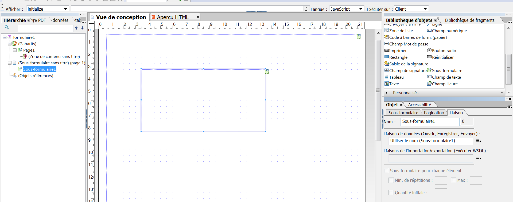
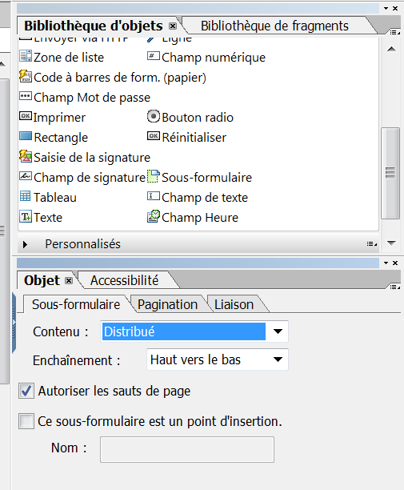
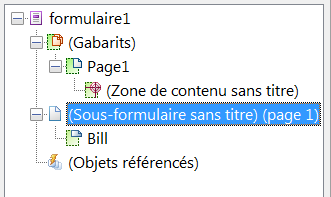
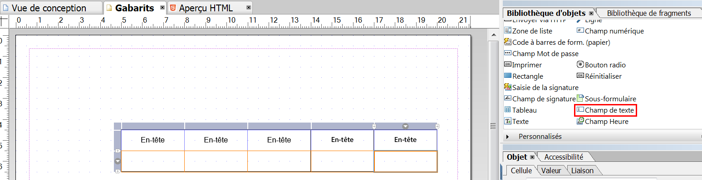

# Conception de la mise en page{#layout-design}

Les modèles de formulaire XFA ou XDP sont les modèles pour :

* [Lettres](/help/forms/using/create-letter.md)
* [Canal d’impression](/help/forms/using/web-channel-print-channel.md#printchannel) des [communications interactives](/help/forms/using/interactive-communications-overview.md)

* Fragments de disposition

Les XDP sont conçus dans Adobe Forms Designer. Cet article fournit des détails sur la manière de concevoir vos XDP pour créer des correspondances/communications interactives efficaces, notamment où utiliser les champs de formulaire ou les zones cibles et quand utiliser les fragments de disposition.

## Création d’une mise en page pour des lettres ou pour le canal d’impression des communications interactives {#creating-a-layout-for-letters-or-for-interactive-communications-print-channel}

Une mise en page définit l’apparence graphique d’une lettre ou d’un canal d’impression d’une communication interactive. La disposition peut comporter des champs de formulaire types comme « Adresse » et « Numéro de référence ». Elle contient également des sous-formulaires vides indiquant les zones cible. Créez la mise en page dans le concepteur de formulaires et une fois l’application terminée, le spécialiste de l’application la télécharge sur AEM serveur. De là, vous pouvez sélectionner la mise en page lors de la création d’un modèle de correspondance ou d’un canal d’impression d’une communication interactive.

Pour créer des mises en page pour les lettres/canal d’impression des communications interactives, procédez comme suit :

1. Analysez la mise en page et déterminez le contenu qui se répétera sur toutes les pages. Il s’agit en général de l’en-tête et du pied de page. Ce contenu est placé sur les gabarits de la mise en page. Le contenu restant va dans le corps des pages de la mise en page. Dans un douilleur de police, le logo et l’adresse de l’entreprise peuvent être ajoutés à l’en-tête et au pied de page du gabarit. Par exemple, l’avis d’annulation utilise la même disposition.
1. Lors de la conception des pages courantes, divisez le contenu des pages en sections. Chaque section est conçue comme un sous-formulaire intégré dans la mise en page ou comme une mise en page de fragment. Si la section contient un tableau, modélisez-la en tant que fragment de mise en page.
1. Une mise en page peut être conçue comme suit :

   1. Faites de chaque section un sous-formulaire distinct contenant tous les éléments de la section.
   1. Faites en sorte que chaque sous-formulaire de section soit enfant du même sous-formulaire parent. La disposition du sous-formulaire parent est définie pour s’enchaîner de manière à ce que les sections se déplacent vers le bas en cas de données fusionnées dans les sections précédentes.
   1. La section Résidence principale peut être réutilisée dans d’autres mises en page. Créez-la en tant que mise en page de fragment.
   1. La section Détails d’intérêt supplémentaires ne contient que deux éléments placés l’un au-dessous de l’autre, elle peut contenir des données volumineuses et est conçue comme une mise en page souple.
   1. Les autres sections contiennent des éléments à des positions spécifiques ; elles sont donc conçues comme des mises en page positionnées.
   1. Ventilez une section dans des sous-formulaires si la section contient des éléments à des positions spécifiques et si ces éléments contiennent de grandes quantités de données. Organisez ensuite les sous-formulaires pour obtenir le comportement souhaité.
   1. Pour la section Résidence principale, ajoutez une zone cible d’espace réservé. Cet espace réservé est lié à la résidence du Principal de fragment au moment de la conception de la lettre/communication interactive.
   1. Téléchargez la mise en page (et le fragment, le cas échéant, qui utilise la mise en page) sur le serveur AEM Forms.

### Utiliser un sous-formulaire dans un modèle XDP {#usesubformxdp}

Une fois que vous avez analysé la disposition requise pour créer votre communication interactive, vous pouvez créer des sous-formulaires dans le modèle XDP à l’aide de Forms Designer. Les composants de sous-formulaires vierges utilisés dans le modèle XDP génèrent l’affichage des zones cibles dans le canal d’impression de la communication interactive.

>[!NOTE]
>
>Ajoutez du contenu au canal d’impression de la communication interactive au lieu d’ajouter du contenu au composant de sous-formulaire dans le modèle XDP. Ajoutez du contenu aux zones cibles du canal d’impression en utilisant [des fragments de document, des graphiques, des images](create-interactive-communication.md#step2) et des fragments de disposition.

Effectuez les étapes suivantes pour utiliser un sous-formulaire dans un modèle XDP :

1. Ouvrez Forms Designer, puis sélectionnez **Fichier** > **Nouveau** > **Utiliser un formulaire vierge**, sélectionnez **Suivant**, puis sélectionnez **Terminer** pour ouvrir le formulaire à des fins de création de modèle.

   Assurez-vous que les options **Bibliothèque d’objets** et **Objet** sont sélectionnées dans le menu **Fenêtre**.

1. Faites glisser le composant **Sous-formulaire** de la **bibliothèque d’objets** vers le formulaire.

   

1. Sélectionnez le sous-formulaire pour afficher les options correspondantes dans la fenêtre **Objet** dans le volet de droite.
1. Sélectionnez l’onglet **Sous-formulaire** et sélectionnez **Distribué** dans la liste déroulante **Contenu**. Faites glisser le point d’entrée gauche du sous-formulaire pour ajuster la longueur.

   

1. Dans l’onglet **Liaison** :

   1. Nommer le sous-formulaire dans le champ **Nom**.
   1. Sélectionnez **Aucune liaison de données** dans la liste déroulante **Liaison de données**.

1. De même, sélectionnez le sous-formulaire racine dans le volet de gauche.

   

1. Sélectionnez l’onglet **Sous-formulaire** et sélectionnez **Distribué** dans la liste déroulante **Contenu**. Dans l’onglet **Liaisons** :

   1. Nommez le sous-formulaire dans le champ **Nom**.
   1. Sélectionnez **Aucune liaison de données** dans la liste déroulante **Liaison de données**.

   Répétez les étapes 2 à 5 pour ajouter d’autres sous-formulaires au modèle XDP. Ajoutez des [textes, fragments de document, images et graphiques](create-interactive-communication.md#step2) aux zones cible, uniquement lors de la création de la communication interactive.

1. Sélectionnez **Fichier** > **Enregistrer sous** pour enregistrer le fichier sur le système de fichiers local :

   1. Accédez à l’emplacement où enregistrer le fichier et nommer le modèle XDP.
   1. Sélectionnez **.xdp** dans la liste déroulante **Type**.

   1. Sélectionnez **Enregistrer**.

### Utiliser le composant Champ d’image dans un modèle XDP {#use-image-field-component-in-an-xdp-template}

Utilisez le composant Champ d’image ou Sous-formulaire dans le modèle XDP et ajoutez une image lors de la création de la communication interactive.

>[!NOTE]
>
>Ajoutez une image au canal d’impression de la communication interactive au lieu d’ajouter une image au composant Champ d’image ou Sous-formulaire du modèle XDP. Pour plus d’informations, voir [Ajouter du contenu à la communication interactive](../../forms/using/create-interactive-communication.md#step2).

Procédez comme suit pour utiliser le composant Champ d’image dans un modèle XDP :

1. Faites glisser et déposez le composant **Champ d’image** de la **bibliothèque d’objets** au formulaire.
1. Sélectionnez le sous-formulaire pour afficher les options correspondantes dans la fenêtre **Objet** dans le volet de droite.
1. Dans l’onglet **Liaison** :

   1. Nommez le champ d’image dans le champ **Nom**.
   1. Sélectionnez **Aucune liaison de données** dans la liste déroulante **Liaison de données**.

### Créer un modèle XDP pour des fragments de mise en page {#xdplayoutfragments}

Utilisez le composant Tableau dans Forms Designer pour créer des fragments de mise en page, puis utilisez-les pour créer des tableaux lors de la création du canal d’impression de la communication interactive. L’utilisation de fragments de mise en page pour créer des tableaux garantit que le contenu du tableau conserve la structure lorsque le canal web est généré automatiquement à l’aide du canal d’impression.

>[!NOTE]
>
>Saisissez du texte dans les cellules du tableau ou [créez une liaison avec les objets de modèle de données de formulaire](create-interactive-communication.md#step2) uniquement lors de la création de la communication interactive.

Effectuez les opérations suivantes pour utiliser le composant Tableau dans le modèle XDP à l’aide de Forms Designer :

1. Faites glisser le composant **Tableau** de la **bibliothèque d’objets** vers le formulaire.
1. Dans la boîte de dialogue **Insérer un tableau** :

   1. Spécifiez le nombre de lignes et de colonnes du tableau.
   1. Cochez la case **Inclure la rangée d’en-tête dans le tableau** pour inclure une ligne pour l’en-tête du tableau.
   1. Sélectionnez **OK**.

1. Sélectionner **+** dans le volet de gauche en regard du nom du tableau, cliquez avec le bouton droit sur les noms de cellule inclus dans l’en-tête et dans les autres lignes, puis sélectionnez **Rename Object** pour renommer les cellules du tableau.
1. Cliquez sur les champs de texte de l’en-tête du tableau dans le **Vue de conception** et renommez-les.
1. Faites glisser et déposez le composant **Champ de texte** de la **Bibliothèque d’objets** à chacune des cellules du tableau dans **Vue de conception**. Effectuez cette étape pour pouvoir lier les cellules du tableau aux objets de modèle de données de formulaire lors de la création de la communication interactive.

   

1. Sélectionnez le nom de la rangée dans le volet gauche et sélectionnez **Objet** > **Liaison** > **Répéter la rangée pour chaque élément de données**. Effectuez cette étape pour vous assurer que si une liaison est créée entre les cellules du tableau de cette ligne avec des objets de modèle de données de formulaire de type collection, la ligne du tableau est automatiquement répétée pour chaque élément de données disponible dans la base de données.

   Saisissez du texte dans les cellules du tableau ou [créez une liaison avec les objets de modèle de données de formulaire](create-interactive-communication.md#step2), uniquement lors de la création de la communication interactive.

1. Sélectionnez **Fichier** > **Enregistrer sous** pour enregistrer le fichier sur le système de fichiers local :

   1. Accédez à l’emplacement où enregistrer le fichier et spécifiez le nom du modèle XDP.
   1. Sélectionnez **.xdp** dans la liste déroulante **Type**.

   1. Sélectionnez **Enregistrer**.

### Télécharger le modèle XDP sur le serveur AEM Forms {#uploadxdptemplate}

Une fois que vous avez créé un modèle XDP à l’aide de Forms Designer, vous devez le charger sur le serveur AEM Forms afin que le modèle puisse être utilisé lors de la création de la communication interactive.

1. Sélectionnez **Formulaires** > **Formulaires et documents**.
1. Sélectionner **Créer** > **Téléchargement du fichier**.
1. Accédez à l’emplacement du modèle XDP sur le système de fichiers local et sélectionnez **Ouvrir** pour importer le modèle XDP sur le serveur AEM Forms.

## Utilisation d’un schéma {#using-schema}

Vous pouvez utiliser un schéma dans une mise en page ou un fragment de mise en page , mais cela n’est pas obligatoire. Si vous utilisez un schéma, vérifiez les points suivants :

1. La mise en page et tous les fragments de mise en page utilisés dans une lettre/communication interactive utilisent le même schéma que la lettre/communication interactive.
1. Tous les champs à renseigner avec des données sont liés au schéma.

## Création de champs associables {#creating-relatable-fields}

Par défaut, tous les champs sont considérés comme associables à d’autres sources de données. Si votre mise en page contient des champs qui ne sont pas liés à une source de données, nommez le champ avec un suffixe &quot;_int&quot; (interne) ; par exemple, pageCount_int.

Un champ associable doit :

* être un &lt;champ> XFA ou &lt;exclGroup>
* disposer d’une référence de liaison XFA ;
* si c’est un &lt;exclgroup>, il doit comporter au moins un champ de bouton radio enfant ; sinon, son type de valeur ne peut pas être déterminé.

Un champ associable doit :

* avoir un nom ;

Un champ associable ne doit pas :

* Inclure un suffixe &quot;_int&quot; dans son nom
* ont une liaison définie sur &quot;none&quot;.
* être l’enfant d’un élément &lt;exclGroup>

Tant qu’un champ associable répond aux critères décrits ci-dessus, il peut se trouver à n’importe quel emplacement et dans n’importe quelle profondeur d’imbrication dans la mise en page. Vous pouvez utiliser des champs associables dans les gabarits.

Les champs sont plus flexibles dans leur configuration de disposition que les sous-formulaires de zone cible, mais ils sont liés à un seul type de valeur. Vous pouvez agrandir ou définir un champ sur une largeur et une hauteur fixes, etc. Le résultat du module ou de la règle résolu est placé dans le champ .

## Quand utiliser des sous-formulaires et des champs de texte {#deciding-when-to-use-subforms-and-text-nbsp-fields}

Utilisez un sous-formulaire si vous souhaitez capturer plusieurs contenus de module dans une disposition verticale descendante (plusieurs paragraphes ou images). Votre mise en page doit tenir compte du fait que la hauteur du sous-formulaire varie en fonction de son contenu. Si vous ne pouvez pas être certain que la longueur du contenu associé au sous-formulaire/à la cible ne dépasse jamais l’espace réservé au sous-formulaire dans la mise en page, créez le sous-formulaire en tant qu’enfant dans un conteneur de sous-formulaires avec enchaînement. Ce processus permet de s’assurer que les objets de mise en page situés sous le sous-formulaire sont dirigés vers le bas au fur et à mesure que le sous-formulaire se développe.

Utilisez un champ si vous souhaitez capturer des données de module ou d’élément de dictionnaire de données dans le schéma de votre mise en page (car les champs sont liés à des données) ou pour afficher le contenu d’un module sur un gabarit. N’oubliez pas que le contenu d’une page de gabarit ne présente pas une mise en page souple modulable en fonction du contenu de la page. Assurez-vous donc que le champ d’image est utilisé comme logo de l’en-tête. Ce tableau fournit d’autres critères pour décider quand utiliser un sous-formulaire ou un champ dans une mise en page.

<table>
 <tbody>
  <tr>
   <td>
<strong>Utilisez un sous-formulaire lorsque</strong>
 </td>
   <td>
<strong>Utilisez un champ de texte lorsque</strong>
 </td>
  </tr>
  <tr>
   <td>
Il contient une combinaison d’éléments, tels que Nom et Prénom.
 </td>
   <td>
Il contient un seul élément, tel qu’un numéro de police.
 </td>
  </tr>
  <tr>
   <td>
Il comprend plusieurs paragraphes.
 </td>
   <td>
Le texte est encapsulé et justifié.
 </td>
  </tr>
  <tr>
   <td>
Les groupes de données conditionnels, facultatifs et répétitifs sont liés à des sous-formulaires afin de réduire le risque d’erreurs de conception susceptibles de se produire si des scripts sont utilisés pour obtenir les mêmes résultats.
 </td>
   <td>
Des éléments tels que le logo et l’adresse de votre entreprise apparaissent sur toutes les pages d’une lettre/communication interactive. Dans ce cas, créez des champs de formulaire pour ces éléments et placez-les sur le gabarit. Si vous définissez la liaison du champ sur "Aucune liaison de données", les champs "Aucun lien" apparaissent comme des champs associables dans l’éditeur de lettre/communication interactive. Si vous souhaitez associer un type de contenu à ces champs, ils doivent avoir une liaison.
 
Si l’adresse de votre société contient plusieurs lignes de données, utilisez un champ de texte avec l’option "Permettre des lignes multiples" pour représenter l’adresse dans la mise en page.
 
Si le type de données d’un champ de texte est défini sur texte brut, la version en texte brut de la sortie du module est utilisée à la place de la version en texte enrichi (toutes les mises en forme sont ignorées). Pour conserver la mise en forme, définissez le type de données du champ de texte sur texte enrichi.
 </td>
  </tr>
  <tr>
   <td>
Enchaînement du texte
 </td>
   <td>
Les champs de texte et d’image sont utilisés dans les pages de gabarit. Les pages de Principal ne peuvent pas utiliser de sous-formulaires comme zones cible.
 </td>
  </tr>
  <tr>
   <td>
Les objets sont regroupés et organisés sans lier le sous-formulaire à un élément de données.
 </td>
   <td>
 
 </td>
  </tr>
  <tr>
   <td>
Le sous-formulaire contient un champ de texte. Le sous-formulaire peut s’agrandir sans écraser d’autres objets en dessous dans la mise en page.
 </td>
   <td>
Vous avez besoin d’un accès facile à ses données dans le post-traitement.
 </td>
  </tr>
 </tbody>
</table>

## Configuration des éléments répétitifs {#setting-up-repetitive-elements}

Lorsque des éléments tels que le logo et l’adresse de votre entreprise apparaissent sur toutes les pages d’une lettre/communication interactive, créez des champs de formulaire pour ces éléments et placez-les sur le gabarit. Utilisez la liaison Nom (Nom du champ) pour ces champs.

## Spécifier le format de rendu du serveur {#specify-the-server-nbsp-render-format}

Utilisez le format de rendu du serveur de la mise en page pour le formulaire XML dynamique. Dans le cas contraire, les lettres/communications interactives basées sur cette mise en page ne seront pas correctement restituées. Par défaut, le format de rendu du serveur dans Forms Designer est défini sur Formulaire XML dynamique. Pour vous assurer que vous utilisez le format correct :

* Dans Designer, cliquez sur **Fichier** > **Propriétés de formulaire** > **Valeurs par défaut** et assurez-vous que la configuration de Format/Rendu PDF est définie comme formulaire XML dynamique.
