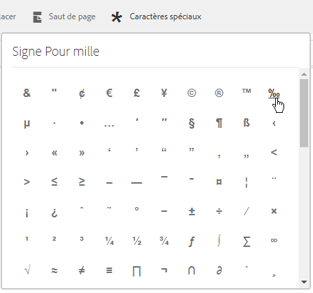

# Fragments de document{#document-fragments}

## Fragments de document {#document-fragments-1}

Dans une correspondance, les fragments de document sont des parties ou composants réutilisables avec lesquels vous pouvez composer des lettres ou correspondances. Les fragments de document sont des types suivants :

* **Texte** : Un actif de texte est un élément de contenu comprenant un ou plusieurs paragraphes de texte. Un paragraphe peut être statique ou dynamique.
* **Liste** : La liste est un groupe de fragments du document, y compris le texte, les listes, les conditions et les images. L’ordre des éléments de la liste peut être fixe ou modifiable. Lors de la création d’une lettre, vous pouvez utiliser certains ou la totalité des éléments de liste pour reproduire un modèle d’éléments réutilisable.
* **Condition** : les conditions vous permettent de définir le contenu à inclure lors de la création d’une correspondance, en fonction des données fournies. La condition est décrite en termes de variables de contrôle. Une variable de contrôle peut être soit un élément de dictionnaire de données, soit un espace réservé.
* **Fragment de disposition** : Un fragment de présentation est une disposition pouvant être utilisée dans une ou plusieurs lettres. Un fragment de disposition est utilisé pour créer des motifs répétables, en particulier des tableaux dynamiques. La mise en page peut contenir des champs de formulaire types tels qu’« Adresse » et « Numéro de référence ». Elle contient également des sous-formulaires vides indiquant les zones cible. Les dispositions (fichiers XDP) sont créées dans Designer puis sont téléchargées vers AEM Forms.

## Texte {#text}

Un actif de texte est un élément de contenu comprenant un ou plusieurs paragraphes de texte. Un paragraphe peut être statique ou dynamique. Un paragraphe dynamique contient des références à des éléments de données dont les valeurs sont fournies au moment de l’exécution. Par exemple, le nom du client dans la formule de salutation d’une lettre pourra être un élément de données dynamique, dont la valeur sera rendue disponible au moment de l’exécution. En modifiant ces valeurs, un même modèle de lettre peut être servir à générer des courriers destinées à des clients différents.

La solution Correspondence Management prend en charge deux types d’éléments de données dynamiques (données variables) :

* **Éléments du dictionnaire de données** : ces éléments sont liés au dictionnaire de données et leurs valeurs proviennent de la source de données fournie. Une variable de dictionnaire de données peut être protégée ou non protégée. Durant la création d’une correspondance, l’utilisateur peut modifier la valeur par défaut des variables de dictionnaire de données non protégées, mais pas de celles qui sont protégées.
* **Espaces réservés** : il s’agit de variables qui ne sont pas liées à une source de données d’arrière-plan. Ils nécessitent que l’utilisateur il indique une valeur durant la création de la correspondance. Les espaces réservés sont non protégés par défaut.

>[!NOTE]
>
>Les modèles Correspondence Management ne vous forcent pas à créer des noms uniques lors de la création d’espaces réservés. Si vous créez deux espaces réservés portant le même nom, (un texte et une condition, par exemple) et que vous les utilisez tous les deux dans un modèle de courrier, les valeurs du dernier espace réservé inséré seront utilisées pour les deux espaces réservés. Si deux espaces réservés portent le même nom, leurs types sont comparés. Si les types sont différents leur type devient String (Chaîne). Dans un module toutefois, vous ne pouvez pas créer plusieurs espaces réservés portant le même nom.

### Créer du texte {#create-text}

1. Sélectionnez **Formulaires** >**Fragments de document**.
1. Appuyez sur **Créer** > **Texte** ou sélectionnez un actif de texte et appuyez sur **Modifier**.
1. Spécifiez les informations suivantes pour le texte :

   * **Titre : (Facultatif)** Saisissez le titre de l’actif de texte. Les titres ne doivent pas nécessairement être uniques et peuvent contenir des caractères spéciaux et des caractères dans une autre langue que l’anglais. Les textes sont référencés par leur titre (le cas échéant) comme dans les vignettes et les propriétés de l’actif.
   * **Nom :** Saisissez un nom unique pour l’actif de texte. Aucun actif (texte, condition ou liste), quel que soit son état, ne peut porter le même nom qu’un autre actif. Dans le champ nom, vous ne pouvez entrer que les caractères, les chiffres et les tirets d’anglais. Le champ Nom est automatiquement renseigné en fonction du champ Titre. Les caractères spéciaux, les espaces, les chiffres et les caractères non anglais saisis dans le champ Titre sont remplacés par des tirets dans le champ Nom. Bien que la valeur du champ Titre soit automatiquement copiée dans Nom, vous pouvez la modifier.
   * **Description** : Entrez une description de l’actif.
   * **Dictionnaire de données** : Si vous le souhaitez, sélectionnez le dictionnaire de données auquel mapper l’actif. Cet attribut vous permet d’ajouter dans l’actif de texte des références à des éléments du dictionnaire de données.
   * **Balises** : Eventuellement, pour créer une balise personnalisée, entrez la valeur dans le champ de texte et appuyez sur Entrée. Vous pouvez afficher la balise sous le champ de texte des balises. Lorsque vous enregistrez ce texte, les balises nouvellement ajoutées sont également créées.

1. Appuyez sur **Next** (Suivant). Correspondence Management affiche la page Editeur dans laquelle vous pouvez ajouter des paragraphes et des éléments de données de texte au texte.

   Le vérificateur orthographique par défaut dans les vérifications orthographiques des navigateurs dans l’éditeur de texte. Pour gérer les vérifications d’orthographe et de grammaire, vous pouvez modifier les paramètres du vérificateur orthographique de votre navigateur ou installer des modules/adjonctions externes de navigateur pour vérifier l’orthographe et la grammaire.

   Vous pouvez également utiliser les divers raccourcis clavier de l’éditeur de texte pour gérer, modifier et mettre en forme du texte. Pour plus d’informations sur les raccourcis clavier [Éditeur de texte](/help/forms/using/keyboard-shortcuts.md#p-formatting-p) dans Raccourcis clavier de Correspondence Management.

1. Un éditeur de texte s’ouvre. Entrez le texte. Utilisez la barre d’outils située en haut de la page pour mettre en forme le texte, les conditions d’insertion, le lien et les sauts de page.

   

   * **Lien** : Insérer un lien hypertexte dans le texte.
   * **Répéter** : Imprime l’élément Collection dans le dictionnaire de données au moyen d’un délimiteur.
   * **Condition** : cliquez pour insérer une condition. Insérez le texte en fonction de la condition. Si la condition est vraie, le texte est visible dans la lettre, sinon il ne l’est pas.
   * **Description** de l&#39;Ajoute : Ajouter l&#39;annotation à un bout de texte. Il s’agit de métadonnées visibles pour l’auteur mais pas d’une partie de la lettre créée.
   * **Saut de page** : Si vous définissez l’attribut de saut de page d’un module de texte sur false, le module de texte n’est pas fractionné sur plusieurs pages.

   L’éditeur de texte s’ouvre. Saisissez le texte. La barre d’outils change selon le type de modifications que vous souhaitez effectuer : paragraphes, alignement ou liste :

   

   Sélectionnez le type de barre d’outils : Paragraphe, alignement ou liste

   

   Barre d’outils Paragraphe
   barre d&#39;outilsBarre d&#39;outils Alignement

   

   Barre d’outils Liste (Cliquez pour ouvrir une image en taille réelle)

1. Pour réutiliser un ou plusieurs paragraphes de texte existant dans une autre application, comme par exemple du texte issu de MS Word ou des pages HTML, copiez et collez le texte dans l’éditeur de texte. La mise en forme du texte copié est conservée dans l’éditeur de texte.

   Vous pouvez copier et coller un ou plusieurs paragraphes de texte dans un module de texte modifiable. Par exemple, vous pouvez disposer d’un document MS Word contenant une liste à puces de preuves de résidence acceptables comme suit :

   

   Vous pouvez directement copier et coller le texte à partir du document MS Word vers un module de texte modifiable. La mise en forme, telle que la liste à puces, la police et la couleur du texte, est conservée dans le module de texte.

   

   >[!NOTE]
   >
   >Toutefois, la mise en forme du texte collé présente certaines [restrictions](https://helpx.adobe.com/aem-forms/kb/cm-copy-paste-text-limitations.html).

1. Si nécessaire, insérez des caractères spéciaux dans le fragment de document. Vous pouvez, par exemple, utiliser la palette des caractères spéciaux pour insérer les caractères suivants :

   * Symboles de devise tels que €, ¥ et £
   * Symboles mathématiques tels que Δ, √,  et ^
   * Symboles de ponctuation tels que ‟ et&quot;

   

   Correspondence Management offre une prise en charge intégrée de 210 caractères spéciaux. L’administrateur peut [ajouter la prise en charge de caractères spéciaux supplémentaires/personnalisés en personnalisant](/help/forms/using/custom-special-characters.md).

1. Pour mettre en surbrillance\mettre en évidence des parties de texte dans un module incorporé modifiable, sélectionnez le texte et appuyez sur Couleur de surbrillance.

   

   Vous pouvez soit appuyer directement sur une couleur de base `**[A]**` présente dans la palette Couleurs de base, soit appuyer sur **Sélectionner** après avoir utilisé le curseur `**[B]**` pour choisir l’ombrage approprié de la couleur.

   Vous pouvez également accéder à l’onglet Avancé pour sélectionner la teinte, la luminosité et la saturation `**[C]**` appropriée afin de créer la couleur précise, puis appuyer sur Sélectionner `**[D]**` pour appliquer la couleur de mise en surbrillance du texte.

   

1. Dans le volet de données, faites glisser des éléments du dictionnaire de données et des éléments d’espace réservé dans le texte.

   Pour :

   * Ajoutez un élément de dictionnaire de données dans le texte, sélectionnez un élément de données dans la liste, puis appuyez sur Insérer ( ). Si vous sélectionnez Protégé, l’élément de dictionnaire de données est en lecture seule et il apparaît dans l’éditeur de lettre, mais pas dans l’interface utilisateur de création de correspondance ni dans le créateur de correspondance.
   * Ajoutez un élément d’espace réservé dans le texte, dans le panneau Éléments de données, appuyez sur Nouveau, saisissez les détails du nouvel élément de données, puis appuyez sur Créer pour ajouter le nouvel élément à la liste. Le nouvel espace réservé peut être inséré dans le texte de la même façon qu’un élément du dictionnaire de données. Pour modifier un espace réservé, sélectionnez l’espace réservé et appuyez sur Modifier.

   

   Éléments d’espace réservé comme spécifié dans le fichier de données d’exemple d’un dictionnaire de données

   

   Valeurs des éléments d’espace réservé dans la vue CCR renseignée des variables de dictionnaire de données comme spécifié dans le fichier de données d’exemple

   Vous pouvez également utiliser le symbole @ pour rechercher et ajouter des éléments de dictionnaire de données et d’espace réservé dans l’éditeur de texte. Placez le curseur à l’endroit où vous souhaitez insérer l’élément. Tapez @ suivi de la chaîne de recherche. L’éditeur de texte effectue l’opération de recherche sur tous les éléments de dictionnaire de données et d’espace réservé disponibles dans le fragment de document de texte. L&#39;opération de recherche récupère et affiche les éléments contenant la chaîne de recherche sous la forme d&#39;une liste déroulante. Parcourez les résultats de la recherche et cliquez sur l’élément à insérer à l’emplacement du curseur. Appuyez sur Echap pour masquer les résultats de la recherche.

1. Vous pouvez utiliser des conditions intégrés et la répétition afin que votre lettre soit hautement contextuelle et parfaitement structurée. Pour plus d’informations sur la condition intégrée et la répétition, voir [Conditions insérées et répétez dans des lettres](/help/forms/using/cm-inline-condition.md).
1. Appuyez sur **Enregistrer**.

#### Insérer un hyperlien dans un texte {#insert-hyperlink}

Exécutez les étapes suivantes pour créer un hyperlien dans une ressource de texte :

1. Sélectionnez le texte ou l’objet de modèle de données dans l’éditeur de texte.

2. Appuyez sur **[!UICONTROL Lien]**. Appuyez sur le champ **[!UICONTROL Alt Text]** pour supprimer le nom ou le texte de l&#39;objet de modèle de données existant.

3. Spécifiez l’URL et appuyez sur .

#### Recherche et remplacement de texte {#searching-and-replacing-text}

Lorsque vous travaillez avec des éléments de texte contenant un grand corps de texte, vous devez rechercher une chaîne de texte spécifique. Vous devrez peut-être également remplacer une chaîne de texte spécifique par une autre chaîne.

La fonction Rechercher et remplacer vous permet de rechercher (et de remplacer) n’importe quelle chaîne de caractères dans un élément de texte. La fonction comprend également une recherche d’expression régulière puissante.

#### Pour rechercher du texte dans un module de texte {#to-search-text-in-a-text-module}

1. Ouvrez le module de texte dans l’éditeur de texte.

1. Appuyez sur Rechercher et remplacer.
1. Saisissez le texte à rechercher dans le champ Rechercher et appuyez sur Rechercher. La recherche de texte est mise en surbrillance dans le module de texte.
1. Pour rechercher l’instance suivante du texte, appuyez de nouveau sur Rechercher.

   Si vous continuez à appuyer sur le bouton Rechercher, la recherche se poursuit jusqu’au bas de la page. Une fois la dernière instance du texte trouvée, le message **Fin du module** atteinte indique qu’aucun autre résultat de recherche n’a été trouvé.

   Toutefois, si aucune instance du texte à rechercher n’est trouvée dans le module de texte, le message affiché est :**Aucune correspondance trouvée**.

1. Si vous appuyez à nouveau sur Rechercher, la recherche se poursuit dans la partie supérieure de la page.

#### Options de recherche {#search-options}

**Respecter la casse :** la recherche renvoie des résultats avec la même casse uniquement.

**Mot entier :** la recherche renvoie uniquement des mots entiers.

>[!NOTE]
>
>Si vous saisissez des caractères spéciaux dans la zone de texte Rechercher, l’option Mot entier est désactivée.

**Reg ex :** Recherche à l&#39;aide d&#39;expressions régulières. Par exemple, l’expression régulière suivante recherche des adresses électroniques dans un module de texte :

`[a-zA-Z0-9._%+-]+@[a-zA-Z0-9.-]+\.[a-zA-Z]{2,4}`

#### Pour rechercher et remplacer du texte dans un module de texte {#to-search-and-replace-text-in-a-text-module}

1. Ouvrez le module de texte dans l’éditeur de texte.
1. Appuyez sur Rechercher et remplacer.
1. Saisissez le texte à rechercher dans le champ Rechercher, ainsi que le texte à utiliser en remplacement de la recherche de texte, puis appuyez sur Remplacer.
1. Si le texte de la recherche est trouvé, il est remplacé par le texte de remplacement.

   * Si une autre occurrence du texte de recherche est trouvée, elle est mise en surbrillance dans le module de texte. Si vous appuyez à nouveau sur Remplacer, l’occurrence mise en surbrillance est remplacée et, si une troisième occurrence est trouvée, le curseur se déplace vers le bas.
   * Si aucune autre occurrence n’est trouvée, le curseur s’arrête à la dernière occurrence remplacée.

1. Si vous appuyez à nouveau sur Rechercher, la recherche se poursuit dans la partie supérieure de la page.

   Utilisez l’option Tout remplacer pour remplacer toutes les occurrences dans le module de texte. Lorsque vous utilisez &quot;, le nombre de remplacements s&#39;affiche sous la forme d&#39;un message dans la boîte de dialogue Rechercher et remplacer.

#### Conseils et astuces des meilleures pratiques relatives aux modules de texte {#best-practices-tips-and-tricks-for-text-modules}

* Utilisez une convention de dénomination cohérente afin d’éviter la duplication.
* Utilisation de la liaison de dictionnaires de données appropriée dans les modules de texte.
* Les règles suivantes s’appliquent lorsque vous utilisez l’Editeur de texte pour modifier un actif de texte :

   * **Ajout de variable :** Autorisé
   * **Retrait de variable :** Autorisé
   * **Mise à jour des propriétés :** Autorisée
   * **Modification des données du dictionnaire :** Autorisé tant que l’élément du dictionnaire de données n’est pas utilisé. Vous ne pouvez pas modifier le dictionnaire de données lors de la mise à jour.

## Liste {#list}

Une liste est un groupe de fragments du document, y compris le texte, les listes (autres), les conditions, et les images. L’ordre des éléments de la liste peut être fixe ou modifiable. Lors de la création d’une lettre, vous pouvez utiliser certains ou la totalité des éléments de liste pour reproduire un modèle d’éléments réutilisable. Les listes se comportent essentiellement comme des cibles qui peuvent être imbriquées dans d&#39;autres cibles.

### Implémentation des listes {#implementing-lists}

L’implémentation des listes se compose de deux étapes :

1. Définition des propriétés de base telles que le nom, la description, le dictionnaire de données.
1. la section du contenu qui fait partie de la liste, puis la définition de propriétés telles que l’ordre de verrouillage et l’accès à la bibliothèque pour la liste.

### Création de liste {#create-a-list}

Une liste est un groupe de contenus associés pouvant être utilisés dans un modèle de lettre en tant que même unité. N’importe quel type de contenu peut être ajouté à une liste. Les listes peuvent également être imbriquées. Les modules de liste peuvent être spécifiés comme suit :

* **ORDONNÉ** : L’ordre ne peut pas être modifié dans l’environnement d’exécution Création de correspondance.
* **Accès à la bibliothèque** : Les utilisateurs peuvent ajouter des modules à la liste. Cet indicateur spécifie si l’accès à la bibliothèque est activé. S’il est activé (ouvert), l’utilisateur peut ajouter des modules à la liste tout en prévisualisant la lettre.
* Lors de la création d’une liste, vous pouvez spécifier un type :
* **Normale** : Aucun style supplémentaire de mise en forme n’est appliqué à la liste.
* **À puces** : La liste est mise en forme par l’application d’une puce simple.
* **Numérotée** : Une liste numérotée permettant de choisir entre les chiffres standard (1, 2, 3, etc.), les chiffres romains en majuscules (I, II, III, etc.) et les chiffres romains en minuscules (i, ii, iii, etc.).
* **Avec lettres** : Liste alphabétique permettant de choisir entre minuscules (a, b, c, etc.) et majuscules (A, B, C, etc.).
* **Personnalisée** : Vous pouvez créer n’importe quel type de liste numérotée ou avec lettres, et y ajouter les préfixes et suffixes de votre choix.

1. Sélectionnez **Formulaires** >**Fragments de document**.

1. Sélectionnez **Créer** > **Liste**.

1. Spécifiez les informations suivantes pour la liste :

   * **Titre (facultatif) : saisissez** le titre de la liste. Le titre ne doit pas être unique et peut contenir des caractères spéciaux et des caractères dans une autre langue que l’anglais. Les listes sont référencées par leur titre (lorsqu’elles sont disponibles), par exemple dans les miniatures et les propriétés de la ressource.
   * **Nom :** nom unique de la liste. Aucun actif (texte, condition ou liste), quel que soit son état, ne peut porter le même nom qu’un autre actif. Dans le champ nom, vous ne pouvez entrer que les caractères, les chiffres et les tirets d’anglais. Le champ nom est automatiquement renseigné par la valeur dans le champ Titre. Les caractères spéciaux, les espaces, les chiffres et les caractères non anglais saisis dans le champ Titre sont remplacés par des tirets dans le champ Nom. Bien que la valeur du champ Titre soit automatiquement copiée dans Nom, vous pouvez la modifier.
   * **Description (Facultatif)** : Entrez une description de la ressource.
   * **Dictionnaire de données (facultatif)** : Si vous le souhaitez, sélectionnez le dictionnaire de données auquel se connecter. Seuls peuvent être ajoutés à la liste les actifs qui utilisent le même dictionnaire de données que la liste ou les actifs auxquels aucun dictionnaire de données n’a été affecté. L’affectation d’un dictionnaire de données à une liste permet à une personne créant un modèle de lettre de trouver facilement la liste appropriée.
   * **Balises (facultatif)** : Sélectionnez les balises à appliquer. Vous pouvez également taper un nouveau nom d’étiquette pour créer une étiquette. (La nouvelle balise est créée lorsque vous appuyez sur **Enregistrer**.)

1. Appuyez sur **Next** (Suivant).
1. Appuyez sur **Ajouter l&#39;actif**.
1. Pour ajouter des ressources à la liste, sélectionnez-les dans la page Sélectionner les ressources et appuyez sur **Terminé**.

   

1. Les actifs sont ajoutés à la page Eléments de la liste.
Pour modifier l’ordre des actifs dans la liste, appuyez sur les icônes de flèches (  ) et faites-les glisser. Lorsque l’utilisateur ouvre un modèle de courrier dans l’interface utilisateur de création de correspondance, le contenu est assemblé dans l’ordre que vous avez défini ici.

   

1. Vous pouvez sélectionner les options suivantes pour indiquer comment la liste se comporte dans l’interface utilisateur CCR :

   * **Accès à la bibliothèque** : pour activer l’accès à la bibliothèque pour ajouter des éléments, appuyez sur Accès à la bibliothèque. Lorsque l’accès à la bibliothèque est activé, l’expert en assurance peut ajouter plus de contenu à la liste. Sinon, l’expert en assurance est limité au contenu que vous avez défini pour la liste.
   * **Ordre de verrouillage** : pour verrouiller l’ordre des actifs dans la liste et empêcher l’utilisateur de modifier cet ordre, appuyez sur Verrouiller l’ordre. Si vous ne sélectionnez pas cette option, l’utilisateur pourra modifier l’ordre des éléments de la liste.

   * **Ajouter des puces** : Utilisez cette option pour appliquer une puce ou un style de numérotation au module. Vous pouvez utiliser un style de liste prédéfini ou personnalisé. Vous pouvez également indiquer le texte à afficher avant et après chaque élément de liste.
   * **Saut** de page : Sélectionnez cette option ( ) pour ajouter un saut de page entre le contenu de la liste. Si cette option n’est pas sélectionnée ( ), si le contenu de la liste déborde sur la page suivante, la liste entière est déplacée vers la page suivante au lieu de se fractionner entre la liste.

   * **Configuration d’affectation** : Utilisez cette option pour spécifier le nombre minimal et maximal d’actifs qui peuvent être ajoutés à la liste.

1. Vous pouvez sélectionner les options suivantes pour spécifier le comportement de chaque actif de la liste au moment de l’exécution :

   * **Modifiable** : Lorsque cette option est sélectionnée, le contenu peut être modifié dans l’interface utilisateur de création de correspondance. (Cette option n’est pas disponible pour les modules Liste et Image.)
   * **Obligatoire** : Lorsque cette option est sélectionnée, le contenu est obligatoire dans l’interface utilisateur de création de correspondance.
   * **Sélectionné** : Lorsque cette option est sélectionnée, le contenu est présélectionné dans l’interface utilisateur de création de correspondance.
   * **Sauter les puces et la numérotation** : Lorsque cette option est sélectionnée, le contenu n’utilise pas les puces et la numérotation dans l’interface utilisateur de création de correspondance. (Cette option n’est pas disponible pour les modules d’image). En outre, entre Sauter le style, Numérotation composée et Ignorer le style de liste, une seule des options peut être appliquée à un module. Une de ces options peut être utilisée pour un module lorsque vous sélectionnez l’option Ajouter les puces pour un module.)
   * **Mise en retrait** : Vous pouvez modifier le niveau de mise en retrait de chaque module/contenu sélectionné pour faire partie de la liste. La mise en retrait est spécifiée en termes de niveaux (en commençant par zéro), de sorte que chaque niveau de retrait corresponde à une marge de 36 points.
   * **Composé :** Lorsqu’elle est sélectionnée, la numérotation composée est appliquée comme une combinaison du style de la liste extérieure (parente) et de celui de la liste imbriquée. La numérotation composée de cette liste imbriquée est basée sur l’ordre dans lequel cette liste imbriquée apparaît dans la liste extérieure.
   * **Ignorer le style de liste** : Si l’option Numérotation composée est désélectionnée, l’option Ignorer le style de liste est activée. Cette sélection ignore le style de la liste imbriquée et la numérotation continue à partir de la liste extérieure. Par conséquent, les modules de la liste imbriquée sont traités en tant que partie intégrante de la liste extérieure et tous les styles spécifiés dans la liste imbriquée sont ignorés. Si l’option Ignorer le style de liste est désactivée pour une liste imbriquée, les modules qui font partie de cette liste imbriquée ont leur propre style de numérotation.
   * **Sous-formulaire solidaire :** Définit le saut de page des actifs d’une liste. Si vous définissez la propriété Sous-formulaire solidaire pour l’un des actifs d’une liste sur **On**, cet actif et l’actif suivant resteront sur la même page. Le contenu de l’actif sélectionné et de l’actif suivant ne sera pas fractionné sur plusieurs pages.

1. Appuyez sur **Enregistrer**.

### Meilleures pratiques/conseils et astuces {#best-practices-tips-and-tricks}

* Utilisez une convention de dénomination cohérente afin d’éviter la duplication.
* Utilisez une liaison au dictionnaire de données approprié.
* Les règles suivantes s’appliquent lorsque vous utilisez l’Editeur de liste pour apporter des modifications à une liste :

   * Mise à jour des propriétés : Autorisée
   * **Modification du dictionnaire de données :** Autorisé tant qu’aucun élément utilisant le dictionnaire de données n’y est associé. Vous ne pouvez pas modifier le dictionnaire de données lors de la mise à jour.

## Conditions {#conditions}

Les conditions vous permettent de définir le contenu à inclure lors de la création d’une correspondance/lettre, en fonction des données fournies. La condition est décrite en termes de variables de contrôle. Lorsque vous ajoutez une condition, vous pouvez choisir d’inclure un actif en fonction de la valeur de la variable de contrôle.

Selon les options sélectionnées, soit uniquement la première expression vérifiée comme vraie, en fonction de la variable de condition actuelle est évaluée ou toute la condition. Lors du remplissage de la lettre dans Create Correspondence (CCR), les conditions se comportent comme des « boîtes blanches ». Si une condition entraîne une liste, tous les éléments obligatoires et présélectionnés de la liste se trouvent dans la sortie. Si l’un de ces éléments est lui-même une condition ou une liste, le contenu qui en résulte est également sorti, de haut en bas ou dans le sens de la profondeur sous forme de liste plate de contenus d’image et de texte. Les résultats de la condition peuvent être de n’importe quel type (texte, liste, condition ou image).

### Conditions d’implémentation  {#implementing-conditions}

L’éditeur de conditions est fourni avec une interface utilisateur [Générateur d’expression](/help/forms/using/expression-builder.md), qui prend en charge la création d’expressions à l’aide à la fois de plusieurs espaces réservés et d’éléments du dictionnaire de données. Vous pouvez utiliser sur ces expressions des opérandes communs et des fonctions locales/globales. Chaque expression peut être associée à un certain contenu et il peut éventuellement y avoir une section par défaut si aucune des expressions n’est évaluée comme vraie. Toutes les expressions sont évaluées dans l’ordre dans lequel elles sont définies et la première expression renvoyant la valeur true est sélectionnée et son contenu associé est renvoyé par ce module conditionnel.

Par exemple, si le texte des termes et conditions d’une lettre diffère selon l’Etat où réside le client, et si le dictionnaire de données contient un élément appelé « Etat », vous pourrez ajouter la condition de la manière suivante : • Etat = NY, select T&amp;C_NY text paragraph • Etat = NC, select T&amp;C_NC text paragraph

L’Editeur de condition vous permet de spécifier une condition par défaut. Si la valeur des variables de contrôle ne correspond à aucune condition, alors le contenu associé à la condition par défaut est utilisé. Suivant l’exemple précédent, vous pourriez ajouter cette ligne de condition :
• Par défaut, sélectionnez T&amp;C_Rest

### Création d’une condition {#create-a-condition}

1. Sélectionnez **Formulaires** >**Fragments de document**.
1. Sélectionnez **Créer > condition**.
1. Spécifiez les informations suivantes pour la liste :

   * **Titre (facultatif) :** Saisissez le titre de la condition. Le titre ne doit pas être unique et peut contenir des caractères spéciaux et des caractères dans une autre langue que l’anglais. Les conditions sont référencées par leur titre (le cas échéant), comme dans les vignettes et les propriétés de la ressource.
   * **Nom :** nom unique de la condition. Aucun actif (texte, condition ou liste), quel que soit son état, ne peut porter le même nom qu’un autre actif. Dans le champ nom, vous ne pouvez entrer que les caractères, les chiffres et les tirets d’anglais. Le champ Nom est automatiquement renseigné en fonction du champ Titre. Les caractères spéciaux, les espaces, les chiffres et les caractères non anglais saisis dans le champ Titre sont remplacés par des tirets dans le champ Nom. Bien que la valeur du champ Titre soit automatiquement copiée dans Nom, vous pouvez la modifier.
   * **Description (facultatif)** Saisissez une description de la condition.
   * **Dictionnaire de données (facultatif)** : Si vous le souhaitez, sélectionnez le dictionnaire de données auquel se connecter. Seuls peuvent être ajoutés à la liste les actifs qui utilisent le même dictionnaire de données que la condition ou les actifs auxquels aucun dictionnaire de données n’a été affecté. L’affectation d’un dictionnaire de données à une liste permet à une personne créant un modèle de lettre de trouver facilement la condition appropriée.
   * **Balises (facultatif)** : Si vous le souhaitez, sélectionnez les balises à appliquer. Vous pouvez également taper un nouveau nom d’étiquette pour créer une étiquette. (La nouvelle balise est créée lorsque vous appuyez sur **Enregistrer**.)

1. Appuyez sur **Next** (Suivant).
1. Appuyez sur **Ajouter l&#39;actif**.
1. Pour ajouter une ressource à la condition, sélectionnez-la dans la page Sélectionner les ressources et appuyez sur **Terminé**. Les actifs sont ajoutés au volet Expression.
1. Vous pouvez sélectionner les options suivantes pour spécifier le comportement de la condition au moment de l’exécution :

   * **Désactiver l’évaluation de résultats multiples\Activer l’évaluation de résultats multiples** : Lorsque cette option est activée (s’affiche comme « Activer l’évaluation… »), toutes les conditions sont évaluées et le résultat est la somme de toutes les conditions réelles. Si cette option est désactivée (« Désactiver l’évaluation… »), alors seule la première condition qui s’avère vraie est évaluée et devient la sortie de la condition.
   * **Saut** de page : Sélectionnez cette option ( ) pour ajouter un saut de page entre les modules des conditions. Si cette option n’est pas sélectionnée ( ), si une condition déborde sur la page suivante, la condition entière est décalée vers la page suivante au lieu de se briser entre les conditions.

1. Pour modifier l’ordre des actifs dans la condition, appuyez sur l’icône des flèches (  ) et faites-la glisser. Lorsque l’utilisateur ouvre un modèle de courrier dans l’interface utilisateur de création de correspondance, le contenu est assemblé dans l’ordre que vous avez défini ici.
1. Appuyez sur **Supprimer** pour supprimer la ligne. Si vous appuyez sur Supprimer pour la ligne par défaut, efface uniquement les informations d’actif.
1. Appuyez sur **Copier** pour duplicata d’une ligne.
1. Appuyez sur **Modifier** pour modifier la ressource ou l’expression.

   Par ailleurs :

   * Pour mettre à jour l’actif, appuyez sur l’icône de dossier dans la colonne Actif.
   * Pour ouvrir le Générateur d’expression afin d’insérer une expression, appuyez sur l’icône de dossier dans la colonne Expression. Pour plus d’informations sur le créateur d’Expressions, voir [créateur d’Expressions](/help/forms/using/expression-builder.md).

### Meilleures pratiques/conseils et astuces {#best-practices-tips-and-tricks-1}

* Utilisez une convention de dénomination cohérente pour une recherche simple et pour éviter la duplication.
* Les conditions se comportent comme des instructions Case ; l’ordre des conditions a donc son importance. La première correspondance est renvoyée.
* Utilisez une liaison au dictionnaire de données approprié.
* Les règles suivantes s’appliquent lorsque vous utilisez l’Editeur de condition pour apporter des modifications à une condition :

   * **Ajout de variable :** Autorisé
   * **Retrait de variable :** Autorisé
   * **Mise à jour des propriétés :** Autorisée
   * **Modification des données du dictionnaire :** Autorisé tant que l’élément du dictionnaire de données n’est pas utilisé.

## Fragments de disposition {#layoutfragments}

Un fragment de mise en page est basé sur des fichiers XDP créés dans Designer. Pour créer des fragments de mise en page, vous devez créer les fichiers XDP et [les télécharger vers AEM Forms](/help/forms/using/import-export-forms-templates.md).

Un ou plusieurs fragments de disposition peuvent faire partie d’une lettre et définir l’apparence graphique de ces parties. Un fragment de disposition peut contenir des champs de formulaire standard, tels que l’adresse et le numéro de référence, et des sous-formulaires vides indiquant les zones cible. En outre, les fragments de mise en page vous permettent de créer des tableaux et de les insérer dans les lettres.

Un exemple d’utilisation standard est de trouver les motifs réutilisables de présentation dans les lettres et de créer des mises en page de fragments pour eux. Par exemple, la formule de politesse, l’adresse et l’objet de la lettre, qui s’affichent dans le même ordre dans plusieurs lettres. Un autre exemple peut être un nombre de lignes similaire et des colonnes du tableau utilisés dans plusieurs lettres.

Vous pouvez créer un fragment de mise en page basé sur un fichier XDP existant. Un fragment de mise en page peut comporter des champs et des zones cible ou un ou plusieurs tableaux. Les tables dans une disposition peuvent être statiques ou dynamiques. XDP est créé dans Designer et [téléchargé vers AEM Forms](/help/forms/using/import-export-forms-templates.md). Un fichier XDP peut former la structure d’un fragment de mise en page ou d’une lettre. Plus d&#39;informations sur [la conception de la mise en page](/help/forms/using/layout-design-details.md).

Utiliser des fragments liés à des zones cible permet à la lettre d’être modifiée au moment de la création. Des fragments de disposition de différentes dimensions peuvent être créés et le fragment approprié peut être lié à la zone cible. Les fragments de mise en page permettent également de personnaliser un certain nombre de propriétés de tableau :

1. Vous pouvez augmenter le nombre de lignes et de colonnes.
1. Vous pouvez spécifier un en-tête et un pied de page pour des lignes et des colonnes supplémentaires.
1. Vous pouvez définir le ratio (rapport largeur/hauteur) des colonnes de tableau. Au moment de l’exécution, les colonnes du tableau sont redimensionnées selon le ratio défini et en fonction de l’espace disponible. La somme du rapport de largeur doit être 100. Sinon elle ne s’applique pas.
1. Si un tableau est un espace réservé (ne contenant qu’une cellule vide), vous pouvez définir le type (zone cible/champ) de nouvelles colonnes.
1. Vous pouvez masquer les lignes d’en-tête et de pied de page.

Avant d’effectuer cette procédure, créez un fragment XFA à l’aide de Designer. Le fragment peut contenir des tableaux pour l’organisation des champs et des zones cible. Designer permet la création de deux types de tableaux : statiques et dynamiques. Les tableaux statiques contiennent un nombre fixe de lignes. Ils peuvent contenir des zones cibles et des champs. Il n’est pas possible de lier ces zones cible et ces champs à des éléments de dictionnaire de données répétés. Un tableau dynamique peut comporter une seule ligne également. Les données liées à des cellules déterminent le nombre des lignes des tableaux dynamiques. Un tableau dynamique ne peut contenir que des champs. Ces éléments peuvent être répétés ou non répétés.

Tenez compte des points suivants lorsque vous concevez des tableaux :

1. Les tableaux peuvent être personnalisés au moment de la création de fragments de mise en page. Mais la personnalisation n’est activée que lorsque le sous-formulaire parent du tableau présente une mise en page souple.
1. Dans le cas des tableaux dynamiques, pour tous les champs, les lignes répétées et le tableau, utiliser la liaison « use name » pour que la fusion de données s’effectue correctement.
1. Dans le cas des tableaux dynamiques, tous les éléments de dictionnaire de données répétés liés aux champs du tableau font partie de la même hiérarchie. Pour les éléments de dictionnaire de données non répétés, il n’existe aucune restriction de ce type.
1. Au moment de la fusion du fragment de mise en page dans la zone cible parent, les tableaux sont redimensionnés, en fonction de l’espace disponible ; mais le redimensionnement ne s’effectue que lorsque le fragment de mise en page ne contient pas de zone cible ou de champ directement au sein du sous-formulaire de niveau supérieur. Les zones cible et les champs sont autorisés à l’intérieur des tableaux.
1. Vous pouvez créer des tableaux d’espaces réservés. Ces tableaux ne comportent qu’une seule cellule vide.

* Pour les tableaux d’espaces réservés, vous pouvez personnaliser les propriétés suivantes au moment de la création de fragments :

   * nombre de lignes ;
   * nombre de colonnes ;
   * en-tête et pied de page pour chaque colonne ;
   * type (zone cible/champ) de chaque colonne ;
   * rapport largeur/hauteur de chaque colonne.

* Pour les autres tableaux, vous pouvez personnaliser les propriétés suivantes :

   * nombre de lignes ;
   * nombre de colonnes ;
   * en-tête et pied de page pour une colonne supplémentaire ;
   * rapport largeur/hauteur de chaque colonne.

Vous pouvez imbriquer des fragments dans une lettre. Cela signifie que vous pouvez ajouter un fragment au sein d’un fragment. La solution Correspondence Management prend en charge jusqu’à quatre niveaux d’imbrication dans une lettre : **Lettre**->**Fragment**->**Fragment**->**Fragment**->**Fragment.**

Pour un exemple détaillé de l’utilisation de tableaux statiques et dynamiques dans les fragments de mise en page, voir [Exemple avec des fichiers d’exemple : utilisation de tableaux statiques et dynamiques dans une lettre ](#examplewithsamplefiles).

### Création d’un fragment de disposition {#creating-a-layout-fragment}

1. Sélectionnez **Créer** > **Fragment de disposition**.
1. Correspondence Management affiche les fichiers XDP disponibles. Sélectionnez le fichier XDP sur lequel vous souhaitez baser votre fragment de mise en page et appuyez sur **Suivant**.
1. Spécifiez les informations suivantes pour la mise en page :

   * **Titre (facultatif) :** Entrez le titre du fragment de mise en page. Le titre ne doit pas être unique et peut contenir des caractères spéciaux et des caractères dans une autre langue que l’anglais. Les fragments de mise en page sont référencés par leurs titres (le cas échéant), comme dans les miniatures et les propriétés de la ressource.
   * **Nom :** nom unique du fragment de mise en page. Aucun actif (texte, condition ou liste), quel que soit son état, ne peut porter le même nom qu’un autre actif. Dans le champ nom, vous ne pouvez entrer que les caractères, les chiffres et les tirets d’anglais. Le champ Nom est automatiquement renseigné en fonction du champ Titre. Les caractères spéciaux, les espaces, les chiffres et les caractères non anglais saisis dans le champ Titre sont remplacés par des tirets dans le champ Nom. Bien que la valeur du champ Titre soit automatiquement copiée dans Nom, vous pouvez la modifier. Ce nom apparaît dans la liste de l’interface utilisateur de gestion des actifs.
   * **Description (Facultatif)** : Description qui s’affiche dans la liste de l’interface utilisateur de gestion des actifs.
   * **Balises (facultatif)** : Si vous le souhaitez, sélectionnez les balises à appliquer à la condition. Vous pouvez également taper un nouveau nom d’étiquette pour créer une étiquette.

1. Cliquez sur l’onglet **Tableau** et spécifiez les informations suivantes pour la mise en page :

   * **Configuration pour** : Sélectionnez la table en cours de configuration.En tant que suffixe du nom de la table dans la liste déroulante est (Statique) si la table est statique ou (Dynamique) si la table est dynamique. Les tableaux statiques contiennent un nombre fixe de lignes. Ils peuvent contenir des zones cibles et des champs. Il n’est pas possible de lier ces zones cible et ces champs à des éléments de dictionnaire de données répétés. Les données liées à des cellules déterminent le nombre des lignes des tableaux dynamiques.

   * **Lignes** : Sélectionnez le nombre de lignes pour la mise en page. Le nombre de lignes configuré doit être supérieur ou égal au nombre de lignes à l’origine.
   * **Colonnes** : Sélectionnez le nombre de colonnes pour la mise en page. Le nombre de colonnes configuré doit être supérieur ou égal au nombre de colonnes à l’origine.

   Pour chaque colonne, les détails suivants sont requis :

   * **En-tête** : Le texte à afficher pour l’en-tête.
   * **Pied de page** : Le texte à afficher pour le pied de page.
   * **Type** : Le type de colonne supplémentaire : champ ou zone cible. L’option Type est activée pour les tableaux d’espaces réservés statiques. Elle peut être définie au niveau colonne et non au niveau cellule. Toutes les cellules d’une colonne étendue seront du même type. Dans le cas d’un tableau dynamique, toutes les colonnes sont de type champ. Dans le cas de tableaux autres qu’espaces réservées, vous ne pouvez pas définir le type des colonnes supplémentaires. Dans ce cas, les cellules supplémentaires d’une colonne étendue sont du même type que celles de la dernière colonne de la ligne et le type des cellules d’une ligne supplémentaire est identique à celui de la dernière cellule de la colonne.
   * **Rapport largeur/hauteur** : Le ratio des largeurs des colonnes du tableau. 

   Pour un exemple détaillé de l’utilisation de tableaux statiques et dynamiques dans les fragments de mise en page, voir [Exemple avec des fichiers d’exemple : utilisation de tableaux statiques et dynamiques dans une lettre ](#examplewithsamplefiles).

1. Appuyez sur **Enregistrer**.

### Télécharger un fichier XDP vers Correspondence Management {#upload-an-xdp-to-correspondence-management}

Pour obtenir des instructions sur l’importation et l’exportation d’un fichier XDP vers Correspondence Management, voir [Importation et exportation des fichiers vers des AEM Forms](/help/forms/using/import-export-forms-templates.md).

### Meilleures pratiques/conseils et astuces  {#best-practices-tips-and-tricks-2}

#### Définissez la liaison de sous-formulaire par défaut {#set-the-default-subform-binding}

Lorsque vous créez des zones cible dans Designer, il est utile de définir par défaut comme « Aucune » la liaison pour tous les nouveaux sous-formulaires.

Pour définir la liaison par défaut :

1. Dans Designer, appuyez sur **Outils** > **Options** > **Liaisons de données** > **Liaison de sous-formulaire**.

1. Dans la liste Liaison par défaut pour nouveaux sous-formulaires, sélectionnez **Aucune liaison de données**.

Cela garantit que les sous-formulaires insérés à l’aide de la commande Insérer > Sous-formulaire ou par glisser-déposer à partir de la palette Objet possèdent une liaison de type « Aucune » par défaut. Cela signifie que, par défaut, tout nouveau sous-formulaire est une zone cible à moins que vous n’y ajoutiez du contenu, que vous ne modifiiez ses paramètres de liaison ou que vous ne le renommiez avec un suffixe « _int ».

#### Conformité à la section 508 {#section-compliance}

Si la version définitive de la lettre créée dans l’interface utilisateur de création de correspondance est utilisée pour compléter un flux de travail ultérieur, lors de la création de la mise en page, appliquez les recommandations suivantes qui sont en rapport à la section 508. Dans les autres cas, le PDF de la lettre est utilisé à des fins d’affichage et vous pouvez ignorer les recommandations ci-dessous :

* Tous les sous-formulaires de zone cible et tous les champs d’une mise en page ont un ordre de tabulation.
* Les champs contenant des légendes sont par défaut conformes à la section 508. L’attribut de champ /field/assist/speak@priority est défini par défaut comme « personnalisé », ce qui signifie que le lecteur d’écran lit la légende du champ à moins que le texte de l’écran de lecture personnalisé ne soit fourni.
* Les champs sans légende spécifient une info-bulle et indiquent que les lecteurs d’écran lisent l’info-bulle en définissant

`/field/assist/speak@priority="toolTip"` et spécification du texte d’info-bulle dans  `/field/assist/toolTip`.

#### Formats des dates dans Designer et Asset Configuration Manager {#date-formats-in-designer-and-asset-configuration-manager}

Lors de la création d’une mise en page dans Designer, assurez-vous que les formats des champs de dates sont conformes aux formats de dates définis dans Data Display Formats dans [Propriétés de configuration de Correspondence Management](/help/forms/using/cm-configuration-properties.md). Pour plus d’informations, voir Formater des valeurs de champ et utiliser des modèles dans l’Aide de Designer.

#### Capture des plages de dates  {#capturing-date-ranges}

Lorsque vous avez affaire à une combinaison de dates, telles que startDate-endDate, utilisez un sous-formulaire unique afin de garantir un alignement correct dans la lettre définitive et de minimiser le nombre de champs.

#### Définition de liaison au niveau du formulaire  {#setting-form-level-binding}

Lorsqu’une mise en forme contient de nombreux champs et zones cible mappés à des éléments XML uniques, utilisez la liaison au niveau du formulaire et créez un nœud distinct pour chaque élément. Les champs liés au niveau du formulaire sont ignorés lors du mappage des données dans Correspondence Management.

#### N’utilisez pas de zones cible de sous-formulaire dans une page de gabarit  {#do-not-use-subform-target-areas-in-a-master-page}

Les zones cible de sous-formulaire d’une page de gabarit ne sont pas visibles dans l’interface utilisateur de gestion des actifs et aucune donnée ne peut leur être mappée. 

#### Choix des positions et des types appropriés pour les zones cible  {#choosing-appropriate-positions-and-types-for-target-areas}

Lors de la conception de la mise en forme, soyez attentifs au choix des sous-formulaires. Si la mise en page contient un seul sous-formulaire, il peut s’agir d’un type de mise en page souple. Après avoir positionné les champs dans le sous-formulaire, vous pouvez les encapsuler dans un autre sous-formulaire afin que le sous-formulaire encapsulé soit également de mise en page souple et que la mise en page ne soit pas perturbée.

#### Positionnement des champs sur les gabarits {#placing-fields-on-master-pages}

Notez les points suivants lorsque vous placez un champ sur un gabarit :

* Définissez la liaison de champs de page principale pour utiliser les données globales
* Ne placez pas le champ directement sous l’objet pageArea racine du gabarit.
* Placez le champ dans un sous-formulaire et vérifiez que la liaison du sous-formulaire nommé est définie sur Utiliser un nom.

## Création de tableaux à l’aide de fragments de mise en page  {#creating-tables-using-layout-fragments}

De nombreux modèles de courrier contiennent des tableaux. Les tableaux peuvent être statiques (cas, par exemple, des tableaux de termes et de conditions), où chaque ligne représente une condition et chaque partie est indiqué dans une colonne distincte. Les tableaux peuvent également être dynamiques (cas des informations de compte, par exemple) lorsqu’ils contiennent des informations comme le nom du client, l’identifiant de compte, le numéro de transaction et le montant de la transaction.

* **Tableau statique** : Les tableaux sont parfois créés avec des lignes ayant un nombre différent de colonnes, comme pour un tableau de conditions générales. Où chaque ligne représente une condition et chaque condition peut comporter différentes sous-parties. Chaque partie est indiquée dans une colonne distincte.
* **Tableaux dynamiques** : Les fragments de mise en page offrent la possibilité de lier les champs d’un tableau dynamique aux DDE Collection. Au moment de la génération du courrier, les lignes d’un tableau sont générées, conformément à la taille des DDE Collection.

Le DD a un élément Collection Nominee_details possédant un élément composite avec trois éléments primitifs : Nominee_name, Nominee_address et Nominee_gender.
Le fichier XDP dynamique utilise les mêmes en-têtes. Vous pouvez mapper les champs dynamiques XDP avec les champs mentionnés ci-dessus de DD.

### Exemple avec fichiers exemple : Utilisation de tableaux statiques et dynamiques dans une lettre {#examplewithsamplefiles}

Cet exemple montre comment créer un tableau dynamique et statique, lier le tableau dynamique aux DDE, puis créer une lettre qui inclut ces deux tableaux. Lorsque vous travaillez avec cet exemple, vous pouvez créer des fichiers intégralement ou utiliser les fichiers d’entrée fournis dans les étapes.

1. Créez un dictionnaire de données (DD) à utiliser dans l’exemple, comme illustré dans le graphique.

   Sélectionnez ensuite le dictionnaire de données et exportez les données exemple. Le fichier XML que vous obtenez contient les données des employés et trois instances de Nominee_details (par défaut, 3 instances sont téléchargées). Vous pouvez ajouter ou supprimer selon vos besoins). Mettez à jour les valeurs puis importez les données de test dans le dictionnaire de données. Le fichier CMP est le package et contient le dictionnaire de données. Donc, importez le dictionnaire de données vers Correspondence Management.

   Pour plus d’informations sur l’utilisation du dictionnaire de données et des données de test, voir [Dictionnaire de données](/help/forms/using/data-dictionary.md#p-working-with-test-data-p).

   

   [Obtenir le fichier](assets/exportpackage_1431709897770.cmp.zip)

1. Dans Designer, créez deux fichiers XDP (fragments de mise en page) : un tableau dynamique et un tableau statique. Pour les deux mises en pages :

   * Ajoutez le sous-formulaire à la colonne du tableau. Veillez à rendre souple la mise en page du sous-formulaire parent du tableau et à supprimer les liaisons du sous-formulaire dans le tableau.
   * Ajoutez un sous-formulaire à la cellule du tableau. Veillez à rendre souple la mise en page du sous-formulaire parent du tableau et à supprimer les liaisons du sous-formulaire dans le tableau.

   Ou utilisez les fichiers XDP statiques et dynamiques liés à cette étape.

   Pour plus d’informations sur l’utilisation des fragments de mise en page, voir [Fragments de mise en page](#layoutfragments).
Pour plus d’informations sur la conception de mises en pages, voir [Aide de Designer](https://help.adobe.com/en_US/AEMForms/6.1/DesignerHelp/).

   [Obtenir le fichier](assets/static.xdp.zip)

   [Obtenir le fichier](assets/dynamic.xdp.zip)

1. Téléchargez les fichiers XDP vers AEM Forms.
1. Créez un fragment de mise en page basé sur le fichier XDP dynamique. L’onglet Tableau des propriétés indique que le tableau est dynamique (champ Configuration pour). Le nombre de lignes (1) et de colonnes (3) provient du fichier XDP/fragment de mise en page.

   Les champs de cette disposition sont ultérieurement liés au dictionnaire de données importé et dans la lettre, le nombre de lignes est créé dynamiquement selon le nombre d’enregistrements dans le fichier de données de test (le fichier de données XML rattaché au dictionnaire de données).

   

   Cliquez pour ouvrir l’image en taille réelle.

1. Créez un fragment de disposition basé sur le fichier XDP statique. L’onglet Tableau des propriétés indique que le tableau est statique (champ Configuration pour). Le nombre de lignes (1) et de colonnes (3) provient du fichier XDP/fragment de mise en page.

   Vous pouvez modifier le nombre de colonnes et de lignes ici. En fonction de l’élément sélectionné dans cet écran, le nombre de lignes et de colonnes d’un tableau statique reste fixe dans la lettre créée avec cette présentation.
   

1. Créez une lettre en utilisant les deux fragments de mise en page qu’elle contient. Lorsque vous insérez le fichier XDP dynamique dans la lettre, définissez la liaison de ses champs aux éléments Collection de dictionnaire de données.

   Pour plus d’informations sur la création de lettres et de modèles de lettre, voir [Création de lettre](/help/forms/using/create-letter.md).

1. Enregistrez la lettre et prévisualisez-la. Lorsque vous affichez l’aperçu de la lettre, les valeurs du dictionnaire de données s’affichent dans la lettre. Pour le tableau dynamique, il existe trois lignes. Ceci est dû au fait que les données de test comportent trois enregistrements pour ces lignes.

   Pour le tableau statique, il existe autant de lignes et colonnes que vous avez spécifiées lors de la création du fragment de mise en page.

   

   Pour le tableau dynamique, les trois lignes apparaissent selon le nombre d’enregistrements dans le fichier de données de test. Ce problème est survenu car lors de l’ajout de la disposition à la lettre, vous avez créé une liaison entre les champs du tableau dynamique et les éléments Collection du dictionnaire de données. Les valeurs Nom, Adresse et Sexe sont renseignées à partir du fichier de données de test utilisé.

   

## Création d’une copie d’un fragment de document {#create-a-copy-of-a-document-fragment}

Pour créer rapidement un fragment de document avec des propriétés et un contenu similaires à un fragment de document existant, vous pouvez le copier et le coller.

1. Dans la liste des fragments de document, sélectionnez une ou plusieurs fragments de document. L’interface utilisateur affiche l’icône Copier.
1. Appuyez sur Copier. L’interface utilisateur affiche l’icône Coller. Vous pouvez également accéder au contenu d’un dossier avant de coller. Différents dossiers peuvent contenir des actifs portant les mêmes noms. Pour plus d’informations sur les dossiers, voir [Dossiers et organisation des actifs](/help/forms/using/import-export-forms-templates.md#folders-and-organizing-assets).
1. Appuyez sur Coller. La boîte de dialogue Coller s’affiche. Si vous copiez et collez des fragments de document au même endroit, le système attribue automatiquement des noms et des titres aux nouvelles copies des lettres, mais vous pouvez modifier les titres et les noms des lettres.
1. Si nécessaire, modifiez le titre et le nom sous lesquels vous souhaitez enregistrer la copie du fragment de document.
1. Appuyez sur Coller. La copie du fragment de document est créée.

