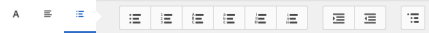

# Fragments de document{#document-fragments}

## Fragments de document {#document-fragments-1}

Les fragments de document sont des parties/composants réutilisables d’une correspondance qui vous permettent de composer des lettres/correspondances. Les fragments de document sont composés des types suivants :

* **Texte** : Un actif de texte est un élément de contenu comprenant un ou plusieurs paragraphes de texte. Un paragraphe peut être statique ou dynamique.
* **Liste** : la liste est un groupe de fragments de document, incluant du texte, des listes, des conditions et des images. L’ordre des éléments de la liste peut être fixe ou modifiable. Lors de la création d’une lettre, vous pouvez utiliser certains ou tous les éléments de liste pour répliquer un modèle d’éléments réutilisable.
* **Condition** : les conditions vous permettent de définir le contenu à inclure lors de la création d’une correspondance, en fonction des données fournies. La condition est décrite en termes de variables de contrôle. Une variable de contrôle peut être un élément de dictionnaire de données ou un espace réservé.
* **Fragment de disposition** : il s’agit d’une mise en page pouvant être utilisée dans une ou plusieurs lettres. Un fragment de disposition est utilisé pour créer des modèles répétables, en particulier des tableaux dynamiques. La disposition peut comporter des champs de formulaire types comme « Adresse » et « Numéro de référence ». Elle contient également des sous-formulaires vides indiquant les zones cible. Les dispositions (XDP) sont créées dans Designer, puis sont téléchargées sur AEM Forms.

## Texte {#text}

Une ressource texte est un élément de contenu comprenant un ou plusieurs paragraphes de texte. Un paragraphe peut être statique ou dynamique. Un paragraphe dynamique contient des références à des éléments de données dont les valeurs sont fournies au moment de l’exécution. Par exemple, le nom du client ou de la cliente dans une formule de salutation pourra être un élément de données dynamique dont la valeur sera rendue disponible au moment de l’exécution. En modifiant ces valeurs, le même modèle de lettre peut être utilisé pour générer d’autres lettres pour différents clientes et clients.

La solution Correspondence Management prend en charge deux types d’éléments de données dynamiques (données variables) :

* **Éléments du dictionnaire de données** : ces éléments sont liés au dictionnaire de données et leurs valeurs proviennent de la source de données fournie. Une variable du dictionnaire de données peut être protégée ou non protégée. Lors de la création d’une correspondance, l’utilisateur ou l’utilisatrice peut modifier la valeur par défaut des variables du dictionnaire de données non protégées, mais ne peut pas modifier celles qui sont protégées.
* **Espaces réservés** : il s’agit de variables qui ne sont pas liées à une source de données d’arrière-plan. Ils requièrent que l’utilisateur ou l’utilisatrice remplisse une valeur lors de la création de la correspondance. Par défaut, les espaces réservés ne sont pas protégés.

>[!NOTE]
>
>Les modèles de Correspondence Management ne vous forcent pas à créer des noms uniques lors de la création d’espaces réservés. Si vous créez deux espaces réservés portant le même nom, tels qu’un texte et une condition, et que vous les utilisez tous les deux dans un modèle de lettre, les valeurs de l’espace réservé inséré en dernier seront utilisées pour les deux espaces réservés. Si deux espaces réservés portent le même nom, leurs types sont comparés. Si les types sont différents leur type devient String (Chaîne). Toutefois, dans un module, vous ne pouvez pas créer plusieurs espaces réservés portant le même nom.

### Créer du texte {#create-text}

1. Sélectionnez **Formulaires** > **Fragments de document**.
1. Sélectionner **Créer** > **Texte** Vous pouvez également sélectionner une ressource de texte et sélectionner **Modifier**.
1. Spécifiez les informations suivantes pour le texte :

   * **Titre : (facultatif)** saisissez le titre de la ressource texte. Les titres n’ont pas besoin d’être uniques et peuvent contenir des caractères spéciaux et des caractères non anglais. Les textes sont référencés par leur titre (le cas échéant) comme dans les vignettes et les propriétés de l’actif.
   * **Nom :** Saisissez un nom unique pour l’actif de texte. Deux ressources (texte, condition ou liste) ne peuvent porter le même nom, peu importe leur état. Dans le champ Nom, vous pouvez saisir uniquement des caractères, des chiffres et des tirets de langue anglaise. Le champ Nom est automatiquement renseigné en fonction du champ Titre. Les caractères spéciaux, les espaces, les chiffres et les caractères non anglais saisis dans le champ Titre sont remplacés par des tirets dans le champ Nom. Bien que la valeur du champ Titre soit automatiquement copiée dans Nom, vous pouvez la modifier.
   * **Description** : saisissez une description de la ressource.
   * **Dictionnaire de données** : Si vous le souhaitez, sélectionnez le dictionnaire de données auquel mapper l’actif. Cet attribut vous permet d’ajouter des références aux éléments du dictionnaire de données dans la ressource texte.
   * **Balises** : éventuellement, pour créer une balise personnalisée, entrez la valeur dans le champ de texte et appuyez sur Entrée. Vous pouvez voir votre balise sous le champ de texte des balises. Lorsque vous enregistrez ce texte, les balises nouvellement ajoutées sont également créées.

1. Sélectionner **Suivant**. Correspondence Management affiche la page Éditeur, où vous pouvez ajouter les paragraphes et les éléments de données de texte au texte.

   Le vérificateur orthographique par défaut de votre navigateur vérifie l’orthographe dans l’éditeur de texte. Pour gérer les vérifications d’orthographe et de grammaire, vous pouvez modifier les paramètres du vérificateur orthographique de votre navigateur ou installer des plug-ins/modules complémentaires externes de navigateur pour vérifier l’orthographe et la grammaire.

   Vous pouvez également utiliser les nombreux raccourcis clavier dans l’éditeur de texte pour gérer, modifier et mettre en forme le texte. Pour plus d’informations sur les raccourcis clavier de [l’Éditeur de texte](/help/forms/using/keyboard-shortcuts.md#p-formatting-p) dans les Raccourcis clavier de Correspondence Management.

1. Un éditeur de texte s’ouvre. Entrez le texte. Utilisez la barre d’outils située en haut de la page pour mettre en forme le texte, les conditions d’insertion, le lien et les sauts de page.

   

   * **Lien** : Insérer un lien [hypertexte](#insert-hyperlink) dans le texte.
   * **Répéter** : Imprime l’élément Collection dans le dictionnaire de données au moyen d’un délimiteur.
   * **Condition**: sélectionnez cette option pour insérer une condition. Insérez du texte en fonction de la condition. Si la condition est true, le texte est visible dans la lettre. Dans le cas contraire, il n’est pas visible.
   * **Ajouter la description** : ajouter une annotation à un fragment de texte. Il s’agit de métadonnées visibles pour l’auteur mais pas d’une partie de la lettre créée.
   * **Saut de page** : Si vous définissez l’attribut de saut de page d’un module de texte sur false, le module de texte n’est pas fractionné sur plusieurs pages.

   L’éditeur de texte s’ouvre. Saisissez le texte. La barre d’outils change selon le type de modifications que vous souhaitez effectuer : paragraphes, alignement ou liste :

   

   Sélectionner le type de barre d’outils : paragraphe, alignement ou liste

   

   Barre d’outils Paragraphe
   Barre d’outils d’alignement

   

   Barre d’outils Liste (Cliquez pour afficher l’image en taille réelle).

1. Pour réutiliser un ou plusieurs paragraphes de texte existant dans une autre application, comme des pages MS Word ou HTML, copiez et collez le texte dans l’éditeur de texte. La mise en forme du texte copié est conservée dans l’éditeur de texte.

   Vous pouvez copier et coller un ou plusieurs paragraphes de texte dans un module de texte modifiable. Par exemple, vous pouvez disposer d’un document MS Word avec une liste à puces de preuves de résidence acceptables, comme suit :

   

   Vous pouvez directement copier et coller le texte du document MS Word dans un module de texte modifiable. La mise en forme, telle que la liste à puces, la police et la couleur du texte, est conservée dans le module de texte.

   

   >[!NOTE]
   >
   >Toutefois, la mise en forme du texte collé présente certaines [restrictions](https://helpx.adobe.com/fr/aem-forms/kb/cm-copy-paste-text-limitations.html).

1. Au besoin, insérez des caractères spéciaux dans le fragment de document. Vous pouvez, par exemple, utiliser la palette des caractères spéciaux pour insérer les caractères suivants :

   * Symboles de devise tels que €,￥et £
   * Symboles mathématiques tels que ∑, √, ∂ et ^
   * Symboles de ponctuation tels que « et »

   

   Correspondence Management offre une prise en charge intégrée de 210 caractères spéciaux. L’administrateur peut [ajouter la prise en charge de plus de caractères/de caractères spéciaux grâce à la personnalisation](/help/forms/using/custom-special-characters.md).

1. Pour mettre en surbrillance/mettre en évidence des parties de texte dans un module intégré modifiable, sélectionnez le texte et choisissez Couleur de surbrillance.

   

   Vous pouvez sélectionner directement une couleur de base. `**[A]**` dans la palette Couleurs de base ou sélectionnez **Sélectionner** après avoir utilisé le curseur `**[B]**` pour choisir l’nuance appropriée de la couleur.

   Vous pouvez également accéder à l’onglet Avancé pour sélectionner la teinte, la luminosité et la saturation appropriées. `**[C]**` pour créer une couleur précise, puis sélectionnez Sélectionner `**[D]**` pour appliquer la couleur pour mettre le texte en surbrillance.

   

1. Dans le panneau de données, effectuez un glisser-déposer des éléments du dictionnaire de données et des éléments d’espace réservé dans le texte.

   Pour :

   * Ajoutez un élément du dictionnaire de données dans le texte, sélectionnez un élément de données dans la liste, puis choisissez Insérer ( ). Si vous sélectionnez Protégé, l’élément de dictionnaire de données est en lecture seule et il apparaît dans l’éditeur de lettre, mais pas dans l’interface utilisateur de création de correspondance ni dans le créateur de correspondance.
   * Ajoutez un élément d’espace réservé dans le texte. Dans le panneau Éléments de données, sélectionnez Créer, saisissez les détails du nouvel élément de données, puis sélectionnez Créer pour ajouter le nouvel élément à la liste. Le nouvel espace réservé peut être inséré dans le texte de la même manière que l’élément du dictionnaire de données. Pour modifier un espace réservé, sélectionnez-le, puis choisissez Modifier.

   

   Éléments d’espace réservé comme spécifié dans le fichier de données d’exemple d’un dictionnaire de données

   

   Valeurs des éléments d’espace réservé dans la vue CCR renseignée des variables de dictionnaire de données comme spécifié dans le fichier de données d’exemple

   Vous pouvez également utiliser le symbole @ pour rechercher et ajouter des éléments du dictionnaire de données et de l’espace réservé dans l’éditeur de texte. Placez le curseur à l’endroit où vous souhaitez insérer l’élément. Saisissez @ suivi de la chaîne de recherche. L’éditeur de texte effectue l’opération de recherche sur tous les éléments du dictionnaire de données et de l’espace réservé disponibles dans le fragment de document texte. L’opération de recherche récupère et affiche les éléments contenant la chaîne de recherche sous forme de liste déroulante. Parcourez les résultats de la recherche et cliquez sur l’élément à insérer à l’emplacement du curseur. Appuyez sur Échap pour masquer les résultats de la recherche.

1. Vous pouvez utiliser des conditions intégrés et la répétition afin que votre lettre soit hautement contextuelle et parfaitement structurée. Pour plus d’informations sur les conditions intégrées et la répétition, consultez la section [Conditions intégrées et répétition dans les lettres](/help/forms/using/cm-inline-condition.md).
1. Sélectionnez **Enregistrer**.

#### Insérer un hyperlien dans un texte {#insert-hyperlink}

Pour créer un lien hypertexte dans une ressource de texte, procédez comme suit :

1. Sélectionnez le texte ou l’objet de modèle de données dans l’éditeur de texte.

2. Sélectionner **[!UICONTROL Lien]**. Sélectionner **[!UICONTROL Texte de remplacement]** pour supprimer le nom ou le texte de l’objet de modèle de données existant.

3. Spécifiez l’URL et sélectionnez .

#### Recherche et remplacement de texte {#searching-and-replacing-text}

Lorsque vous travaillez avec des éléments de texte contenant un grand corps de texte, vous pouvez avoir besoin de rechercher une chaîne de caractères précise. Voire de remplacer une chaîne de caractères précise par une autre chaîne.

La fonction Rechercher et remplacer permet de rechercher (et de remplacer) n’importe quelle chaîne de texte dans un élément de texte. La fonction comprend également une recherche d’expression régulière puissante.

#### Pour rechercher du texte dans un module de texte {#to-search-text-in-a-text-module}

1. Ouvrez le module de texte dans l’éditeur de texte.

1. Sélectionnez Rechercher et remplacer.
1. Saisissez le texte à rechercher dans la zone de texte Rechercher et appuyez sur Rechercher. La recherche de texte est mise en surbrillance dans le module de texte.
1. Pour rechercher l’occurrence suivante, cliquez à nouveau sur Rechercher.

   Si vous continuez à appuyer sur le bouton Rechercher, la recherche se poursuit jusqu’au bas de la page. Une fois la dernière occurrence trouvée, le message **Fin du module atteinte** s’affiche, indiquant qu’aucun autre résultat n’a été trouvé.

   Toutefois, si aucune instance du texte à rechercher n’est trouvée dans le module de texte, le message affiché est :**Aucune correspondance trouvée**.

1. Si vous appuyez à nouveau sur Rechercher, la recherche se poursuit dans la partie supérieure de la page.

#### Options de recherche {#search-options}

**Respect de la casse :** la recherche renvoie uniquement les résultats respectant la casse.

**Mot entier :** la recherche renvoie uniquement des mots entiers.

>[!NOTE]
>
>Si vous saisissez des caractères spéciaux dans le champ Rechercher, l’option Mot entier est désactivée.

**Exp. rég. :** recherche à l’aide d’expressions régulières. Par exemple, l’expression régulière suivante recherche des adresses électroniques dans un module de texte :

`[a-zA-Z0-9._%+-]+@[a-zA-Z0-9.-]+\.[a-zA-Z]{2,4}`

#### Pour rechercher et remplacer du texte dans un module de texte {#to-search-and-replace-text-in-a-text-module}

1. Ouvrez le module de texte dans l’éditeur de texte.
1. Sélectionnez Rechercher et remplacer.
1. Saisissez le texte à rechercher dans la zone de texte Rechercher et le texte à remplacer par le texte recherché et appuyez sur Remplacer.
1. Si le texte de recherche est trouvé, il est remplacé par le texte de remplacement.

   * Si une autre occurrence du texte de recherche est trouvée, elle est mise en surbrillance dans le module de texte. Si vous appuyez à nouveau sur Remplacer, l’instance mise en surbrillance est remplacée et le curseur se déplace vers l’avant, si une troisième instance est trouvée.
   * Si aucune autre instance n’est trouvée, le curseur s’arrête à la dernière instance remplacée.

1. Si vous appuyez à nouveau sur Rechercher, la recherche se poursuit dans la partie supérieure de la page.

   Utilisez l’option Tout remplacer pour remplacer toutes les occurrences dans le module de texte. Lorsque vous effectuez cette opération, le nombre de remplacements est affiché sous la forme d’un message dans la boîte de dialogue Rechercher et remplacer.

#### Bonnes pratiques/conseils et astuces pour les modules de texte {#best-practices-tips-and-tricks-for-text-modules}

* Utilisez une convention de nommage cohérente pour éviter la duplication.
* Utilisez la liaison de dictionnaire de données appropriée dans les modules de texte.
* Les règles suivantes s’appliquent lors de l’utilisation de l’éditeur de texte pour la modification d’une ressource de texte :

   * **Ajout de variable :** Autorisé
   * **Retrait de variable :** Autorisé
   * **Mise à jour des propriétés :** Autorisée
   * **Modification des données du dictionnaire :** Autorisé tant que l’élément du dictionnaire de données n’est pas utilisé. Vous ne pouvez pas modifier le dictionnaire de données lors de la mise à jour.

## Liste {#list}

Une liste est un groupe de fragments du document, notamment du texte, des listes (différentes), des conditions et des images. L’ordre des éléments de la liste peut être fixe ou modifiable. Lors de la création d’une lettre, vous pouvez utiliser certains ou tous les éléments de liste pour répliquer un modèle d’éléments réutilisable. Les listes se comportent fondamentalement comme des cibles qui peuvent être imbriquées dans d’autres cibles.

### Implémenter des listes {#implementing-lists}

L’implémentation des listes comprend deux étapes :

1. la définition des propriétés de base telles que le nom, la description et le dictionnaire de données ;
1. la section du contenu faisant partie de la liste, puis la définition de propriétés telles que l’ordre de verrouillage et l’accès à la bibliothèque pour la liste.

### Créer une liste {#create-a-list}

Une liste est un groupe de contenu associé qui peut être utilisé dans un modèle de lettre comme une seule unité. Tout type de contenu peut être ajouté à une liste. Les listes peuvent également être imbriquées. Les modules de liste peuvent être spécifiés comme :

* **Classé en ordre** : l’ordre ne peut pas être modifié dans l’exécution de création d’une correspondance.
* **Accès à la bibliothèque** : les utilisateurs et utilisatrices peuvent ajouter des modules à la liste. Cet indicateur spécifie si l’accès à la bibliothèque est activé. S’il est activé (ouvert), l’utilisateur ou l’utilisatrice peut ajouter des modules à la liste tout en prévisualisant la lettre.
* Lors de la création d’une liste, vous pouvez spécifier un type, par exemple :
* **Classique** : aucun style supplémentaire de mise en forme n’est appliqué à la liste.
* **À puces** : une liste formatée avec une puce simple.
* **Numérotée** : une liste numérique avec le choix entre les nombres standard (1, 2,...), romains majuscules (I, II, ...) et romains minuscules (i, ii, etc.).
* **Avec lettres** : une liste alphabétique permettant de choisir entre minuscules (a, b, etc.) et majuscules (A, B, etc.).
* **Personnalisée** : vous pouvez créer n’importe quel type numéroté/avec lettres, ainsi que les valeurs de préfixe et de suffixe de votre choix.

1. Sélectionnez **Formulaires** > **Fragments de document**.

1. Sélectionnez **Créer** > **Liste**.

1. Spécifiez les informations suivantes pour la liste :

   * **Titre (facultatif) : saisissez** le titre de la liste. Le titre n’a pas besoin d’être unique et peut contenir des caractères spéciaux et des caractères non anglais. Les listes sont référencées par leur titre (le cas échéant) comme dans les vignettes et les propriétés de la ressource.
   * **Nom :** il s’agit du nom unique de la liste. Deux ressources (texte, condition ou liste) ne peuvent porter le même nom, peu importe leur état. Dans le champ Nom, vous pouvez saisir uniquement des caractères, des chiffres et des tirets de langue anglaise. Le champ nom est automatiquement renseigné par la valeur dans le champ Titre. Les caractères spéciaux, les espaces, les chiffres et les caractères non anglais saisis dans le champ Titre sont remplacés par des tirets dans le champ Nom. Bien que la valeur du champ Titre soit automatiquement copiée dans Nom, vous pouvez la modifier.
   * **Description (facultatif)** : entrez une description de la ressource.
   * **Élément de données (facultatif)** : sélectionnez le dictionnaire de données auquel se connecter. Seules les ressources qui utilisent le même dictionnaire de données que la liste ou celles auxquelles aucun dictionnaire de données n’est affecté peuvent être ajoutées à la liste. L’affectation d’un dictionnaire de données à une liste permet à la personne qui crée un modèle de lettre de trouver plus facilement la liste appropriée.
   * **Balises (facultatives)** : sélectionnez les balises à appliquer. Vous pouvez également saisir un nouveau nom de balise pour créer une balise. (La nouvelle balise est créée lorsque vous sélectionnez **Enregistrer**.)

1. Sélectionnez **Suivant**.
1. Sélectionnez **Ajouter un actif**.
1. Pour ajouter des ressources à la liste, sélectionnez-les sur la page Sélectionner les ressources et sélectionnez **Terminé**.

   

1. Les actifs sont ajoutés à la page Eléments de la liste.
Pour modifier l’ordre des actifs dans la liste, cliquez sur l’icône des flèches (  ) et effectuez un glisser-déposer. Lorsque l’utilisateur ouvre un modèle de courrier dans l’interface utilisateur de création de correspondance, le contenu est assemblé dans l’ordre que vous avez défini ici.

   

1. Vous pouvez sélectionner les options suivantes pour spécifier le comportement de la liste dans l’interface utilisateur CCR :

   * **Accès à la bibliothèque**: pour activer l’accès à la bibliothèque pour l’ajout de ressources, sélectionnez Accès à la bibliothèque. Lorsque l’accès à la bibliothèque est activé, l’utilisateur ou l’utilisatrice peut ajouter plus de contenu à la liste. Dans le cas contraire, l’utilisateur ou l’utilisatrice se limite au contenu que vous avez défini pour la liste.
   * **Ordre de verrouillage**: pour verrouiller l’ordre des actifs dans la liste de sorte que l’utilisateur ne puisse pas modifier l’ordre, sélectionnez Verrouiller l’ordre. Si vous ne sélectionnez pas cette option, l’utilisateur ou l’utilisatrice pourra modifier l’ordre des éléments de la liste.

   * **Ajout de puces** : utilisez cette option pour appliquer une puce ou un style de numérotation au module. Vous pouvez utiliser un style de liste prédéfini ou personnalisé. Vous pouvez également indiquer le texte à afficher avant et après chaque élément de liste.
   * **Saut de page** : sélectionnez cette option () pour insérer un saut de page entre les contenus de liste. Lorsque cette option n’est pas sélectionnée (), si le contenu de la liste déborde sur la page suivante, la liste entière est décalée vers la page suivante au lieu de faire un saut dans la page entre la liste.

   * **Configuration de l’affectation** : utilisez cette option pour spécifier le nombre minimal et maximal de ressources pouvant être ajoutées à la liste.

1. Vous pouvez sélectionner les options suivantes pour spécifier le comportement de la liste au moment de l’exécution :

   * **Modifiable** : Lorsque cette option est sélectionnée, le contenu peut être modifié dans l’interface utilisateur de création de correspondance. (Cette option n’est pas disponible pour les modules de liste et d’image).
   * **Obligatoire** : Lorsque cette option est sélectionnée, le contenu est obligatoire dans l’interface utilisateur de création de correspondance.
   * **Sélectionné** : Lorsque cette option est sélectionnée, le contenu est présélectionné dans l’interface utilisateur de création de correspondance.
   * **Sauter les puces et la numérotation** : Lorsque cette option est sélectionnée, le contenu n’utilise pas les puces et la numérotation dans l’interface utilisateur de création de correspondance. (Cette option n’est pas disponible pour les modules d’image. En outre, parmi les options Sauter les puces et la numérotation, Composé et Ignorer le style de liste, une seule des options peut être appliquée à un module. L’une de ces options peut être utilisée pour un module lorsque vous sélectionnez Ajout de puces pour un module.)
   * **Mise en retrait** : Vous pouvez modifier le niveau de mise en retrait de chaque module/contenu sélectionné pour faire partie de la liste. La mise en retrait est spécifiée en termes de niveaux (en commençant par zéro), de sorte que chaque niveau de retrait corresponde à une marge de 36 points.
   * **Composé :** Lorsqu’elle est sélectionnée, la numérotation composée est appliquée comme une combinaison du style de la liste extérieure (parente) et de son propre style. La numérotation composée de cette liste imbriquée est basée sur l’ordre dans lequel cette liste imbriquée apparaît dans la liste extérieure.
   * **Ignorer le style de liste** : Si l’option Numérotation composée est désélectionnée, l’option Ignorer le style de liste est activée. Cette sélection ignore le style de la liste imbriquée et la numérotation se poursuit à partir de la liste extérieure. Par conséquent, les modules de la liste imbriquée sont traités comme faisant partie de la liste extérieure elle-même, indépendamment des styles spécifiés dans la liste imbriquée. Si l’option Ignorer le style de liste est désélectionnée pour une liste imbriquée, les modules qui font partie de cette liste imbriquée ont leur propre style de numérotation.
   * **Sous-formulaire solidaire :** Définit le saut de page des actifs d’une liste. Si vous définissez la propriété Sous-formulaire solidaire pour l’un des actifs d’une liste sur **On**, cet actif et l’actif suivant resteront sur la même page. Cela signifie que le contenu de la ressource sélectionnée et de la ressource suivante ne sera pas fractionné sur plusieurs pages.

1. Sélectionnez **Enregistrer**.

### Bonnes pratiques/conseils et astuces {#best-practices-tips-and-tricks}

* Utilisez une convention de nommage cohérente pour éviter la duplication.
* Associez le dictionnaire de données de manière appropriée.
* Les règles suivantes s’appliquent lorsque vous utilisez l’éditeur de liste pour modifier une liste :

   * Mise à jour des propriétés : Autorisée
   * **Modification du dictionnaire de données :** Autorisé tant qu’aucun élément utilisant le dictionnaire de données n’y est associé. Vous ne pouvez pas modifier le dictionnaire de données lors de la mise à jour.

## Conditions {#conditions}

Les conditions vous permettent de définir le contenu à inclure lors de la création d’une correspondance/lettre, en fonction des données fournies. La condition est décrite en termes de variables de contrôle. Lorsque vous ajoutez une condition, vous pouvez choisir d’inclure une ressource en fonction de la valeur de la variable de contrôle.

Selon les options que vous choisissez, seule la première expression qui s’avère vraie, basée sur la variable de condition actuelle, est évaluée, ou toutes les conditions. Lors du remplissage de la lettre dans Create Correspondence (CCR), les conditions se comportent comme des « boîtes blanches ». Si une condition entraîne une liste, tous les éléments obligatoires et présélectionnés de la liste se trouvent dans la sortie. Si l’un de ces éléments est lui-même une condition ou une liste, le contenu qui en résulte est également généré, dans l’ordre décroissant et de profondeur, sous la forme d’une liste plate de contenu textuel et d’image. Les résultats de la condition peuvent être de n’importe quel type (texte, liste, condition ou image).

### Conditions d’implémentation {#implementing-conditions}

L’éditeur de conditions est fourni avec une interface utilisateur [Générateur d’expression](/help/forms/using/expression-builder.md), qui prend en charge la création d’expressions à l’aide à la fois de plusieurs espaces réservés et d’éléments du dictionnaire de données. Vous pouvez utiliser sur ces expressions des opérandes communs et des fonctions locales/globales. Chaque expression peut être associée à un certain contenu et il peut éventuellement y avoir une section par défaut si aucune des expressions n’est évaluée comme vraie. Toutes les expressions sont évaluées dans l’ordre dans lequel elles sont définies et les premières expressions renvoyant la valeur true sont sélectionnées et le contenu associé est renvoyé par ce module conditionnel.

Par exemple, si le texte des conditions générales d’une lettre diffère selon l’État où réside le client ou la cliente, et si le dictionnaire de données contient un élément appelé « État », vous pouvez ajouter la condition de la manière suivante :
* Si l’État = NY, sélectionnez le paragraphe de texte T&amp;C_NY.
* Si l’État = NC, sélectionnez le paragraphe de texte T&amp;C_NC.

L’éditeur de conditions vous permet de spécifier une condition par défaut. Si la valeur des variables de contrôle ne correspond à aucune condition, alors le contenu associé à la condition par défaut est utilisé. En suivant l’exemple précédent, vous pouvez ajouter cette ligne de condition :
* Par défaut, sélectionnez T&amp;C_Rest.

### Créer une condition {#create-a-condition}

1. Sélectionnez **Formulaires** > **Fragments de document**.
1. Sélectionnez **Créer > Condition**.
1. Spécifiez les informations suivantes pour la liste :

   * **Titre (facultatif) :** saisissez le titre de la condition. Le titre n’a pas besoin d’être unique et peut contenir des caractères spéciaux et des caractères non anglais. Les conditions sont référencées par leur titre (le cas échéant), comme dans les vignettes et les propriétés de la ressource.
   * **Nom :** nom unique de la condition. Deux ressources (texte, condition ou liste) ne peuvent porter le même nom, peu importe leur état. Dans le champ Nom, vous pouvez saisir uniquement des caractères, des chiffres et des tirets de langue anglaise. Le champ Nom est automatiquement renseigné en fonction du champ Titre. Les caractères spéciaux, les espaces, les chiffres et les caractères non anglais saisis dans le champ Titre sont remplacés par des tirets dans le champ Nom. Bien que la valeur du champ Titre soit automatiquement copiée dans Nom, vous pouvez la modifier.
   * **Description (facultatif) :** saisissez une description de la condition.
   * **Dictionnaire de données (facultatif)** : sélectionnez le dictionnaire de données auquel se connecter. Seules les ressources qui utilisent le même dictionnaire de données que la condition ou celles auxquelles aucun dictionnaire de données n’a été attribué peuvent être ajoutées à la liste. L’attribution d’un dictionnaire de données à une liste permet à la personne créant un modèle de lettre de trouver plus facilement la condition appropriée.
   * **Balises (facultatif)** : sélectionnez les balises à appliquer. Vous pouvez également saisir un nouveau nom de balise pour créer une balise. (La nouvelle balise est créée lorsque vous sélectionnez **Enregistrer**.)

1. Sélectionnez **Suivant**.
1. Sélectionnez **Ajouter un actif**.
1. Pour ajouter un actif à la condition, sélectionnez-le sur la page Sélectionner les actifs et sélectionnez **Terminé**. Les actifs sont ajoutés au volet Expression.
1. Vous pouvez sélectionner les options suivantes pour spécifier le comportement de la condition au moment de l’exécution :

   * **Désactiver l’évaluation de résultats multiples\Activer l’évaluation de résultats multiples** : lorsque cette option est activée (qu’elle apparaît comme « Activer l’évaluation… »), toutes les conditions sont évaluées et le résultat est la somme de toutes les conditions vraies (true). Si cette option est désactivée (« Désactiver l’évaluation… »), alors seule la première condition vérifiée est évaluée et devient la sortie de la condition.
   * **Saut de page** : sélectionnez cette option () pour insérer un saut de page entre les modules des conditions. Lorsque cette option nʼest pas sélectionnée () et quʼune condition déborde sur la page suivante, la condition entière est décalée vers la page suivante, au lieu de marquer un saut de page entre les modules.

1. Pour modifier l’ordre des actifs dans la condition, cliquez sur l’icône de flèches (  ) et effectuez un glisser-déposer. Lorsque l’utilisateur ouvre un modèle de courrier dans l’interface utilisateur de création de correspondance, le contenu est assemblé dans l’ordre que vous avez défini ici.
1. Sélectionner **Supprimer** pour supprimer la ligne. Si vous sélectionnez Supprimer pour la ligne par défaut, efface uniquement les informations de la ressource.
1. Sélectionner **Copier** pour dupliquer une ligne.
1. Sélectionner **Modifier** pour modifier l’actif ou l’expression.

   Par ailleurs :

   * Pour mettre à jour la ressource, sélectionnez l’icône de dossier dans la colonne Ressource .
   * Pour ouvrir le Générateur d’expression afin d’insérer une expression, sélectionnez l’icône de dossier située sous la colonne Expression . Pour plus d’informations sur le Générateur d’expression, consultez la section [Générateur d’expression](/help/forms/using/expression-builder.md).

### Bonnes pratiques, conseils et astuces {#best-practices-tips-and-tricks-1}

* Adoptez une convention de nommage cohérente pour rechercher facilement vos ressources et éviter la duplication.
* Les conditions se comportent comme des instructions Case ; l’ordre des conditions a donc son importance. La première correspondance est renvoyée.
* Associez le dictionnaire de données de manière appropriée.
* Les règles suivantes s’appliquent lorsque vous utilisez l’éditeur de conditions pour modifier une condition :

   * **Ajout de variable :** Autorisé
   * **Retrait de variable :** Autorisé
   * **Mise à jour des propriétés :** Autorisée
   * **Modification des données du dictionnaire :** Autorisé tant que l’élément du dictionnaire de données n’est pas utilisé.

## Fragments de disposition {#layoutfragments}

Un fragment de disposition est basé sur des fichiers XDP créés dans Designer. Pour créer des fragments de disposition vous devez créer les fichiers XDP et les [télécharger vers AEM Forms](/help/forms/using/import-export-forms-templates.md).

Un ou plusieurs fragments de disposition peuvent former des parties d’une lettre et définir la mise en page graphique de ces parties. Un fragment de disposition peut contenir des champs de formulaire standard, tels que l’adresse et le numéro de référence, et des sous-formulaires vides indiquant les zones cible. En outre, les fragments de mise en page permettent de créer des tableaux et de les insérer dans des lettres.

Prenez le cas d’utilisation courant suivant : localisez les modèles de disposition réutilisables dans les lettres, puis créez des fragments de disposition pour eux. Par exemple, les formules de politesse, l’adresse et l’objet de la lettre sont souvent agencés de manière uniforme dans plusieurs lettres. Un autre exemple peut être un nombre de lignes similaire et des colonnes du tableau utilisés dans plusieurs lettres.

Vous pouvez créer un fragment de disposition basé sur un fichier XDP existant. Un fragment de disposition peut être constitué de champs et de zones cible ou d’un ou plusieurs tableaux. Les tableaux d’une disposition peuvent être statiques ou dynamiques. Un fichier XDP est créé dans Designer et [téléchargé sur AEM Forms](/help/forms/using/import-export-forms-templates.md). Un fichier XDP peut former la structure d’un fragment de disposition ou d’une lettre. Plus d’informations sur la [conception de la disposition](/help/forms/using/layout-design-details.md).

L’utilisation de fragments liés à des zones cible permet de modifier la lettre au moment de la création. Des fragments de disposition de différentes dimensions peuvent être créés et le fragment approprié peut être lié à la zone cible. Les fragments de mise en page permettent également de personnaliser certaines des propriétés du tableau :

1. Vous pouvez augmenter le nombre de lignes et de colonnes.
1. Vous pouvez spécifier le texte de l’en-tête et du pied de page pour d’autres lignes et colonnes.
1. Vous pouvez définir le rapport largeur/hauteur des colonnes du tableau. Au moment de l’exécution, les colonnes du tableau sont redimensionnées en fonction du rapport défini et de l’espace disponible. La somme du rapport de largeur doit être 100. Dans le cas contraire, il n’est pas applicable.
1. Si un tableau est un espace réservé (ne contenant qu’une seule cellule vide), vous pouvez définir le type (zone cible/champ) des nouvelles colonnes.
1. Vous pouvez masquer les lignes d’en-tête et de pied de page.

Avant d’effectuer cette procédure, créez un fragment XFA à l’aide de Designer. Le fragment peut contenir des tableaux pour organiser les champs et les zones cible. Designer permet la création de deux types de tableaux : statique et dynamique. Les tableaux statiques contiennent un nombre fixe de lignes. Les tableaux statiques peuvent contenir des zones cible et des champs. Ces zones cible et champs ne peuvent pas être liés à des DDE répétés. Un tableau dynamique peut également comporter une seule ligne. Les données liées à des cellules déterminent le nombre des lignes des tableaux dynamiques. Un tableau dynamique ne peut contenir que des champs. Les DDE peuvent être répétés ou non répétés.

Tenez compte des points suivants lors de la conception de tableaux :

1. Les tableaux peuvent être personnalisés au moment de la création de fragments de mise en page. Toutefois, l’option de personnalisation n’est activée que lorsque le sous-formulaire parent du tableau est distribué.
1. Dans le cas des tableaux dynamiques, pour tous les champs, les lignes répétables et le tableau, utilisez la liaison « use name » pour que les données soient fusionnées correctement.
1. Pour les tableaux dynamiques, tous les DDE répétés liés aux champs du tableau font partie de la même hiérarchie. Pour les DDE non répétés, il n’existe aucune restriction de ce type.
1. Au moment de la fusion du fragment de mise en page dans la zone cible parent, les tableaux sont redimensionnés, en fonction de l’espace disponible ; mais le redimensionnement ne s’effectue que lorsque le fragment de mise en page ne contient pas de zone cible ou de champ directement au sein du sous-formulaire de niveau supérieur. La zone cible et les champs dans le tableau sont autorisés.
1. Vous pouvez créer des tableaux d’espaces réservés. Les tableaux d’espaces réservés ne comportent qu’une seule cellule vide.

* Pour les tableaux d’espaces réservés, vous pouvez personnaliser les propriétés suivantes au moment de la création de fragments :

   * nombre de lignes ;
   * nombre de colonnes ;
   * en-tête et pied de page pour chaque colonne ;
   * type (zone cible/champ) de chaque colonne ;
   * rapport de largeur pour chaque colonne.

* Pour un tableau d’espaces non réservés, vous pouvez personnaliser les propriétés suivantes :

   * nombre de lignes ;
   * nombre de colonnes ;
   * en-tête et pied de page pour une colonne supplémentaire ;
   * rapport de largeur pour chaque colonne.

Vous pouvez imbriquer des fragments dans une lettre. Cela signifie que vous pouvez ajouter un fragment dans un fragment. La solution Correspondence Management prend en charge jusqu’à quatre niveaux d’imbrication dans une lettre : **Lettre *>*Fragment *>*Fragment *>*Fragment *>*Fragment.**

Pour un exemple détaillé de l’utilisation de tableaux statiques et dynamiques dans des fragments de disposition, voir [Exemple avec des fichiers modèles : utiliser des tableaux statiques et dynamiques dans une lettre](#examplewithsamplefiles).

### Création d’un fragment de mise en page {#creating-a-layout-fragment}

1. Sélectionnez **Créer** > **Fragment de disposition**.
1. Correspondence Management affiche les fichiers XDP disponibles. Sélectionnez le fichier XDP sur lequel vous souhaitez baser votre fragment de mise en page et sélectionnez **Suivant**.
1. Spécifiez les informations suivantes pour la mise en page :

   * **Titre (facultatif) :** Entrez le titre du fragment de mise en page. Le titre n’a pas besoin d’être unique et peut contenir des caractères spéciaux et des caractères non anglais. Les fragments de disposition sont référencés par leur titre (le cas échéant), comme dans les vignettes et les propriétés de la ressource.
   * **Nom :** nom unique du fragment de disposition. Deux ressources (texte, condition ou liste) ne peuvent porter le même nom, peu importe leur état. Dans le champ Nom, vous pouvez saisir uniquement des caractères, des chiffres et des tirets de langue anglaise. Le champ Nom est automatiquement renseigné en fonction du champ Titre. Les caractères spéciaux, les espaces, les chiffres et les caractères non anglais saisis dans le champ Titre sont remplacés par des tirets dans le champ Nom. Bien que la valeur du champ Titre soit automatiquement copiée dans Nom, vous pouvez la modifier. Ce nom apparaît dans la liste de l’interface utilisateur de gestion des ressources.
   * **Description (facultatif)** : la description qui apparaît dans la liste de l’interface utilisateur de gestion des ressources.
   * **Balises (facultatif)** : si vous le souhaitez, sélectionnez les balises à appliquer à la condition. Vous pouvez également taper un nouveau nom de balise pour créer une balise.

1. Sélectionnez la variable **Tableau** et indiquez les informations suivantes pour la mise en page :

   * **Configuration pour** : sélectionnez le tableau à configurer. Dans la liste déroulante, le suffixe du nom de tableau est (Statique) si le tableau est statique ou (Dynamique) si le tableau est dynamique. Les tableaux statiques contiennent un nombre fixe de lignes. Les tableaux statiques peuvent contenir des zones cible et des champs. Ces zones cible et champs ne peuvent pas être liés à des DDE répétés. Les données liées à des cellules déterminent le nombre des lignes des tableaux dynamiques.

   * **Lignes** : sélectionnez le nombre de lignes pour la mise en page. Le nombre de lignes configuré doit être supérieur ou égal au nombre de lignes d’origine.
   * **Colonnes** : Sélectionnez le nombre de colonnes pour la mise en page. Le nombre de colonnes configuré doit être supérieur ou égal au nombre de colonnes d’origine.

   Pour chaque colonne, les détails suivants sont requis :

   * **En-tête** : texte à afficher pour l’en-tête.
   * **Pied de page** : texte à afficher pour le pied de page.
   * **Type** : Le type de colonne supplémentaire : Champ ou zone cible. Le type est activé pour les tableaux d’espaces réservés statiques. Le type peut être défini au niveau des colonnes et non au niveau des cellules. Toutes les cellules d’une colonne étendue sont du même type. Pour un tableau dynamique, toutes les colonnes sont de type Champ. Dans le cas de tableaux autres qu’espaces réservés, vous ne pouvez pas définir le type de colonnes supplémentaires. Dans ce cas, le type des cellules supplémentaires de la colonne étendue est identique au type de la dernière colonne de cette ligne ; et le type de cellule dans une ligne supplémentaire est identique au type de la dernière cellule de cette colonne.
   * **Rapport largeur/hauteur** : Le ratio des largeurs des colonnes du tableau.

   Pour un exemple détaillé sur l’utilisation de tableaux statiques et dynamiques dans des fragments de disposition, consultez la section [Exemple avec fichiers exemple : utiliser des tableaux statiques et dynamiques dans une lettre](#examplewithsamplefiles).

1. Sélectionnez **Enregistrer**.

### Télécharger un fichier XDP vers Correspondence Management {#upload-an-xdp-to-correspondence-management}

Pour obtenir des instructions sur le téléchargement/l’importation d’un fichier XDP vers Correspondence Management, voir [Importation et exportation de ressources vers AEM Forms](/help/forms/using/import-export-forms-templates.md).

### Bonnes pratiques, conseils et astuces {#best-practices-tips-and-tricks-2}

#### Définir la liaison de sous-formulaire par défaut {#set-the-default-subform-binding}

Lors de la création de zones cible dans Designer, il est utile de définir la liaison par défaut de tous les nouveaux sous-formulaires sur « aucune ».

Pour définir la liaison par défaut :

1. Dans Designer, sélectionnez **Outils** > **Options** > **Liaisons de données** > **Liaison de sous-formulaire**.

1. Dans la liste Liaison par défaut pour les nouveaux sous-formulaires, sélectionnez **Aucune liaison de données**.

Cela garantit que les sous-formulaires insérés à l’aide de la commande Insérer > Sous-formulaire ou par glisser-déposer à partir de la palette Objet possèdent une liaison de type « Aucune » par défaut. Cela signifie que, par défaut, tout nouveau sous-formulaire est une zone cible à moins que vous n’y ajoutiez du contenu, que vous ne modifiiez son paramètre de liaison ou que vous ne le renommiez avec un suffixe « _int ».

#### Conformité à la section 508 {#section-compliance}

Si la lettre terminée créée dans l’interface utilisateur de création de correspondance est utilisée pour remplir un workflow ultérieur. Suivez ces recommandations relatives à la section 508 lors de la création de la mise en page. Dans le cas contraire, le PDF des lettres est à afficher et vous pouvez ignorer les recommandations suivantes :

* Tous les sous-formulaires de zone cible et tous les champs d’une mise en page ont un ordre de tabulation.
* Les champs contenant des légendes sont par défaut conformes à la section 508. L’attribut /field/assist/speak@priority du champ est défini par défaut sur « personnalisé », ce qui signifie que, à moins que le texte du lecteur d’écran personnalisé ne soit fourni, le lecteur d’écran lit la légende du champ.
* Les champs sans légende spécifient une info-bulle et indiquent que les lecteurs d’écran lisent l’info-bulle en définissant

`/field/assist/speak@priority="toolTip"` et en spécifiant le texte de lʼinfo-bulle dans `/field/assist/toolTip`.

#### Formats des dates dans Designer et Asset Configuration Manager {#date-formats-in-designer-and-asset-configuration-manager}

Lors de la création d’une mise en page dans Designer, assurez-vous que les formats des champs de dates sont conformes aux formats de date définis dans Data Display Formats dans [Propriétés de configuration de Correspondence Management](/help/forms/using/cm-configuration-properties.md). Pour plus d’informations, reportez-vous à « Formater des valeurs de champ et utiliser des modèles » dans l’aide de Designer.

#### Capturer des plages de dates {#capturing-date-ranges}

Lorsque vous avez affaire à une combinaison de dates, telles que startDate - endDate, utilisez un seul sous-formulaire pour garantir un alignement correct dans la lettre définitive et pour réduire au minimum le nombre de champs.

#### Définir une liaison au niveau du formulaire {#setting-form-level-binding}

Lorsqu’une mise en page contient de nombreux champs et zones cible mappés à des éléments XML uniques, utilisez la liaison au niveau du formulaire et créez un nœud distinct pour chaque élément. Les champs liés au niveau du formulaire sont ignorés lors du mappage des données dans Correspondence Management.

#### N’utilisez pas de zones cible de sous-formulaire dans un gabarit de page. {#do-not-use-subform-target-areas-in-a-master-page}

Les zones cible de sous-formulaire d’un gabarit de page ne sont pas visibles dans l’interface utilisateur de gestion des ressources et les données ne peuvent pas y être mappées.

#### Choisir des positions et des types appropriés pour les zones cible {#choosing-appropriate-positions-and-types-for-target-areas}

Lors de la conception de la mise en page, faites preuve de prudence lors du choix des sous-formulaires. Si la mise en page contient un seul sous-formulaire, il peut s’agir d’un d’un type de mise en page souple. Après avoir positionné des champs dans le sous-formulaire, vous pouvez les placer dans un autre sous-formulaire afin que le sous-formulaire encapsulé soit également souple et que la mise en page ne soit pas perturbée.

#### Placer des champs sur les gabarits de page {#placing-fields-on-master-pages}

Notez ce qui suit lorsque vous placez un champ sur un gabarit de page :

* Définir la liaison des champs de gabarit de page pour utiliser les données globales
* Ne placez pas le champ directement sous la zone PageArea racine du gabarit de page.
* Placez le champ dans un sous-formulaire nommé et assurez-vous que la liaison du sous-formulaire nommé est définie sur Utiliser le nom.

## Créer des tableaux à l’aide de fragments de disposition {#creating-tables-using-layout-fragments}

De nombreux modèles de lettre contiennent des tableaux. Les tableaux peuvent être statiques (cas, par exemple, des tableaux de termes et de conditions), où chaque ligne représente une condition et chaque partie est indiqué dans une colonne distincte. Les tableaux peuvent également être dynamiques, par exemple les informations du compte, qui contiennent des informations telles que le nom du client ou de la cliente, l’identifiant de compte, le numéro de transaction et le montant de la transaction.

* **Tableaux statiques** : les tableaux sont parfois créés avec des lignes ayant un nombre de colonnes différent, comme pour un tableau des conditions générales. Dans un tel tableau, chaque ligne représente une condition et chaque condition peut comporter différentes sous-parties. Chaque partie est affichée dans une colonne distincte.
* **Tableaux dynamiques** : les fragments de disposition permettent de lier les champs d’un tableau dynamique aux DDE de collection. Au moment de la génération de la lettre, les lignes du tableau sont générées en fonction de la taille des DDE de collection.

Le DD a un élément Collection Nominee_details possédant un élément composite avec trois éléments primitifs : Nominee_name, Nominee_address et Nominee_gender.
Le fichier XDP dynamique utilise les mêmes en-têtes. Vous pouvez mapper les champs dynamiques XDP avec les champs mentionnés ci-dessus de DD.

### Exemple avec des fichiers d’exemple : utiliser des tableaux statiques et dynamiques dans une lettre {#examplewithsamplefiles}

Cet exemple montre comment créer un tableau dynamique et statique, lier le tableau dynamique aux DDE, puis créer une lettre qui inclut ces deux tableaux. Lorsque vous utilisez cet exemple, vous pouvez créer des fichiers entièrement ou utiliser les fichiers d’entrée fournis dans les étapes.

1. Créez un dictionnaire de données (DD) à utiliser dans l’exemple, comme illustré dans le graphique.

   Sélectionnez ensuite le DD et exportez les données d’exemple. Le fichier XML que vous obtenez contient les données des personnes employées et trois instances pour Nominee_details (par défaut, 3 instances sont téléchargées. Vous pouvez en ajouter ou en supprimer selon vos besoins). Mettez à jour les valeurs, puis importez les données de test dans le DD. Le fichier CMP est le package et contient le dictionnaire de données. Importez donc le dictionnaire de données dans Correspondence Management.

   Pour plus d’informations sur l’utilisation du dictionnaire de données et des données de test, voir [Dictionnaire de données](/help/forms/using/data-dictionary.md#p-working-with-test-data-p).

   

[Obtenir le fichier](assets/exportpackage_1431709897770.cmp.zip)

1. Dans Designer, créez deux fichiers XDP (fragments de disposition) : un tableau dynamique et un tableau statique. Pour les deux dispositions :

   * Ajoutez un sous-formulaire à la colonne du tableau. Veillez à rendre souple la mise en page du sous-formulaire parent du tableau et à supprimer les liaisons du sous-formulaire dans le tableau.
   * Ajoutez un sous-formulaire à la cellule du tableau. Veillez à rendre souple la mise en page du sous-formulaire parent du tableau et à supprimer les liaisons du sous-formulaire dans le tableau.

   Ou utilisez les fichiers XDP statiques et dynamiques liés à cette étape.

   Pour plus d’informations sur l’utilisation des fragments de mise en page, voir [Fragments de mise en page](#layoutfragments).
Pour plus d’informations sur la conception de mises en pages, voir [Aide de Designer](https://help.adobe.com/fr_FR/AEMForms/6.1/DesignerHelp/).

[Obtenir le fichier](assets/static.xdp.zip)

[Obtenir le fichier](assets/dynamic.xdp.zip)

1. Téléchargez les fichiers XDP vers AEM Forms.
1. Créez un fragment de disposition basé sur le fichier XDP dynamique. L’onglet Tableau des propriétés affiche que le tableau est dynamique (champ Configuration pour). Le nombre de lignes (1) et de colonnes (3) provient du fichier XDP/fragment de disposition.

   Les champs de cette disposition sont ultérieurement liés au dictionnaire de données importé et dans la lettre, le nombre de lignes est créé dynamiquement selon le nombre d’enregistrements dans le fichier de données de test (le fichier de données XML rattaché au dictionnaire de données).

   

   Cliquez pour ouvrir une image en taille réelle.

1. Créez un fragment de disposition basé sur le fichier XDP statique. L’onglet Tableau des propriétés affiche que le tableau est statique (champ Configuration pour). Le nombre de lignes (1) et de colonnes (3) provient du fichier XDP/fragment de disposition.

   Vous pouvez modifier le nombre de colonnes et de lignes ici. Selon ce que vous choisissez sur cet écran, le nombre de lignes et de colonnes d’un tableau statique reste fixe dans la lettre créée avec cette mise en page.
   

1. Créez une lettre à l’aide des deux fragments de disposition qu’elle contient. Lorsque vous insérez le fichier XDP dynamique dans la lettre, définissez la liaison de ses champs aux éléments de collection du dictionnaire de données.

   Pour plus d’informations sur la création de lettres et de modèles de lettre, voir [Créer une lettre](/help/forms/using/create-letter.md).

1. Enregistrez et prévisualisez la lettre. Lorsque vous prévisualisez la lettre, les valeurs du dictionnaire de données s’affichent dans la lettre. Il existe trois lignes pour le tableau dynamique. En effet, les données de test comportent trois enregistrements pour ces lignes.

   Pour le tableau statique, il existe autant de lignes et colonnes que vous avez spécifiées lors de la création du fragment de mise en page.

   

   Pour le tableau dynamique, les trois lignes apparaissent en fonction du nombre d’enregistrements dans le fichier de données de test. Cela est dû au fait que vous avez créé une liaison entre les champs du tableau dynamique et les éléments de collection du dictionnaire de données lors de l’ajout de la mise en page à la lettre. Les valeurs Nom, Adresse et Genre sont renseignées à partir du fichier de données de test que vous avez utilisé.

   

## Créer une copie d’un fragment de document {#create-a-copy-of-a-document-fragment}

Pour créer rapidement un fragment de document avec des propriétés et du contenu similaires à un fragment de document existant, vous pouvez le copier-coller.

1. Dans la liste des fragments de document, sélectionnez un ou plusieurs fragments de document. L’interface utilisateur affiche l’icône Copier.
1. Sélectionnez Copier. L’interface utilisateur affiche l’icône Coller. Vous pouvez également choisir d’accéder à un dossier avant de le coller. Différents dossiers peuvent contenir des ressources portant le même nom. Pour plus d’informations sur les dossiers, voir [Dossiers et organisation des actifs](/help/forms/using/import-export-forms-templates.md#folders-and-organizing-assets).
1. Sélectionnez Coller. La boîte de dialogue Coller s’affiche. Si vous copiez et collez les fragments de document au même emplacement, le système attribue automatiquement des noms et des titres aux nouvelles copies de lettres, mais vous pouvez les modifier.
1. Si nécessaire, modifiez le titre et le nom sous lesquels vous souhaitez enregistrer la copie du fragment de document.
1. Sélectionnez Coller. La copie du fragment de document est créée.
