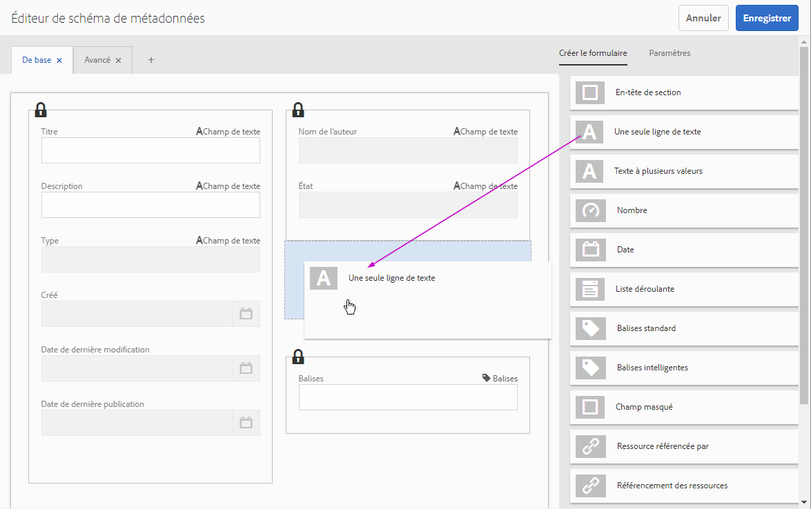

# Gestion des métadonnées de formulaire{#manage-form-metadata}

## Présentation  {#overview-nbsp}

Les métadonnées permettent de catégoriser et d’organiser plus facilement les ressources. Les utilisateurs peuvent ainsi retrouver aisément une ressource spécifique.

Par défaut, AEM Forms fournit un ensemble défini de métadonnées pour chaque type de ressource. En plus des métadonnées par défaut, vous pouvez ajouter des métadonnées personnalisées à chaque type de ressources. AEM Forms permet également de créer, gérer et échanger efficacement toutes ces métadonnées pour vos formulaires.

Si vous êtes développeur ou propriétaire d’un site, vous pouvez personnaliser Forms Portal, l’interface utilisateur pour AEM Forms, afin qu’il reflète les métadonnées utilisées dans votre entreprise. Pour plus d’informations sur Forms Portal, reportez-vous à la section [Présentation de la publication de formulaires sur un portail](../../forms/using/introduction-publishing-forms.md).

## Métadonnées en AEM Forms {#metadata-in-aem-forms}

Dans AEM Forms, la liste des propriétés de métadonnées associées à une ressource dépend du type de cette dernière. En outre, si vous ajoutez une propriété de métadonnées personnalisée, celle-ci est ajoutée pour toutes les ressources du même type.

### Types de ressources {#asset-types}

Les types de ressources suivants sont pris en charge dans les AEM Forms :

* Modèles de formulaire (formulaires XFA)
* Formulaires PDF
* Document (fichiers PDF aplatis)
* Formulaires adaptatifs
* Ressources
* XFS

#### Liste exhaustive des métadonnées {#extensive-list-of-metadata}

Vous trouverez ci-dessous une liste exhaustive des propriétés de métadonnées prises en charge dans AEM Forms :

<table>
 <tbody> 
  <tr> 
   <td><strong>Nom de la propriété</strong></td> 
   <td><strong>Type de ressource</strong></td> 
   <td><strong>Description</strong>  </td> 
  </tr> 
  <tr> 
   <td>Titre</td> 
   <td>Tout type, à l’exception du type ressource</td> 
   <td>Nom d’affichage du formulaire.  </td> 
  </tr> 
  <tr> 
   <td>Description</td> 
   <td>Tout type, à l’exception du type ressource</td> 
   <td>Description du formulaire. L’utilisateur peut spécifier cette valeur.  </td> 
  </tr> 
  <tr> 
   <td>Type</td> 
   <td>Tous</td> 
   <td>
Valeur en lecture seule indiquant le type de ressource. Il peut avoir l’une des valeurs suivantes :
 
    <ul> 
     <li>Modèle de formulaire</li> 
     <li>Formulaire PDF, formulaire PDF (AcroForm) ou formulaire PDF (signé)</li> 
     <li>Document, document (signé)</li> 
     <li>Formulaire adaptatif</li> 
     <li>Resource</li> 
    </ul> </td> 
  </tr> 
  <tr> 
   <td>Créé</td> 
   <td>Tous</td> 
   <td>Valeur en lecture seule indiquant la date de création de la ressource.</td> 
  </tr> 
  <tr> 
   <td>Date de dernière modification</td> 
   <td>Tous</td> 
   <td>Valeur en lecture seule indiquant la date de dernière modification de la ressource.</td> 
  </tr> 
  <tr> 
   <td>Création</td> 
   <td>Tout type, à l’exception du type ressource</td> 
   <td>
Valeur en lecture seule qui est automatiquement calculée selon le type de formulaire.
 
    <ul> 
     <li>PDF/Modèle de formulaire/Document - extrait du fichier binaire téléchargé.</li> 
     <li>Formulaire adaptatif : utilisateur connecté au moment de la création du formulaire.</li> 
    </ul> </td> 
  </tr> 
  <tr> 
   <td>État</td> 
   <td>Tout type, à l’exception du type ressource</td> 
   <td>
 Valeur en lecture seule qui définit l’un des états suivants d’un formulaire :
 
    <ul> 
     <li>Aucune valeur : si un formulaire n’a jamais été publié.</li> 
     <li>Publié : lorsqu’un formulaire est publié.</li> 
     <li>Modifié : lorsqu’un formulaire est modifié après avoir été publié une fois.</li> 
    </ul> </td> 
  </tr> 
  <tr> 
   <td>Date de dernière publication</td> 
   <td>Tout type, à l’exception du type ressource</td> 
   <td>Valeur en lecture seule indiquant la date de dernière publication du formulaire.</td> 
  </tr> 
  <tr> 
   <td>Date de publication/d’annulation de la publication</td> 
   <td>Tout type, à l’exception du type ressource</td> 
   <td>
Date à laquelle la publication/l’annulation de la publication automatique est planifiée pour le formulaire. L’utilisateur définit cette valeur lors de la modification des métadonnées.
 
    <ul> 
     <li>La date de publication et d’annulation de la publication doit être antérieure à la date actuelle. </li> 
     <li>La date d’annulation de la publication doit être antérieure à celle de la publication. </li> 
    </ul> </td> 
  </tr> 
  <tr> 
   <td>URL d’envoi</td> 
   <td>
Modèle de formulaire
 
Formulaire PDF
 </td> 
   <td>
Pour configurer une URL d’envoi spécifiée par l’utilisateur afin d’envoyer les données d’un formulaire vers une servlet.
 
L’URL d’envoi peut être configurée selon l’une des méthodes suivantes, classées par ordre de priorité :
 
    <ul> 
     <li>Spécifiez une URL d’envoi directement dans un modèle de formulaire à l’aide du bouton d’envoi via HTTP lorsque vous créez un formulaire XFA dans AEM Forms Designer.</li> 
     <li>Dans l’interface utilisateur AEM Forms, sélectionnez un formulaire et spécifiez une URL d’envoi lors de la modification des propriétés de métadonnées.</li> 
     <li>Dans le portail de formulaires, modifiez le composant Recherche et énumérateur et spécifiez une URL d’envoi dans l’onglet Lien de formulaire.</li> 
    </ul> </td> 
  </tr> 
  <tr> 
   <td>Profil de rendu HTML</td> 
   <td>Modèle de formulaire</td> 
   <td>Profil de rendu HTML utilisé lors du rendu d’un modèle de formulaire au format HTML.</td> 
  </tr> 
  <tr> 
   <td>Format du rendu</td> 
   <td>
Modèle de formulaire
 
Formulaire adaptatif
 </td> 
   <td>
Cette option permet à l’utilisateur de spécifier le format de rendu du formulaire lorsque celui-ci est publié :
 
    <ul> 
     <li>HTML</li> 
     <li>PDF</li> 
     <li>Les deux</li> 
    </ul> 
Cette option sert à limiter uniquement le format de rendu des formulaires sur le portail de formulaires où ils sont visibles par l’utilisateur final.
 </td> 
  </tr> 
  <tr> 
   <td>Balises</td> 
   <td>Tout type, à l’exception du type ressource</td> 
   <td>Etiquettes associées au formulaire pour faciliter la recherche.</td> 
  </tr> 
  <tr> 
   <td>Références</td> 
   <td>
Formulaire adaptatif
 
Modèle de formulaire
 
Ressource
 </td> 
   <td>
Liste des ressources (formulaires ou ressources) auxquelles ce formulaire est associé. Ces ressources peuvent appartenir à deux catégories :
 
    <ul> 
     <li>Fait référence : ressources auxquelles le formulaire actuel fait référence.</li> 
     <li>Référencé par : ressources faisant référence à la ressource actuelle.</li> 
    </ul> 
Ces ressources sont affichées sous forme de liens, et leurs métadonnées sont accessibles en cliquant dessus.  
 </td> 
  </tr> 
  <tr> 
   <td>Sélection du modèle de formulaire (XDP/XSD)</td> 
   <td>Formulaire adaptatif</td> 
   <td>
Indique quel modèle de formulaire est utilisé lors de la création du formulaire adaptatif. Cette propriété peut avoir les valeurs suivantes :
 
    <ul> 
     <li>Modèle de formulaire : un modèle de formulaire est sélectionné parmi ceux figurant dans le référentiel. Cette valeur peut être mise à jour.</li> 
     <li>Schéma XML : un fichier XSD est téléchargé. Cette valeur peut être mise à jour.</li> 
     <li>Aucune</li> 
    </ul> 
    

      Un modèle de formulaire sélectionné peut être mis à jour mais pas supprimé. 
    
 </td> 
  </tr> 
 </tbody> 
</table>

## Affichage des métadonnées de formulaire {#view-form-metadata}

Les ressources possèdent des valeurs de propriété qui peuvent être affichées en mode lecture seule. Ces métadonnées proviennent du téléchargement ou de la création d’un formulaire.

1. Accédez à l’emplacement de la ressource pour laquelle vous souhaitez afficher les métadonnées.

1. Ouvrez la page de propriétés à l’aide de l’une des méthodes suivantes :

   1. Cliquez sur l&#39;icône Propriétés de la Vue  dans Actions rapides.

      >[!NOTE]
      >
      >Les Actions rapides sont les éléments d’action qui s’affichent sur une miniature lorsque vous pointez dessus.

   1. Sélectionnez le formulaire et cliquez sur l’icône Propriétés de la Vue  qui s’affiche dans la barre d’outils.
   1. Accédez à la page des détails du formulaire en cliquant sur la miniature de celui-ci lorsque vous n’êtes pas en mode de sélection. Cliquez maintenant sur l’icône  en haut à droite, puis cliquez sur Propriétés dans la liste en dessous.

1. La page de propriétés qui s’ouvre affiche un schéma contenant uniquement les propriétés de métadonnées comportant des valeurs.

   La page de propriétés comporte une barre d’outils dotée de deux icônes d’action :

   * Modifier :  Modifier les valeurs des propriétés de métadonnées
   * Vue :  Accédez à la page des détails du formulaire, qui ouvre le formulaire en mode prévisualisation.

   La section du contenu est divisée en deux parties :

   * Le panneau de gauche contient la miniature du formulaire
   * Le panneau de droite contient les propriétés de métadonnées en mode lecture seule, réparties dans différents onglets.

## Ajout/mise à jour de valeurs de métadonnées de formulaire {#add-update-form-metadata-values}

Vous pouvez modifier les valeurs des propriétés de métadonnées existantes ou ajouter de nouvelles valeurs à un champ de propriété de métadonnées existant (par exemple, lorsqu’un champ de métadonnées est vide).

### Mise à jour des valeurs de propriétés de métadonnées {#update-metadata-property-values}

1. Suivez la procédure décrite dans la section précédente pour ouvrir la page de propriétés dans laquelle peuvent être affichées les métadonnées existantes du formulaire sélectionné.

1. Dans la barre d’outils, cliquez sur l’icône de modification  pour modifier le mode de la page de lecture seule à lecture/écriture.

1. La page de propriétés qui s’affiche contient un schéma comportant un mélange de champs d’entrée modifiables et de texte statique.

1. Les propriétés affichées sous forme de texte statique sont celles que vous ne pouvez pas modifier.

1. Vous pouvez accéder à d’autres onglets pour rechercher des champs d’entrée pour les propriétés de métadonnées placées sous ceux-ci.

   Cette page contient une barre d’outils dotée de deux icônes d’action différentes de celles du mode d’affichage :

   * Annuler :  Annuler les modifications apportées jusqu’à présent aux valeurs des propriétés de métadonnées
   * Terminé :  Enregistrer toutes les modifications apportées jusqu’à présent aux valeurs de propriété de métadonnées

   Ces deux actions redirigent l’utilisateur dans le mode lecture seule de la page de propriétés contenant les valeurs mises à jour.

### Mise à jour de la miniature du formulaire {#update-the-form-thumbnail}

Dans la page de propriétés, le panneau de gauche affiche la miniature du formulaire. Par défaut, la miniature affichée est celle qui a été générée au moment de la création du formulaire (formulaire adaptatif) ou du téléchargement du formulaire.

Pour tous les types de formulaires, vous avez la possibilité de télécharger une image en cliquant sur **[!UICONTROL Télécharger l’image]** et en accédant à un fichier image dans le répertoire local. L’image sélectionnée remplace la miniature par défaut.

Pour les formulaires adaptatifs, les utilisateurs ont également la possibilité de générer une miniature en tant qu’instantané de l’aperçu du formulaire adaptatif actuel. Comme AEM Forms prend également en charge la création de formulaires adaptatifs, l’aperçu d’un formulaire adaptatif peut être modifié chaque fois que vous changez ce dernier. Cette possibilité de générer une miniature permet d’obtenir une miniature mise à jour du formulaire adaptatif selon l’état de l’aperçu actuel. Cliquez sur **[!UICONTROL Générer l’aperçu]** pour exécuter cette action.

>[!NOTE]
>
>* Utilisez une image carrée pour la miniature. Lorsque vous utilisez une image qui n’est pas carrée et affichez la miniature dans une vue de liste, la miniature apparaît tronquée.
>* Une fois qu’une nouvelle image est téléchargée ou générée, la miniature est remplacée par celle-ci et l’image précédente ne peut pas être rétablie.

>

## Ajout de métadonnées personnalisées {#add-custom-metadata}

Outre les métadonnées prêtes à l’emploi, AEM Forms prend en charge de nouvelles métadonnées personnalisées.

Un outil (Editeur de Schéma de métadonnées) est fourni pour définir le schéma de la mise en page des métadonnées ; c’est-à-dire la disposition de ce qui apparaît dans la page **[!UICONTROL Propriétés]** d’un formulaire. L’éditeur de schéma de métadonnées permet d’ajouter ou de modifier un schéma personnalisé pour vos ressources.

AEM Forms exposent les schémas de métadonnées des types de formulaires pris en charge dans cet outil. Vous pouvez ainsi accéder à ces schémas et utiliser les fonctionnalités de l’éditeur de schéma de métadonnées pour ajouter des propriétés personnalisées.

### Navigation dans l’éditeur de schéma de métadonnées {#navigate-the-metadata-schema-editor}

1. Accédez à **[!UICONTROL Outils > Ressources > Schémas de métadonnées]**.

1. Cliquez sur **[!UICONTROL formulaires]** dans les formulaires de schéma répertoriés.

1. Dans la liste qui s’affiche, cliquez sur le type de ressource auquel vous souhaitez ajouter des métadonnées personnalisées.

   >[!NOTE]
   >
   >Ces schémas contiennent des propriétés de métadonnées prêtes à l’emploi qui ne doivent pas être modifiées (en cochant des cases ou en cliquant sur Modifier dans la barre d’outils) pour éviter tout problème fonctionnel.

1. Lorsque vous cliquez sur n’importe quel type de ressource, une liste contenant l’option `extendedmetadata` s’affiche. Modifiez ce schéma.

1. Cochez la case en regard de `extendedmetadata`, puis cliquez sur l’icône de modification  qui apparaît dans la barre d’outils.

1. AEM Forms ouvre l’éditeur de schéma de métadonnées/le créateur de formulaires du type de ressource sélectionné (dans ce cas présent, du formulaire adaptatif).

   

   Editeur de métadonnées

   1. Le panneau de gauche contient des sections à onglets où se trouvent les champs. Le panneau de droite affiche tous les composants d’IU disponibles et les propriétés du champ sélectionné dans le panneau de gauche.

   1. La section verrouillée n’est pas modifiable et contient les champs de toutes les propriétés de métadonnées prêtes à l’emploi.

   1. Vous pouvez ajouter d’autres onglets en cliquant sur le symbole +. 

   1. Vous pouvez ajouter un champ personnalisé de type souhaité en faisant glisser le composant de champ de la section **[!UICONTROL Créateur de formulaires]** jusqu’à la page de schéma.
   1. Les caractéristiques de ce champ peuvent être affichées sous la section **[!UICONTROL Paramètres]** en cliquant dessus.

### Ajout d’une propriété de métadonnées personnalisée dans l’éditeur de schéma {#add-custom-metadata-property-in-schema-editor}

1. Accédez à l’onglet (nouveau ou existant) auquel vous souhaitez ajouter la propriété personnalisée.

1. Faites glisser un composant du type souhaité de la section **[!UICONTROL Créer le formulaire]** du panneau de gauche jusqu’à l’emplacement souhaité.

   >[!NOTE]
   >
   >Vous ne pouvez pas déplacer les sections verrouillées. Vous pouvez toutefois placer votre composant dans un des espaces vides.

1. Cliquez sur un composant que vous venez de déplacer. Dans l’onglet Paramètres qui s’affiche dans le panneau de droite, renseignez les champs suivants : 

   1. Fournissez un libellé de champ qui sera utilisé comme nom d’affichage au-dessus du champ placé dans le schéma (Service, par exemple).
   1. Sous le champ Associer à la propriété, vous pouvez voir une valeur prérenseignée **’./jcr:content/metadata/default’**. Remplacez « **default** » par le nom de propriété de votre choix, qui sera utilisé pour stocker la propriété dans le référentiel crx (par exemple,  »./jcr:content/metadata/service ») 

      >[!NOTE]
      >
      >Ne modifiez pas le préfixe « ./jcr:content/metadata/ » car il définit le chemin où la propriété est stockée.
      >
      >En outre, le nom de propriété doit être unique pour éviter d’écrire des valeurs pour deux propriétés ou davantage au même emplacement dans le référentiel. Il est donc recommandé de modifier la valeur « default ».

   1. Remplissez les autres paramètres selon vos besoins. Sélectionnez par exemple l’option Obligatoire si vous souhaitez que le champ soit obligatoire.
   1. Pour supprimer un champ que vous avez ajouté, sélectionnez-le, puis cliquez sur l’icône Supprimer .

1. Si nécessaire, suivez les étapes 1 à 3 pour ajouter une autre propriété.
1. Cliquez sur **Terminé** lorsque vous avez apporté toutes les modifications.

   Vous venez d’ajouter une propriété de métadonnées personnalisée.

Tous les formulaires adaptatifs d’AEM Forms contiennent maintenant cette autre propriété de métadonnées. Vous pouvez la modifier dans la page de propriétés.
