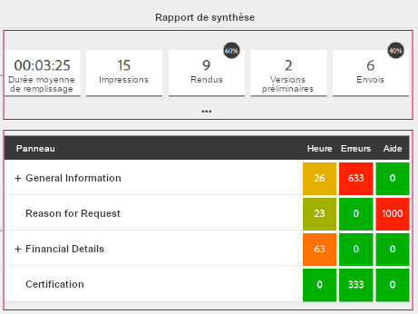
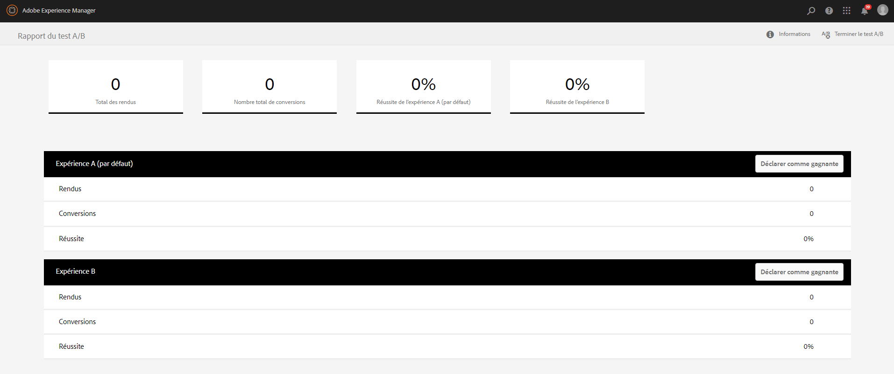

# Mesure et amélioration de l’efficacité et de la conversion des formulaires{#measure-and-improve-effectiveness-and-conversion-of-forms}

## La difficulté {#the-challenge-br}

Les entreprises autorisent et encouragent de plus en plus leurs clients à avoir recours aux applications numériques en libre service sur plusieurs canaux. Toutefois, en l’absence de mécanisme de commentaire linéaire, il est difficile de mesurer la réussite et de tester les formulaires numériques pour améliorer l’expérience client et augmenter les conversions.

Pour optimiser le retour sur investissement, les entreprises doivent contrôler la manière dont les utilisateurs et utilisatrices interagissent avec les services, puis tester leurs artefacts numériques (formulaires) pour améliorer les expériences client. Pour mesurer la réussite et définir une stratégie d’amélioration, les entreprises doivent obtenir les réponses aux questions suivantes :

* Combien de clientes et clients ont tenté d’accéder ou de lancer une transaction avec mes formulaires ?
* Combien d’entre eux ont terminé la transaction ?
* Combien d’entre eux ont abandonné le formulaire ?
* Quelles sont les zones qui posent problème aux clientes et clients ?
* Quelles modifications puis-je apporter et comment tester ce qui favoriserait la conversion ?

## La solution {#the-solution}

AEM Forms s’intègre aux solutions [Adobe Marketing Cloud](https://www.adobe.com/fr/marketing-cloud.html), [Adobe Analytics](https://www.adobe.com/fr/marketing-cloud/web-analytics.html) et [Adobe Target](https://business.adobe.com/fr/products/target/adobe-target.html), qui peuvent vous aider à surveiller et à analyser les performances de vos formulaires et vous permettre de tester et d’identifier l’expérience qui conduit à un meilleur taux de conversion.

## Le workflow {#the-workflow}

Voyons en détail la façon dont vous pouvez mesurer les performances et améliorer les taux de conversion des formulaires.

### Audience cible {#target-audience}

* Clientèle professionnelle et analystes responsables des stratégies marketing et de leur réussite
* Personnel informatique chargé de la configuration et de la maintenance des infrastructures et des solutions

### Composants et fonctions d’AEM Forms impliqués {#aem-forms-components-and-features-involved}

* Formulaires adaptatifs
* Intégration à Adobe Analytics pour collecter, organiser et générer un rapport des interactions client avec vos formulaires adaptatifs
* Intégration à Adobe Target pour effectuer des tests A/B pour les formulaires adaptatifs

### Hypothèses {#assumptions}

* Vous disposez déjà d’un compte Adobe Marketing Cloud et vous êtes enregistré pour les solutions Analytics et Target.
* Vous avez publié un formulaire adaptatif auquel les utilisateurs et utilisatrices peuvent accéder.

### Étapes du workflow {#workflow-steps}

#### Étape 1 : Configurer Analytics et Target dans AEM Forms  {#step-configure-analytics-and-target-in-aem-forms-br}

**Configuration d’Analytics**

Pour obtenir des informations détaillées sur les interactions client avec vos formulaires, vous devez d’abord configurer Analytics dans AEM Forms. Exécutez les étapes suivantes :

1. Création d’une suite de rapports dans Adobe Analytics
1. Création d’une configuration de service Cloud dans AEM
1. Création de la structure de service Cloud dans AEM
1. Configuration du service de configuration d’AEM Forms Analytics dans AEM
1. Activation de l’analyse du formulaire dans AEM

Pour les étapes détaillées, voir [Configurer des analyses et des rapports pour les formulaires adaptatifs](../../forms/using/configure-analytics-forms-documents.md).

**Configuration de Target**

Pour créer et exécuter des tests A/B pour vos formulaires adaptatifs, configurez Target dans AEM Forms comme décrit dans [Configurer et intégrer Target dans AEM Forms](../../forms/using/ab-testing-adaptive-forms.md#p-set-up-and-integrate-target-in-aem-forms-p).

#### Etape 2 : Afficher le rapport d’analyse {#step-view-analytics-report-br}

Lorsque vos clientes et clients utilisent et interagissent avec des formulaires pour lesquels vous avez activé Analytics, leurs interactions sont consignées dans les bases de données Analytics, qui sont hautement sécurisées. Les bases de données sont segmentées par cliente et client et accessibles via des connexions sécurisées.

Vous pouvez afficher un rapport à partir d’AEM pour des formulaires pour lesquels Analytics est activé, puis analyser les données. Pour afficher le rapport :

1. Sur le serveur AEM, accédez à **Forms > Forms et Documents.**
1. Sélectionnez le formulaire pour lequel vous souhaitez obtenir un rapport d’analyse.
1. Cliquez sur l’icône Rapports d’analyse. Le rapport s’affiche.

Regardons de plus près les points de données des formulaires qu’Analytics collecte et signale.

**Rapport d’analyse de formulaires**

Le rapport d’analyse pour les formulaires adaptatifs capture les indicateurs de performances clés (KPI) suivants au niveau du formulaire :

* **Durée moyenne de remplissage** : temps moyen passé au remplissage du formulaire.
* **Impressions** : nombre de fois que le formulaire s’est affiché dans des résultats de recherche. 

* **Rendus** : nombre de fois que le formulaire a été affiché ou ouvert.
* **Brouillons** : nombre de fois que le formulaire a été enregistré en tant que brouillon.

* **Envois** : nombre de fois que le formulaire a été envoyé.
* **Abandons** : nombre de fois que les utilisateurs et utilisatrices ont quitté le site sans remplir le formulaire.
* **Visites/envoi** : ratio des visites par envoi.

En outre, vous obtenez les informations suivantes pour chaque panneau du formulaire :

* **Temps** : temps moyen passé (exprimé en secondes) dans le panneau et ses champs. 

* **Erreurs** : nombre d’erreurs survenues sur le panneau et ses champs par tranche de 1000 rendus de formulaire. 

* **Aide** : nombre de fois que les utilisateurs ont accédé à l’aide contextuelle pour le panneau et ses champs par tranche de 1000 rendus de formulaire

Pour plus d’informations sur les rapports d’analyse de formulaires, reportez-vous à la rubrique [Affichage et compréhension des rapports d’analyse AEM Forms](../../forms/using/view-understand-aem-forms-analytics-reports.md).

>[!NOTE]
>
>Vous pouvez afficher les rapports détaillés et obtenir des informations plus précises sur vos clients et leurs interactions avec vos formulaires depuis votre compte Analytics sur Adobe Marketing Cloud.

#### Etape 3 : Analyser les points de données {#step-analyze-data-points}

Dans cette étape, vous analyserez les points de données des rapports d’analyse et en déduirez comment le formulaire s’exécute. S’il ne répond pas à vos KPI de réussite, vous allez émettre des hypothèses, en fonction des données obtenues, et rechercher les solutions possibles pour résoudre ces problèmes. Par exemple :

* Si le temps moyen de remplissage du formulaire est plus élevé que prévu, il est possible que votre formulaire soit trop complexe pour que les clientes et clients le comprennent, qu’il n’utilise pas la terminologie standard, qu’il soit trop long, etc. Dans ce cas, vous aurez intérêt à simplifier la structure et les champs du formulaire, à retravailler sa conception, à le raccourcir, ou à ajouter des descriptions et des exemples d’aide pour les champs de formulaire non standard.
* Si les données indiquent que la plupart des clientes et clients accède à l’aide contextuelle d’un panneau du formulaire, il est évident qu’ils et elles ne sont pas certains des informations à fournir. Vous pouvez utiliser une terminologie différente ou ajouter des exemples d’entrée et une description du panneau concerné.
* Si le taux d’arrêt ou d’abandon d’un formulaire est plus élevé que prévu, cela peut être dû au fait qu’il est long à remplir, que les clientes et clients accèdent au formulaire par inadvertance ou qu’il est trop compliqué. Dans ce cas, vous pouvez optimiser la description du formulaire qui s’affiche dans les résultats de recherche, simplifier le formulaire, optimiser le formulaire pour un chargement plus rapide, etc.

Après avoir analysé ces points de données et formulé une hypothèse, apportez les modifications requises au formulaire.

#### Étape 4 : Valider votre analyse et vos correctifs {#step-validate-your-analysis-and-fixes}

Dans cette étape, vous allez valider les modifications apportées au formulaire et vérifier si elles influencent le taux de conversion.

**Éxécuter un test A/B**

L’intégration d’AEM Forms à Target permet de créer des tests A/B pour les formulaires adaptatifs. Dans les tests A/B, vous présentez aléatoirement différentes expériences pour un formulaire donné à vos clientes et clients en temps réel pour déterminer quelle expérience fonctionne le mieux ou génère le plus de conversions. Une fois que vous disposez de données significatives indiquant l’expérience fournissant le meilleur taux de conversion, vous pouvez considérer que vous avez atteint votre objectif. La prochaine étape consiste à en faire l’expérience par défaut visible à l’ensemble des clientes et clients.

Pour plus d’informations sur la création d’un test A/B pour un formulaire adaptatif, reportez-vous à la rubrique [Test A/B des formulaires adaptatifs](../../forms/using/ab-testing-adaptive-forms.md).

## Bonnes pratiques {#best-practices}

Les bonnes pratiques sont celles que vous identifiez vous-même lors de l’exécution de ce workflow. Elles sont propres à votre environnement et à vos exigences. Capturez vos améliorations à travers le workflow et conservez-les en tant que bonnes pratiques.

Voici quelques recommandations à propos de la conception des formulaires et l’exécution des tests A/B :

**Conception de formulaires**

* Le formulaire doit être simple, court et facile à parcourir. Utilisez des repères directionnels pour le parcourir.
* Utilisez des terminologies standard ou courantes pour les champs du formulaire.
* Expliquez le champ et l’entrée requise, avec des exemples ou une aide, là où les utilisateurs risquent d’être déconcertés.
* Validez les entrées des utilisateurs et utilisatrices au moment de la saisie, si possible, pour éviter des erreurs lors de l’envoi du formulaire.
* Optimisez les dispositions pour les ordinateurs de bureau et les appareils mobiles.
* Renseignez automatiquement les informations concernant les utilisateurs et utilisatrices connus.

**Tests A/B**

* Formulez une hypothèse et identifiez les mesures de succès avant d’exécuter le test A/B.
* Apportez des variations minimales (dans l’idéal, une à la fois) à votre expérience alternative pour savoir ce qui a influé sur le taux de conversion.
* Testez fréquemment le système pour éliminer les inefficacités.
