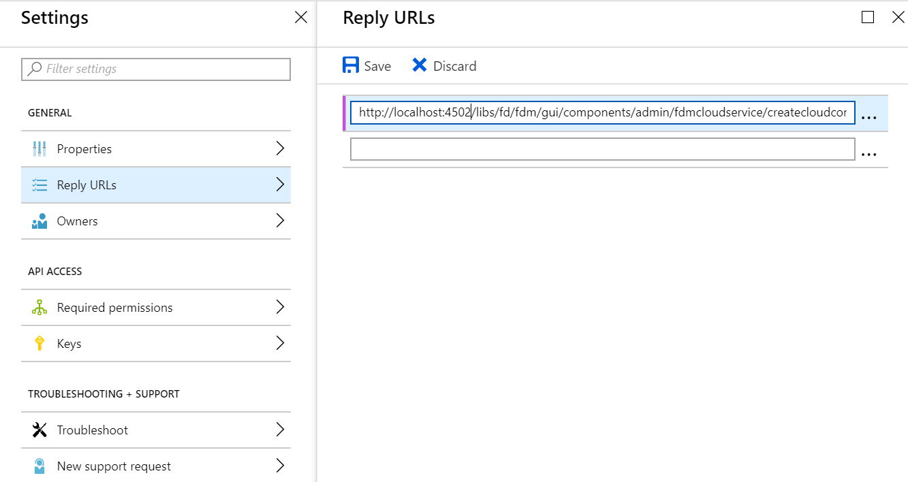

# Configuration du service OData de Microsoft Dynamics{#microsoft-dynamics-odata-configuration}


Microsoft Dynamics est un logiciel de gestion de la relation client (CRM, Customer Relationship Management) et de planification des ressources de l’entreprise (ERP, Enterprise Resource Planning) qui fournit des solutions d’entreprise pour la création et la gestion de comptes clients, de contacts, de prospects, d’opportunités et de dossiers. [L’intégration de données d’AEM Forms](../../forms/using/data-integration.md) fournit une configuration de service cloud OData pour intégrer Forms aux serveurs Microsoft Dynamics en ligne et sur site. Elle vous permet de créer un modèle de données de formulaire basé sur des entités, des attributs et des services définis dans le service Microsoft Dynamics. Le modèle de données de formulaire peut être utilisé pour créer des formulaires adaptatifs qui interagissent avec le serveur Microsoft Dynamics pour activer les workflows d&#39;entreprise. Par exemple :

* Requête du serveur Microsoft Dynamics pour les données et préremplir les formulaires adaptatifs
* Écrire des données dans Microsoft Dynamics lors de l&#39;envoi du formulaire adaptatif
* Ecrire des données dans Microsoft Dynamics par le biais d&#39;entités personnalisées définies dans le modèle de données de formulaire et vice versa

Le module complémentaire AEM Forms inclut également la configuration OData de référence que vous pouvez exploiter pour intégrer rapidement Microsoft Dynamics à AEM Forms.

Lorsque le package est installé, les entités et services suivants sont déployés sur votre instance AEM Forms :

* Service cloud OData MS Dynamics (service OData)
* Modèle de données de formulaire avec entités et services Microsoft Dynamics préconfigurés.

Les entités et services Microsoft Dynamics préconfigurés dans un modèle de données de formulaire ne sont disponibles sur votre instance AEM Forms que si le mode d&#39;exécution de l&#39;instance AEM est défini sur `samplecontent` (par défaut). Le Cloud Service MS Dynamics OData (service OData) est également disponible avec d&#39;autres modes d&#39;exécution. Pour plus d’informations sur la configuration des modes d’exécution pour une instance AEM, voir [Modes d’exécution](/help/sites-deploying/configure-runmodes.md).

## Conditions préalables {#prerequisites}

Avant de commencer à installer et configurer Microsoft Dynamics, vérifiez que vous avez :

* Installation du [module complémentaire AEM Forms](../../forms/using/installing-configuring-aem-forms-osgi.md)
* Configuré Microsoft Dynamics 365 en ligne ou installé une instance de l’une des versions de Microsoft Dynamics suivantes :

   * Microsoft Dynamics 365 sur site
   * Microsoft Dynamics 2016 sur site

* [Enregistrement de l&#39;application pour le service en ligne Microsoft Dynamics avec Microsoft Azure Principale Directory](https://docs.microsoft.com/en-us/dynamics365/customer-engagement/developer/walkthrough-register-dynamics-365-app-azure-active-directory). Prenez note des valeurs de l’ID client (également appelé ID de l&#39;application) et du secret client pour le service enregistré. Ces valeurs sont utilisées lors de l’utilisation de la [configuration du service cloud pour votre service Microsoft Dynamics](../../forms/using/ms-dynamics-odata-configuration.md#configure-cloud-service-for-your-microsoft-dynamics-service).

## Définition de l’URL de réponse pour l’application Microsoft Dynamics enregistrée {#set-reply-url-for-registered-microsoft-dynamics-application}

Procédez comme suit pour définir l’URL de réponse de l’application Microsoft Dynamics enregistrée :

>[!NOTE]
>
>Utilisez cette procédure uniquement lors de l’intégration d’AEM Forms au serveur Microsoft Dynamics en ligne.

1. Accédez au compte Microsoft Azure Principal Directory et ajoutez l&#39;URL de configuration de service cloud suivante dans les paramètres **URL de réponse** pour votre application enregistrée :

   `https://'[server]:[port]'/libs/fd/fdm/gui/components/admin/fdmcloudservice/createcloudconfigwizard/cloudservices.html`

   

1. Enregistrez la configuration.

## Configuration de Microsoft Dynamics pour IFD  {#configure-microsoft-dynamics-for-ifd}

Microsoft Dynamics utilise l’authentification basée sur les réclamations pour fournir l’accès aux données sur le serveur Microsoft Dynamics CRM aux utilisateurs externes. Pour ce faire, procédez comme suit pour configurer Microsoft Dynamics pour le déploiement par Internet (IFD) et configurer les paramètres de réclamation.

>[!NOTE]
>
>Utilisez cette procédure uniquement lors de l’intégration d’AEM Forms au serveur Microsoft Dynamics sur site.

1. Configurez l&#39;instance de Microsoft Dynamics sur site pour IFD comme décrit dans [Configuration d&#39;IFD pour Microsoft Dynamics](https://technet.microsoft.com/en-us/library/dn609803.aspx).
1. Exécutez les commandes suivantes à l’aide de Windows PowerShell pour configurer les paramètres de réclamation sur Microsoft Dynamics compatible avec IFD :

   ```shell
   Add-PSSnapin Microsoft.Crm.PowerShell
    $ClaimsSettings = Get-CrmSetting -SettingType OAuthClaimsSettings
    $ClaimsSettings.Enabled = $true
    Set-CrmSetting -Setting $ClaimsSettings
   ```

   Voir [Enregistrement d’application pour CRM sur site (IFD)](https://msdn.microsoft.com/sl-si/library/dn531010(v=crm.7).aspx#bkmk_ifd) pour plus de détails.

## Configuration du client OAuth sur une machine AD FS {#configure-oauth-client-on-ad-fs-machine}

Procédez comme suit pour enregistrer un client OAuth sur la machine Active Directory Federation Services (AD FS) et octroyer l’accès sur la machine AD FS :

>[!NOTE]
>
>Utilisez cette procédure uniquement lors de l’intégration d’AEM Forms au serveur Microsoft Dynamics sur site.

1. Exécutez la commande suivante :

   `Add-AdfsClient -ClientId “<Client-ID>” -Name "<name>" -RedirectUri "<redirect-uri>" -GenerateClientSecret`

   Où :

   * `Client-ID` est un ID client que vous pouvez générer à l’aide de n’importe quel générateur de GUID.
   * `redirect-uri` est l’URL du service cloud OData de Microsoft Dynamics dans AEM Forms. Le service cloud par défaut installé avec le package AEM Forms est déployé à l’adresse URL suivante :
      `https://'[server]:[port]'/libs/fd/fdm/gui/components/admin/fdmcloudservice/createcloudconfigwizard/cloudservices.html`

1. Exécutez la commande suivante pour octroyer l’accès sur la machine AD FS :

   `Grant-AdfsApplicationPermission -ClientRoleIdentifier “<Client-ID>” -ServerRoleIdentifier <resource> -ScopeNames openid`

   Où :

   * `resource` est l&#39;URL de l&#39;organisation Microsoft Dynamics.

1. Microsoft Dynamics utilise le protocole HTTPS. Pour appeler les points de fin AD FS depuis le serveur Forms, installez le certificat de site Microsoft Dynamics dans le fichier de stockage des certificats Java à l’aide de la commande `keytool` sur l’ordinateur exécutant AEM Forms.

## Configurer le service cloud pour votre service Microsoft Dynamics {#configure-cloud-service-for-your-microsoft-dynamics-service}

La configuration **Cloud Service MS Dynamics OData (OData Service)** est fournie avec la configuration OData par défaut. Pour le configurer afin qu’il se connecte à votre service Microsoft Dynamics, procédez comme suit.

1. Accédez à **[!UICONTROL Outils > Services cloud > Sources de données]** et appuyez sur le dossier de configuration `global`.
1. Sélectionnez la configuration du **service cloud OData MS Dynamics (service OData)** et appuyez sur **[!UICONTROL Propriétés]**. La boîte de dialogue Propriété de configuration du service cloud s’affiche.

   Dans l’onglet **Paramètres d’authentification** :

   1. Saisissez la valeur pour le champ **Racine du service**. Accédez à l&#39;instance Dynamics et accédez à **Developer Resources** pour vue la valeur du champ Service Root. Par exemple, https://&lt;nom-client>/api/data/v9.1/

   1. Remplacez les valeurs par défaut dans les champs **ID client** (également appelé **ID d’application**), **Secret client**, **URL OAuth**, **URL du jeton d’actualisation**, **URL du jeton d’accès** et **Ressource** avec les valeurs de votre configuration de service Microsoft Dynamics. Il est obligatoire de spécifier l&#39;URL de l&#39;instance de dynamique dans le champ **Ressource** pour configurer Microsoft Dynamics avec un modèle de données de formulaire. Utilisez l’URL racine du service pour dériver l’URL de l’instance de dynamique. Par exemple, [https://org.crm.dynamics.com](https://org.crm.dynamics.com/).

   1. Spécifiez **openid** dans le champ **Portée de l&#39;autorisation** pour le processus d&#39;autorisation sur Microsoft Dynamics.

   

1. Cliquez sur **[!UICONTROL Connexion à OAuth]**. Vous êtes redirigé vers la page de connexion de Microsoft Dynamics.
1. Connectez-vous à l&#39;aide de vos informations d&#39;identification Microsoft Dynamics et acceptez d&#39;autoriser la configuration du service cloud à se connecter au service Microsoft Dynamics. C’est une tâche ponctuelle qui permet d’établir une connexion entre le service cloud et le service.

   Vous êtes ensuite redirigé vers la page de configuration du service cloud, qui affiche un message indiquant que la configuration OData a été enregistrée avec succès.

Le service cloud OData MS Dynamics (Service OData) est configuré et connecté à votre service Dynamics.

## Créer un modèle de données de formulaire {#create-form-data-model}

Lorsque vous installez le package AEM Forms, un modèle de données de formulaire,**Microsoft Dynamics FDM**, est déployé sur votre instance AEM. Par défaut, le modèle de données de formulaire utilise le service Microsoft Dynamics configuré dans le Cloud Service MS Dynamics OData (OData Service) comme source de données.

Lorsque vous ouvrez le modèle de données de formulaire pour la première fois, il se connecte au service Microsoft Dynamics configuré et récupère les entités de votre instance Microsoft Dynamics. Les entités « Contact » et « Prospect » de Microsoft Dynamics sont déjà ajoutées au modèle de données de formulaire.

Pour vérifier le modèle de données de formulaire, accédez à **[!UICONTROL Formulaires > Intégrations de données]**. Sélectionnez **Microsoft Dynamics FDM** et cliquez sur **Modifier** pour ouvrir le modèle de données de formulaire en mode édition. Vous pouvez également ouvrir le modèle de données de formulaire directement à partir de l’URL suivante :

`https://'[server]:[port]'/aem/fdm/editor.html/content/dam/formsanddocuments-fdm/ms-dynamics-fdm`


Vous pouvez ensuite créer un formulaire adaptatif basé sur le modèle de données de formulaire et l’utiliser dans divers cas d’utilisation de formulaire adaptatif, tels que :

* Remplir le formulaire adaptatif en obtenant des informations des entités et services Microsoft Dynamics
* Appeler les opérations du serveur Microsoft Dynamics définies dans un modèle de données de formulaire à l&#39;aide de règles de formulaire adaptatif
* Écrire les données de formulaire envoyées dans les entités Microsoft Dynamics

Il est recommandé de créer une copie du modèle de données de formulaire fourni avec le package AEM Forms et de configurer les modèles de données et les services en fonction de vos besoins. Ainsi, les futures mises à jour du package de ne remplaceront pas votre modèle de données de formulaire.

Pour plus d’informations sur la création et l’utilisation de modèles de données de formulaire dans les processus métier, voir [Intégration de données](../../forms/using/data-integration.md).
