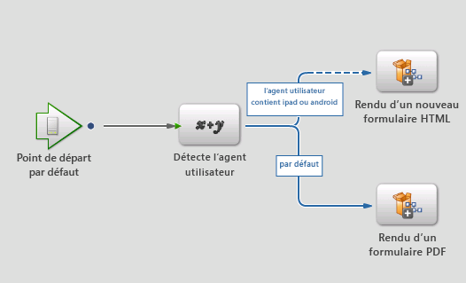
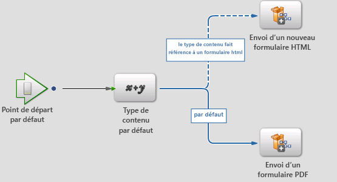

# Nouveau service de rendu et d’envoi{#new-render-and-submit-service}

## Présentation {#introduction}

Dans Workbench, lorsque vous définissez une opération `AssignTask`, spécifiez un formulaire particulier (XDP ou PDF). Par ailleurs, spécifiez un ensemble de services de rendu et d’envoi, via un profil d’action.

Un XDP peut être rendu sous la forme d’un formulaire PDF ou d’un formulaire HTML. Les nouvelles fonctionnalités comprennent la possibilité de :

* rendre et envoyer un formulaire XDP au format HTML ;
* rendre et envoyer un formulaire XDP au format PDF sur le bureau, et au format HTML sur les périphériques mobiles (par exemple, un iPad).

### Nouveaux services de formulaires HTML {#new-html-forms-service}

Le nouveau service de formulaires HTML exploite la nouvelle fonction dans les formulaires pour prendre en charge le rendu de formulaire XDP au format HTML. Le nouveau service de formulaires HTML expose les méthodes suivantes :

```java
/*
 * Generates a URL (for the HTML Form) to be passed to client, given a TaskContext.
 * The output of this API is something like this - /lc/content/xfaforms/profiles/default.ws.html?ContentRoot=repository://Applications/MyApplication/MyFolder&template=MyForm.xdp
 * @param taskContext task context
 * @param profileName Forms servlet URL.
 * @return form URL string
 */
public String generateFormURL(TaskContext taskContext, String profileName);

/*
 * Render the XDP Form as HTML. Can be used directly for updating the runtimeMap in render.
 * It adds the following keys to the map -
 * hint:new html form = true
 * newHTMLFormURL = the URL returned after calling 'generateFormURL' API.
 * @param TaskContext taskContext
 * @param profileName Forms servlet URL.
 * @param runtimeMap runtime map<string,object> associated with form rendering.
 * return runtimeMap
 */
public Map<String, Object> renderHTMLForm (TaskContext taskContext, String profileName, Map<String,Object> runtimeMap);
```

Vous trouverez plus d’informations sur les profils Mobile Form dans la section [Création d’un profil personnalisé](/help/forms/using/custom-profile.md).

## Nouveaux processus de rendu et d’envoi de formulaire HTML {#new-html-form-render-amp-submit-processes}

Pour chaque opération « AssignTask », spécifiez un processus de rendu et d’envoi avec le formulaire. Ces processus sont appelés par les API TaskManager `renderForm` et `submitForm`   pour autoriser la gestion personnalisée. Sémantique de ces processus pour un nouveau formulaire HTML :

### Rendre un nouveau formulaire HTML {#render-a-new-html-form}

Le nouveau processus de rendu HTML, comme chaque processus de rendu, a les paramètres d’E/S suivants :

Entrée - `taskContext`

Sortie - `runtimeMap`

Sortie - `outFormDoc`

Cette méthode simule le comportement exact de l’API `renderHTMLForm` du NewHTMLFormsService. Elle appelle l’API `generateFormURL` pour obtenir l’URL pour le rendu HTML du formulaire. Elle enseigne ensuite le runtimeMap avec la clé ou les valeurs suivantes :

nouveau formulaire html = true

newHTMLFormURL = l’URL renvoyé après avoir appelé l’API `generateFormURL`.

### Envoyer un nouveau formulaire HTML {#submit-a-new-html-form}

Ce processus permettant d’envoyer un nouveau formulaire HTML fonctionne avec les paramètres d’E/S suivants :

Entrée - `taskContext`

Sortie - `runtimeMap`

Sortie - `outputDocument`

The process sets the `outputDocument`to the `inputDocument`retrieved from `taskContext`.

## Processus de rendu ou d’envoi par défaut, et profils d’action {#default-render-or-submit-processes-and-action-profiles}

Les services de rendu et d’envoi par défaut permettent la prise en charge du rendu de fichiers PDF sur un bureau, et de fichiers HTML sur des périphériques mobiles (iPad).

### Formulaire de rendu par défaut {#default-render-form}

Ce processus rend un formulaire XDP sur plusieurs plates-formes en toute simplicité. Le processus récupère l’agent utilisateur de `taskContext`, et utilise les données pour appeler le processus pour le rendu HTML ou PDF.



### Formulaire d’envoi par défaut {#default-submit-form}

Ce processus envoie un formulaire XDP sur plusieurs plates-formes en toute simplicité. Il récupère l’agent utilisateur de `taskContext` et utilise les données pour appeler le processus pour l’envoi HTML ou PDF.



## Basculer le rendu des formulaires mobiles de PDF vers HTML {#switch-the-rendering-of-mobile-forms-from-pdf-to-html}

Les navigateurs retirent progressivement la prise en charge des modules externes NPAPI, notamment des modules complémentaires Adobe Acrobat et Adobe Acrobat Reader. Vous pouvez redéfinir le rendu des formulaires mobiles de PDF vers HTML à l’aide des étapes suivantes :

1. Connectez-vous à Workbench en tant qu’utilisateur valide.
1. Sélectionnez **Fichier** > **Obtenir les applications**.

   La boîte de dialogue Obtenir les applications s’affiche.

1. Select the applications for which you want to change the mobile form rendering and click **OK**.
1. Ouvrez le processus pour lequel vous souhaitez modifier le rendu.
1. Ouvrez le point de départ/la tâche ciblé(e), accédez à la section Présentation et Données, puis cliquez sur **Gérer les profils d’action**.

   La boîte de dialogue Gérer les profils d’action apparaît.
1. Redéfinissez les configurations de profil de rendu par défaut de PDF à HTML, puis cliquez sur **OK**.
1. Enregistrez le processus.
1. Répétez les étapes afin de changer le rendu pour d’autres processus.
1. Déployez l’application correspondant aux processus que vous avez changés.

### Profil d’action par défaut {#default-action-profile}

Le profil d’action par défaut a rendu le formulaire XDP au format PDF. Ce comportement a maintenant été modifié pour utiliser les processus de formulaire de rendu par défaut et de formulaire d’envoi par défaut.

Voici certaines questions fréquentes sur les profils d’action :

 **Quels processus de rendu/envoi seront disponibles en standard ?**

* Render Guide (Guides est obsolète)
* Render Form Guide
* Render PDF Form
* Render HTML Form
* Render New HTML form (nouveau)
* Default Render form (nouveau)

Et, les processus d’envoi équivalents.

 **Quel d&#39;action sera disponible en standard ?**

Pour des formulaires XDP:

* Profil d’action par défaut (rendu/envoi à l’aide des nouveaux processus de « rendu/envoi par défaut »)

 **Que doit faire le concepteur de processus pour permettre le rendu du formulaire au format HTML sur un périphérique et au format PDF sur un bureau ?**

Rien. Le profil d’action par défaut est choisi automatiquement, et le mode de rendu est pris en charge automatiquement.

 **Que faut-il faire pour permettre le rendu du formulaire au format HTML sur un bureau ?**

L’utilisateur doit sélectionner le bouton radio HTML pour le profil par défaut.

 **Y aura-t-il un impact de mise à niveau sur la modification du comportement du d&#39;actions par défaut  comportement ?**

Oui ; étant donné que le rendu précédent et les services d’envoi associés au profil d’action par défaut étaient différents, ils sont gérés en tant que personnalisations des formulaires existants. On clicking **Restore Defaults**, the default render and submit services are set instead.

Si vous aviez modifié les services liés aux formulaires PDF de rendu/d’envoi existants ou aviez créé des services personnalisés (par exemple, custom1) et souhaitez maintenant utiliser la même fonctionnalité pour un rendu HTML : Vous devez répliquer le nouveau service de rendu/d’envoi (par exemple, en tant que custom2) et appliquer des personnalisations identiques. Désormais, modifiez le profil d’action de votre formulaire XDP afin de commencer à utiliser les services custom2, au lieu des services custom1 pour le rendu ou l’envoi.

#Que doit faire le concepteur de processus pour que le formulaire puisse être rendu au format HTML sur un périphérique et au format PDF sur un bureau ?
#Que doit faire le concepteur de processus pour que le formulaire puisse être rendu au format HTML sur un périphérique et au format PDF sur un bureau ?
