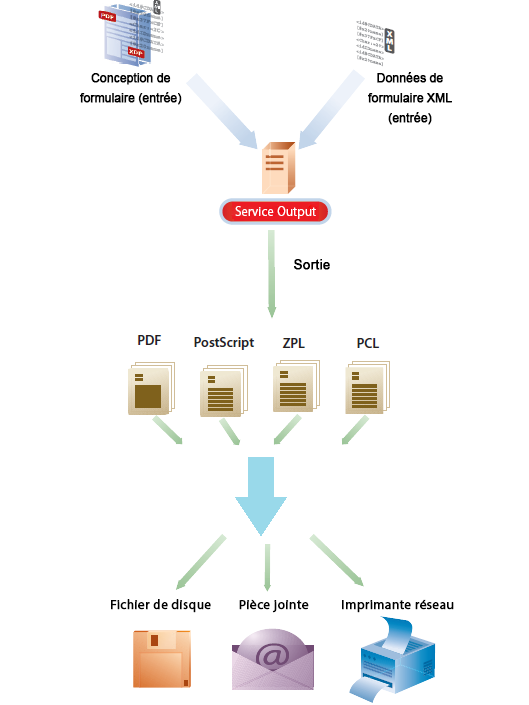

# Service Output{#output-service}

## Présentation {#overview}

Le service Output est un service OSGi qui fait partie d’AEM Document Services. Le service Output prend en charge divers formats de sortie et fonctions de conception de sortie d’AEM Forms Designer. Le service Output peut convertir les modèles XFA et les données XML pour générer des documents d’impression dans différents formats.

Le service Output permet de créer des applications grâce auxquelles vous pouvez accomplir les actions suivantes :

* Générer des documents de formulaire définitifs en complétant des fichiers de modèle avec des données XML.
* Générer des formulaires de sortie dans différents formats, y compris des flux d’impression PDF non interactifs, PostScript, PCL et ZPL.
* Générer des fichiers PDF d’impression à partir de fichiers PDF de formulaire XFA.
* Générez des documents PDF, PostScript, PCL et ZPL en masse en fusionnant plusieurs jeux de données avec les modèles fournis.

>[!NOTE]
>
>Le service Output est une application 32 bits. Sous Microsoft Windows, une application 32 bits est autorisée à utiliser un maximum de 2 Go de mémoire. La limite s’applique également au service Output.

## Création de documents de formulaire non interactifs {#creating-non-interactive-form-documents}

En général, vous créez des modèles dans AEM Forms Designer. Les API `generatePDFOutput` et `generatePrintedOutput` du service Output permettent de convertir directement ces modèles en divers formats, y compris au format PDF, PostScript, ZPL et PCL.

L’opération `generatePDFOutput` génère des fichiers PDF, tandis que l’opération `generatePrintedOutput` génère des formats PostScript, ZPL et PCL. Le premier paramètre des deux opérations accepte le nom du fichier du modèle (par exemple `ExpenseClaim.xdp`) ou un objet de document qui contient le modèle. Lorsque vous spécifiez le nom du fichier de modèle, spécifiez également la racine du contenu en tant que chemin d’accès au dossier contenant le modèle. Vous pouvez spécifier la racine de contenu à l’aide du paramètre `PDFOutputOptions` ou `PrintedOutputOptions` . Voir la documentation Javadoc pour en savoir plus sur les autres options que vous pouvez spécifier à l’aide de ces paramètres.

Le deuxième paramètre accepte un document XML fusionné avec le modèle lors de la génération du document de sortie.

L’opération `generatePDFOutput` peut également accepter un formulaire PDF XFA comme entrée et renvoyer une version non interactive du formulaire PDF en sortie.

## Génération de documents de formulaire non interactifs {#generating-non-interactive-form-documents}

Supposons que vous ayez un ou plusieurs modèles et plusieurs enregistrements de données XML pour chaque modèle.

Utilisez les opérations `generatePDFOutputBatch` et `generatePrintedOutputBatch` du service Output pour générer un document d’impression pour chaque enregistrement.

Vous pouvez également combiner les enregistrements en un seul et même document. Les deux opérations nécessitent quatre paramètres.

Le premier paramètre est un paramètre de mappage (Map) qui contient une chaîne arbitraire comme clé et le nom du fichier de modèle comme valeur.

Le second paramètre est un autre paramètre de mappage (Map) dont la valeur est un objet de document qui contient des données XML. La clé est la même que celle que vous spécifiez pour le premier paramètre.

Le troisième paramètre pour `generatePDFOutputBatch` ou `generatePrintedOutputBatch` est de type `PDFOutputOptions` ou `PrintedOutputOptions` , respectivement.

Les types de paramètre sont identiques à ceux des paramètres pour les opérations `generatePDFOutput` et `generatePrintedOutput` et ont le même effet.

Le quatrième paramètre est de type `BatchOptions`, que vous utilisez pour spécifier si un fichier distinct peut être généré pour chaque enregistrement. La valeur par défaut de ce paramètre est « false » (faux).

`generatePrintedOutputBatch` et `generatePDFOutputBatch` renvoient tous deux une valeur de type `BatchResult`. La valeur contient une liste des documents générés. Elle comporte aussi un document de métadonnées au format XML qui contient des informations relatives à chaque document généré.
