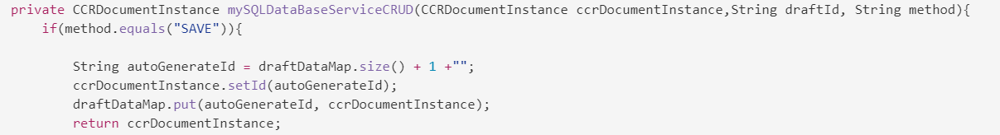

# Préparation et envoi d’une communication interactive à l’aide de l’interface utilisateur de l’agent {#prepare-and-send-interactive-communication-using-the-agent-ui}

L’interface utilisateur de l’agent permet aux agents de préparer et d’envoyer la communication interactive au post-traitement. L’agent apporte les modifications nécessaires dans la mesure du possible et envoie la communication interactive en post-traitement, comme un courrier électronique ou une impression.

## Présentation {#overview}

Après la création d&#39;une communication interactive, l&#39;agent peut ouvrir la communication interactive dans l&#39;interface utilisateur de l&#39;agent et préparer une copie spécifique au destinataire en saisissant des données et en gérant le contenu et les pièces jointes. Enfin, l&#39;agent peut soumettre la communication interactive à un post-processus.

Lors de la préparation de la communication interactive à l’aide de l’interface utilisateur de l’agent, l’agent gère les aspects suivants de la communication interactive dans l’interface utilisateur de l’agent avant de l’envoyer à un post-traitement :

* **Données** : l’onglet Données de l’interface utilisateur de l’agent affiche toutes les variables modifiables par l’agent et les propriétés du modèle de données du formulaire non verrouillées dans la communication interactive. Ces variables/propriétés sont créées lors de la modification ou de la création de fragments de documents inclus dans la communication interactive. L’onglet Données comprend également tous les champs intégrés dans le modèle de canal d’impression/XDP. L’onglet Données s’affiche uniquement lorsque des variables, des propriétés de modèle de données de formulaire ou des champs de la communication interactive peuvent être modifiés par l’agent.
* **Contenu** : dans l’onglet Contenu, l’agent gère le contenu, tel que des fragments de documents et des variables de contenu dans la communication interactive. L’agent peut apporter les modifications au fragment de document comme autorisé lors de la création de la communication interactive dans les propriétés de ces fragments de document. L’agent peut également réorganiser, ajouter/supprimer un fragment de document et ajouter des sauts de page, si cela est autorisé.
* **Pièces jointes** : L&#39;onglet Pièces jointes apparaît dans l&#39;interface utilisateur de l&#39;agent uniquement si la communication interactive comporte des pièces jointes ou si l&#39;agent a accès à la bibliothèque. L’agent peut être autorisé ou non à modifier les pièces jointes.

## Préparation de la communication interactive à l’aide de l’interface utilisateur de l’agent {#prepare-interactive-communication-using-the-agent-ui}

1. Sélectionnez **[!UICONTROL Formulaires]** > **[!UICONTROL Formulaires et documents]**.
1. Sélectionnez la communication interactive appropriée et appuyez sur **[!UICONTROL Ouvrir l&#39;interface utilisateur de l&#39;agent]**.

   >[!NOTE]
   >
   >L&#39;interface utilisateur de l&#39;agent ne fonctionne que si la communication interactive sélectionnée comporte un canal d&#39;impression.

   

   En fonction du contenu et des propriétés de la communication interactive, l’interface utilisateur de l’agent affiche les trois onglets suivants : Données, Contenu et Pièces jointes.

   

   Procédez à la saisie des données, à la gestion du contenu et à la gestion des pièces jointes.

### Saisir des données {#enter-data}

1. Dans l’onglet Données, saisissez les données pour les variables, les propriétés du modèle de données de formulaire et les champs du modèle d’impression (XDP), selon les besoins. Renseignez tous les champs obligatoires signalés par un astérisque (&amp;amp ; ast ;) pour activer le bouton **Envoyer**.

   Appuyez sur une valeur de champ de données dans la prévisualisation de communication interactive pour mettre en surbrillance le champ de données correspondant dans l’onglet Données ou vice versa.

### Gérer le contenu {#manage-content}

Dans l’onglet Contenu, vous pouvez gérer du contenu, tel que des fragments de documents et des variables de contenu dans la communication interactive.

1. Sélectionnez **[!UICONTROL Contenu]**. L&#39;onglet Contenu de la communication interactive s&#39;affiche.

   

1. Modifiez les fragments de document, selon les besoins, dans l’onglet Contenu. Pour mettre l’accent sur le fragment approprié dans la hiérarchie de contenu, vous pouvez soit appuyer sur la ligne ou le paragraphe approprié dans la prévisualisation de communication interactive, soit appuyer directement sur le fragment dans la hiérarchie Contenu.

   Par exemple, le fragment de document avec la ligne « Effectuer un paiement en ligne dès maintenant… » est sélectionné dans l’aperçu du graphique ci-dessous et le même fragment de document est sélectionné dans l’onglet Contenu.

   

   Dans l’onglet Contenu ou Données, en appuyant sur Mettre en surbrillance les modules sélectionnés dans le contenu ( ) dans l’angle supérieur gauche de la prévisualisation, vous pouvez désactiver ou activer la fonctionnalité d’accès au fragment de document lorsque le texte, le paragraphe ou le champ de données approprié est sélectionné ou sélectionné dans la prévisualisation.

   Les fragments qui peuvent être modifiés par l&#39;agent lors de la création de la communication interactive ont l&#39;icône Modifier le contenu sélectionné ( ). Appuyez sur l’icône Modifier le contenu sélectionné pour lancer le fragment en mode édition et y apporter des modifications. Utilisez les options suivantes pour formater et gérer le texte :

   * [Options de mise en forme](#formattingtext)

      * [Copier-coller du texte formaté depuis d’autres applications](#pasteformattedtext)
      * [Parties du texte en surbrillance](#highlightemphasize)
   * [Caractères spéciaux](#specialcharacters)
   * [Raccourcis clavier](/help/forms/using/keyboard-shortcuts.md)

   Pour plus d&#39;informations sur les actions disponibles pour divers fragments de document dans l&#39;interface utilisateur de l&#39;agent, voir [Actions et informations disponibles dans l&#39;interface utilisateur de l&#39;agent](#actionsagentui).

1. Pour ajouter un saut de page à la sortie d’impression de la communication interactive, placez le curseur à l’endroit où vous souhaitez insérer un saut de page et sélectionnez Saut de page avant ou Saut de page après ( ).

   Un espace réservé explicite de saut de page est inséré dans la communication interactive. Pour voir comment un saut de page explicite affecte la communication interactive, reportez-vous à l’aperçu avant impression.

   

   Procédez à la gestion des pièces jointes de la communication interactive.

### Gestion des pièces jointes {#manage-attachments}

1. Sélectionnez **[!UICONTROL Pièce jointe]**. L’interface utilisateur de l’agent affiche les pièces jointes disponibles de la manière dont elles ont été configurées lors de la création de la communication interactive.

   Vous pouvez choisir de ne pas envoyer de pièce jointe en même temps que la communication interactive en appuyant sur l&#39;icône de vue et en appuyant sur la croix de la pièce jointe pour la supprimer (si l&#39;agent est autorisé à supprimer ou à masquer la pièce jointe) de la communication interactive. Pour les pièces jointes spécifiées comme obligatoires, lors de la création de la communication interactive, les icônes Afficher et Supprimer sont désactivées.

   

1. Appuyez sur l’icône Accès à la bibliothèque ( ) pour accéder à la bibliothèque de contenu et insérer des fichiers DAM en tant que pièces jointes.

   >[!NOTE]
   >
   >L’icône Accès à la bibliothèque n’est disponible que si l’accès à la bibliothèque a été activé lors de la création de la communication interactive (dans les propriétés de Conteneur de Document du canal d’impression).

1. Si l’ordre des pièces jointes n’a pas été verrouillé lors de la création de la communication interactive, vous pouvez réorganiser les pièces jointes en sélectionnant une pièce jointe et en appuyant sur les flèches haut et bas.
1. Utilisez Aperçu web et Aperçu avant impression pour voir si les deux sorties sont conformes à vos besoins.

   Si les prévisualisations vous conviennent, appuyez sur **[!UICONTROL Envoyer]** pour envoyer la communication interactive à un post-processus. Ou pour apporter des modifications, quittez la prévisualisation pour revenir à l’étape d’élaboration des modifications.

## Formatage du texte {#formattingtext}

Lors de l’édition d’un fragment de texte dans l’interface utilisateur de l’agent, la barre d’outils change en fonction du type d’édition que vous choisissez d’effectuer (Police, Paragraphe ou Liste) :

 

Barre d’outils de la police


Barre d’outils Paragraphe


Barre d’outils de la liste

### Mettre des parties de texte en surbrillance/en évidence  {#highlightemphasize}

Pour mettre des parties de texte en surbrillance\en évidence dans un fragment modifiable, sélectionnez le texte et appuyez sur Couleur de surbrillance.


### Coller le texte formaté {#pasteformattedtext}


### Insérer des caractères spéciaux dans le texte {#specialcharacters}

L’interface utilisateur de l’agent offre une prise en charge intégrée de 210 caractères spéciaux. L’administrateur peut [ajouter la prise en charge de caractères spéciaux supplémentaires/personnalisés en personnalisant](/help/forms/using/custom-special-characters.md).

#### Livraison des pièces jointes {#attachmentdelivery}

* Lorsque la communication interactive est rendue à l’aide d’API côté serveur sous la forme d’un PDF interactif ou non interactif, le PDF rendu contient des pièces jointes au format PDF.
* Lorsqu’un post-processus associé à une communication interactive est chargé dans le cadre de l’interface utilisateur d’envoi à l’aide de l’agent, les pièces jointes sont transmises en tant que paramètre inAttachmentDocs de Liste&lt;com.adobe.idp.Document>.
* Les processus du mécanisme de livraison, tels que l’envoi par courrier électronique et l’impression, livrent les pièces jointes avec la version PDF de la communication interactive.

## Actions et informations disponibles dans l’interface utilisateur de l’agent  {#actionsagentui}

### Fragments de document {#document-fragments}


* **Flèches haut/bas** : flèches permettant de déplacer les fragments de document vers le haut ou vers le bas dans la communication interactive.
* **Supprimer** : si cela est autorisé, supprimez le fragment de document de la communication interactive.
* **Saut de page avant** (applicable aux modules enfant de la zone cible) : insère un saut de page avant le fragment de document.
* **Retrait** : augmente ou réduit le retrait d’un fragment de document.
* **Saut de page après**  (applicable pour les fragments enfants de la zone de cible) : Insère un saut de page après le fragment de document.


* Modification (fragments de texte uniquement) : ouvrez l’éditeur de texte enrichi pour modifier le fragment de document texte. Pour plus d’informations, voir [Formatage de texte](#formattingtext).

* Sélection (icône représentant un œil) : inclut\exclut le fragment de document de la communication interactive.
* Valeurs vides (information) : indique le nombre de variables vides dans le fragment de document.

### Fragments de document de la liste  {#list-document-fragments}


* Insertion d’une ligne vide : permet d’insérer une nouvelle ligne vide.
* Sélection (icône représentant un œil) : inclut\exclut le fragment de document de la communication interactive.
* Ignorer les puces/numérotations : permet d’ignorer les puces/numéros dans le fragment de document de la liste.
* Valeurs vides (information) : indique le nombre de variables vides dans le fragment de document.

## Enregistrer les communications interactives en tant que brouillon {#save-as-draft}

Vous pouvez utiliser l’interface utilisateur de l’agent pour enregistrer un ou plusieurs brouillons pour chaque communication interactive et récupérer le brouillon ultérieurement pour continuer à travailler dessus. Vous pouvez spécifier un nom différent pour chaque brouillon afin de l’identifier.

L’Adobe recommande d’exécuter ces instructions en séquence pour enregistrer une communication interactive en tant que brouillon.

### Active la fonction Enregistrer en tant que brouillon {#before-save-as-draft}

Par défaut, la fonction Enregistrer en tant que brouillon n’est pas activée. Pour activer cette fonction, effectuez les étapes suivantes :

1. Implémentez l&#39;interface de Prestataire [ccrDocumentInstance](https://helpx.adobe.com/experience-manager/6-5/forms/javadocs/com/adobe/fd/ccm/ccr/ccrDocumentInstance/api/services/CCRDocumentInstanceService.html) (SPI).

   L’interface SPI vous permet d’enregistrer la version préliminaire de la communication interactive dans la base de données avec un ID de brouillon en tant qu’identifiant unique. Ces instructions supposent que vous connaissez déjà comment créer un lot OSGi à l&#39;aide d&#39;un projet Maven.

   Pour un exemple d’implémentation SPI, voir [Exemple d’implémentation SPI ccrDocumentInstance](#sample-ccrDocumentInstance-spi).
1. Ouvrez `http://<hostname>:<port>/ system/console/bundles` et appuyez sur **[!UICONTROL Installer/Mettre à jour]** pour télécharger le lot OSGi. Vérifiez que l’état du package téléchargé s’affiche sous la forme **Principal**. Redémarrez le serveur si l’état du package ne s’affiche pas sous la forme **Principal**.
1. Accédez à `https://'[server]:[port]'/system/console/configMgr`.
1. Appuyez sur **[!UICONTROL Créer la configuration de correspondance]**.
1. Sélectionnez **[!UICONTROL Activer Enregistrer avec CCRDocumentInstanceService]** et appuyez sur **[!UICONTROL Enregistrer]**.

### Enregistrer une communication interactive en tant que brouillon {#save-as-draft-agent-ui}

Pour enregistrer une communication interactive en tant que brouillon, procédez comme suit :

1. Sélectionnez une communication interactive dans Forms Manager et appuyez sur **[!UICONTROL Ouvrir l’interface utilisateur de l’agent]**.

1. Apportez les modifications appropriées dans l’interface utilisateur de l’agent et appuyez sur **[!UICONTROL Enregistrer en tant que brouillon]**.

1. Indiquez le nom du brouillon dans le champ **[!UICONTROL Nom]** et appuyez sur **[!UICONTROL Terminé]**.

Une fois que vous avez enregistré la communication interactive en tant que brouillon, appuyez sur **[!UICONTROL Enregistrer les modifications]** pour enregistrer d’autres modifications dans le brouillon.

### Récupérer le projet d&#39;une communication interactive {#retrieve-draft}

Après avoir enregistré une communication interactive en tant que brouillon, vous pouvez la récupérer pour continuer à travailler dessus. Récupérez la communication interactive à l’aide des éléments suivants :

`https://server:port/aem/forms/createcorrespondence.hmtl?draftid=[draftid]`

[] draft désigne l’identifiant unique de la version préliminaire qui est générée après l’enregistrement d’une communication interactive en tant que brouillon.

>[!NOTE]
>
>Si vous apportez des modifications à la communication interactive après l’avoir enregistrée en tant que brouillon, le brouillon de version ne s’ouvre pas.

### Exemple d’implémentation SPI ccrDocumentInstance {#sample-ccrDocumentInstance-spi}

Mettez en oeuvre l&#39;`ccrDocumentInstance` interface SPI pour enregistrer une communication interactive en tant que brouillon. Voici un exemple d&#39;implémentation de l&#39;interface SPI `ccrDocumentInstance`.

```javascript
package Implementation;

import com.adobe.fd.ccm.ccr.ccrDocumentInstance.api.exception.CCRDocumentException;
import com.adobe.fd.ccm.ccr.ccrDocumentInstance.api.model.CCRDocumentInstance;
import com.adobe.fd.ccm.ccr.ccrDocumentInstance.api.services.CCRDocumentInstanceService;
import org.apache.commons.lang3.StringUtils;
import org.osgi.service.component.annotations.Component;
import org.slf4j.Logger;
import org.slf4j.LoggerFactory;

import java.util.*;


@Component(service = CCRDocumentInstanceService.class, immediate = true)
public class CCRDraftService implements CCRDocumentInstanceService {

    private static final Logger logger = LoggerFactory.getLogger(CCRDraftService.class);

    private HashMap<String, Object> draftDataMap = new HashMap<>();

    @Override
    public String save(CCRDocumentInstance ccrDocumentInstance) throws CCRDocumentException {
        String documentInstanceName = ccrDocumentInstance.getName();
        if (StringUtils.isNotEmpty(documentInstanceName)) {
            logger.info("Saving ccrData with name : {}", ccrDocumentInstance.getName());
            if (!CCRDocumentInstance.Status.SUBMIT.equals(ccrDocumentInstance.getStatus())) {
                ccrDocumentInstance = mySQLDataBaseServiceCRUD(ccrDocumentInstance,null, "SAVE");
            }
        } else {
            logger.error("Could not save data as draft name is empty");
        }
        return ccrDocumentInstance.getId();
    }

    @Override
    public void update(CCRDocumentInstance ccrDocumentInstance) throws CCRDocumentException {
        String documentInstanceName = ccrDocumentInstance.getName();
        if (StringUtils.isNotEmpty(documentInstanceName)) {
            logger.info("Saving ccrData with name : {}", documentInstanceName);
            mySQLDataBaseServiceCRUD(ccrDocumentInstance, ccrDocumentInstance.getId(), "UPDATE");
        } else {
            logger.error("Could not save data as draft Name is empty");
        }
    }

    @Override
    public CCRDocumentInstance get(String id) throws CCRDocumentException {
        CCRDocumentInstance cCRDocumentInstance;
        if (StringUtils.isEmpty(id)) {
            logger.error("Could not retrieve data as draftId is empty");
            cCRDocumentInstance = null;
        } else {
            cCRDocumentInstance = mySQLDataBaseServiceCRUD(null, id,"GET");
        }
        return cCRDocumentInstance;
    }

    @Override
    public List<CCRDocumentInstance> getAll(String userId, Date creationTime, Date updateTime,
                                            Map<String, Object> optionsParams) throws CCRDocumentException {
        List<CCRDocumentInstance> ccrDocumentInstancesList = new ArrayList<>();

        HashMap<String, Object> allSavedDraft = mySQLGetALLData();
        for (String key : allSavedDraft.keySet()) {
            ccrDocumentInstancesList.add((CCRDocumentInstance) allSavedDraft.get(key));
        }
        return ccrDocumentInstancesList;
    }

    //The APIs call the service in the database using the following section.
    private CCRDocumentInstance mySQLDataBaseServiceCRUD(CCRDocumentInstance ccrDocumentInstance,String draftId, String method){
        if(method.equals("SAVE")){

            String autoGenerateId = draftDataMap.size() + 1 +"";
            ccrDocumentInstance.setId(autoGenerateId);
            draftDataMap.put(autoGenerateId, ccrDocumentInstance);
            return ccrDocumentInstance;

        }else if (method.equals("UPDATE")){

            draftDataMap.put(ccrDocumentInstance.getId(), ccrDocumentInstance);
            return ccrDocumentInstance;

        }else if(method.equals("GET")){

            return (CCRDocumentInstance) draftDataMap.get(draftId);

        }
        return null;
    }

    private HashMap<String, Object> mySQLGetALLData(){
        return draftDataMap;
    }
}
```

Les opérations `save`, `update`, `get` et `getAll` appellent le service de base de données pour enregistrer une communication interactive en tant que brouillon, mettre à jour une communication interactive, récupérer des données de la base de données et récupérer des données pour toutes les communications interactives disponibles dans la base de données. Cet exemple utilise `mySQLDataBaseServiceCRUD` comme nom du service de base de données.

Le tableau suivant explique l’exemple d’implémentation SPI `ccrDocumentInstance`. Il montre comment les opérations `save`, `update`, `get` et `getAll` appellent le service de base de données dans l&#39;exemple d&#39;implémentation.

<table> 
 <tbody>
 <tr>
  <td><p><strong>Operation</strong></p></td>
  <td><p><strong>Exemples de service de base de données</strong></p></td> 
   </tr>
  <tr>
   <td><p>Vous pouvez soit créer un brouillon pour une communication interactive, soit l’envoyer directement. L’API pour l’opération d’enregistrement vérifie si la communication interactive est envoyée en tant que brouillon et contient un nom de brouillon. L’API appelle ensuite le service mySQLDataBaseServiceCRUD avec la méthode d’entrée Save.</p></br></br>[#$sd1_sf1_dp9]</td>
   <td><p>Le service mySQLDataBaseServiceCRUD vérifie Save comme méthode d’entrée et génère un ID de brouillon généré automatiquement et le renvoie à l’AEM. La logique de génération d’un ID de brouillon peut varier en fonction de la base de données.</p></br></br>[#$sd1_sf1_dp13]</td>
   </tr>
  <tr>
   <td><p>L’API pour l’opération de mise à jour récupère l’état du brouillon de communication interactive et vérifie si la communication interactive comporte un nom de brouillon. L'API appelle le service mySQLDataBaseServiceCRUD pour mettre à jour cet état dans la base de données.</p></br></br>[#$sd1_sf1_dp17]</td>
   <td><p>Le service mySQLDataBaseServiceCRUD vérifie Update comme méthode d’entrée et enregistre l’état du brouillon de communication interactive dans la base de données.</br></p></td>
   </tr>
   <tr>
   <td><p>L’API pour l’opération d’obtention vérifie si la communication interactive contient un brouillon d’ID. L’API appelle ensuite le service mySQLDataBaseServiceCRUD avec Get comme méthode d’entrée pour récupérer les données pour la communication interactive.</br></p></td>
   <td><p>Le service mySQLDataBaseServiceCRUD vérifie Get comme méthode d’entrée et récupère les données pour la communication interactive en fonction de l’ID de brouillon.</p></br></br>[#$sd1_sf1_dp29]</td>
   </tr>
   <tr>
   <td><p>L'API pour l'opération getAll appelle le service mySQLGetALLData pour récupérer les données de toutes les communications interactives enregistrées dans la base de données.</br></p></td>
   <td><p>Le service mySQLGetALLData récupère des données pour toutes les communications interactives enregistrées dans la base de données.</p></br></br>[#$sd1_sf1_dp37]</td>
   </tr>
  </tbody>
</table>

Voici un exemple du fichier `pom.xml` qui fait partie de l&#39;implémentation :

```xml
<?xml version="1.0" encoding="UTF-8"?>
<project xmlns="http://maven.apache.org/POM/4.0.0"
         xmlns:xsi="http://www.w3.org/2001/XMLSchema-instance"
         xsi:schemaLocation="http://maven.apache.org/POM/4.0.0 http://maven.apache.org/xsd/maven-4.0.0.xsd">
    <modelVersion>4.0.0</modelVersion>

    <groupId>com.adobe.livecycle</groupId>
    <artifactId>draft-sample</artifactId>
    <version>2.0.0-SNAPSHOT</version>

    <name>Interact</name>
    <packaging>bundle</packaging>

    <dependencies>
        <dependency>
            <groupId>com.adobe.aemfd</groupId>
            <artifactId>aemfd-client-sdk</artifactId>
            <version>6.0.160</version>
        </dependency>
    </dependencies>


    <!-- ====================================================================== -->
    <!-- B U I L D D E F I N I T I O N -->
    <!-- ====================================================================== -->
    <build>
        <plugins>
            <plugin>
                <groupId>org.apache.felix</groupId>
                <artifactId>maven-bundle-plugin</artifactId>
                <version>3.3.0</version>
                <extensions>true</extensions>
                <executions>
                    <!--Configure extra execution of 'manifest' in process-classes phase to make sure SCR metadata is generated before unit test runs-->
                    <execution>
                        <id>scr-metadata</id>
                        <goals>
                            <goal>manifest</goal>
                        </goals>
                    </execution>
                </executions>
                <configuration>
                    <exportScr>true</exportScr>
                    <instructions>
                        <!-- Enable processing of OSGI DS component annotations -->
                        <_dsannotations>*</_dsannotations>
                        <!-- Enable processing of OSGI metatype annotations -->
                        <_metatypeannotations>*</_metatypeannotations>
                        <Bundle-SymbolicName>${project.groupId}-${project.artifactId}</Bundle-SymbolicName>
                    </instructions>
                </configuration>
            </plugin>
            <plugin>
                <groupId>org.apache.maven.plugins</groupId>
                <artifactId>maven-surefire-plugin</artifactId>
            </plugin>
            <plugin>
                <groupId>org.apache.maven.plugins</groupId>
                <artifactId>maven-compiler-plugin</artifactId>
                <configuration>
                    <source>8</source>
                    <target>8</target>
                </configuration>
            </plugin>
        </plugins>
    </build>
    <profiles>
        <profile>
            <id>autoInstall</id>
            <build>
                <plugins>
                    <plugin>
                        <groupId>org.apache.sling</groupId>
                        <artifactId>maven-sling-plugin</artifactId>
                        <executions>
                            <execution>
                                <id>install-bundle</id>
                                <phase>install</phase>
                                <goals>
                                    <goal>install</goal>
                                </goals>
                            </execution>
                        </executions>
                    </plugin>
                </plugins>
            </build>
        </profile>
    </profiles>

</project>
```

>[!NOTE]
>
>Veillez à mettre à jour la dépendance `aemfd-client-sdk` à 6.0.160 dans le fichier `pom.xml`.
