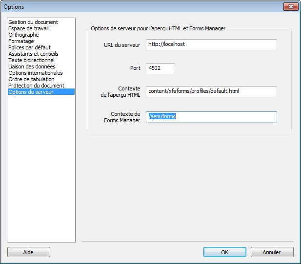

# Génération de l’aperçu HTML5 d’un formulaire XDP{#generate-html-preview-of-an-xdp-form}

Lors de la conception d’un formulaire dans AEM Forms Designer, en plus de la prévisualisation du rendu PDF du formulaire, vous pouvez également prévisualiser un rendu HTML5. Vous pouvez utiliser l’onglet **Aperçu HTML** afin de prévisualiser le formulaire tel qu’il apparaîtra dans un navigateur.

## Activation de l’aperçu HTML pour les formulaires XDP dans Designer {#html-preview-of-forms-in-forms-designer}

Pour permettre à Designer de générer l’aperçu HTML des formulaires XDP, effectuez les procédures suivantes :

* Configurer le service d’authentification Apache Sling
* Désactiver le mode Protégé
* Spécification des détails sur le serveur AEM Forms

### Configurer le service d&#39;authentification Apache Sling {#configure-apache-sling-authentication-service}

1. Accéder à `https://'[server]:[port]'/system/console/configMgr` AEM Forms s’exécutant sur OSGi ou
   `https://'[server]:[port]'/lc/system/console/configMgr` sur AEM Forms s’exécutant sur JEE.
1. Localisez et cliquez sur la boîte de configuration **Service d’authentification Apache Sling** pour l’ouvrir en mode d’édition.

1. Selon que vous exécutez AEM Forms sur OSGi ou JEE, ajoutez ce qui suit dans le **champ** Conditions d’authentification requises : 

   *  d’AEM Forms sur JEE

      * -/content/xfaforms
      * -/etc/clientlibs
   * AEM Forms sur OSGi

      * -/content/xfaforms
      * -/etc/clientlibs/fd/xfaforms
   >[!NOTE]
   >
   >N’effectuez pas de copier-coller de la valeur spécifiée dans le champ des conditions d’authentification requises, car ceci risquerait d’endommager les caractères spéciaux dans la valeur. Saisissez plutôt la valeur spécifiée dans le champ.

1. Indiquez un nom d’utilisateur et un mot de passe respectivement dans les champs **[!UICONTROL Nom d’utilisateur anonyme]** et **[!UICONTROL Mot de passe utilisateuranonyme]**. Les informations d’identification spécifiées sont utilisées pour gérer l’authentification anonyme et autoriser l’accès aux utilisateurs anonymes.
1. Cliquez sur **Enregistrer** pour enregistrer la configuration 

### Désactiver le mode Protégé {#disable-protected-mode}

Le [mode Protégé](../../forms/using/get-xdp-pdf-documents-aem.md) est activé par défaut. Laissez-le activé pour les environnements de production. Vous pouvez la désactiver pour un environnement de développement afin de prévisualiser les formulaires HTML5 dans Designer. Pour le désactiver, procédez comme suit :

1. Connectez-vous à la console Web AEM en tant qu’administrateur. 

   * L’URL d’AEM Forms sur OSGi est `https://'[server]:[port]'/system/console/configMgr`
   * L’URL d’AEM Forms sur JEE est `https://'[server]:[port]'/lc/system/console/configMgr`

1. Ouvrez les **[!UICONTROL configurations de Mobile Forms]** à des fins d’édition.
1. Désélectionnez l’option **[!UICONTROL Mode Protégé]** et cliquez sur **[!UICONTROL Enregistrer]**.

### Spécification des détails sur le serveur AEM Forms {#provide-details-of-aem-forms-server}

1. Dans Designer, cliquez sur **Tools**> **Options**.
1. In the Options window, select **Server Options** page, provide the following details, and click **OK**.

   * **URL de serveur** : URL du serveur de AEM Forms.

   * **Numéro de port HTTP** : port du serveur AEM. La valeur par défaut est 4502.   
   * **Contexte des  HTML :** Chemin du pour le rendu des formulaires XFA. Les  par défaut suivantes sont utilisées pour  le formulaire dans Designer. Cependant, vous pouvez également spécifier un chemin vers un profil personnalisé.

      * `/content/xfaforms/profiles/default.html` (AEM Forms on OSGi)

      * `/lc/content/xfaforms/profiles/default.html` (AEM  Forms on JEE)
   * **Contexte de Forms Manager :** chemin de contexte du déploiement de l’interface utilisateur de Forms Manager. Les valeurs par défaut sont :

      * `/aem/forms` (AEM Forms on OSGi)
      * `/lc/forms` (AEM  Forms on JEE)
   **Remarque :** assurez-vous que le serveur AEM Forms est en cours d’exécution. The HTML preview connects to the CRX server to *generate* a preview.

   

   Options d’AEM Forms Designer

1. To preview a form in HTML, click the **Preview HTML** tab.

   >[!NOTE]
   >
   >
   >
   >
   >    * Si l’onglet Aperçu HTML est fermé, appuyez sur la touche F4 pour l’ouvrir. Vous pouvez également sélectionner Aperçu HTML dans le menu Affichage pour ouvrir l’onglet Aperçu HTML.
   >    * l’aperçu HTML ne prend pas en charge les documents PDF, il est uniquement dédié aux documents au format XDP.

   >[!CAUTION]
   >
   >Pour tester la véritable expérience de l’utilisateur final, vos formulaires dans des navigateurs externes (Google Chrome, Microsoft Edge, Mozilla Firefox, etc.). Chaque navigateur utilise un moteur distinct pour générer du code HTML. Il peut donc exister des différences dans la manière dont un de formulaire  dans Designer et un navigateur externe.

## Pour prévisualiser un formulaire contenant des données d’exemple {#to-preview-a-form-using-sample-data}

Designer vous permet de prévisualiser et de tester un formulaire avec des données XML d’exemple. Il est recommandé de tester fréquemment le formulaire avec des données d’exemple pour vous assurer qu’il est généré correctement.

Si vous ne disposez pas de données d’exemple, Designer peut en fournir ou vous pouvez en créer vous-même (Voir [Génération automatique de données d’exemple pour prévisualiser le formulaire](https://help.adobe.com/en_US/AEMForms/6.1/DesignerHelp/WS107c29ade9134a2c136ae6f212a1f379c94-8000.2.html#WS92d06802c76abadb-728f46ac129b395660c-7efe.2) et [Création de données d’exemple pour prévisualiser le formulaire](https://help.adobe.com/en_US/AEMForms/6.1/DesignerHelp/WS107c29ade9134a2c136ae6f212a1f379c94-8000.2.html#WS92d06802c76abadb-728f46ac129b395660c-7eff.2).)

L’utilisation d’une source de données d’exemple pour tester votre formulaire est un bon moyen de s’assurer que les données et les champs correspondent et que les sous-formulaires se répètent comme prévu. Vous pouvez créer un formulaire à la disposition équilibrée, où chaque objet a la place nécessaire pour afficher les données fusionnées.

1. Sélectionnez **Fichier > Propriétés du formulaire**.

1. Cliquez sur l’onglet **Aperçu** et, dans la zone Fichier de données, indiquez le chemin d’accès complet au fichier de données de test. Vous pouvez également vous servir du bouton Parcourir pour naviguer jusqu’au fichier.

1. Cliquez sur **OK**. La prochaine fois que vous prévisualiserez le formulaire dans l’onglet **Aperçu HTML**, les valeurs des données de l’exemple de fichier XML apparaîtront dans les objets respectifs.

## Aperçu des formulaires situés dans un référentiel {#html-preview-of-forms-in-forms-manager}

Dans AEM Forms, vous pouvez prévisualiser des formulaires et documents figurant dans le référentiel. La prévisualisation reflète l’apparence et le comportement des formulaires lorsqu’ils seront utilisés par les utilisateurs finaux.

[Contacter le support technique](https://www.adobe.com/account/sign-in.supportportal.html)
