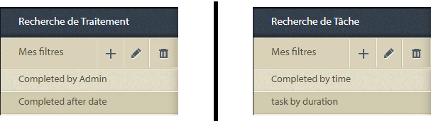
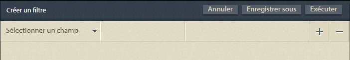
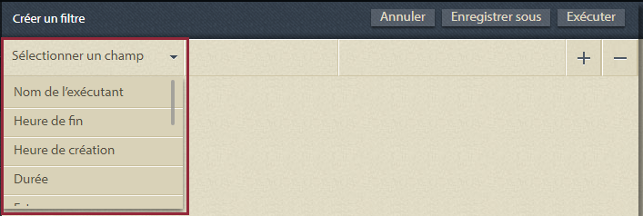
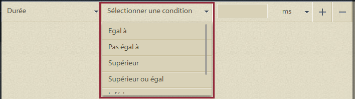
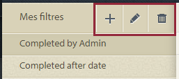
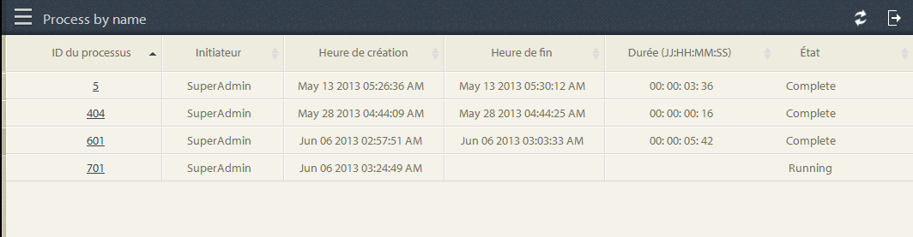
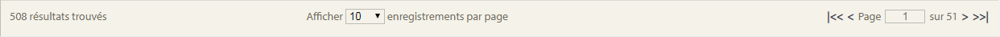
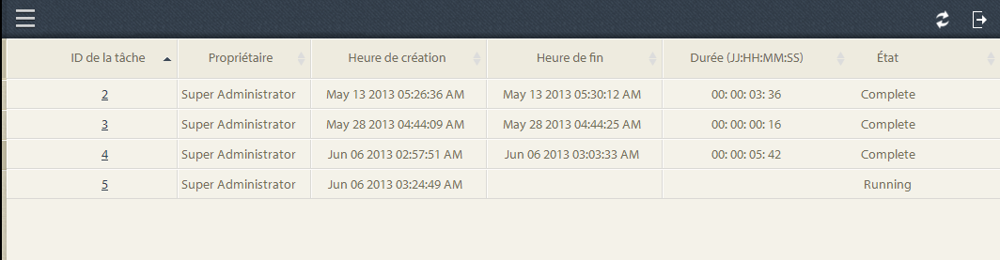
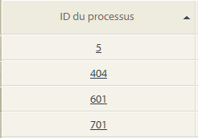
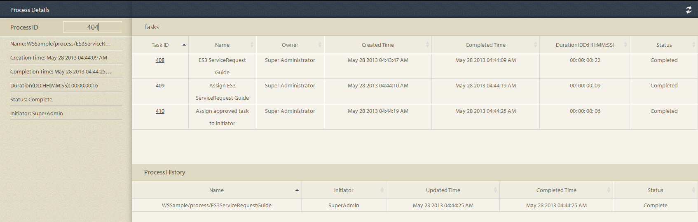

# Requêtes ad hoc dans les rapports de processus{#ad-hoc-queries-in-process-reporting}

## Requêtes ad hoc dans les rapports de processus {#ad-hoc-queries-in-process-reporting-1}

Les requêtes ad hoc dans les rapports de processus vous permettent de créer des requêtes personnalisées que vous pouvez utiliser pour rechercher les détails de processus et de tâches des instances de processus AEM Forms définies dans votre environnement AEM Forms.

En outre, les requêtes ad hoc peuvent être définies à l’aide de filtres de propriétés de processus et de tâche. Ces filtres peuvent ensuite être enregistrés et utilisés pour exécuter les rapports ultérieurement.

[**Recherche**](/help/forms/using/process-reporting/adhoc-queries-in-process-reporting.md#p-process-task-search-p) de processus : Recherchez des instances de processus avec un filtre de recherche défini par l’utilisateur en fonction des attributs de processus.

[**Détails**](/help/forms/using/process-reporting/adhoc-queries-in-process-reporting.md#p-process-task-details-p) du processus : Affichez les détails d’une instance de processus en spécifiant l’ID de processus.

**Recherche de tâche** : Recherchez des instances de tâche avec un filtre de recherche défini par l’utilisateur en fonction des attributs de tâche.

**Détails** de la tâche : Affichez les détails d’une instance de tâche en spécifiant l’identifiant de la tâche.

### Processus et tâches {#processes-and-tasks}

Les étapes que vous suivez pour créer des filtres et exécuter des requêtes pour les détails du processus sont les mêmes que pour les tâches.

Cela signifie que les interfaces utilisateur de la recherche de processus et de la recherche de tâche ne diffèrent que dans les champs que vous pouvez rechercher et dans les champs renvoyés dans les résultats de recherche. Cela est simplement dû au fait que, alors que de nombreux champs sont identiques, certains champs sont spécifiques aux processus et certains champs sont spécifiques aux tâches.

Cet article détaille les descriptions des sections Process/Task Search et Process/Task Details . Aux emplacements appropriés, toutes les différences spécifiques seront spécifiquement appelées.

## Recherche de processus/tâche {#process-task-search}

Vous utilisez Process/Task Search pour définir des filtres pour interroger les instances de processus/de tâche.

### Pour créer une requête de recherche de processus/tâche {#to-create-a-process-task-search-query}

1. Pour afficher les requêtes de recherche de processus/tâche enregistrées ou créer une requête, cliquez sur **Adhoc Queries**, puis sur **Recherche de processus/tâche**.

   

   Le panneau **Mes filtres** s’affiche à droite de l’arborescence.

   Dans le panneau **Mes filtres**, vous pouvez créer des requêtes ad hoc et cliquer pour exécuter des requêtes précédemment enregistrées.

   

1. Pour exécuter une requête existante, il vous suffit de cliquer sur la requête dans le panneau **Mes filtres**.
1. Pour créer une requête, cliquez sur **Ajouter** (+).

   Le panneau **Créer un filtre** s’affiche.

   

   Une requête se compose d’un ou de plusieurs filtres de requête. Pour créer un filtre, ajoutez une ligne de filtre à la requête. Par défaut, une ligne de filtre est ajoutée à la requête.

   **Pour définir un filtre**

   1. Sélectionnez un champ.

      

      >[!NOTE]
      >
      >La liste des champs contient les champs spécifiques au processus/à la tâche AEM Forms.

   1. Sélectionnez une condition.

      

      >[!NOTE]
      >
      >Les conditions répertoriées dépendent de l’attribut sélectionné pour le filtrage.

   1. Saisissez une valeur.

      

   1. Pour ajouter un autre filtre à la requête, cliquez sur **Ajouter (+)** à droite de la ligne de filtre.

      Pour supprimer un filtre de la requête, cliquez sur **Supprimer (-)** à droite de la ligne de filtre.

      

Après avoir créé une requête, utilisez les options situées dans le coin supérieur droit du panneau **Créer un filtre** pour :

* **Annuler** : Annulez les modifications et revenez au panneau  **Mon** filtre.
* **Exécutez** : Exécutez la requête actuelle pour afficher et/ou vérifier les résultats. Dans ce cas, il n&#39;est pas nécessaire d&#39;enregistrer la requête avant de l&#39;exécuter. Vous pouvez vérifier les résultats, apporter des modifications si nécessaire, puis enregistrer la requête lorsque vous êtes satisfait de la sortie.
* **Enregistrer** : Enregistrez le filtre. Le filtre peut ensuite être affiché et exécuté à partir du panneau **Mes filtres**.

### Options dans le panneau Mes filtres {#options-in-my-filters-panel}

Utilisez les options du panneau **Mes filtres** pour **Ajouter** , **Modifier**  ou **Supprimer** &lt;a 12/>lc_pr_edit_filter](assets/lc_pr_edit_filter.png)une requête ad hoc.![

### Pour exécuter une requête de recherche {#to-execute-a-search-query}

1. Pour exécuter une requête, cliquez sur le filtre dans le panneau **Mes filtres** ou cliquez sur le bouton **Exécuter** si vous créez ou modifiez un filtre.
1. Les résultats de la requête s’affichent dans le panneau **Rapport** de la fenêtre **Process Reporting**.

   

   Vous pouvez paginer les résultats de la recherche à l’aide du panneau de pagination affiché au bas du rapport.

   

   Dans la liste déroulante **Afficher** , choisissez le nombre de résultats à afficher par page.

   Dans la zone de texte **Page** , saisissez un numéro de page pour accéder directement à cette page.

1. Les champs suivants s’affichent dans un résultat de recherche de processus :

   * **ID** du processus : L’identifiant du processus. Le champ est lié par un lien hypertexte. Si vous cliquez sur un ID de processus dans ce champ, vous êtes redirigé vers le panneau **[!UICONTROL Détails du processus]** pour le processus.
   * **Initiateur** : L’utilisateur AEM Forms qui a démarré l’instance de processus
   * **Heure de création** : Date et heure de démarrage de l’instance de processus
   * **Durée** terminée : Date et heure auxquelles l’instance de processus s’est terminée
   * **Durée** : Durée du début à la fin de l’instance de processus.
   * **État** : État actuel de l’instance de processus.

   Par défaut, le résultat est trié par ID de processus. Toutefois, pour trier le résultat en fonction de l’un des champs, cliquez sur le titre du champ.

   Comme le tri est une opération de basculement, cliquez sur un en-tête de colonne pour trier le résultat par ordre croissant et cliquez de nouveau dessus pour le trier par ordre décroissant.

   De même, les champs suivants s’affichent dans un résultat Recherche de tâche :

   * **Task ID** : L’identifiant de la tâche. Le champ est lié par un lien hypertexte. Si vous cliquez sur un ID de tâche dans ce champ, vous êtes redirigé vers le panneau **[!UICONTROL Détails de la tâche]** correspondant à la tâche.
   * **Initiateur** : L’utilisateur AEM Forms qui a démarré l’instance de processus
   * **Heure de création** : Date et heure de démarrage de l’instance de processus
   * **Durée** terminée : Date et heure auxquelles l’instance de processus s’est terminée
   * **Durée** : Durée du début à la fin de l’instance de processus.
   * **État** : État actuel de l’instance de processus.

   Par défaut, le résultat est trié par l’identifiant de tâche. Toutefois, pour trier le résultat en fonction de l’un des champs, cliquez sur le titre du champ. Le résultat est trié selon la colonne indiquée par une flèche sombre en regard de l’en-tête de colonne.

   Comme le tri est une opération de basculement, cliquez sur un en-tête de champ pour trier le résultat par ordre croissant et cliquez de nouveau dessus pour le trier par ordre décroissant. L’ordre de tri actuel (croissant/décroissant) est indiqué par la direction d’une flèche sombre en regard de l’en-tête de colonne.

   

1. Cliquez sur le bouton de rail  dans le coin supérieur gauche pour réduire le volet **Mes filtres** et augmenter l’espace disponible pour le panneau **Rapport**.
1. Utilisez les options situées dans le coin supérieur droit du panneau **Rapport** pour effectuer des opérations sur le résultat de la requête.

   * **Actualiser** : Actualise le rapport avec les dernières données stockées

   * **Exporter au format CSV** : Exportez les données du rapport dans un fichier séparé par des virgules.
   >[!NOTE]
   >
   >Lorsque vous exportez un rapport, l’ensemble du résultat de la recherche est exporté dans un fichier CSV et pas seulement dans la page active.

## Détails du processus/de la tâche {#process-task-details}

Utilisez le panneau **Détails du processus** pour afficher les détails d’un processus spécifique.

De même, vous utilisez le panneau **Détails de la tâche** pour afficher les détails d’une tâche spécifique.

### Pour afficher les détails du processus/de la tâche {#to-view-process-task-details}

Vous pouvez afficher les détails d’un processus/d’une tâche AEM Forms spécifique :

* **À partir du résultat de recherche de processus/tâche**
* **En saisissant l’ID de processus/tâche dans le panneau Détails du processus/de la tâche**

#### À partir du résultat de recherche de processus/tâche {#from-a-process-task-search-result}

1. Exécutez une recherche de processus/de tâche. Pour plus d’informations, voir [Pour exécuter une requête de recherche de processus](#to-execute-a-search-query).

   Notez que les ID de processus affichés dans le résultat sont liés par un hyperlien.

   

1. Cliquez sur un ID de processus dans la liste pour afficher les détails de ce processus dans le panneau **Détails du processus**.

   Le résultat de la requête **Détails du processus/de la tâche** affiche les détails des tâches/formulaires contenus dans le processus/la tâche.

   Par défaut, le résultat est trié par Tâche/ID de formulaire. Toutefois, pour trier le résultat en fonction de l’un des champs, cliquez sur le titre du champ. La colonne de tri du résultat est indiquée par une flèche foncée en regard de l’en-tête de colonne.

   Comme le tri est une opération de basculement, cliquez sur un en-tête de champ pour trier le résultat par ordre croissant et cliquez de nouveau dessus pour le trier par ordre décroissant. L’ordre de tri actuel (croissant/décroissant) est indiqué par la direction d’une flèche sombre en regard de l’en-tête de colonne.

   **Résultat Détails du processus**

   

   **Panneau de gauche :** affiche les détails suivants du processus sélectionné :

   * Nom du processus
   * Date et heure de création du processus
   * Date et heure de fin du traitement
   * Durée du processus
   * État du processus
   * Initiateur du processus

   **Panneau supérieur droit :** affiche les détails suivants des tâches qui constituent le processus sélectionné :

   * Task ID
   * Nom de la tâche
   * Propriétaire de la tâche
   * Date et heure de création de la tâche
   * Heure de mise à jour de la tâche
   * Date et heure de fin de la tâche
   * Durée de la tâche
   * Statut de la tâche

   **Panneau inférieur droit :** affiche les détails suivants de l’historique des processus du processus sélectionné :

   * Nom du processus
   * Initiateur du processus
   * Heure de mise à jour du traitement
   * Date et heure de fin du traitement
   * État du processus

   **Résultat Détails de la tâche**

   

   **Panneau de gauche :** affiche les détails suivants de la tâche sélectionnée :

   * Nom de la tâche
   * ID du processus auquel appartient cette tâche
   * Description de la tâche
   * Date et heure de création de la tâche
   * Date et heure de fin de la tâche
   * Durée de la tâche
   * Statut de la tâche
   * Itinéraire sélectionné de la tâche

   **Panneau supérieur droit :** affiche les détails suivants des formulaires qui constituent la tâche sélectionnée :

   * ID de formulaire
   * Date et heure de création du formulaire
   * Date et heure de mise à jour du formulaire
   * URL du modèle de formulaire

   **Panneau inférieur droit :** affiche les détails suivants de l’historique des processus de la tâche sélectionnée :

   * Type d’affectation de tâche
   * Propriétaire de la tâche
   * Date et heure de création de l’affectation de tâche
   * Heure de mise à jour de la tâche

1. Cliquez sur **Retour à la recherche de processus/tâche** pour revenir au résultat de recherche à partir duquel les détails du processus/de la tâche ont été détaillés.

   

   Cependant, si les détails du processus/de la tâche ont été trouvés en saisissant un ID de processus/de tâche spécifique, le fait de cliquer sur Retour à la recherche de processus/de tâche vous ramène à **Recherche de processus/de tâche**, sans afficher de résultat de recherche.

#### En saisissant l’ID de processus/tâche dans le panneau Détails du processus/de la tâche {#by-entering-the-process-task-id-in-the-process-task-details-panel-br}

1. Accédez au panneau **Détails du processus/de la tâche**.

   

1. Dans la zone de texte ID de processus/tâche, saisissez l’ID de processus/tâche.

   

   Les champs du résultat de la requête **Détails du processus/de la tâche** sont des champs spécifiques à un processus/une tâche AEM Forms.

   Pour un processus, le résultat de la requête affiche les détails des tâches contenues dans le processus.

   Pour une tâche, le résultat de la requête affiche les détails des formulaires contenus dans la tâche.
