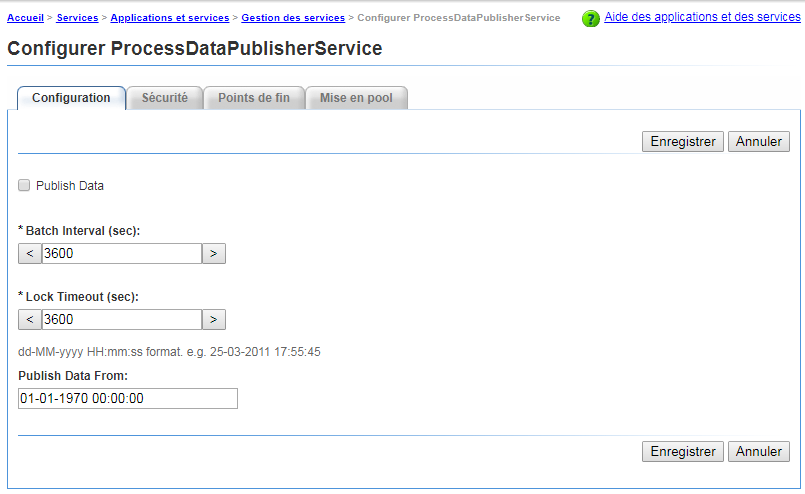
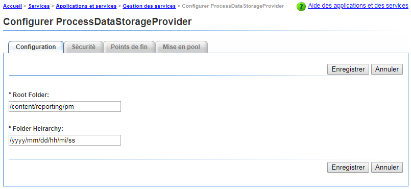
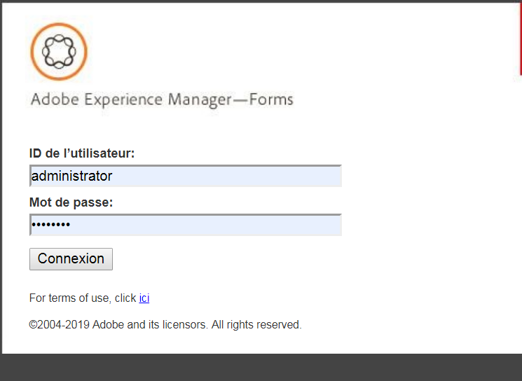
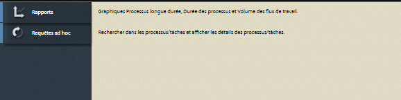

# Getting Started with Process Reporting{#getting-started-with-process-reporting}

Les  de processus permettent aux utilisateurs d’AEM Forms de des informations  sur les processus AEM Forms qui sont actuellement définis dans la mise en oeuvre d’AEM Forms. Toutefois, le  de processus n’accède pas directement aux données à partir du référentiel AEM Forms. Les données sont d’abord publiées dans le référentiel  de processus selon un calendrier planifié (*par les* services ProcessDataPublisher et ProcessDataStorage). Les rapports et les  de l’de processus sont ensuite générés à partir des données de l’ensemble de processus et des données publiées dans le référentiel.  de processus est installé dans le cadre du module de processus des formulaires.

Cet article décrit la procédure à suivre pour activer la publication des données AEM Forms dans le référentiel  de processus. Vous pourrez ensuite utiliser les  de processus pour exécuter des rapports et des  de. L’article traite également des options disponibles pour configurer les services de  de processus.

##  de processus Conditions préalables {#process-reporting-pre-requisites}

### Purger les processus non essentiels {#purge-non-essential-processes}

Si vous utilisez actuellement Forms Workflow, la base de données AEM Forms peut potentiellement contenir une grande quantité de données

Les services de publication  de processus publieront toutes les données AEM Forms actuellement disponibles dans la base de données. Cela signifie que si la base de données contient des données héritées sur lesquelles vous ne souhaitez pas exécuter de rapports et de , toutes ces données seront également publiées dans le référentiel, même si elles ne sont pas requises pour les  de. Il est recommandé de purger ces données avant d’exécuter les services pour publier les données dans le référentiel  de processus. Cela améliorera les performances du service d’éditeur et du service qui  les données pour les .

Pour plus d’informations sur la purge des données de processus AEM Forms, voir [Purge des données](https://help.adobe.com/en_US/livecycle/11.0/AdminHelp/WS92d06802c76abadb-5145d5d12905ce07e7-7cb2.2.html)de processus.

>[!NOTE]
>
>Pour obtenir des conseils et des astuces sur l’utilitaire de purge, reportez-vous à l’article Adobe Developer Connection sur la [purge des processus et des tâches](https://www.adobe.com/content/dam/Adobe/en/devnet/livecycle/pdfs/purging_processes_jobs.pdf).

## Configuration des  de processus {#configuring-process-reporting-services}

### Planification de la publication des données de processus {#schedule-process-data-publishing}

Les services de de processus publient les données de la base de données AEM Forms vers le référentiel de de processus  selon un calendrier planifié.

Cette opération peut être gourmande en ressources et avoir un impact sur les performances des serveurs AEM Forms. Il est recommandé de planifier cette opération en dehors des créneaux horaires occupés du serveur AEM Forms.

Par défaut, la publication des données est programmée pour s’exécuter tous les jours à 02h00.

Effectuez les étapes suivantes pour modifier le calendrier de publication :

>[!NOTE]
>
>Si vous exécutez l’implémentation d’AEM Forms sur une grappe, effectuez les étapes suivantes sur chaque noeud de la grappe.

1. Arrêtez l’instance du serveur AEM Forms.
1. &#x200B;

   * (Pour Windows) Ouvrez le `[JBoss root]/bin/run.conf.bat` fichier dans un éditeur.
   * (pour Linux, AIX et Solaris) `[JBoss root]/bin/run.conf.sh` dans un éditeur.

1. Ajouter l’argument JVM `-Dreporting.publisher.cron = <expression>.`

   Exemple : Le cron  suivant  entraîne le de processus à publier les données AEM Forms dans le référentiel de de processus toutes les 5 heures :

   * `-Dreporting.publisher.cron = 0_0_0/5_*_*_?`

1. Save and close the `run.conf.bat` file.

1. Redémarrez l’instance du serveur AEM Forms.

1. Arrêtez l’instance du serveur AEM Forms.
1. Log in to the WebSphere Administrative Console. In the navigation tree, click **Servers** > **Application servers** and then, in the right pane, click the server name.

1. Sous Server Infrastructure, cliquez sur **Java and Process Management**> **Process Definition**.

1. Sous Additional Properties, cliquez sur **Java Virtual Machine**.

   In the Generic JVM arguments box, add the argument `-Dreporting.publisher.cron = <expression>.`

   **Exemple**: Le cron  suivant  entraîne le de processus à publier les données AEM Forms dans le référentiel de de processus toutes les 5 heures :

   * `-Dreporting.publisher.cron = 0_0_0/5_*_*_?`

1. Click **Apply**, click OK, and then click **Save directly to the master configuration**.
1. Redémarrez l’instance du serveur AEM Forms.
1. Arrêtez l’instance du serveur AEM Forms.
1. Connectez-vous à WebLogic Administration Console. L’adresse par défaut de WebLogic Administration Console est `https://[hostname]:[port]/console`.
1. Sous Change Center, cliquez sur **Lock &amp; Edit**.
1. Sous Domain Structure, cliquez sur **Environment** > **Servers** et, dans le volet de droite, cliquez sur le nom du serveur géré.
1. Dans l’écran suivant, cliquez sur les onglets **Configuration** > **Server Start**.
1. Dans la zone Arguments, ajoutez l’argument JVM `-Dreporting.publisher.cron = <expression>`.

   **Exemple**: Le cron  suivant  entraîne le de processus à publier les données AEM Forms dans le référentiel de de processus toutes les 5 heures :

   `-Dreporting.publisher.cron = 0_0_0/5_*_*_?`

1. Cliquez sur **Save**, puis sur **Activate Changes**.
1. Redémarrez l’instance du serveur AEM Forms.

### Service ProcessDataStorage {#processdatastorage-service}

Le service ProcessDataStorageProvider reçoit les données de processus du service ProcessDataPublisher et les enregistre dans le référentiel  de processus.

Lors de chaque cycle de publication, les données sont enregistrées dans les sous-dossiers d’un dossier racine prédéfini.

Vous pouvez utiliser Administration Console pour configurer la racine (**par défaut**: `/content/reporting/pm`) emplacement et sous-dossier (**par défaut**: `/yyyy/mm/dd/hh/mi/ss`) format hiérarchique dans lequel les données de processus seraient stockées.

#### Pour configurer les emplacements de référentiel  de processus {#to-configure-the-process-reporting-repository-locations}

1. Connectez-vous à **Administration Console** avec les informations d’identification de l’administrateur. L’URL par défaut d’Administration Console est `https://'[server]:[port]'/adminui`
1. Accédez à **Accueil** > **Services** > **Applications et services** > Gestion des **services et ouvrez le service ProcessDataStorageProvider.******

   

   **RootFolder**

   Emplacement CRX à l’intérieur duquel les données de processus seraient stockées pour les  de.

   `Default`: `/content/reporting/pm`

   **Hiérarchie des dossiers**

   Hiérarchie de dossiers dans laquelle les données de processus seraient stockées en fonction de l’heure de création du processus.

   `Default`: `/yyyy/mm/dd/hh/mi/ss`

1. Cliquez sur **Save** (Enregistrer).

### Service ReportConfiguration {#reportconfiguration-service}

Le service ReportConfiguration est utilisé par le de processus pour configurer le service  de processus  le service.

#### To configure the ReportingConfiguration service {#to-configure-the-reportingconfiguration-service}

1. Connectez-vous à **Configuration Manager** à l’aide des informations d’identification d’administrateur CRX. The default URL of Configuration Manager is `https://'[server]:[port]'/lc/system/console/configMgr`
1. Ouvrez le service **ReportingConfiguration** .
1. **Nombre d&#39;enregistrements**

   Lors de l’exécution d’un  sur le référentiel, un résultat peut éventuellement contenir un grand nombre d’enregistrements. Si le jeu de résultats est volumineux, l’exécution du  du peut consommer des ressources du serveur.

   Pour gérer les jeux de résultats volumineux, le service ReportConfiguration divise le traitement des  en lots d’enregistrements. Cela réduit la charge du système.

   `Default`: `1000`

   **Chemin d’ CRX**

   Emplacement CRX à l’intérieur duquel les données de processus doivent être stockées pour les  du.

   `Default`: `/content/reporting/pm`

   >[!NOTE]
   >
   >Il s’agit du même emplacement que spécifié dans l’option de configuration ProcessDataStorage **Root Folder**.
   >
   >
   >Si vous mettez à jour l’option Dossier racine dans la configuration de ProcessDataStorage, vous devez mettre à jour l’emplacement du chemin d’accès au CRX  dans le service ReportConfiguration.

1. Cliquez sur **Enregistrer** et fermez **CQ Configuration Manager**.

### Service ProcessDataPublisher {#processdatapublisher-service}

Le service ProcessDataPublisher importe les données de processus de la base de données AEM Forms et les publie dans le service ProcessDataStorageProvider pour  .

#### Pour configurer le service ProcessDataPublisher {#to-configure-processdatapublisher-service-nbsp}

1. Connectez-vous à **Administration Console** avec les informations d’identification de l’administrateur.

   L’URL par défaut est `https://'server':port]/adminui/`.

1. Accédez à **Accueil** > **Services** > **Applications et services** > Gestion des **services et ouvrez le service ProcessDataPublisher.******

**Publier les données**

Activez cette option pour les données de processus de publication. Par défaut, l’option est désactivée.

Activez les  de processus uniquement lorsque toutes les configurations liées aux composants  de processus sont configurées de manière appropriée.

Vous pouvez également utiliser cette option pour désactiver la publication des données de processus lorsqu’elle n’est plus nécessaire.

`Default`: `Off`

**Intervalle du lot (s)**

Chaque fois que le service ProcessDataPublisher s’exécute, le service commence par fractionner le temps depuis la dernière exécution du service par l’intervalle de traitement par lots. Le service traite ensuite chaque intervalle des données AEM Forms séparément.

Cela permet de contrôler la taille des données que l’éditeur traite de bout en bout lors de chaque exécution (lot) au cours d’un cycle.

Par exemple, si l’éditeur s’exécute tous les jours, au lieu de traiter l’ensemble des données pendant un jour au cours d’une seule exécution, il répartit par défaut le traitement en 24 lots d’une heure chacun.

`Default`: `3600`

`Unit`: `Seconds`

**Délai d’expiration du verrouillage (s)**

Le service d’éditeur acquiert un verrou lorsqu’il  des données de traitement, de sorte que plusieurs instances de l’éditeur ne pas les données en cours d’exécution et de traitement simultané.

Si un service d’éditeur ayant acquis un verrou est inactif pendant le nombre de secondes défini par la valeur Délai d’expiration du verrou, son verrou est libéré afin que les autres instances du service d’éditeur puissent poursuivre le traitement.

`Default`: `3600`

`Unit`: `Seconds`

**Publier les données depuis**

Le  AEM Forms  contient les données du moment où le  a été configuré.

Par défaut, le service ProcessDataPublisher importe toutes les données de la base de données AEM Forms.

En fonction des besoins de votre, si vous prévoyez d’exécuter des rapports et des  sur les données après une date et une heure déterminées, il est recommandé de spécifier la date et l’heure. Le service de publication publiera alors la date à partir de cette date.

`Default`: `01-01-1970 00:00:00`

`Format`: `dd-MM-yyyy HH:mm:ss`

## Accès à l’interface utilisateur du de processus {#accessing-the-process-reporting-user-interface}

L’interface utilisateur des  de processus est basée sur un navigateur.

Une fois que vous avez configuré les  de processus, vous pouvez vous  à travailler avec les  de processus à l’emplacement suivant dans votre installation AEM Forms :

`https://<server>:<port>/lc/pr`

### Connexion au de processus {#log-in-to-process-reporting}

Lorsque vous accédez à l’URL de  de processus (https://&lt;serveur>:&lt;port>/lc/pr), l’écran de connexion s’affiche.

Spécifiez vos informations d’identification pour vous connecter au module  de processus.

>[!NOTE]
>
>Pour vous connecter à l’interface utilisateur du de processus, vous devez disposer de l’autorisation AEM Forms suivante :
>
>`PERM_PROCESS_REPORTING_USER`

Lorsque vous vous connectez à  de processus, l’écran **[!UICONTROL Accueil]** s’affiche.

### Ecran d’accueil du de processus {#process-reporting-home-screen}

**de processus  d&#39;arborescence  :** L’arborescence  sur le côté gauche de l’écran d’accueil contient les éléments pour les modules  du de processus.

L’ d’arborescence se compose des éléments de niveau supérieur suivants :

**Rapports :** Cet élément contient les rapports prêts à l’emploi qui sont livrés avec les  de processus.

Pour plus d’informations sur les rapports prédéfinis, reportez-vous à la page Rapports [prédéfinis dans les](/help/forms/using/process-reporting/pre-defined-reports-in-process-reporting.md)de processus.

**ad hoc :** Cet élément contient des options permettant d’effectuer une recherche basée sur des filtres pour les processus et les .

Pour plus d’informations sur les  ad hoc, reportez-vous à la page  [ad hoc dans le](/help/forms/using/process-reporting/adhoc-queries-in-process-reporting.md)processus .

**Personnalisé :** Le noeud Personnalisé affiche les rapports personnalisés que vous créez.

Pour connaître la procédure de création et d’affichage des rapports personnalisés, voir Rapports [personnalisés dans les](/help/forms/using/process-reporting/process-reporting-custom-reports.md)de processus.

**de traitement de la barre de titre :** La barre de titre du de processus contient des options génériques que vous pouvez utiliser lorsque vous travaillez dans l’interface utilisateur.

**Titre  du processus :** Le titre du de processus s’affiche dans le coin gauche de la barre de titre.

Cliquez sur le titre à tout moment pour revenir à l’écran d’accueil.

**Heure de la dernière mise à jour :** Les données de processus sont publiées à partir de la base de données AEM Forms vers le référentiel de  de processus selon une planification planifiée.

L’Heure de la dernière mise à jour affiche la date et l’heure auxquelles les mises à jour de données ont été transférées vers le référentiel  de processus.

Pour plus d’informations sur le service de publication de données et sur la manière de planifier ce service, voir [Planifier la publication](/help/forms/using/process-reporting/install-start-process-reporting.md#p-schedule-process-data-publishing-p) des données de processus dans l’article Prise en main des  de processus.

**Utilisateur  de processus :** Le nom d’utilisateur connecté s’affiche à droite de l’heure de la dernière mise à jour.

**de traitement le déroulant de la barre de titre  :** Le déroulant situé dans le coin droit de la barre de titre du de processus  contient les options suivantes :

* **[!UICONTROL Synchronisation]**: Synchronisez le référentiel de  de processus incorporé avec la base de données AEM Forms.
* **[!UICONTROL Aide]**: de la documentation d’aide sur l’ de processus.
* **[!UICONTROL Déconnexion]**: Déconnexion du de processus 
