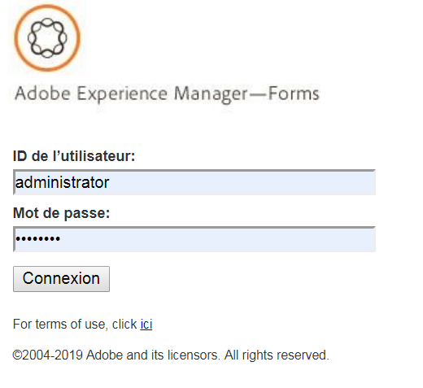

# Introduction aux  de processus{#introduction-to-process-reporting}

Le  de processus est un outil de navigateur que vous utilisez pour créer et des rapports  sur les processus et les  AEM Forms.

Le de processus fournit un ensemble de rapports prêts à l’emploi qui vous permettent de filtrer, de  des informations sur les processus à long terme, la durée du processus et le volume de flux de travail.

De plus, Process fournit une interface permettant d’exécuter des  de rapports ad hoc et d’intégrer des  de rapports personnalisés dans l’interface utilisateur de Process.

Pour le  des navigateurs pris en charge, reportez-vous à la page Plateformes [prises en charge par](/help/forms/using/aem-forms-jee-supported-platforms.md)AEM Forms.

Les  de processus reposent sur des modules qui :

* Lire les données de processus de la base de données AEM Forms
* Publication des données de processus dans un référentiel de de processus incorporé 
* Fournit une interface utilisateur basée sur un navigateur pour les rapports 

## Key Capabilities {#key-capabilities}

###  toujours active {#always-on-reporting}

 le des processus à longue exécution, des diagrammes de durée de processus et exécuter des personnalisés à l’aide de l’de flux.

Le de processus offre également la possibilité d’exporter le rapport et les données  au format CSV.

### Rapports ad hoc {#adhoc-reports}

Utilisez  pour obtenir un spécifique de vos données.

Vous pouvez rechercher des processus ou des  par ID, durée, et dates de fin, initiateur de processus, etc.

Vous pouvez combiner plusieurs  de pour créer des rapports spécifiques.

Vous pouvez ensuite enregistrer le de rapports pour l’exécuter à une date ou une heure ultérieure.

### Historique des  de processus/ {#process-task-history}

Les serveurs AEM Forms exécutent de nombreux processus en parallèle. Ces processus continuent de passer d’un état à l’autre. En publiant les données de formulaires dans le référentiel  de processus à intervalles réguliers,  de processus conserve les informations de transition sur les processus exécutés dans AEM Forms.

### Contrôle d’accès {#access-control-br}

Les rapports de processus fournissent un accès basé sur les autorisations à l’interface utilisateur.

En d’autres termes, seuls les utilisateurs disposant d’autorisations  ont accès à l’interface utilisateur de  de processus.
