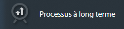
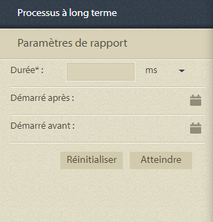
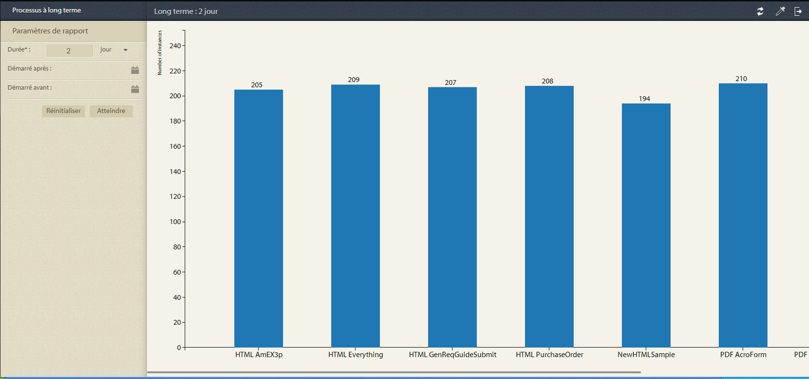
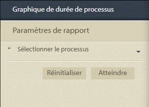
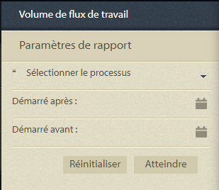

# Rapports prédéfinis dans Process Reporting {#pre-defined-reports-in-process-reporting}

## Rapports prédéfinis dans les rapports de processus {#pre-defined-reports-in-process-reporting-1}

AEM Forms Process Reporting est fourni avec les *rapports d’usine* suivants :

* **[Processus à long terme](#long-running-processes)** : Rapport de tous les processus AEM Forms dont l’exécution a pris plus d’un temps spécifié
* **[Graphique de durée du processus](#process-duration-report)** : Rapport d’un processus AEM Forms spécifié par la durée
* **[Volume de workflow](#workflow-volume-report)** : Rapport des instances en cours d’exécution et terminées du processus spécifié par date

## Processus à long terme {#long-running-processes}

Le rapport Long Running Processes affiche les processus AEM Forms dont l’exécution a pris plus d’un temps spécifié.

### Pour exécuter un rapport de processus à long terme {#to-execute-a-long-running-process-report}

1. Pour afficher la liste des rapports prédéfinis dans Process Reporting, dans l’arborescence **Process Reporting**, cliquez sur le noeud **Reports**.
1. Cliquez sur le noeud de rapport **Processus à long terme** .

   

   Lorsque vous sélectionnez un rapport, le panneau **Paramètres de rapport** s’affiche à droite de l’arborescence.

   

   Paramètres:

   * **Durée**  (*obligatoire*) : Spécifiez une durée et une unité de temps. Affichez tous les processus AEM Forms qui ont été exécutés pendant plus de la durée spécifiée.
   * **Démarré après**  (*facultatif*) : Sélectionnez une date. Filtrez le rapport pour afficher les instances de processus démarrées après la date spécifiée.
   * **Démarré avant**  (*facultatif*) : Sélectionnez une date. Filtrez le rapport pour afficher les instances de processus qui ont démarré avant la date spécifiée.

1. Cliquez sur **Aller** pour exécuter le rapport.

   Le rapport s’affiche dans le panneau **Rapport** à droite de la fenêtre **Process Reporting**.

   

   Utilisez les options situées dans le coin supérieur droit du panneau **Rapport** pour effectuer les opérations suivantes sur le rapport.

   * **Actualiser** : Actualise le rapport avec les dernières données stockées
   * **Changer la couleur** de la légende : Sélectionner et modifier la couleur de la légende du rapport
   * **Exporter au format CSV** : Exporter et télécharger les données du rapport dans un fichier séparé par des virgules

## Rapport Durée du processus {#process-duration-report}

Le rapport Durée du processus affiche le nombre d’instances d’un processus Forms par nombre de jours d’exécution de chaque instance.

### Pour exécuter un rapport Durée du processus {#to-execute-a-process-duration-report}

1. Pour afficher les rapports prédéfinis dans Process Reporting, dans l’arborescence **Process Reporting**, cliquez sur le noeud **Reports**.
1. Cliquez sur le noeud de rapport **Durée des processus** .

   

   Lorsque vous sélectionnez un rapport, le panneau **Paramètres de rapport** s’affiche à droite de l’arborescence.

   

   Paramètres:

   * **Sélectionnez Processus**  (*obligatoire*) : Sélectionnez un processus AEM Forms.

1. Cliquez sur **Aller** pour exécuter le rapport.

   Le rapport s’affiche dans le panneau **Rapport** à droite de la fenêtre Process Reporting.

   

   Utilisez les options situées dans le coin supérieur droit du panneau **Rapport** pour effectuer les opérations suivantes sur le rapport.

   * **Actualiser** : Actualise le rapport avec les dernières données stockées
   * **Changer la couleur** de la légende : Sélectionner et modifier la couleur de la légende du rapport
   * **Exporter au format CSV** : Exporter et télécharger les données du rapport dans un fichier séparé par des virgules

## Rapport Volume de workflow {#workflow-volume-report}

Le rapport Volume de workflow affiche le nombre d’instances en cours d’exécution et terminées d’un processus AEM Forms par jour calendaire.

### Pour exécuter un rapport Volume de workflow {#to-execute-a-workflow-volume-report}

1. Pour afficher les rapports prédéfinis dans Process Reporting, dans l’arborescence **Process Reporting**, cliquez sur le noeud **Reports**.
1. Cliquez sur le noeud de rapport **Volume de workflow** .

   

   Lorsque vous sélectionnez un rapport, le panneau **Paramètres de rapport** s’affiche à droite de l’arborescence.

   

   Paramètres:

   * **Sélectionnez Processus**  (*obligatoire*) : Sélectionnez un processus AEM Forms.

   * **Démarré après**  (*facultatif*) : Sélectionnez une date. Filtre le rapport afin d’afficher les instances de processus démarrées après la date spécifiée.

   * **Démarré avant**  (*facultatif*) : Sélectionnez une date. Filtre le rapport pour afficher les instances de processus qui ont démarré avant la date spécifiée.

1. Cliquez sur **Aller** pour exécuter le rapport.

   Le rapport s’affiche dans le panneau **Rapport** à droite de la fenêtre **Process Reporting**.

   

   Utilisez les options situées dans le coin supérieur droit du panneau **Rapport** pour effectuer les opérations suivantes sur le rapport.

   * **Actualiser** : Actualise le rapport avec les dernières données stockées
   * **Changer la couleur** de la légende : Sélectionner et modifier la couleur de la légende du rapport
   * **Exporter au format CSV** : Exporter et télécharger les données du rapport dans un fichier séparé par des virgules
