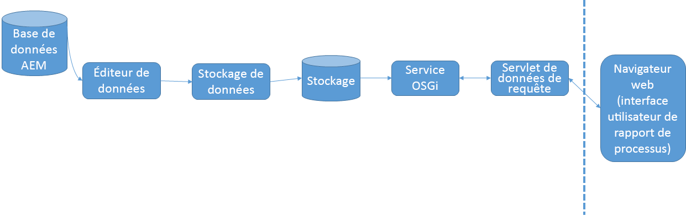

# Fonctionnement du de processus {#how-process-reporting-works}

Le  de processus est le module  de d’AEM Forms sur JEE.

Les  de processus vous permettent d’exécuter des rapports sur les processus et les  d’AEM Forms.

Le de processus utilise le référentiel de de processus incorporé  pour publier les données de formulaires. Il utilise ensuite ces données pour exécuter des rapports.

Les  de processus se composent des modules suivants :

* [Service ProcessDataPublisher](/help/forms/using/process-reporting/process-reporting-architecture.md#p-processdatapublisher-service-br-p)
* [Service ProcessDataStorage](/help/forms/using/process-reporting/process-reporting-architecture.md#p-processdatastorageprovider-service-br-p)
* [Service OSGi](/help/forms/using/process-reporting/process-reporting-architecture.md#p-osgi-service-br-p)
* [servlet de données](/help/forms/using/process-reporting/process-reporting-architecture.md#p-querydataservlet-service-br-p)
* [Interface utilisateur du de processus](/help/forms/using/process-reporting/process-reporting-architecture.md#p-process-reporting-user-interface-br-p)

## Architecture de  de processus {#process-reporting-architecture-br}

## Modules de  de processus {#process-reporting-modules}

### Service ProcessDataPublisher {#processdatapublisher-service-br}

Le serveur ProcessDataPublisher s’exécute régulièrement sur la base de données AEM Forms et extrait les données qui ont changé depuis la dernière exécution du service. Il publie ensuite les données dans le service de  de données de processus .

Pour plus d’informations sur la configuration du service, voir [Configuration du service](/help/forms/using/process-reporting/install-start-process-reporting.md#p-reportconfiguration-service-p)ProcessDataPublisher.

### Service ProcessDataStorageProvider {#processdatastorageprovider-service-br}

Le service ProcessDataStorageProvider reçoit les données de processus du service ProcessDataPublisher et les enregistre dans le référentiel  de processus.

Pour plus d’informations sur la configuration du service, voir [Configuration du service](/help/forms/using/process-reporting/install-start-process-reporting.md#p-to-configure-the-process-reporting-repository-locations-p)ProcessDataStorageProvider.

### Service OSGi {#osgi-service-br}

Le servlet QueryDataServlet utilise ce service pour obtenir les données  du à partir du référentiel  de processus.

### Service QueryDataServlet {#querydataservlet-service-br}

Le service QueryDataServlet accepte les  à partir de l’interface utilisateur de  de de processus.

Le service utilise ensuite les services OSGi pour obtenir les données  pertinentes, traiter les données et les renvoyer à l’interface utilisateur.

### Interface utilisateur du de processus {#process-reporting-user-interface-br}

L’interface utilisateur du de processus est une interface Web basée sur un navigateur. Vous utilisez cette interface pour les informations de processus et de  de publiées à partir de la base de données AEM Forms.

### Service QueryDataServlet {#querydataservlet-service-br-1}

Le service QueryDataServlet accepte les  à partir de l’interface utilisateur de  de de processus.

Le service utilise ensuite les services OSGi pour obtenir les données  pertinentes, traiter les données et les renvoyer à l’interface utilisateur.

### Rapports personnalisés {#custom-reports-br}

Vous pouvez créer vos propres rapports personnalisés et les afficher dans l’onglet Rapports personnalisés de l’interface utilisateur  de processus.

Pour connaître les étapes de création d’un rapport personnalisé, voir Création d’un rapport personnalisé dans l’article Rapports [personnalisés dans le](/help/forms/using/process-reporting/process-reporting-custom-reports.md)de processus.
