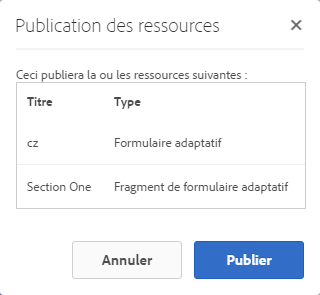
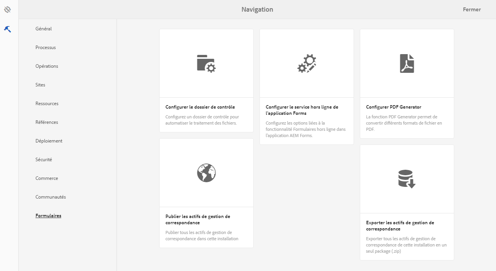
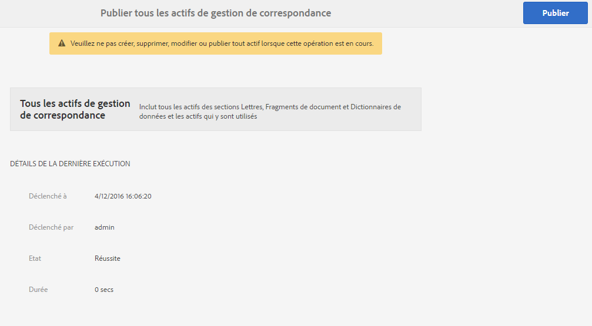

# Publication et annulation de publication de formulaires et documents{#publishing-and-unpublishing-forms-and-documents}

AEM Forms vous permet de créer, publier et annuler la publication de formulaires en toute facilité. Pour plus d’informations sur AEM Forms, consultez la section [Présentation de la gestion des formulaires](../../forms/using/introduction-managing-forms.md).

Le serveur AEM Forms propose deux instances : Auteur et Publication. L’instance Auteur est destinée à la création et la gestion d’éléments et de ressources de formulaire. L’instance Publication est destinée à conserver les éléments et les ressources connexes mis à la disposition des utilisateurs finaux. Vous pouvez importer des formulaires XDP et PDF en mode Auteur. Pour plus d’informations, voir [Obtention de documents XDP et PDF dans AEM Forms](../../forms/using/get-xdp-pdf-documents-aem.md).

## Ressources prises en charge   {#supported-assets-nbsp}

AEM Forms prend en charge les types de ressources suivants :

* Formulaires adaptatifs
* Documents adaptatifs
* Fragments de formulaire adaptatif
* Thèmes
* Modèles de formulaire (formulaires XFA)
* Formulaires PDF
* Document (documents PDF aplatis)
* Ensembles de formulaire
* Ressource (images, schémas et feuilles de style)

Au départ, tous les éléments sont disponibles uniquement dans l’instance Auteur. Un administrateur ou un auteur de formulaires peut publier l’ensemble des éléments, à l’exception des ressources.

Lorsque vous sélectionnez un formulaire et que vous le publiez, ses éléments et ressources associés sont également publiés. Toutefois, les éléments dépendants ne sont pas publiés. Dans ce contexte, les éléments et les ressources connexes sont des éléments qu’un élément publié utilise ou auquel il se réfère. Les éléments dépendants sont des éléments qui font référence à un élément publié.

Vos formulaires adaptatifs peuvent utiliser certains paramètres, configurations et personnalisations qui ne sont pas publiés automatiquement. Il est recommandé de publier ou d’activer ces ressources avant de publier un formulaire adaptatif.

* Modèles de formulaires adaptatifs modifiables
* Configurations du service Cloud pour les modèles Adobe Sign, Typekit, reCAPTCHA et Form Data
* Les autres configurations de services Cloud ne sont activées que si l’utilisateur dispose de droits d’administrateur.
* Personnalisations. Elles comprennent notamment :

   * Mises en page personnalisées
   * Aspects personnalisés
   * Fichier CSS - pris comme entrée dans la boîte de dialogue Propriétés du conteneur de formulaire adaptatif
   * Catégorie de la bibliothèque cliente : saisie en tant qu’entrée dans la boîte de dialogue Propriétés du conteneur de formulaires adaptatifs
   * Une autre bibliothèque client qui peut être incluse dans le modèle de formulaire adaptatif.
   * Chemins de conception

## États d’une ressource {#asset-states}

Un élément peut présenter les états suivants : 

* **Non publié** : élément qui n’a jamais été publié (l’état non publié s’applique uniquement aux éléments de formulaires. Les éléments de Correspondence Management n’ont pas l’état non publié.)
* **Publié** : élément qui a été publié et qui est disponible sur l’instance Publication
* **Modifié** : élément qui est modifié après avoir été publié

## Publication d’un actif {#publish-an-asset}

1. Connectez-vous au serveur AEM Forms.
1. Utilisez l’un des éléments suivants pour sélectionner et publier un élément.

   1. Déplacez le pointeur sur un fichier et appuyez sur **[!UICONTROL Publier]** .
   1. Effectuez l’une des actions suivantes, puis appuyez sur Publier :

      * Si vous êtes dans la vue de carte, appuyez sur **[!UICONTROL Entrer la sélection]** , puis appuyez sur la ressource. L’élément est sélectionné.
      * Si le mode Liste est actif, cochez la case correspondant à un élément. L’élément est sélectionné.
      * Appuyez sur un élément pour en afficher les détails.
      * Affichez les propriétés d’une ressource en appuyant sur Propriétés de la Vue .

      >[!NOTE]
      >
      >Ne sélectionnez pas plusieurs éléments. La publication simultanée de plusieurs fichiers n’est pas prise en charge.

1. Au lancement de la procédure de publication, une boîte de dialogue de confirmation s’ouvre. Elle répertorie l’ensemble des éléments et des ressources connexes. Dans la boîte de dialogue contenant les ressources connexes, appuyez sur **[!UICONTROL Publier]**. La ressource est publiée et la boîte de dialogue Publication des ressources réussie s’affiche.

   >[!NOTE]
   >
   >Dans le cas des formulaires adaptatifs, à côté des éléments connexes, le nom de la page Formulaire adaptatif est également affiché.

   

   Boîte de dialogue de confirmation comprenant l’ensemble des ressources et des éléments connexes.

   >[!NOTE]
   >
   >Pour Forms Manager, si l’utilisateur n’est pas autorisé à publier les éléments répertoriés, l’action Publication est désactivée. Un élément qui nécessite des autorisations supplémentaires est affiché en rouge.

   Une fois l’élément publié, ses propriétés de métadonnées sont copiées dans l’instance Publication et son état passe sur Publié. L’état des éléments dépendants qui sont publiés est également changé pour Publié.

   Après la publication d’un élément, vous pouvez utiliser Forms Portal pour afficher l’ensemble des éléments sur une page Web. Pour plus d’informations, consultez la section [Présentation de la publication de formulaires sur un portail](../../forms/using/introduction-publishing-forms.md).

## Publication de tous les actifs de Correspondence Management {#publish-all-the-correspondence-management-assets}

AEM Forms permet de modifier tous les actifs de Correspondence Management sur un serveur en une seule fois. Les éléments publiés comportent tous les actifs de Correspondence Management et dépendances connexes.

Procédez comme suit pour publier tous les actifs de Correspondence Management sur un serveur :

1. Connectez-vous au serveur AEM Forms.
1. Appuyez sur **Adobe Experience Manager** dans la barre de navigation globale.
1. Appuyez sur , puis sur **Forms**.
1. Appuyez sur **Publier les actifs de Correspondence Management**.

   

   La page Publier tous les actifs de Correspondence Management s’affiche et affiche les informations relatives à la dernière tentative de publication des actifs de Correspondence Management.

   

1. Appuyez sur **Publier** et, dans le message de confirmation, appuyez sur **OK**.

   A la fin du traitement par lot, vous pouvez afficher les détails de la dernière exécution. Ces informations indiquent la session administrateur et si le traitement du lot a réussi ou échoué.

   >[!NOTE]
   >
   >Le processus de publication ne peut pas être annulé une fois lancé. En outre, pendant que l’opération de publication est en cours, ne créez, supprimez, modifiez ou publiez aucun actif ou ne lancez pas l’opération Exporter tous les actifs de Correspondence Management.

## Automatisation de la publication ou de l’annulation de publication de formulaires et documents {#automate-publishing-and-unpublishing-for-forms-amp-documents}

AEM Forms permet de planifier la publication et l’annulation de publication des éléments de formulaires et documents. Vous pouvez spécifier la planification dans l’éditeur de métadonnées. Pour plus d’informations sur la gestion des métadonnées de formulaire, voir [Gestion des métadonnées de formulaire.](../../forms/using/manage-form-metadata.md)

Procédez comme suit pour planifier la date et l’heure de publication et d’annulation de publication des éléments de formulaires et documents :

1. Sélectionnez une ressource et appuyez sur **[!UICONTROL Propriétés de la Vue]**. La page Propriétés des métadonnées s’ouvre.
1. Dans la page Propriétés des métadonnées, appuyez sur **[!UICONTROL Avancé]**, puis sur **[!UICONTROL Modifier]** .
1. Sélectionnez la date et l’heure dans les champs **[!UICONTROL Heure de début de publication]** et **[!UICONTROL Heure de fin de publication]**.\
   Appuyez sur **[!UICONTROL Terminé]** .

## Annulation de la publication d’un élément {#unpublish-an-asset}

1. Sélectionnez un fichier qui est publié et appuyez sur **[!UICONTROL Annuler la publication]** .
1. Utilisez l’une des actions suivantes pour sélectionner et annuler la publication d’un élément.

   1. Positionnez le pointeur sur une ressource et appuyez sur **[!UICONTROL Annuler la publication]** .
   1. Effectuez l’une des actions suivantes, puis appuyez sur Annuler la publication :

      * Si vous êtes dans la vue de carte, appuyez sur **[!UICONTROL Entrer la sélection]** , puis appuyez sur la ressource. L’élément est sélectionné.

      * Si vous vous trouvez dans la vue de liste, passez la souris sur une ressource et appuyez sur  . L’élément est sélectionné.

      * Appuyez sur un élément pour en afficher les détails.
      * Affichez les propriétés d’une ressource en appuyant sur Propriétés de la Vue .

1. Au lancement de la procédure d’annulation de publication, une boîte de dialogue de confirmation s’ouvre. Appuyez sur **[!UICONTROL Annuler la publication]**.

   >[!NOTE]
   >
   >L’annulation de publication affecte uniquement l’élément sélectionné ; les éléments enfants et référencés ne sont pas concernés.

## Rétablir la version précédemment publiée d’une ressource ou d’une lettre {#revert-an-asset-or-letter-to-the-previously-published-version}

Chaque fois que vous publiez une ressource ou une lettre après l’avoir modifiée, une version de la ressource ou de la lettre est publiée. Vous pouvez rétablir la version précédemment publiée d’une ressource ou d’une lettre. Cette opération peut être utile si un problème se produit avec la version actuelle de la ressource ou de la lettre.

>[!NOTE]
>
>Ne rétablissez pas le dernier état de publication d’une lettre si une ressource dépendante utilisée dans cette lettre publiée a été supprimée du système.

1. Sélectionnez un fichier et appuyez sur **[!UICONTROL Revenir à la version précédemment publiée]** .
1. Avant que la ressource ne soit rétablie, une boîte de dialogue de confirmation s’affiche. Appuyez sur **[!UICONTROL Rétablir]**.

   La version précédemment publiée de la ressource ou de la lettre est rétablie.

## Suppression d’un élément {#delete-an-asset}

>[!NOTE]
>
>La suppression d’une ressource la supprime de l’instance de publication. La suppression d’une ressource supprime également son historique des versions, sauf la version de base.

1. Sélectionnez une ressource et appuyez sur **[!UICONTROL Supprimer]** .

   >[!NOTE]
   >
   >L’option Supprimer est également disponible lorsque vous affichez les détails d’un fichier en appuyant sur un fichier ou lorsque vous affichez ses propriétés en appuyant sur Propriétés de la Vue .

1. Avant que l’élément soit supprimé, une boîte de dialogue de confirmation s’affiche. Appuyez sur **[!UICONTROL Supprimer]**.

   >[!NOTE]
   >
   >Seul l’élément sélectionné est supprimé et les éléments dépendants ne sont pas supprimés. Pour vérifier les références d&#39;un actif, appuyez sur , puis sélectionnez un actif.
   >
   >
   >Si l’élément que vous essayez de supprimer est un élément enfant d’un autre élément, il n’est pas supprimé. Pour supprimer ce type d’élément, supprimez les références de cet élément des autres éléments et réessayez.

## Formulaires adaptatifs protégés {#protected-adaptive-forms}

Vous pouvez activer une authentification pour les formulaires auxquels vous souhaitez que des utilisateurs sélectionnés aient accès. Lorsque vous activez une authentification pour vos formulaires, les utilisateurs voient un écran de connexion avant d’y accéder. Seuls les utilisateurs dotés d’informations d’identification autorisées peuvent accéder aux formulaires.

Pour activer une authentification pour vos formulaires :

1. Dans votre navigateur, ouvrez configMgr dans l’instance de publication.\
   URL: `https://<hostname>:<PublishPort>/system/console/configMgr`

1. Dans la configuration de la console Web d’Adobe Experience Manager, cliquez sur **Service d’authentification Apache Sling** pour le configurer.
1. Dans la boîte de dialogue Service d’authentification d’Apache Sling qui s’affiche, utilisez le bouton **+** pour ajouter des chemins d’accès.\
   Lorsque vous ajoutez un chemin, le service d’authentification est activé pour les formulaires de ce chemin.
