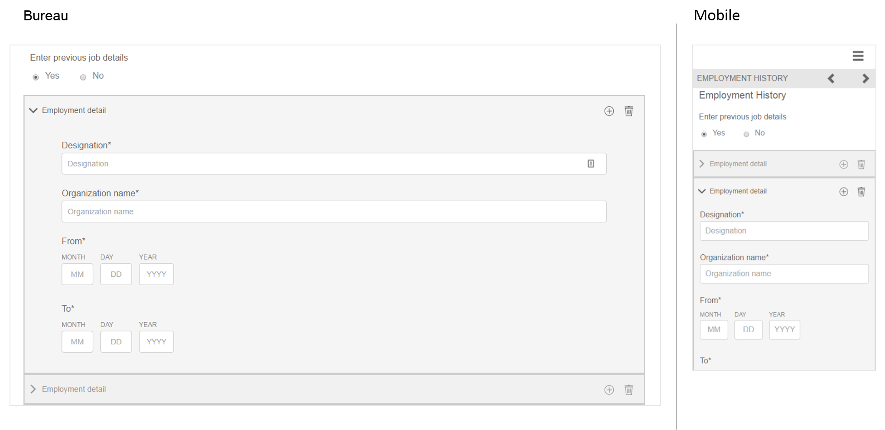
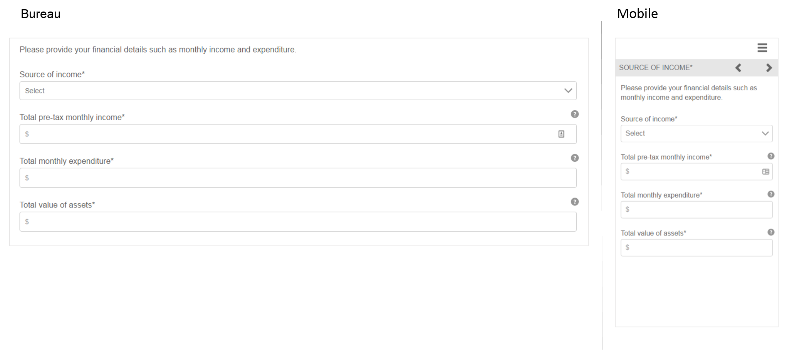

# Fragments de formulaires adaptatifs de référence{#reference-adaptive-form-fragments}

[Fragment de formulaire adaptatif](../../forms/using/adaptive-form-fragments.md) est un groupe de champs ou un panneau contenant un groupe de champs que vous pouvez utiliser lors de la création d’un formulaire. Il vous permet de créer un formulaire facilement et rapidement. Vous pouvez glisser-déposer un fragment de formulaire adaptatif dans un formulaire à l’aide du navigateur de ressources de la barre latérale, et vous pouvez le modifier dans l’éditeur de formulaire.

Pour les auteurs de formulaires adaptatifs, des fragments de référence sont fournis dans le [package de modules complémentaires AEM Forms](https://experienceleague.adobe.com/docs/experience-manager-release-information/aem-release-updates/forms-updates/aem-forms-releases.html?lang=fr). Il comprend les fragments suivants :

* Adresse
* Coordonnées
* Informations de la carte de crédit
* Emploi actuel
* Informations sur les personnes à charge
* Historique d’emploi
* Recettes et dépenses
* Nom
* Conditions générales
* Conditions générales avec griffonnage

Lorsque vous installez le package, un dossier Fragments de référence contenant des fragments de référence est créé sous Forms &amp; Documents. Pour installer un package, voir [Utilisation de packages](/help/sites-administering/package-manager.md).

## Adresse {#address}

Comprend des champs pour spécifier l’adresse postale. Les champs disponibles sont Adresse postale, Code postal, Ville, État et pays. Il comprend également un service Web préconfiguré qui renseigne la ville et l’état pour un code postal américain spécifié.

<!--[Click to enlarge

](assets/address-1.png)-->

## Coordonnées {#contact-information}

Comprend des champs permettant de saisir le numéro de téléphone et l’adresse électronique.

<!--[Click to enlarge

](assets/contact-info-1.png)-->

## Informations de carte de crédit {#credit-card-information}

Comprend des champs permettant de capturer les informations de carte de crédit qui peuvent être utilisées pour le traitement des paiements.

## Emploi actuel {#current-employment}

Comprend des champs permettant de capturer les informations de l’emploi actuel comme le statut d’emploi, le secteur, la désignation, l’entreprise et la date de début.

<!--[Click to enlarge

](assets/current-emp-1.png)-->

## Informations sur les personnes à charge {#dependents-information}

Comprend des champs permettant d’indiquer des informations sur une ou plusieurs personnes à charge, telles que leur nom, la relation et leur âge sous forme de tableau.

<!--[Click to enlarge

](assets/dependents-info-1.png)-->

## Historique d’emploi {#employment-history}

Comprend des champs pour capturer l’historique des emplois. Il permet d’ajouter plusieurs organisations.

<!--[Click to enlarge

](assets/emp-history-1.png)-->

## Recettes et dépenses {#income-expenditure}

Comprend des champs pour capturer les flux de trésorerie et les dépenses mensuels. Les Forms qui demandent aux utilisateurs de fournir des détails financiers peuvent utiliser ce fragment pour capturer les recettes et les dépenses.

<!--[Click to enlarge

](assets/income-1.png)-->

## Nom {#name}

Comprend des champs permettant d’indiquer le titre, le prénom, le deuxième prénom et le nom de famille.

<!--[Click to enlarge

](assets/name-1.png)-->

## Conditions générales {#terms-conditions}

Indique les conditions générales que les utilisateurs doivent accepter avant d’envoyer un formulaire.

<!--[Click to enlarge

](assets/tnc-1.png)-->

## Conditions générales avec saisie tactile {#terms-conditions-with-scribble}

Indique les conditions générales que les utilisateurs doivent accepter et signer avant d’envoyer un formulaire.

<!--[Click to enlarge

](assets/tnc-scribble-1.png)-->
