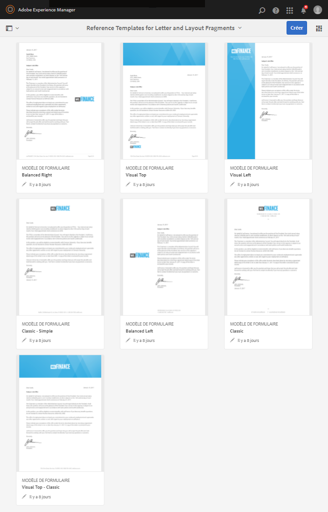
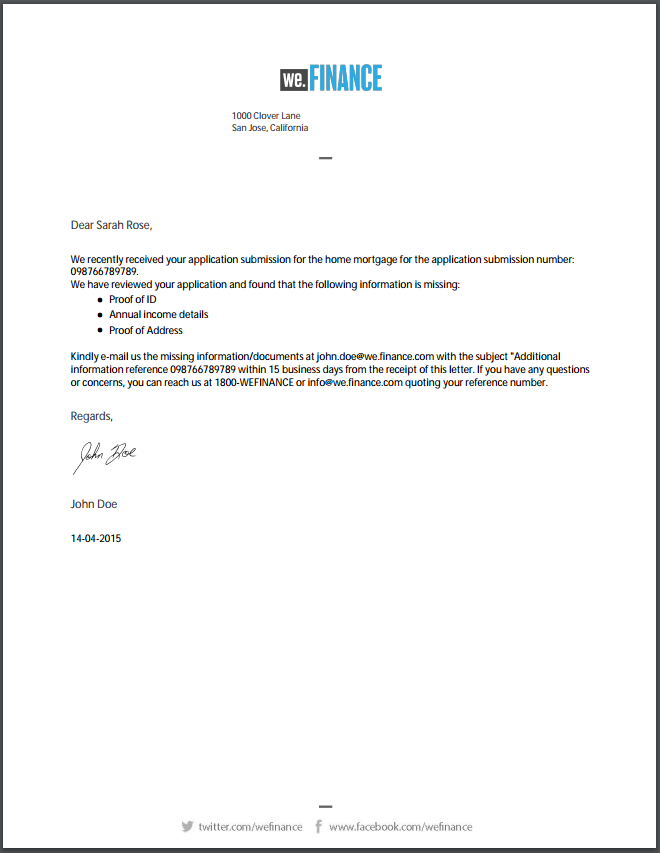

# Modèles de lettres de référence {#reference-letter-templates}

Dans Correspondence Management, un modèle de lettre contient des champs de formulaire classiques, des fonctions de mise en page (en-têtes et pieds de page, par exemple) et des « zones cibles » vides où placer du contenu.

Correspondence Management fournit des modèles de lettre dans le package AEM Forms [AEM-FORMS-REFERENCE-LAYOUT-TEMPLATES](https://www.adobeaemcloud.com/fr/content/marketplace/marketplaceProxy.html?packagePath=/content/companies/public/adobe/packages/cq630/fd/AEM-FORMS-6.3-REFERENCE-LAYOUT-TEMPLATES). Pour installer un package, voir [Comment utiliser les packages](/help/sites-administering/package-manager.md). Vous pouvez personnaliser les modèles dans Designer en fonction de vos besoins de marque et d’entreprise. Le package inclut les modèles suivants :

* Classique
* Classique simple
* Équilibré à gauche
* Équilibré à droite
* Visuel gauche
* Visuel haut
* Visuel haut - Classique

Après avoir installé le package, les modèles de mise en page (XDP) sont répertoriés dans le dossier dédié à l’emplacement suivant :

`https://'[server]:[port]'/[context-root]/aem/forms.html/content/dam/formsanddocuments/templates-folder`

Voici les champs communs à tous les modèles de ce package :

* Date
* Salutations
* Texte de clôture
* Texte de signature

Après l’installation du package AEM-FORMS-6.3-REFERENCE-LAYOUT-TEMPLATES, les modèles sont répertoriés dans les dossiers dédiés

## Classique {#classic}

Présentant un logo dans la partie supérieure, le modèle Classique convient à une lettre professionnelle simple.

Aperçu PDF d’une lettre créée à l’aide du modèle Classique

## Classique simple {#classic-simple}

Comprend des champs permettant de saisir le numéro de téléphone et l’adresse électronique. Un modèle Classique simple est similaire au modèle Classique, sauf qu’il ne comporte pas de champs dans lesquels vous pouvez saisir l’adresse du destinataire.

Aperçu PDF d’une lettre créée à l’aide du modèle Classique simple

## Équilibré à gauche {#balanced-left}

Le modèle Équilibré à gauche affiche le logo à gauche de la lettre.

Aperçu PDF d’une lettre créée à l’aide du modèle Équilibré à gauche

## Équilibré à droite  {#balanced-right}

Le modèle Équilibré à droite présente le logo de la société sur la gauche et fournit un espace pour saisir l’adresse des destinataires dans la lettre elle-même. Le modèle Equilibré à droite comprend également un pied de page qui se répète lorsque votre lettre comporte plusieurs pages.

Aperçu PDF d’une lettre créée à l’aide du modèle Equilibré à droite

## Visuel gauche  {#visual-left}

Le modèle Visuel gauche présente un en-tête latéral sur la gauche de la page avec le logo de la société placé sur l’en-tête latéral. Le modèle Visuel gauche présente un champ pour l’objet mais pas de pied de page.

Aperçu PDF d’une lettre créée à l’aide du modèle Visuel gauche

## Visuel haut  {#visual-top}

Le modèle Visuel haut présente une marge visuelle dans la partie supérieure. Le modèle Visuel haut a un champ pour saisir l’adresse du destinataire sur la page elle-même. Le modèle Visuel haut dispose d’un champ pour l’objet et d’un pied de page qui se répète pour les lettres présentant plusieurs pages.

Aperçu PDF d’une lettre créée à l’aide du modèle Visuel haut

## Visuel haut - Classique  {#visual-top-classic}

Le modèle Visuel haut - Classique comporte un en-tête en haut de la page avec le logo de l’entreprise. Le modèle Visuel haut - Classique comporte un champ permettant de saisir un objet mais pas de pied de page.

Aperçu PDF d’une lettre créée à l’aide du modèle Visuel haut - Classique

