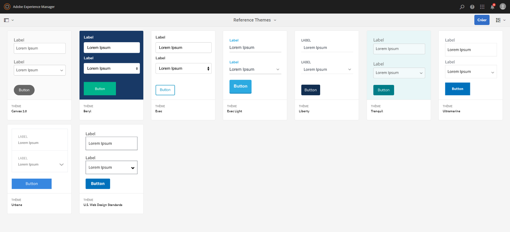

# Thèmes de référence{#reference-themes}

Les [thèmes](../../forms/using/themes.md) vous permettent de styliser vos formulaires sans aucune connaissance approfondie de CSS. In addition to the default theme, you can get the following themes by installing the [AEM-FORMS-REFERENCE-THEMES](https://www.adobeaemcloud.com/content/marketplace/marketplaceProxy.html?packagePath=/content/companies/public/adobe/packages/cq630/fd/AEM-FORMS-6.3-REFERENCE-THEMES) package:

* Beryl
* Exec
* Exec-Light
* Liberty
* Ultramarine
* Urbane
* U.S. Web Design Standards
* Tranquil

Chaque thème comporte un style unique et élégant que vous pouvez utiliser pour créer des formulaires adaptatifs attrayants pour vos utilisateurs. Il contient un style unique pour les sélecteurs tels qu’un panneau, une zone de texte, une boîte de dialogue numérique, un bouton radio, un tableau et un commutateur. Les styles dans ces thèmes sont basés sur des exigences. Par exemple, dans un scénario particulier vous avez besoin d’un thème minimaliste avec des polices très lisibles. Le thème Liberty permet d’obtenir cette apparence.

Les thèmes inclus dans ce package sont réactifs et le style de ces thèmes est défini pour des affichages mobiles et de bureau. La plupart des navigateurs modernes sur différents périphériques peuvent sans problème rendre des formulaires auxquels est appliqué l’un de ces thèmes.

For more information on installing the package, see [How to Work With Packages](/help/sites-administering/package-manager.md).

## Beryl {#beryl}

Le thème Beryl est utilisé par le formulaire adaptatif We.Gov et souligne l’utilisation d’une image d’arrière-plan, de la transparence et de grandes icônes aplaties. Dans la capture d’écran ci-dessous, vous pouvez voir à quoi ressemble le thème Beryl, et comment il peut augmenter le style de votre formulaire.

<!--[Click to enlarge

](assets/beryl-1.png)-->

## Exec {#exec}

Le thème Exec permet d’éviter des remplissages d’arrière-plan plein pour mettre en évidence les composants de formulaire. Sélectionner et cliquer sur des composants modifie les couleurs de police. Par rapport au thème de la zone de travail par défaut, la couleur de la police du texte dans l’onglet sélectionné devient bleu foncé. Remarquez que les boutons de navigation et d’envoi sont différents du thème Beryl.

<!--[Click to enlarge

](assets/exec-1.png)-->

## Exec Light {#exec-light}

Le thème Exec Light utilise l’espace vierge pour créer une expérience homogène. Les boutons Suivante et Envoyer bénéficient d’un remplissage plein et d’une ombre 3D. Les onglets sélectionnés du côté gauche bénéficient d’une flèche au lieu de doubles coches.

<!--[Click to enlarge

](assets/exec-light-1.png)-->

## Liberty {#liberty}

Le thème Liberty utilise une approche minimaliste pour mettre en avant les éléments importants. Par exemple, la couleur de police de l’onglet visité devient verte. Vous pouvez uniquement afficher le contour inférieur de la zone de texte qui simule l’aspect d’un formulaire papier avec des lignes. La zone de texte active dispose d’un contour inférieur noir, tandis que les autres disposent d’un contour inférieur gris clair.

<!--[Click to enlarge

](assets/liberty-1.png)-->

## Tranquil {#tranquil}

Le thème Tranquil fournit des nuances claires et foncées du modèle de couleurs Tranquil à différents composants d’un formulaire. Par exemple, les boutons radio, les panneaux et les onglets disposent de différentes nuances de vert.

<!--[Click to enlarge

](assets/tranquil-1.png)-->

## Ultramarine {#ultramarine}

Le thème Ultramarine utilise des nuances de bleu profond pour mettre en évidence les composants tels que les onglets, les panneaux, les zones de texte et les boutons.

<!--[Click to enlarge](assets/ultramarine-1.png)-->

## Urbane {#urbane}

Le thème Urbane met l’accent sur un aspect minimaliste et fonctionnel de votre formulaire. Lorsque vous appliquez le thème Urbane à votre formulaire, vous pouvez voir que les composants sont aplatis. Les panneaux reçoivent des contours fins pour créer un aspect moderne.

<!--[Click to enlarge

](assets/urbane-1.png)-->

## U.S. Web Design Standards {#u-s-web-design-standards}

Le thème U.S. Web Design Standards, comme son nom l&#39;indique, utilise des polices de caractères et des styles décrits dans le site Draft U.S. Web Design Standards. La norme Web est utilisée par les organisations fédérales pour créer des contenus Web homogènes sur les sites Web du gouvernement fédéral américain.

<!--[Click to enlarge

](assets/usgov.png)-->
