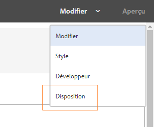
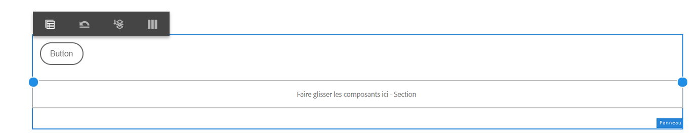
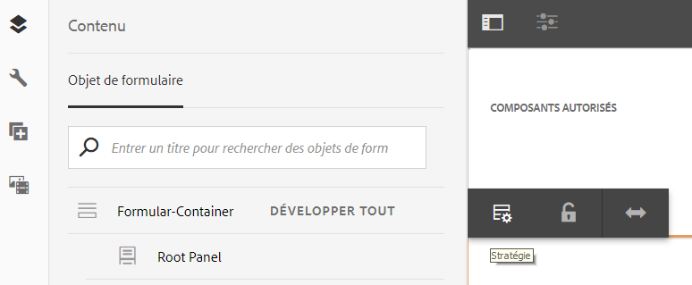

# Utilisation du mode Mise en page pour redimensionner les composants {#use-layout-mode-to-resize-components}

L’interface de création du canal Web de communication interactive vous permet de redimensionner les composants en utilisant le mode Disposition. Faites glisser et déposez des points bleus dans les colonnes pour définir les points de départ et d’arrivée afin de positionner les composants. Les points bleus s’affichent après avoir appuyé sur le composant dans la grille réactive. La grille réactive est composée de 12 colonnes égales. L’ombrage blanc et bleu différencie une colonne d’une l’autre.

Vous pouvez utiliser le mode Mise en page afin de redimensionner les composants pour tous les types d’appareils tels que les ordinateurs de bureau, les tablettes, les smartphones et d’autres appareils plus petits. La tablette dérive automatiquement la configuration de la disposition de la version de bureau. Les appareils plus petits dérivent la configuration de la disposition du téléphone. Vous pouvez toutefois remplacer les configurations dérivées automatiquement pour définir une configuration différente pour chaque type d’appareil.

>[!NOTE]
>
>Si vous créez le canal Web en utilisant le [canal d’impression comme gabarit](../../forms/using/create-interactive-communication.md) pour une communication interactive, les composants disponibles pour le redimensionnement comprennent également les sous-formulaires et les champs générés automatiquement dans le canal Web à l’aide du canal d’impression. Le canal Web conserve la disposition des éléments du canal d’impression en mode Disposition.

## Accès au mode Mise en page {#access-layout-mode}

Sélectionnez **Disposition** dans la liste déroulante qui s’affiche en haut de l’interface de création de Communication interactive à côté de l’option **Prévisualiser**. Le formulaire s’affiche en mode Mise en page.

1. Connectez-vous à l’instance d’auteur AEM et accédez à **Adobe Experience Manager** > **Formulaires** > **Formulaires et documents**.
1. Créez une [Communication interactive](../../forms/using/create-interactive-communication.md) ou ouvrez-en une déjà existante.
1. Sélectionnez **Mise en page** dans la liste déroulante qui s’affiche en haut à côté de l’option **Prévisualiser**. Le formulaire s’affiche en mode Mise en page.

   

## Redimensionnement des composants {#resize-components}

1. En mode Disposition, sélectionnez le composant à redimensionner.  Les points bleus s’affichent au début et à la fin de la grille réactive.
1. Faites glisser les points bleus pour définir la position du composant dans la grille réactive.

   

   La barre d’outils qui s’affiche après avoir appuyé sur des composants comprend les options suivantes :

   * **Parent :** permet de sélectionner le parent d’un composant.
   * **Flotter vers une nouvelle ligne :** permet de déplacer le composant vers la ligne suivante s’il y a plusieurs composants sur la même ligne.

   Vous pouvez annuler toutes les modifications de redimensionnement et appliquer la disposition par défaut au panneau contenant des composants redimensionnés à l’aide de l’option **[!UICONTROL Rétablir la disposition du point d’arrêt]** (). Sélectionnez le parent du composant redimensionné pour afficher l’option.

   >[!NOTE]
   >
   >Vous ne pouvez pas redimensionner les composants de colonne de tableau, de barre d’outils, de bouton de barre d’outils et de zone cible à l’aide du mode Mise en page. Utilisez le mode Style pour redimensionner ces composants.

### Exemple {#example}

**Objectif :** vous souhaitez insérer un composant tableau ainsi qu’un composant image et les positionner parallèlement l’un à l’autre dans une communication interactive.

1. Insérez les composants tableau et image en mode Édition dans le canal Web d’une communication interactive. Le composant d’image s’affiche après le composant de tableau.
1. Basculez en mode Disposition et sélectionnez le composant Tableau. Les points bleus pour redimensionner le composant s’affichent aux colonnes 1 et 12.
1. Faites glisser et déposez le point bleu de la colonne 12 vers la colonne 6 de la grille réactive.

   

1. De même, sélectionnez le composant Image et faites glisser le point bleu de la colonne 1 vers la colonne 7 de la grille réactive. Les composants de tableau et d’image s’affichent en parallèle.

   

   Vous pouvez sélectionner le composant Image et sélectionner l’option **Flotter sur une nouvelle ligne** disponible dans la barre d’outils afin de décaler le composant Image vers la ligne suivante.

## Redimensionnement des panneaux {#resize-panels-layout-mode}

Si vous souhaitez redimensionner l’ensemble du panneau au lieu de composants distincts, procédez comme suit :

1. Sélectionnez n’importe quel composant situé dans le panneau que vous souhaitez redimensionner, sélectionnez , puis sélectionnez la première option dans la liste déroulante, si le panneau est le parent immédiat du composant.

   Les points bleus s’affichent au début et à la fin de la grille réactive.

1. Faites glisser les points bleus pour définir la position du panneau dans la grille réactive.
Vous pouvez répéter les étapes 1 et 2 et sélectionner  pour déplacer le panneau redimensionné vers la ligne suivante.

## Définir une disposition à plusieurs colonnes d’un panneau

Pour définir le nombre de colonnes d’un panneau, procédez comme suit :

1. En mode **[!UICONTROL Édition]**, sélectionnez le panneau, sélectionnez , puis l’option **[!UICONTROL Réactif - tout sur la page sans navigation]** dans la liste déroulante **[!UICONTROL Disposition du panneau]**.

1. Sélectionnez  pour enregistrer les propriétés.

1. En mode **[!UICONTROL Disposition]**, sélectionnez n’importe quel composant du panneau, sélectionnez , puis sélectionnez le panneau.

1. Sélectionnez  et sélectionnez le nombre de colonnes dans la liste déroulante. Le nombre de colonnes peut être compris entre 1 et 12. Le panneau est divisé en une disposition à plusieurs colonnes.

## Désactivation du mode Mise en page pour les formulaires avec une ancienne disposition réactive {#disable-layout-mode-for-forms-with-old-responsive-layout}

Vous pouvez désactiver le mode Mise en page pour les formulaires avec une ancienne disposition réactive en modifiant les propriétés du modèle utilisé dans le formulaire.

Pour désactiver le mode Mise en page, procédez comme suit :

1. Sélectionnez **[!UICONTROL Outils]** > **[!UICONTROL Général]** > **[!UICONTROL Modèles]** et ouvrez le modèle utilisé dans le formulaire en mode **[!UICONTROL Édition]**.
1. Sélectionnez le conteneur de document dans le volet de gauche, puis sélectionnez **[!UICONTROL Politique.]**

   

1. Sélectionnez l’onglet **[!UICONTROL Paramètres de disposition]** puis sélectionnez **[!UICONTROL Désactiver le mode Disposition]**.
1. Sélectionnez  pour enregistrer les propriétés du modèle.
