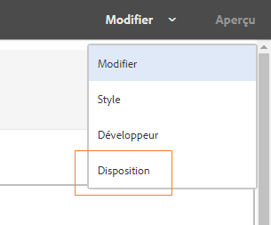
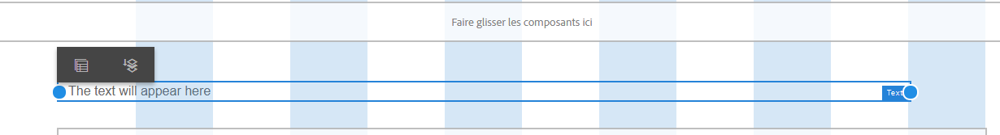
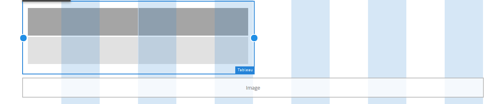
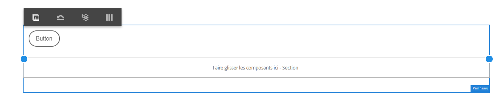
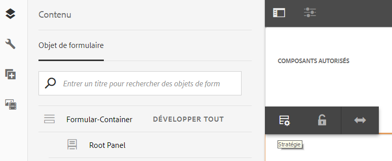

# Utiliser le mode Mise en page pour redimensionner les composants {#use-layout-mode-to-resize-components}

L’interface de création de formulaires adaptatifs vous permet de redimensionner des composants en mode Mise en page. Faites glisser des points bleus dans les colonnes pour définir le début et les points d’extrémité à positionner les composants. Les points bleus s’affichent après avoir appuyé sur le composant dans la grille réactive. La grille réactive est composée de 12 colonnes égales. L’ombrage blanc et bleu des autres colonnes différencie une colonne de l’autre.

Vous pouvez utiliser le mode Mise en page pour redimensionner les composants pour tous les types de périphériques, tels que les ordinateurs de bureau, tablettes, smartphones et autres périphériques plus petits. La tablette dérive automatiquement la configuration de la mise en page de la version de bureau et les périphériques plus petits dérivent la configuration de la mise en page de la version de téléphone. Cependant, vous pouvez remplacer les configurations dérivées automatiquement pour définir une configuration différente pour chaque type de périphérique.

## Accès au mode Mise en page {#access-layout-mode}

Sélectionnez **Disposition** dans la liste déroulante qui s’affiche en haut de l’interface de création de formulaires adaptatifs en regard de l’option **Prévisualisation** . Le formulaire s’affiche en mode Mise en page.

1. Connectez-vous à l’instance d’auteur AEM et accédez à **Adobe Experience Manager** > **Formulaires** > **Formulaires et documents**.
1. Create a new or open an existing [adaptive form](../../forms/using/creating-adaptive-form.md).
1. Sélectionnez **Disposition** dans la liste déroulante qui s’affiche en haut à côté de l’option **Prévisualisation** . Le formulaire s’affiche en mode Mise en page.

   

## Redimensionnement des composants {#resize-components}

1. En mode Mise en page, appuyez sur le composant pour le redimensionner. Les points bleus s’affichent en début et à la fin de la grille réactive.
1. Faites glisser les points bleus pour définir la position du composant dans la grille réactive.

   

   La barre d’outils qui s’affiche après avoir appuyé sur des composants comprend les options suivantes :

   * **Parent :** Sélectionnez le parent d’un composant.
   * **Flotter vers la nouvelle ligne :** Déplacez le composant vers la ligne suivante s’il existe plusieurs composants dans la même ligne.

   Vous pouvez annuler toutes les modifications de redimensionnement et appliquer la mise en page par défaut au panneau contenant des composants redimensionnés à l’aide de l’option **[!UICONTROL Rétablir la mise en page]** du point d’arrêt ( ). Appuyez sur le parent du composant redimensionné pour vue à l’option.

   >[!NOTE]
   >
   >Vous ne pouvez pas redimensionner les composants de colonne de tableau, de barre d’outils, de bouton de barre d’outils et de zone de cible à l’aide du mode Disposition. Utilisez le mode Style pour redimensionner ces composants.

### Exemple {#example}

**Objectif :** Vous souhaitez insérer un composant de tableau et un composant d’image et les positionner en parallèle dans un formulaire adaptatif.

1. Insérez le tableau et les composants d’image en mode Edition dans le formulaire adaptatif. Le composant d’image s’affiche après le composant de tableau.
1. Passez en mode Mise en page et appuyez sur le composant Tableau. Les points bleus pour redimensionner le composant s’affichent aux colonnes 1 et 12.
1. Faites glisser le point bleu de la colonne 12 vers la colonne 6 de la grille réactive.

   

1. De même, sélectionnez le composant Image et faites glisser le point bleu de la colonne 1 vers la colonne 7 de la grille dynamique. Les composants de tableau et d’image s’affichent en parallèle.

   

   Vous pouvez sélectionner le composant Image et appuyer sur l’option **Flotter sur la nouvelle ligne** disponible dans la barre d’outils pour déplacer le composant Image vers la ligne suivante.

## Redimensionnement des panneaux {#resize-panels-layout-mode}

Exécutez les étapes suivantes si vous souhaitez redimensionner l’ensemble du panneau au lieu de composants individuels :

1. Appuyez sur l’un des composants du panneau à redimensionner, sélectionnez et sélectionnez la première option dans la liste déroulante, si le panneau est le parent immédiat du composant.

   Les points bleus s’affichent en début et à la fin de la grille réactive.

1. Faites glisser les points bleus pour définir la position du panneau dans la grille réactive.
Vous pouvez répéter les étapes 1 et 2 et sélectionner  pour déplacer le panneau redimensionné sur la ligne suivante.

## Définition de la disposition à plusieurs colonnes pour un panneau

Exécutez les étapes suivantes pour définir le nombre de colonnes d’un panneau :

1. En mode **[!UICONTROL Edition]** , appuyez sur le panneau, sélectionnez , puis sélectionnez **[!UICONTROL Réactif - tout sur la page sans option de navigation]** dans la liste déroulante Disposition du **[!UICONTROL panneau.]**

1. Appuyez sur  (Enregistrer) pour enregistrer les propriétés.

1. En mode **[!UICONTROL Mise en page]** , appuyez sur l’un des composants du panneau, sélectionnez , puis sélectionnez le panneau.

1. Appuyez sur  et sélectionnez le nombre de colonnes dans la liste déroulante. Le nombre de colonnes peut être compris entre 1 et 12. Le panneau est divisé en plusieurs colonnes.

## Activer la nouvelle grille réactive pour les anciennes mises en page réactives {#enableresponsivegrid}

Activez la nouvelle grille réactive pour les formulaires que vous créez à l’aide d’AEM Forms 6.4 ou d’une version antérieure afin de redimensionner les composants.

>[!NOTE]
>
>Le passage à la nouvelle grille réactive élimine les propriétés de mise en page déjà définies pour les composants utilisés dans le formulaire.

Effectuez les étapes suivantes pour activer la nouvelle grille réactive :

1. Sélectionnez **Disposition** dans la liste déroulante qui s’affiche en haut à côté de l’option **Prévisualisation** . Une confirmation pour activer le mode Mise en page s’affiche.
1. Appuyez sur **Oui** pour activer le mode **Disposition** du formulaire.

### Incorporation d’un ancien fragment dans un formulaire adaptatif avec une nouvelle disposition réactive {#embed-an-old-fragment-in-an-adaptive-form-with-new-responsive-layout}

La nouvelle disposition réactive pour le formulaire adaptatif vous permet d’ajouter un fragment de formulaire adaptatif avec l’ancienne disposition réactive au formulaire. Cependant, la nouvelle mise en page ignore les propriétés de mise en page déjà définies pour les composants utilisés dans le fragment. Vous pouvez passer en mode Mise en page pour définir les propriétés de mise en page des composants utilisés dans le fragment.

### Incorporation d’un fragment avec une nouvelle disposition réactive dans un ancien formulaire adaptatif {#embed-a-fragment-with-new-responsive-layout-in-an-old-adaptive-form}

Si vous incorporez un fragment avec la nouvelle disposition réactive dans un formulaire adaptatif avec une ancienne disposition réactive, le système vous invite à activer le mode Mise en page du formulaire et à réincorporer le fragment.

Pour activer le mode Disposition, sélectionnez **Disposition** dans la liste déroulante qui s’affiche en haut à côté de l’option **Prévisualisation** et appuyez sur **Oui** pour confirmer. Sélectionnez le mode **Edition** pour réincorporer le fragment.

## Désactiver le mode de mise en page pour les formulaires avec une ancienne mise en page réactive {#disable-layout-mode-for-forms-with-old-responsive-layout}

Vous pouvez désactiver le mode Disposition pour les formulaires dotés d’une ancienne disposition réactive en modifiant les propriétés du modèle utilisé dans le formulaire.

Pour désactiver le mode Disposition, procédez comme suit :

1. Sélectionnez **[!UICONTROL Outils]** > **[!UICONTROL Général]** > **[!UICONTROL Modèles]** et ouvrez le modèle utilisé dans le formulaire en mode **[!UICONTROL Modifier.]**
1. Sélectionnez le Conteneur de Document dans le volet de gauche et appuyez sur **[!UICONTROL Stratégie.]**

   

1. Appuyez sur l’onglet Paramètres **[!UICONTROL de]** mise en page et sélectionnez **[!UICONTROL Désactiver le mode]** de mise en page.
1. Tap  to save the template properties.

