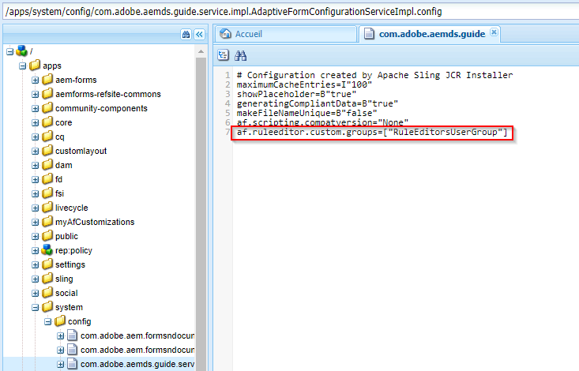

# Autorisation d’accès à l’éditeur de règles pour des groupes d’utilisateurs sélectionnés{#grant-rule-editor-access-to-select-user-groups}

## Présentation {#overview}

Plusieurs types d’utilisateurs dotés de différentes compétences peuvent utiliser les formulaires adaptatifs. Les utilisateurs chevronnés peuvent avoir les connaissances requises pour utiliser des scripts et des règles complexes. Toutefois, certains utilisateurs peu expérimentés utilisent uniquement les propriétés de mise en page et de base des formulaires adaptatifs.

AEM Forms permet de limiter l’accès à l’éditeur de règles des utilisateurs selon leur rôle ou fonction. Dans les paramètres du service de configuration des formulaires adaptatifs, vous pouvez spécifier les [groupes d’utilisateurs](/help/sites-administering/security.md) qui pourront afficher l’éditeur de règles et y accéder.

## Spécification des groupes d’utilisateurs qui peuvent accéder à l’éditeur de règles {#specify-user-groups-that-can-access-rule-editor}

1. Connectez-vous à AEM Forms en tant qu’administrateur.
1. Dans l’instance d’auteur, cliquez sur Adobe Experience Manager > Outils  > Opérations > Console Web. La console Web s’ouvre dans une nouvelle fenêtre.

   

1. Dans la fenêtre de la console Web, recherchez et cliquez sur **[!UICONTROL Formulaire adaptatif et Configuration du Canal Web de communication interactive]**. **[!UICONTROL La boîte de dialogue]** Configuration du Canal Web de formulaire adaptatif et de communication interactive s&#39;affiche. Ne modifiez aucune valeur puis cliquez sur **Enregistrer**.

   Vous créez ainsi un fichier /apps/system/config/com.adobe.aemds.guide.service.impl.AdaptiveFormConfigurationServiceImpl.config dans le référentiel CRX.

1. Connectez-vous à CRDXE en tant qu’administrateur. Ouvrez le fichier /apps/system/config/com.adobe.aemds.guide.service.impl.AdaptiveFormConfigurationServiceImpl.config pour le modifier.
1. Utilisez la propriété suivante pour spécifier le nom d’un groupe pouvant accéder à l’éditeur de règles (par exemple, RuleEditorsUserGroup) et cliquez sur **Enregistrer tout**.

   `af.ruleeditor.custom.groups=["RuleEditorsUserGroup"]`

   Pour autoriser l’accès à plusieurs groupes, spécifiez une liste de valeurs séparées par des virgules :

   `af.ruleeditor.custom.groups=["RuleEditorsUserGroup", "PermittedUserGroup"]`

   

   Désormais, lorsqu’un utilisateur qui ne fait pas partie d’un groupe d’utilisateurs spécifié (ici RuleEditorsUserGroup) touche un champ, l’icône Modifier la règle ( ) n’est pas disponible pour elle dans la barre d’outils des composants :

   

   Barre d’outils de composants comme visible pour un utilisateur ayant un accès à l’éditeur de règles

   

   Barre d’outils de composants comme visible pour un utilisateur sans accès à l’éditeur de règles

   Pour obtenir des instructions sur l’ajout d’utilisateurs à des groupes, voir [Administration utilisateur et sécurité](/help/sites-administering/security.md).

