# Éditeur de règles de formulaires adaptatifs{#adaptive-forms-rule-editor}

## Présentation {#overview}

La fonctionnalité d’éditeur de règles dans Adobe Experience Manager Forms permet aux utilisateurs et aux développeurs professionnels de formulaires de créer des règles sur des objets de formulaire adaptatif. Ces règles déterminent les actions à déclencher sur des objets de formulaire en fonction des conditions prédéfinies, des saisies de l’utilisateur et des actions de l’utilisateur sur le formulaire.  Cela permet de rationaliser davantage l’expérience de remplissage du formulaire en assurant précision et vitesse.

L’éditeur de règles fournit une interface utilisateur intuitive et simplifiée pour la création de règles. L’éditeur de règles offre un éditeur visuel à tous les utilisateurs. En outre, l’éditeur de règles fournit un éditeur de code permettant d’écrire des règles et des scripts, mais seulement aux utilisateurs avancés des formulaires. Les principales actions que vous pouvez exécuter sur des objets de formulaire adaptatif utilisant des règles sont :

* Afficher ou masquer un objet 
* Activer ou désactiver un objet
* Définir une valeur pour un objet 
* Valider la valeur d’un objet 
* Exécuter les fonctions pour calculer la valeur d’un objet 
* Appeler un service de modèle de données de formulaire et effectuer une opération
* Définir la propriété d’un objet 

L’éditeur de règles remplace les fonctionnalités de script dans AEM Forms 6.1 et les versions antérieures. Toutefois, les scripts existants sont conservés dans le nouvel éditeur de règles.  Pour plus d’informations sur l’utilisation des scripts existants dans l’éditeur de règles, reportez-vous à la section[ Impact de l’éditeur de règles sur les scripts existants](../../forms/using/rule-editor.md#p-impact-of-rule-editor-on-existing-scripts-p).

Les utilisateurs ajoutés au groupe des utilisateurs avancés de formulaires peuvent créer de nouveaux scripts et modifier les scripts existants. Les utilisateurs appartenant au groupe d’utilisateurs de formulaires peuvent utiliser les scripts, mais ne peuvent ni en créer ni en modifier.

## Compréhension d’une règle {#understanding-a-rule}

Une règle est une combinaison d’actions et de conditions. Dans l’éditeur de règles, les actions incluent des activités telles que masquer, afficher, activer, désactiver ou calculer la valeur d’un objet dans un formulaire. Les conditions sont des expressions booléennes qui sont évaluées en effectuant des vérifications et des opérations sur l’état, la valeur ou la propriété d’un objet de formulaire. Les actions sont exécutées en fonction de la valeur (`True` ou`False` ) ) renvoyée par l’évaluation d’une condition.

L’éditeur de règles fournit un ensemble de types de règle prédéfinis, tels que Lorsque, Afficher, Masquer, Activer, Désactiver, Définir la valeur de et Valider pour vous aider à créer des règles.  Chaque type de règle vous permet de définir des conditions et des actions dans une règle. Le document décrit plus loin chaque type de règle en détail. 

Une règle suit généralement l’un des concepts suivants : 

**Condition-Action** Dans ce concept, une règle définit d&#39;abord une condition suivie d&#39;une action à déclencher. Le concept est comparable à l’instruction de cause à effet des langages de programmation.

Dans l’éditeur de règles, le type de règle **Lorsque** applique le concept de condition-action.

**Action-Condition** Dans ce concept, une règle définit d&#39;abord une action à déclencher suivie des conditions d&#39;évaluation. Une autre variante de ce concept est une action alternative d’action-condition, qui définit également une action alternative à déclencher si la condition renvoie la valeur False.

Les types de règles Afficher, Masquer, Activer, Désactiver, Définir la valeur de et Valider de l’éditeur de règles appliquent le concept de règle d’action-condition.  Par défaut, l’action alternative d’Afficher est Masquer et l’action alternative d’Activer est Désactiver, et inversement.  Vous ne pouvez pas modifier l’action alternative par défaut.

>[!NOTE]
>
>Les types de règle disponibles, y compris les conditions et les actions que vous définissez dans l’éditeur de règles, dépendent également du type de l’objet de formulaire pour lequel vous créez une règle. L’éditeur de règles affiche uniquement les types de règle et les options valides lors de la création des instructions de condition et d’action pour un type particulier d’objet de formulaire.  Par exemple, les types de règle Valider, Définir la valeur de, Activer et Désactiver ne s’affichent pas pour un objet de panneau. 

Pour plus d’informations sur les types de règles disponibles dans l’éditeur de règles, reportez-vous à la section [Types de règles disponibles dans l’éditeur de règles](../../forms/using/rule-editor.md#p-available-rule-types-in-rule-editor-p).

### Directives pour choisir un concept de règle {#guidelines-for-choosing-a-rule-construct}

Bien que vous puissiez obtenir la plupart des cas d’utilisation avec n’importe quel concept de règle, voici quelques recommandations pour choisir un concept plus qu’un autre. For more information about the available rules in rule editor, see [Available rule types in rule editor](../../forms/using/rule-editor.md#p-available-rule-types-in-rule-editor-p).

* Lors de la création d’une règle, un des principes de base consiste à penser à cette règle dans le contexte de l’objet pour lequel vous créez une règle. Imaginons que vous souhaitez masquer ou afficher le champ B selon la valeur qu’un utilisateur indique dans le champ A. Dans ce cas, vous évaluez une condition du champ A, et en fonction de la valeur qu’elle renvoie, vous déclenchez une action sur le champ B.

   Par conséquent, si vous créez une règle pour le champ B (l’objet pour lequel vous évaluez une condition), utilisez le concept de condition-action ou le type de règle Lorsque.  De même, utilisez le concept d’action-condition ou le type de règle Afficher ou Masquer pour le champ A.

* Parfois, vous devez effectuer plusieurs actions en fonction d’une condition.  Dans pareils cas, il est recommandé d’utiliser le concept de condition-action. Dans ce concept, vous pouvez évaluer une seule condition et spécifier plusieurs instructions d’action.

   Par exemple, pour masquer les champs B, C et D selon la condition qui vérifie la valeur qu’un utilisateur indique dans le champ A, créez une règle avec le concept de condition-action ou le type de règle Lorsque pour le champ A et spécifiez les actions de contrôle de visibilité des champs B, C et D. Sinon, vous avez besoin de trois règles distinctes pour les champs B, C et D, où chaque règle vérifie la condition et affiche ou masque chaque champ respectif. Dans cet exemple, il est plus efficace de créer un type de règle Lorsque sur un objet plutôt qu’un type de règle Afficher ou Masquer sur trois objets.

* Pour déclencher une action selon plusieurs conditions, il est recommandé d’utiliser le concept d’action-condition. Par exemple, pour afficher et masquer le champ A en évaluant les conditions des champs B, C et D, utilisez le type de règle Afficher ou Masquer sur le champ A.
* Utilisez le concept de condition-action ou d’action-condition si la règle contient une action pour une condition.
* Si une règle vérifie une condition et exécute immédiatement une action lorsqu’une valeur est indiquée dans un champ ou lorsqu’un champ est quitté, il est recommandé de créer une règle avec le concept de condition-action ou le type de règle Lorsque pour le champ pour lequel la condition est évaluée.
* La condition dans la règle Lorsque est évaluée lorsqu’un utilisateur modifie la valeur de l’objet pour lequel la règle Lorsque est appliquée.  Toutefois, si vous souhaitez déclencher l’action lorsque la valeur change du côté serveur, comme dans le cas d’un pré-remplissage de la valeur, il est recommandé de créer une règle Lorsque qui déclenche l’action lorsque le champ est initialisé.
* Lors de la création de règles pour les objets de listes déroulantes, de boutons radio ou de cases à cocher, les options ou valeurs de ces objets de formulaire dans le formulaire sont pré-renseignées dans l’éditeur de règles.

## Types d’opérateur et événements disponibles dans l’éditeur de règles {#available-operator-types-and-events-in-rule-editor}

L’éditeur de règles fournit les opérateurs logiques et les événements suivants à l’aide desquels vous pouvez créer des règles.

* **Est égal à**
* **N’est pas égal à**
* **Commence par**
* **Se termine par**
* **Contient**
* **Est vide**
* **N’est pas vide**
* **A sélectionné :** renvoie True lorsque l’utilisateur sélectionne une option donnée pour une case à cocher, une liste déroulante, un bouton radio.
* **Est initialisé (événement) :** renvoie True si un objet de formulaire est généré dans le navigateur.
* **Est modifié (événement) :** renvoie True si l’utilisateur modifie la valeur saisie ou l’option sélectionnée pour un objet de formulaire.

## Types de règle disponibles dans l’éditeur de règles {#available-rule-types-in-rule-editor}

L’éditeur de règles fournit un ensemble de types de règle prédéfinis que vous pouvez utiliser pour créer des règles.  Examinons en détail chaque type de règle. Pour plus d’informations sur la création de règles dans l’éditeur de règles, reportez-vous à la section[ Création de règles](../../forms/using/rule-editor.md#p-write-rules-p).

### Quand {#whenruletype}

Le type de règle **Lorsque** suit le concept de règle d’**action alternative de condition-action**, ou parfois, simplement le concept de **condition-action**. Dans ce type de règle, vous spécifiez d’abord une condition à évaluer puis une action à déclencher si la condition est remplie ( `True`). Lors de l’utilisation du type de règle Quand, vous pouvez utiliser plusieurs opérateurs ET et OU afin de créer des [expressions imbriquées](#nestedexpressions).

Avec le type de règle Lorsque, vous pouvez évaluer une condition sur un objet de formulaire et exécuter des actions sur un ou plusieurs objets.

En clair, un type de règle Lorsque standard est structuré comme suit :

`When on Object A:`

`(Condition 1 AND Condition 2 OR Condition 3) is TRUE;`

`Then, do the following:`

Action 2 sur Objet B ; ET Action 3 sur Objet C ; 

_

Lorsque vous disposez d’un composant à plusieurs valeurs, tel que des boutons radio ou des  de, lors de la création d’une règle pour ce composant, les options sont automatiquement récupérées et mises à la disposition du créateur de règles. Vous n’avez pas besoin de saisir à nouveau les valeurs de l’option.

Par exemple, une liste comporte quatre options : Rouge, Bleu, Vert et Jaune. Lors de la création de la règle, les options (boutons radio) sont automatiquement récupérées et mises à disposition du créateur de la règle comme suit :

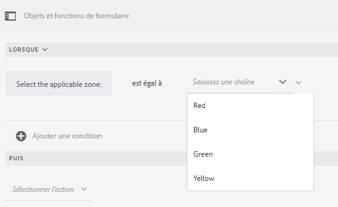

Lorsque vous écrivez une règle Lorsque, vous pouvez déclencher l’action Effacer la valeur de. L’action Effacer la valeur de efface la valeur de l’objet spécifié. L’option Effacer la valeur de comme option de l’instruction Lorsque vous permet de créer des conditions complexes avec plusieurs champs.

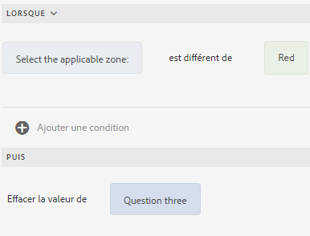

**Masquer** Masque l’objet spécifié.

**Afficher** Affiche l’objet spécifié.

**Activer** Active l’objet spécifié.

**Désactiver** Désactive l’objet spécifié.

**Service** d’appel Appelle un service configuré dans un modèle de données de formulaire. Lorsque vous sélectionnez l’opération Appel du service, un champ apparaît. Lorsque vous touchez le champ, il affiche tous les services configurés dans tous les modèles de données de formulaire de votre instance AEM. Lorsque vous choisissez un service de modèle de données de formulaire, des champs supplémentaires permettant de mapper les objets de formulaires avec des paramètres d’entrée et de sortie pour le service spécifié apparaissent. Voir l’exemple de règle pour appeler des services de modèle de données de formulaire.

En plus du service de modèle de données de formulaire, vous pouvez spécifier une URL WSDL directe pour appeler un service Web. Cependant, un service de modèle de données de formulaire possède de nombreux avantages et l’approche recommandée permettant d’appeler un service.

For more information about configuring services in form data model, see [AEM Forms Data Integration](/help/forms/using/data-integration.md).

**Définissez la valeur de** Calculs et la valeur de l’objet spécifié. Vous pouvez définir la valeur de l’objet sur une chaîne, la valeur d’un autre objet, la valeur calculée à l’aide d’une fonction ou d’un  de  mathématique, la valeur d’une propriété d’un objet ou la valeur de sortie d’un service de modèle de données de formulaire configuré. Lorsque vous sélectionnez l’option de service Web, elle affiche tous les services configurés dans tous les modèles de données de formulaire sur votre instance AEM. Lorsque vous choisissez un service de modèle de données de formulaire, des champs supplémentaires permettant de mapper les objets de formulaires avec des paramètres d’entrée et de sortie pour le service spécifié apparaissent.

For more information about configuring services in form data model, see [AEM Forms Data Integration](/help/forms/using/data-integration.md).

Le type de règle **Définir la propriété** vous permet de définir la valeur d’une propriété de l’objet spécifié en fonction d’une action de condition.

Il vous permet de définir des règles pour ajouter dynamiquement des cases à cocher au formulaire adaptatif. Vous pouvez utiliser une fonction personnalisée, un objet de formulaire ou une propriété d’objet pour définir une règle.

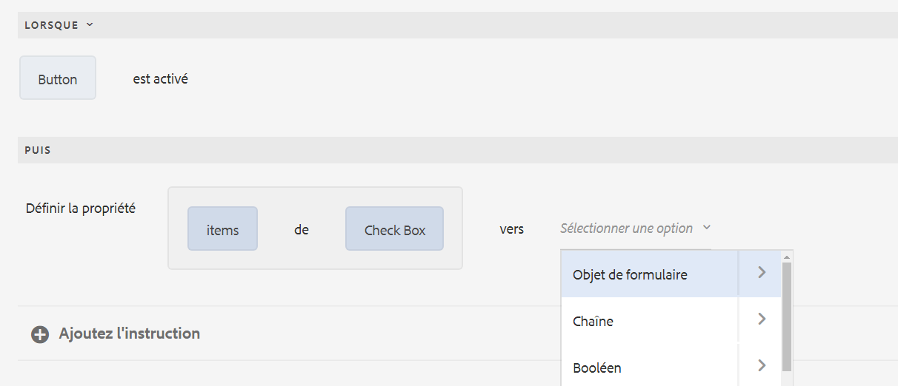

Pour définir une règle basée sur une fonction personnalisée, sélectionnez Sortie **de** fonction dans le déroulant, puis faites glisser une fonction personnalisée depuis l’onglet **Fonctions** . Si l’action de condition est remplie, le nombre de cases à cocher définies dans la fonction personnalisée est ajouté au formulaire adaptatif.

Pour définir une règle basée sur un objet de formulaire, sélectionnez Objet **de** formulaire dans le déroulant, puis faites glisser un objet de formulaire depuis l’onglet Objets **de** formulaire. Si l’action de condition est remplie, le nombre de cases à cocher définies dans l’objet de formulaire est ajouté au formulaire adaptatif.

Une règle Définir la propriété basée sur une propriété d’objet vous permet d’ajouter le nombre de cases à cocher dans un formulaire adaptatif en fonction d’une autre propriété d’objet incluse dans le formulaire adaptatif.

La figure suivante illustre un exemple d’ajout dynamique de cases à cocher en fonction du nombre de  déroulants dans le formulaire adaptatif :

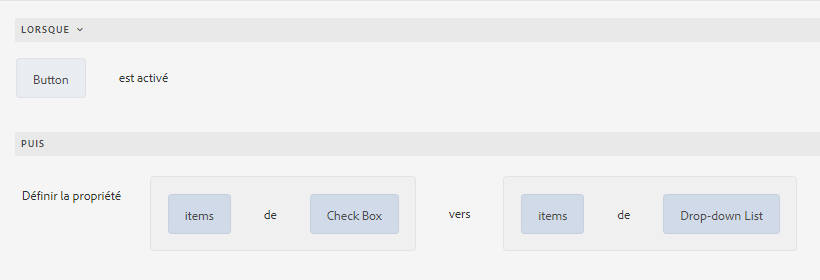

**Effacer la valeur de** Efface la valeur de l’objet spécifié.

**Définir la cible d’action** Définit la cible d’action sur l’objet spécifié.

**Enregistrer le formulaire** Enregistre le formulaire.

**Envoyer des formulaires** Envoie le formulaire.

**Réinitialiser le formulaire** Réinitialise le formulaire.

**Valider le formulaire** Valide le formulaire.

**Instance** Ajouter Ajoute une instance du panneau ou de la ligne de tableau répétable spécifié.

**Supprimer l’instance** Supprime une instance du panneau ou de la ligne de tableau répétable spécifié.

**Accédez à** d’autres communications interactives, des formulaires adaptatifs, d’autres ressources telles que des images ou des fragments de  de ou une URL externe. Pour plus d’informations, voir le bouton [Ajouter de la communication](../../forms/using/create-interactive-communication.md#addbuttontothewebchannel)interactive.

### Définir la valeur de {#set-value-of}

The **[!UICONTROL Set Value of]** rule type allows you to set the value of a form object depending on whether the specified condition is satisfied or not. La valeur peut être définie sur la valeur d’un autre objet, d’une chaîne littérale, la valeur dérivée d’une expression ou d’une fonction mathématique, la valeur d’une propriété d’un autre objet ou la sortie d’un service de modèle de données de formulaire. De même, vous pouvez vérifier la condition d’un composant, d’une chaîne, d’une propriété ou les valeurs provenant d’une fonction ou d’une expression mathématique.

Notez que le type de règle Définir la valeur de n’est pas disponible pour tous les objets de formulaire, tels que les boutons de panneaux et de barres d’outils. Une règle Définir la valeur de standard présente la structure suivante :


Définir la valeur de Objet A sur : 

(chaîne ABC) OR(propriété d’objet X de l’objet C) OR(valeur d’une fonction) OR(valeur d’un de  mathématique) OR(valeur de sortie d’un service de modèle de données ou d’un service Web);

Lorsque (facultatif) :

(Condition 1 ET Condition 2 ET Condition 3) est TRUE ; 


L’exemple suivant prend la valeur du champ `dependentid` comme valeur d’entée et définit la valeur du champ `Relation` comme valeur de sortie de l’argument `Relation` du service de modèle de données de formulaire `getDependent`.

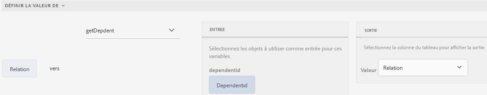

Exemple de règle Définir la valeur à l’aide du service de modèle de données de formulaire

>[!NOTE]
>
>En outre, vous pouvez utiliser la règle Définir la valeur de pour remplir toutes les valeurs d’un composant de type liste déroulante à partir de la sortie d’un service de modèle de données de formulaire ou d’un service Web. Cependant, assurez-vous que l’argument de sortie que vous choisissez est de type Tableau. Toutes les valeurs renvoyées dans un tableau sont disponibles dans la liste déroulante spécifiée.

### Afficher {#show}

Avec le type de règle **Afficher**, vous pouvez créer une règle pour afficher ou masquer un objet de formulaire selon si une condition est remplie ou non. Le type de règle Afficher déclenche également l’action Masquer au cas où la condition ne serait pas remplie ou renvoyée`False` .

Une règle standard Afficher est structurée comme suit :


`Show Object A;`

`When:`

`(Condition 1 OR Condition 2 OR Condition 3) is TRUE;`

`Else:`

`Hide Object A;`


### Masquer {#hide}

De la même manière que pour le type de règle Afficher, vous pouvez utiliser le type de règle **Masquer** pour afficher ou masquer un objet de formulaire selon qu’une condition est remplie ou non.  Le type de règle Masquer déclenche également l’action Afficher au cas où la condition ne serait pas remplie ou renvoyée`False` .

Une règle standard Masquer est structurée comme suit :


`Hide Object A;`

`When:`

`(Condition 1 AND Condition 2 AND Condition 3) is TRUE;`

`Else:`

`Show Object A;`


### Activer {#enable}

Le type de règle **Activer** vous permet d’activer ou de désactiver un objet de formulaire selon si une condition est remplie ou non. Le type de règle Activer déclenche également l’action Désactiver au cas où la condition ne serait pas remplie ou serait renvoyée`False` .

Une règle Activer standard est structurée comme suit :


`Enable Object A;`

`When:`

`(Condition 1 AND Condition 2 AND Condition 3) is TRUE;`

`Else:`

`Disable Object A;`


### Désactiver {#disable}

De la même manière que le type de règle Activer, le type de règle **Désactiver** vous permet d’activer ou de désactiver un objet de formulaire selon qu’une condition est remplie ou non.  Le type de règle Désactiver déclenche également l’action Activer au cas où la condition ne serait pas remplie ou serait renvoyée `False` .

Une règle Désactiver standard est structurée comme suit :


`Disable Object A;`

`When:`

`(Condition 1 OR Condition 2 OR Condition 3) is TRUE;`

`Else:`

`Enable Object A;`

### Valider {#validate}

Le type de règle **Valider** valide la valeur d’un champ à l’aide d’une expression.  Par exemple, vous pouvez créer une expression pour vérifier que le champ de texte qui indique un nom ne contient pas de caractères spéciaux ni de nombres.

Une règle Valider standard est structurée comme suit :

`Validate Object A;`

`Using:`

`(Expression 1 AND Expression 2 AND Expression 3) is TRUE;`

>[!NOTE]
>
>Si la valeur spécifiée n’est pas conforme à la règle Valider, vous pouvez afficher un message de validation à l’utilisateur.  Vous pouvez spécifier le message dans le champ **[!UICONTROL Message de validation du script]** dans les propriétés de composant dans la zone latérale.

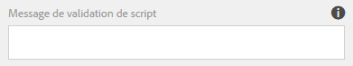

### Set Options Of {#setoptionsof}

Le type de règle **Définir les options** vous permet de définir des règles pour ajouter des cases à cocher dynamiquement au formulaire adaptatif. Vous pouvez utiliser un modèle de données de formulaire ou une fonction personnalisée pour définir la règle.

Pour définir une règle basée sur une fonction personnalisée, sélectionnez Sortie **de** fonction dans le déroulant, puis faites glisser une fonction personnalisée depuis l’onglet **Fonctions** . Le nombre de cases à cocher définies dans la fonction personnalisée est ajouté au formulaire adaptatif.

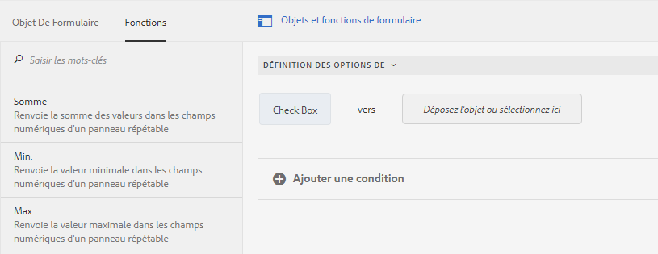

Pour créer une fonction personnalisée, voir Fonctions [personnalisées dans l’éditeur](#custom-functions)de règles.

Pour définir une règle basée sur un modèle de données de formulaire :

1. Sélectionnez **Service Output** dans le  déroulant.
1. Sélectionnez l’objet de modèle de données.
1. Sélectionnez une propriété d’objet de modèle de données dans le déroulant Valeur **d’** affichage. Le nombre de cases à cocher dans le formulaire adaptatif provient du nombre d’instances définies pour cette propriété dans la base de données.
1. Sélectionnez une propriété d’objet de modèle de données dans le déroulant **Enregistrer la valeur** .

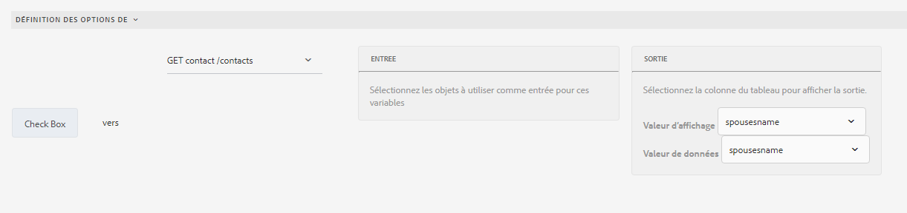

## Compréhension de l’interface utilisateur de l’éditeur de règles {#understanding-the-rule-editor-user-interface}

L’éditeur de règles fournit une interface utilisateur exhaustive et néanmoins simple qui permet de créer et de gérer des règles.  Vous pouvez lancer l’interface utilisateur de l’éditeur de règles depuis un formulaire adaptatif en mode Création.

Pour lancer l’interface utilisateur de l’éditeur de règles :

1. Ouvrez un formulaire adaptatif en mode Création.
1. Tap the form object for which you want to write a rule, and in Component Toolbar tap . L’interface utilisateur de l’éditeur de règles s’affiche.

   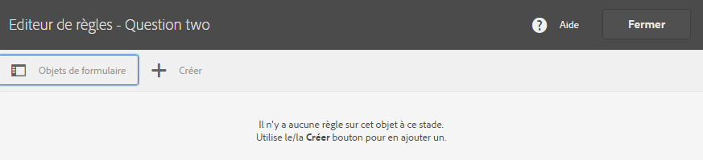

   Toutes les règles existantes pour les objets de formulaire sélectionnés sont répertoriées dans cet écran.  Pour plus d’informations sur la gestion des règles existantes, reportez-vous à la section[ Gestion des règles](../../forms/using/rule-editor.md#p-manage-rules-p).

1. Tap **[!UICONTROL Create]** to write a new rule. L’éditeur visuel de l’interface utilisateur de l’éditeur de règles s’ouvre par défaut lorsque vous lancez l’éditeur de règles la première fois.
[ 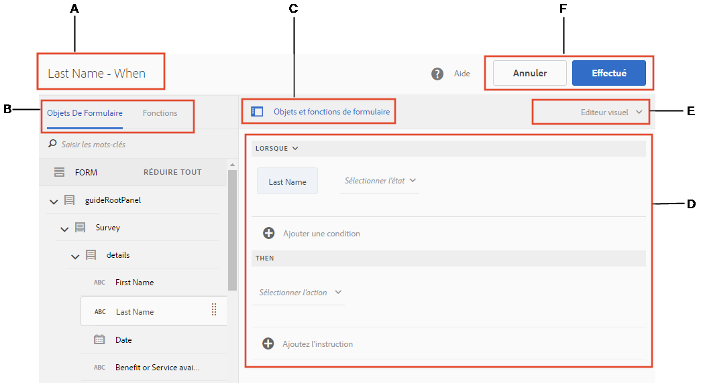

   Cliquez pour afficher une image agrandie

   ](assets/rule-editor-ui-1.png)Examinons en détail chaque composant de l’interface utilisateur de l’éditeur de règles.

### A. Affichage composant-règle {#a-component-rule-display}

Affiche le titre de l’objet d’un formulaire adaptatif depuis lequel vous avez lancé l’éditeur de règles et le type de règle actuellement sélectionné. Dans l’exemple ci-dessus, l’éditeur de règles est lancé depuis l’objet d’un formulaire adaptatif intitulé Salary et le type de règle sélectionné est Lorsque. 

### B. Objets de formulaire et fonctions {#b-form-objects-and-functions-br}

Le volet situé à gauche de l’interface utilisateur de l’éditeur de règles comporte deux onglets — **[!UICONTROL Objets de formulaire]** et **[!UICONTROL Fonctions]**.

L’onglet Objets de formulaire affiche une vue hiérarchique de tous les objets contenus dans le formulaire adaptatif. Il affiche le titre et le type des objets. Lors de la création d’une règle, vous pouvez glisser-déposer les objets de formulaire dans l’éditeur de règles. Lors de la création ou de la modification d’une règle lorsque vous faites glisser un objet ou une fonction dans un espace réservé, celui-ci prend automatiquement le type de valeur approprié.

Les objets de formulaire contenant une ou plusieurs règles valides appliquées sont identifiés par un point vert. Si l’une des règles appliquées à un objet de formulaire n’est pas valide, l’objet de formulaire est identifié par un point jaune.

L’onglet Fonctions inclut un jeu de fonctions intégrées, telles que Somme de, Minimum de, Maximum de, Moyenne de, Nombre de et Valider le formulaire. Vous pouvez utiliser ces fonctions pour calculer des valeurs dans des panneaux et des lignes de tableau répétables et les utiliser dans des instructions d’action et de condition lors de l’écriture de règles. You can, however, create [custom functions](#custom-functions) too.

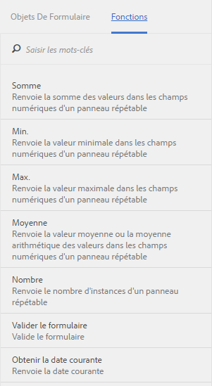

>[!NOTE]
>
>Vous pouvez effectuer une recherche de texte dans les noms et titres des objets et des fonctions depuis les onglets Objets de formulaire et Fonctions. 

Dans l’arborescence de gauche des objets de formulaire, vous pouvez appuyer sur les objets de formulaire pour afficher les règles appliquées à chacun des objets. Vous pouvez non seulement parcourir les règles des différents objets de formulaire mais également copier-coller des règles entre les objets du formulaire.  Pour plus d’informations, reportez-vous à la section[ Règles de Copier-coller](../../forms/using/rule-editor.md#p-copy-paste-rules-p).

### C. Basculement entre les objets de formulaire et les fonctions{#c-form-objects-and-functions-toggle-br} 

Le bouton Basculer, lorsqu’il est sélectionné, permet de basculer entre le volet des objets de formulaire et celui des fonctions.

### D. Éditeur de règles visuel {#d-visual-rule-editor}

Lorsque l’interface utilisateur de l’éditeur de règles est en mode éditeur visuel, l’éditeur de règles visuel est la zone dans laquelle vous créez des règles.  Il vous permet de sélectionner un type de règle et de définir en conséquence des conditions et des actions.  Lors de la définition des conditions et des actions dans une règle, vous pouvez glisser-déposer des objets de formulaire et des fonctions depuis le volet Objets de formulaire et Fonctions.

Pour plus d’informations sur l’utilisation de l’éditeur de règles visuel, reportez-vous à la section[ Création de règles](../../forms/using/rule-editor.md#p-write-rules-p). 

### E. Sélecteur des modes éditeur visuel-éditeur de code {#e-visual-code-editors-switcher}

Les utilisateurs appartenant au groupe des utilisateurs avancés de formulaires peuvent accéder à l’éditeur de code. L’éditeur de code n’est pas disponible pour les autres utilisateurs. Si vous disposez des droits, vous pouvez passer du mode éditeur visuel en mode éditeur de code et inversement, à l’aide d’un sélecteur situé au-dessus de l’éditeur de règles. Lorsque vous lancez l’éditeur de règles pour la première fois, il s’ouvre en mode Éditeur visuel. Vous pouvez créer des règles en mode Éditeur visuel ou passer en mode Éditeur de code pour créer un script de règle. Notez toutefois que si vous modifiez une règle ou si vous créez une règle dans l’éditeur de code, vous ne pouvez pas revenir à l’éditeur visuel pour cette règle sauf si vous avez désélectionné l’éditeur de code.

AEM Forms suit le mode Éditeur de règles que vous avez utilisé en dernier pour créer une règle. Lorsque vous lancez l’éditeur de règles la fois suivante, il s’ouvre dans ce mode. Toutefois, vous pouvez également configurer un mode par défaut pour ouvrir l’éditeur de règles dans le mode spécifié. Pour ce faire :

1. Go to AEM web console at `https://[host]:[port]/system/console/configMgr`.
1. Click to edit **[!UICONTROL Adaptive Form Configuration Service]**.
1. Sélectionnez **[!UICONTROL Éditeur visuel]** ou **[!UICONTROL Éditeur de code]** dans la liste déroulante **[!UICONTROL Mode par défaut de l’éditeur de règle]**.

1. Cliquez sur **[!UICONTROL Enregistrer]**.

### F. Boutons Terminé et Annuler {#f-done-and-cancel-buttons}

The **[!UICONTROL Done]** button is used to save a rule. Vous pouvez enregistrer une règle incomplète. Toutefois, les règles incomplètes ne sont pas valides et ne s’exécutent pas. Les règles enregistrées sur un objet de formulaire sont répertoriées lorsque vous lancez l’éditeur de règles à l’ouverture suivante du même objet de formulaire. Vous pouvez gérer les règles existantes dans cette vue. Pour plus d’informations, consultez la section [Gérer les règles](../../forms/using/rule-editor.md#p-manage-rules-p).

Le bouton **[!UICONTROL Annuler]** annule tous les changements apportés à une règle et ferme l’éditeur de règles.

## Règles d’écriture {#write-rules}

Vous pouvez créer des règles à l’aide de l’éditeur de règles visuel ou l’éditeur de code. Lorsque vous lancez l’éditeur de règles pour la première fois, il s’ouvre en mode d’éditeur visuel. Vous pouvez passer au mode d’éditeur de code et créer des règles. Notez toutefois que si vous créez ou modifiez une règle dans l’éditeur de code, vous ne pouvez pas basculer vers l’éditeur visuel pour cette règle sauf si vous avez désélectionné l’éditeur de code. Lorsque vous lancez l’éditeur de règles la fois suivante, il s’ouvre dans le mode que vous avez utilisé en dernier pour créer une règle.

Tout d’abord, examinons l’écriture de règles utilisant l’éditeur visuel.

### À l’aide de l’éditeur visuel {#using-visual-editor}

Examinons comment créer une règle dans l’éditeur visuel en utilisant l’exemple de formulaire suivant.


La section Conditions de prêt dans l’exemple de formulaire de demande de prêt requiert des demandeurs de spécifier leur état civil, leur salaire et, si mariés, le salaire de leur conjoint. D’après les entrées de l’utilisateur, la règle permet de calculer le montant d’éligibilité du prêt et l’affiche dans le champ Éligibilité de prêt. Appliquez les règles suivantes pour mettre en œuvre le scénario :

* Le champ Salaire du conjoint s’affiche uniquement lorsque la valeur État civil est Marié(e).
* Le montant d’éligibilité de prêt est 50% du salaire total.

Effectuez les étapes suivantes pour créer les règles :

1. Tout d’abord, créez la règle pour contrôler la visibilité du champ Salaire du conjoint en fonction de l’option de l’utilisateur pour le bouton radio État civil.

   Ouvrez le formulaire de demande de prêt en mode Création. Tap the **Marital Status** component and tap . Ensuite, appuyez sur **[!UICONTROL Créer]** pour lancer l’éditeur de règles.

   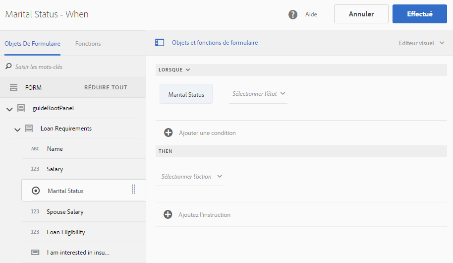

   Lorsque vous lancez l’éditeur de règles, la règle Lorsque est sélectionnée par défaut. En outre, l’objet de formulaire (dans ce cas, État civil) d’où vous avez lancé l’éditeur de règles est spécifié dans l’instruction Lorsque.

   Alors que vous ne pouvez pas changer ou modifier l’objet sélectionné, vous pouvez utiliser la liste déroulante de règles, comme indiqué ci-dessous, pour sélectionner un autre type de règle. Si vous souhaitez créer une règle sur un autre objet, appuyez sur Annuler pour quitter l’éditeur de règles et relancez-le depuis l’objet de formulaire de votre choix.

1. Tap **[!UICONTROL Select State]** drop-down and select **[!UICONTROL is equal to]**. Le champ **[!UICONTROL Saisissez une chaîne]** apparaît.

   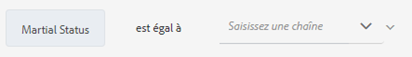

   In the Marital Status radio button, **Married** and **Single** options are assigned **0** and **1** values, respectively. Vous pouvez vérifier les valeurs assignées dans l’onglet Titre de la boîte de dialogue Modifier le bouton radio comme illustré ci-dessous.

   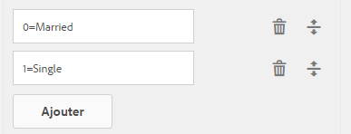

1. Dans le champ **Entrer une chaîne** dans la règle, indiquez **0**.

   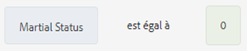

   Vous avez défini la condition comme `When Marital Status is equal to Married`. Ensuite, définissez l’action à effectuer si cette condition est True.

1. Dans l’instruction Alors, choisissez **[!UICONTROL Afficher]** dans le menu déroulant **[!UICONTROL Sélectionner l’action]**.

   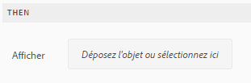

1. Drag-drop the **Spouse Salary** field from the Form Objects tab on the **Drop object or select here** field. Alternatively, tap the **Drop object or select here** field and select the **Spouse Salary** field from the pop-up menu, which lists all form objects in the form.

   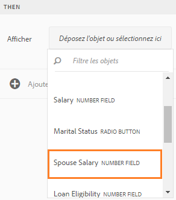

   La règle s’affiche comme suit dans l’éditeur de règles.

   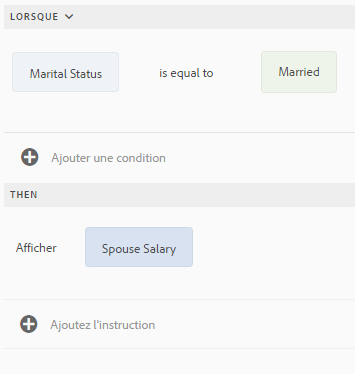

   Appuyez sur **Terminé** pour enregistrer la règle.

1. Répétez les étapes 1 à 5 pour définir une autre règle pour masquer le champ de salaire du conjoint si la valeur d’état civil est Célibataire. La règle s’affiche comme suit dans l’éditeur de règles.

   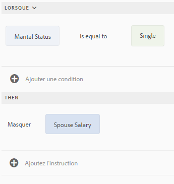

   >[!NOTE]
   >
   >Vous pouvez également créer une règle Afficher sur le champ Salaire du conjoint, au lieu de deux règles Lorsque sur le champ État civil, pour implémenter le même comportement.

   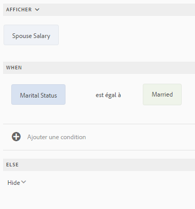

1. Ensuite, créez une règle afin de calculer le niveau d’éligibilité de prêt, qui est de 50 % du salaire total, puis affichez-la dans le champ Éligibilité de prêt. Pour ce faire, créez les règles **Définir la valeur de** sur le champ Éligibilité de prêt.

   In authoring mode, tap the **[!UICONTROL Loan Eligibility]** field and tap . Ensuite, appuyez sur **[!UICONTROL Créer]** pour lancer l’éditeur de règles.

1. Sélectionnez la règle **[!UICONTROL Définir la valeur de]** dans la liste déroulante des règles.

   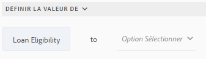

1. Tap **[!UICONTROL Select Option]** and select **[!UICONTROL Mathematical Expression]**. Un champ permettant de saisir l’expression mathématique s’ouvre.

   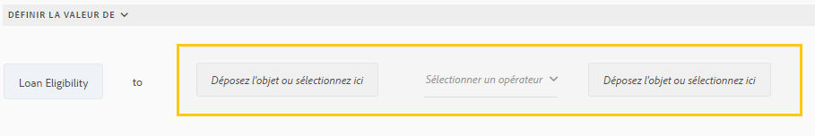

1. Dans le champ de l’expression :

   * Sélectionnez ou glissez-déposez depuis l’onglet Objets de formulaire le champ **Salaire** dans le premier champ **Déposez l’objet ou sélectionnez ici**.

   * Sélectionnez **Plus** dans le champ **Sélectionner un opérateur**.

   * Select or drag-drop from the Forms Object tab the **Spouse Salary** field in the other **Drop object or select here** field.
   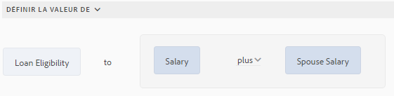

1. Next, tap in the highlighted area around the expression field and tap **Extend Expression**.

   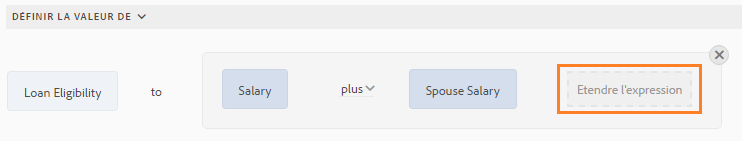

   Dans le champ d’expression étendu, sélectionnez **divisé par** depuis le champ **Sélectionner un opérateur** et **Nombre** depuis le champ **Sélectionner une option**. Spécifiez ensuite la valeur **2** dans le champ Nombre.

   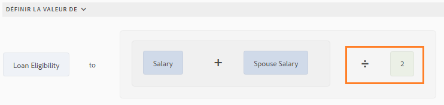

   >[!NOTE]
   >
   >Vous pouvez créer des expressions complexes à l’aide de composants, de fonctions, d’expressions mathématiques, et des valeurs de propriété dans le champ Sélectionner une option.

   Créez ensuite une condition qui fait que, lorsque True est renvoyé, l’expression s’exécute.

1. Tap **Add Condition** to add a When statement.

   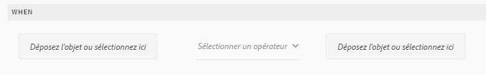

   Dans l’instruction Lorsque :

   * Sélectionnez ou glissez-déposez depuis l’onglet Objets de formulaire le champ **État civil** dans le premier champ **Déposez l’objet ou sélectionnez ici**.

   * Sélectionnez **est égal à** depuis le champ **Sélectionner un opérateur**.

   * Select String in the other **Drop object or select here** field and specify **Married** in the **Enter a String** field.
   La règle s’affiche finalement comme suit dans l’éditeur de règles.  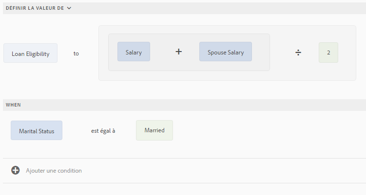

   Appuyez sur **Terminé** pour enregistrer la règle.

1. Répétez les étapes 7 à 12 pour définir une autre règle pour calculer le montant d’éligibilité si la valeur d’état civil est Célibataire. La règle s’affiche comme suit dans l’éditeur de règles.

   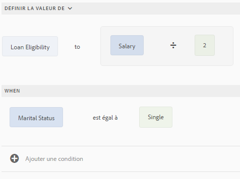

>[!NOTE]
>
>Vous pouvez également utiliser la règle Définir la valeur de pour calculer l’éligibilité de prêt dans la règle Lorsque que vous avez créée pour afficher ou masquer le champ Salaire du conjoint. La règle combinée résultante lorsque la valeur État civil est Célibataire s’affiche comme suit dans l’éditeur de règles.
>
>De même, vous pouvez entrer une règle combinée pour contrôler la visibilité du champ Salaire du conjoint lorsque la valeur d’état civil est Marié(e).

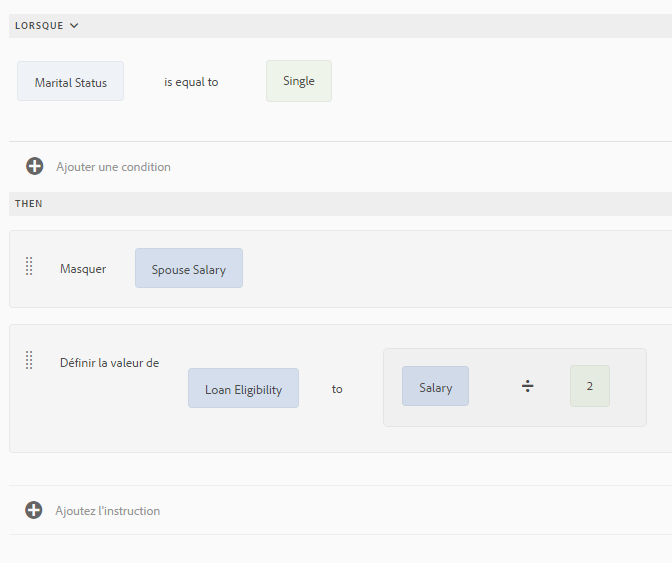

### À l’aide de l’éditeur de code {#using-code-editor}

Les utilisateurs ajoutés au groupe des utilisateurs avancés de formulaires peuvent utiliser l’éditeur de code. L’éditeur de règles génère automatiquement le code javascript pour toute règle que vous créez à l’aide de l’éditeur visuel. Vous pouvez basculer de l’éditeur visuel à l’éditeur de code pour afficher le code généré. Cependant, si vous modifiez le code de règle dans l’éditeur de code, vous ne pouvez pas revenir à l’éditeur visuel. Si vous préférez les règles d’écriture de l’éditeur de code plutôt que celles de l’éditeur visuel, vous avez la possibilité de définir de nouvelles règles dans l’éditeur de code. Le bouton bascule des éditeurs visuel-code vous permet de passer d’un mode à l’autre.

Le code JavaScript de l’éditeur de code est le langage   des formulaires adaptatifs. Toutes les expressions sont des expressions JavaScript valides qui utilisent des API de modèle de script pour les formulaires adaptatifs. Ces expressions renvoient des valeurs de certains types. Pour obtenir la liste complète des classes de formulaires adaptatifs, des événements, des objets et des API publiques, consultez la [référence d’API de bibliothèque JavaScript pour les formulaires adaptatifs.](https://helpx.adobe.com/fr/experience-manager/6-5/forms/javascript-api/index.html)

Pour plus d’informations sur la création de règles dans l’éditeur de code, reportez-vous à la section[ Expressions de formulaire adaptatif](/help/forms/using/adaptive-form-expressions.md).

Lorsque vous écrivez du code en JavaScript dans l’éditeur de règle, les repères visuels suivants vous aident avec la structure et la syntaxe :

* Mise en valeur de la syntaxe
* Mise en retrait automatique
* Conseils et suggestions pour les objets Formulaire, leurs fonctions et leurs propriétés
* Remplissage automatique des noms de composants du formulaire et des fonctions JavaScript courantes

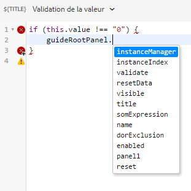

#### Fonctions personnalisées dans l’éditeur de règles {#custom-functions}

Apart from the out-of-the-box functions like *Sum of* that are listed under Functions Output, you can write custom functions that you frequently need. Assurez-vous que la fonction que vous créez est accompagnée du `jsdoc` au-dessus.

Accompanying `jsdoc` is required:

* Si vous souhaitez personnaliser la configuration et la description.
* Because there are multiple ways to declare a function in `JavaScript,` and comments let you keep a track of the functions.

For more information, see [usejsdoc.org](https://usejsdoc.org/).

Balises `jsdoc` prises en charge :

* **Syntaxe privée**: `@private`Une fonction privée n’est pas incluse en tant que fonction personnalisée.

* **Syntaxe du nom**: `@name funcName <Function Name>`Vous pouvez également `,` utiliser : `@function funcName <Function Name>`**ou** `@func` `funcName <Function Name>`.
   `funcName` est le nom de la fonction (aucun espace autorisé).
   `<Function Name>` est le nom d’affichage de la fonction.

* **Syntaxe des membres**: `@memberof namespace`Joint un   à la fonction.

* **Syntaxe des paramètres**: Vous pouvez `@param {type} name <Parameter Description>`également utiliser : `@argument` `{type} name <Parameter Description>` ou **** `@arg` `{type}` `name <Parameter Description>`.
Affiche les paramètres utilisés par la fonction. Une fonction peut comporter plusieurs balises de paramètre, une balise pour chaque paramètre dans l’ordre d’occurrence.
   `{type}` représente le type de paramètre. Les types de paramètre sont les suivants : 

   1. chaîne
   1. nombre
   1. booléen
   Tous les autres types de paramètre sont classés en dessous de l’un des précédents. Aucun n’est pas pris en charge. Assurez-vous que vous sélectionnez l’un des types ci-dessus. Les types ne sont pas sensibles à la casse. Spaces are not allowed in the parameter `name`. `<Parameter Descrption>` `<parameter>  can have multiple words. </parameter>`

* **Syntaxe du type** de retour : Vous pouvez `@return {type}`également utiliser `@returns {type}`.
Ajoute des informations sur la fonction, telles que son objectif.
{type} représente le type de retour de la fonction. Les types de retour autorisés sont les suivants : 

   1. chaîne
   1. nombre
   1. booléen
   Tous les autres types de retour sont classés en dessous de l’un des précédents. Aucun n’est pas pris en charge. Assurez-vous que vous sélectionnez l’un des types ci-dessus. Les types de retour ne sont pas sensibles à la casse.

>[!NOTE]
>
>Les commentaires avant une fonction personnalisée sont utilisés pour le résumé. Le résumé peut s’étendre sur plusieurs lignes jusqu’à ce qu’une balise soit trouvée. Limitez la taille à une seule pour une description concise dans le créateur de règles.

**Ajout d’une fonction personnalisée** 

Par exemple, vous voulez ajouter une fonction personnalisée qui calcule la surface d’un carré. La longueur du côté est la valeur entrée par l’utilisateur à la fonction personnalisée, qui est acceptée à l’aide d’une zone numérique dans le formulaire. La sortie calculée s’affiche dans une autre zone numérique dans le formulaire. Pour ajouter une fonction personnalisée, vous devez d’abord créer une bibliothèque cliente, puis l’ajouter au référentiel CRX.

Exécutez les étapes suivantes pour créer une bibliothèque cliente et l’ajouter dans le référentiel CRX.

1. Créez une bibliothèque cliente. Pour en savoir plus, voir [Utilisation des bibliothèques côté client](/help/sites-developing/clientlibs.md).
1. In CRXDE, add a property `categories`with string type value as `customfunction` to the `clientlib` folder.

   >[!NOTE]
   >
   >`customfunction`est un exemple de . You can choose any name for the category you create in the `clientlib`folder.

Une fois que vous avez ajouté votre bibliothèque client dans le référentiel CRX, utilisez-la dans votre formulaire adaptatif. Cela vous permet d’utiliser votre fonction personnalisée comme règle dans votre formulaire. Effectuez les étapes suivantes pour ajouter la bibliothèque cliente dans votre formulaire adaptatif.

1. Ouvrez votre formulaire en mode d’édition.
To open a form in edit mode, select a form and tap **Open**.
1. In the edit mode, select a component, then tap  > **Adaptive Form Container**, and then tap .
1. Dans la zone latérale, sous Nom de bibliothèque cliente, ajoutez votre bibliothèque cliente. ( `customfunction` in the example.)

   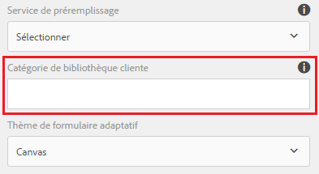

1. Select the input numeric box, and tap  to open the rule editor.
1. Appuyez sur **Créer une règle**. À l’aide des options indiquées ci-dessous, créez une règle pour enregistrer la valeur carrée de l’entrée dans le champ Sortie de votre formulaire.
   [ 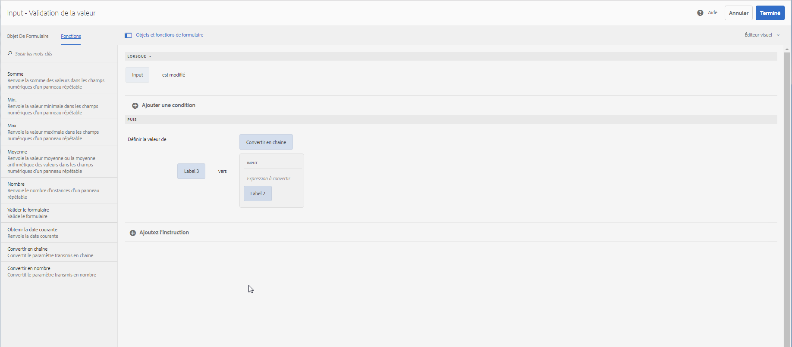](assets/add-custom-rule.png)règleAppuyez sur **Terminé**. Votre fonction personnalisée est ajoutée.

#### Types pris en charge de déclaration de fonction {#function-declaration-supported-types}

**Instruction de fonction**

```
function area(len) {
    return len*len;
}
```

This function is included without `jsdoc` comments.

**Expression de fonction** 

```
var area;
//Some codes later
/** */
area = function(len) {
    return len*len;
};
```

**Expression et instruction de fonction** 

```
var b={};
/** */
b.area = function(len) {
    return len*len;
}
```

**Déclaration de fonction en tant que variable** 

```
/** */
var x1,
    area = function(len) {
        return len*len;
    },
    x2 =5, x3 =true;
```

Limite : la fonction personnalisée prend uniquement la première déclaration de fonction de la liste des variables, si elles sont ensemble. Vous pouvez utiliser l’expression de fonction pour chaque fonction déclarée.

**Déclaration de fonction en tant qu’objet** 

```
var c = {
    b : {
        /** */
        area : function(len) {
            return len*len;
        }
    }
};
```

>[!NOTE]
>
>Assurez-vous que vous utilisez`jsdoc`   pour chaque fonction personnalisée. Although `jsdoc`comments are encouraged, include an empty `jsdoc`comment to mark your function as custom function. Cela permet la manipulation par défaut de votre fonction personnalisée.

## Gestion des règles {#manage-rules}

Any existing rules on a form object are listed when you tap the object and tap . Vous pouvez afficher le titre et un aperçu du résumé de la règle. En outre, l’interface utilisateur vous permet de développer et d’afficher le résumé complet de la règle, de changer l’ordre des règles, de modifier les règles et de supprimer des règles.

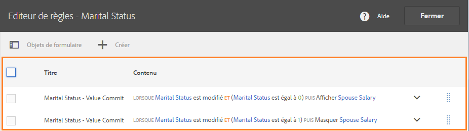

Vous pouvez effectuer les actions suivantes sur les règles :

* **Développer/Réduire** : la colonne Contenu dans la liste des règles affiche le contenu des règles. If the entire rule content is not visible in the default view, tap  to expand it.

* **Réorganiser** : toute nouvelle règle que vous créez est empilée au bas de la liste des règles. Les règles sont exécutées de haut en bas. La règle en haut s’exécute en premier suivie des autres règles du même type. Par exemple, si vous avez les règles Lorsque, Afficher, Activer et Lorsque en première, deuxième, troisième et quatrième position depuis le haut respectivement, la règle Lorsque du haut est exécutée en premier suivie de la règle Lorsque à la quatrième position. Ensuite, les règles Afficher et Activer seront exécutées.
You can change the order of a rule by tapping  against it or drag-drop it to the desired order in the list.

* **Modifier** : pour modifier une règle, cochez la case située en regard du titre de la règle. D’autres options de modification et de suppression de la règle s’affichent. Tap **Edit** to open the selected rule in the rule editor in visual or code editor mode depending the mode used to create the rule.

* **Supprimer**: Pour supprimer une règle, sélectionnez-la et appuyez sur **Supprimer**.

* **Activer/Désactiver** : vous devrez peut-être suspendre temporairement l’utilisation d’une règle. Vous pouvez sélectionner une ou plusieurs règles puis appuyer sur Désactiver dans la barre d’outils Actions pour les désactiver. Si une règle est désactivée, elle ne s’exécute pas au moment de l’exécution. Pour activer une règle désactivée, vous pouvez la sélectionner puis appuyer sur Activer dans la barre d’outils Actions. La colonne État de la règle indique si la règle est activée ou désactivée.

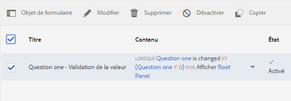

## Règles de copier-coller {#copy-paste-rules}

Vous pouvez copier-coller une règle d’un champ à d’autres champs similaires pour gagner du temps.

Pour copier-coller des règles, procédez comme suit :

1. Tap the form object from which you want to copy a rule, and in the component toolbar tap . L’interface utilisateur de l’éditeur de règles s’affiche avec l’objet de formulaire sélectionné et les règles existantes s’affichent.

   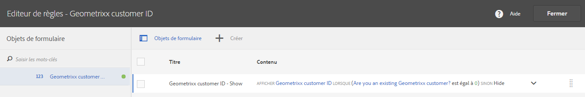

   Pour plus d’informations sur la gestion des règles existantes, consultez la section [Gestion des règles](../../forms/using/rule-editor.md#p-manage-rules-p).

1. Cochez la case en regard du titre de la règle. D’autres options de gestion des règles s’affichent. Appuyez sur **Copier**.

   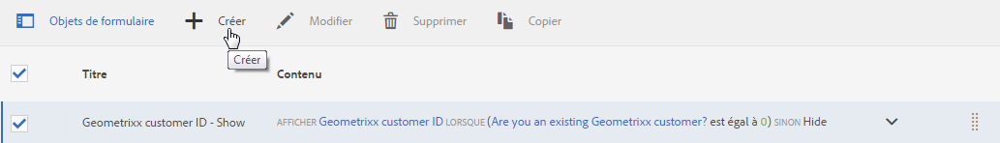

1. Select another form object to which you want to paste the rule and tap **Paste**. De plus, vous pouvez modifier la règle pour y apporter des modifications.

   >[!NOTE]
   >
   >Vous pouvez coller une règle à un autre objet de formulaire uniquement si cet objet de formulaire prend en charge les événements de règle copiée. Par exemple, un bouton prend en charge l’événement Cliquer. Vous pouvez coller une règle avec un événement Cliquer sur un bouton mais pas dans une case à cocher.

1. Appuyez sur **Terminé** pour enregistrer la règle.

## Expressions imbriquées {#nestedexpressions}

L’éditeur de règles vous permet d’utiliser plusieurs opérateurs ET et OU afin de créer des règles imbriquées. Vous pouvez fusionner plusieurs opérateurs ET et OU dans les règles.

Voici un exemple de règle imbriquée qui affiche un message à l’utilisateur au sujet de l’éligibilité pour un droit de garde lorsque les conditions nécessaires sont remplies.

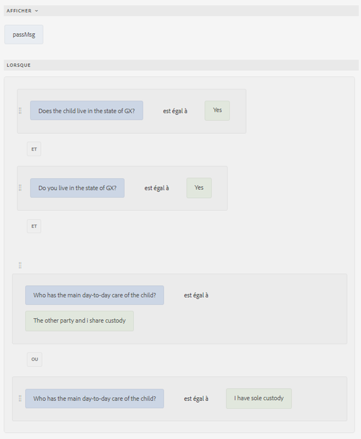

Vous pouvez également faire glisser et déposer des conditions dans une règle pour la modifier. Tap and hover over the handle ( ) before a condition. Une fois le pointeur affiché sous forme de main comme illustré ci-dessous, faites glisser la condition et déposez-la n’importe où dans la règle. La structure de la règle change.


## Conditions d’expression de date {#dateexpression}

L’éditeur de règles vous permet d’utiliser des comparaisons de dates afin de créer des conditions.

Voici un exemple de condition qui affiche un objet de texte statique si l’hypothèque sur la maison est déjà prise, ce que l’utilisateur signifie en remplissant le champ de date.

Lorsque la date du prêt hypothécaire de la propriété indiquée par l’utilisateur est déjà dépassée, le formulaire adaptatif affiche une remarque concernant le calcul des revenus. La règle suivante compare la date indiquée par l’utilisateur avec la date actuelle et si la date indiquée par l’utilisateur est antérieure à la date actuelle, le formulaire affiche le message texte (appelé Revenu).

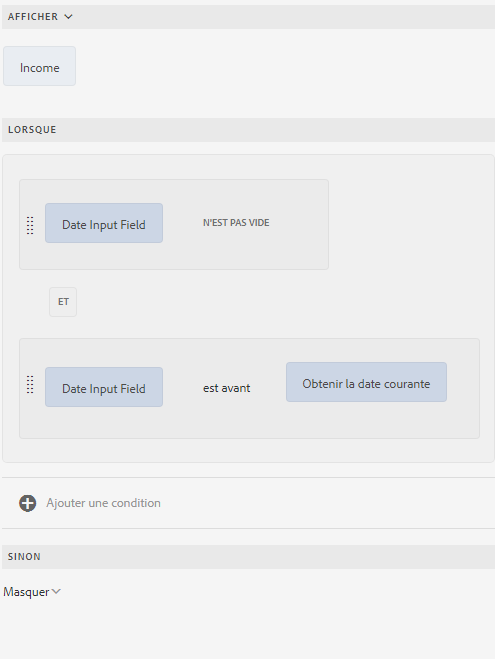

Lorsque la date remplie est antérieure à la date actuelle, le formulaire affiche le message texte (Revenu) comme suit :


## Conditions de comparaison des nombres {#number-comparison-conditions}

L’éditeur de règles vous permet de créer des conditions qui comparent deux nombres.

Voici un exemple de condition qui affiche un objet de texte statique si le nombre de mois qu’un demandeur reste à son adresse actuelle est inférieur à 36.

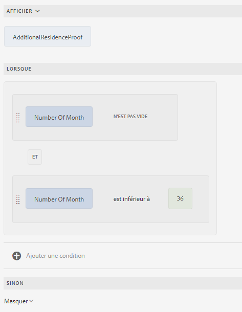

Lorsque l’utilisateur indique qu’il habite à son adresse résidentielle actuelle depuis moins de 36 mois, le formulaire affiche une notification indiquant qu’un justificatif de domicile supplémentaire peut être demandé.


## Impact de l’éditeur de règles sur les scripts existants {#impact-of-rule-editor-on-existing-scripts}

Dans les versions AEM Forms antérieures à la version AEM Forms 6.1 Pack 1, les auteurs et les développeurs de formulaires créaient des expressions dans l’onglet Script de la boîte de dialogue Modifier le composant pour ajouter un comportement dynamique aux formulaires adaptatifs. L’onglet Scripts est désormais remplacé par l’éditeur de règles.

Tous les scripts ou expressions que vous deviez saisir dans l’onglet Scripts sont disponibles dans l’éditeur de règles. Alors que vous ne pouvez pas les afficher ou les modifier dans l’éditeur visuel, vous pouvez modifier les scripts dans l’éditeur de code si vous appartenez au groupe des utilisateurs avancés de formulaires.

## Exemples de règles {#example}

### Appeler le service de modèle de données de formulaire {#invoke}

Imaginons un service Web `GetInterestRates` prenant le montant du prêt, la durée et la cote de solvabilité du demandeur comme valeurs d’entrée et renvoyant un régime de prêt incluant le montant des mensualités et le taux d’intérêt. Créez un modèle de données de formulaire en utilisant le service Web comme source de données. You add data model objects and a `get` service to the form model. Le service apparaît dans l’onglet Services du modèle de données de formulaire. Ensuite, créez un formulaire adaptatif incluant des champs à partir d’objets du modèle de données pour capturer les entrées utilisateurs pour le montant du prêt, la durée et la cote de solvabilité. Ajoutez un bouton qui demande au service Web d’extraire les détails du plan. La sortie est renseignée dans les champs appropriés.

La règle suivante indique comment configurer l’action Appel du service pour accomplir l’exemple de scénario.

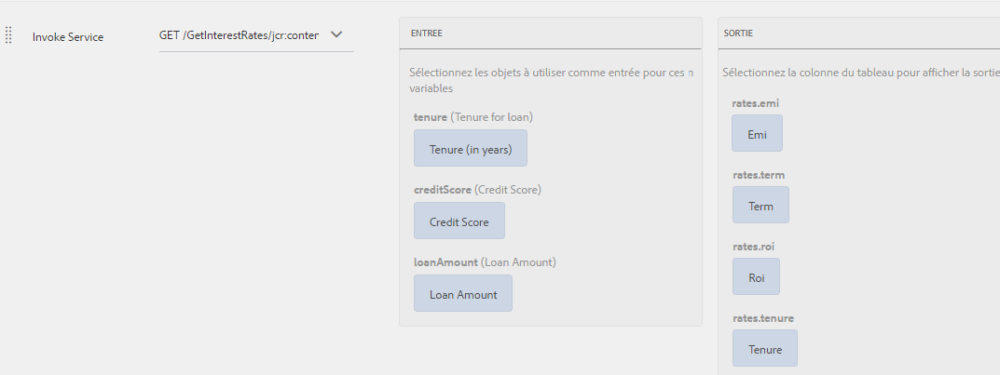

Appeler le service de modèle de données de formulaire à l’aide d’une règle de formulaire adaptatif

### Déclenchement de plusieurs actions, à l’aide de la règle Lorsque {#triggering-multiple-actions-using-the-when-rule}

Dans un formulaire de demande de prêt, vous voulez savoir si le demandeur de prêt est un client existant ou non. En fonction des informations fournies par l’utilisateur, le champ ID du client doit s’afficher ou se masquer. En outre, vous souhaitez placer le focus sur le champ d’ID de client si l’utilisateur est un client existant. Le formulaire de demande de prêt est composé des éléments suivants :

* Un bouton radio,**Êtes-vous déjà client(e) chez Geometrix ?**, qui propose les options Oui et Non. La valeur de Oui est **0** et de Non est **1**.

* Un champ de texte,**ID de client Geometrixx**, pour indiquer l’ID du client.

Lorsque vous entrez une règle Lorsque sur le bouton radio pour implémenter ce comportement, la règle s’affiche comme suit dans l’éditeur de règles visuel.  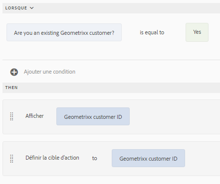

Règle dans l’éditeur visuel

Dans l’exemple de règle, l’instruction suivante dans la section Lorsque est la condition qui, si elle renvoie True, exécute les actions spécifiées dans la section Alors.

La règle s’affiche comme suit dans l’éditeur de code.

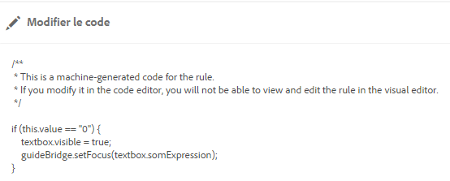

Règle dans l’éditeur de code

### Utilisation d’une sortie de fonction au sein d’une règle {#using-a-function-output-in-a-rule}

Dans un formulaire de bon de commande, vous avez le tableau suivant, dans lequel les utilisateurs rempliront leurs commandes. Dans le tableau ci-dessous :

* La première ligne est répétable, de sorte que les utilisateurs peuvent commander plusieurs produits et spécifier différentes quantités. Its element name is `Row1`.
* Le titre de la cellule dans la colonne Quantité de produit de la ligne répétable est Quantité. Le nom de l’élément pour cette cellule est`productquantity` .
* La deuxième ligne du tableau est non répétable et le titre de la cellule dans la colonne Quantité de produit dans cette ligne est Quantité totale.

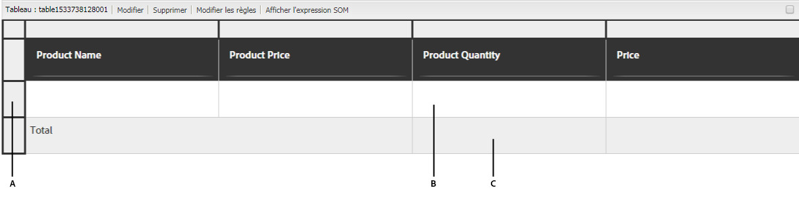

**A.** Ligne1 **B.** Quantité **C.** Quantité totale

Maintenant, vous souhaitez ajouter des quantités spécifiées dans la colonne Quantité de produit pour tous les produits et afficher la somme dans la cellule Quantité totale. Vous pouvez obtenir ce résultat en saisissant une règle Définir la valeur de sur la cellule Quantité totale, comme illustré ci-dessous.

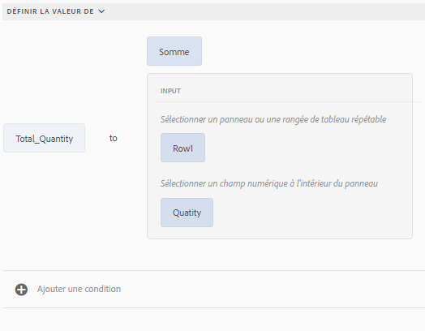

Règle dans l’éditeur visuel

La règle s’affiche comme suit dans l’éditeur de code.

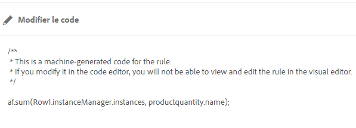

Règle dans l’éditeur de code

### Validation d’une valeur de champ à l’aide d’une expression {#validating-a-field-value-using-expression}

Dans le formulaire de bon de commande décrit dans l’exemple précédent, vous souhaitez empêcher l’utilisateur de commander plus d’une quantité de n’importe quel produit dont le prix est supérieur à 10 000. Pour ce faire, vous pouvez rédiger pour une règle Valider comme illustré ci-dessous.

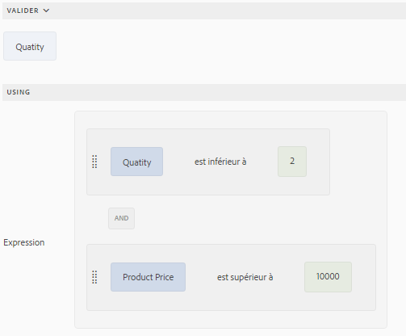

Règle dans l’éditeur visuel

La règle s’affiche comme suit dans l’éditeur de code.

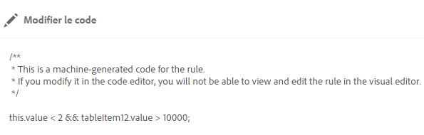

Règle dans l’éditeur de code

