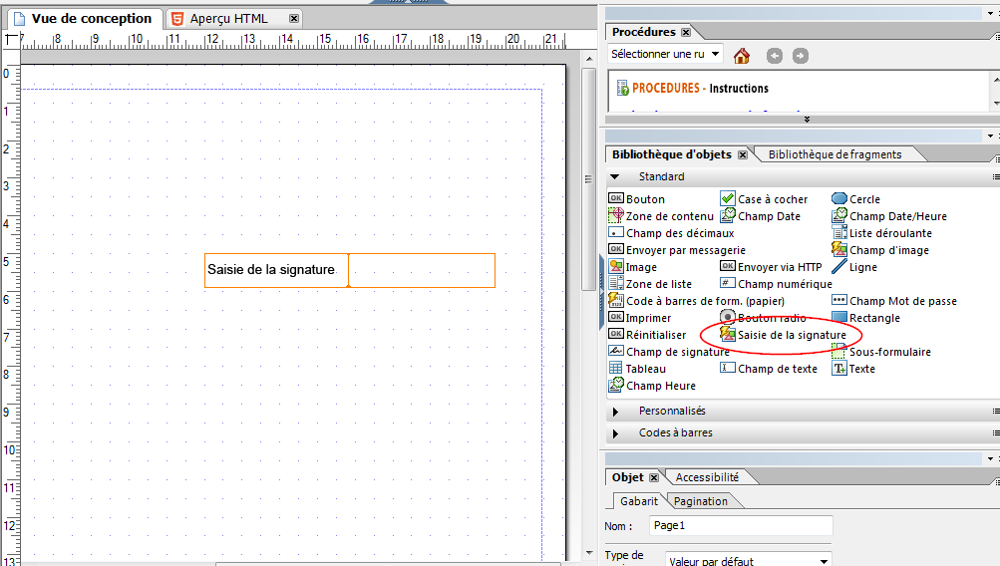

# Utilisation de la signature tactile dans les formulaires HTML5{#using-scribble-signature-in-html-forms}

Les formulaires HTML5 sont de plus en plus utilisés sur les périphériques tactiles, qui prennent tous en charge les signatures. La saisie tactile, consistant à écrire avec un stylet ou un doigt, devient un moyen accepté de signer des formulaires sur les périphériques mobiles. Les formulaires HTML5 et Forms Designer offrent désormais la possibilité d’afficher un champ de signature tactile dans le formulaire. Lorsque le formulaire est rendu dans le navigateur, vous pouvez signer dans ces champs avec un stylet, la souris ou le doigt.

## Comment créer un formulaire utilisant un champ de signature tactile  {#how-to-design-a-form-using-scribble-signature-field}

1. Ouvrez un formulaire dans Forms Designer.
1. Faites glisser le champ de signature tactile vers la page.

   

   >[!NOTE]
   >
   >Les Dimensions du champ sélectionné dans Forms Designer sont répercutées lors du rendu du champ. Toutefois, la dimension de la zone de signature rendue est calculée en fonction des proportions du champ et non des dimensions spécifiées dans Forms Designer.

1. Configurez le champ de signature tactile.

   Par défaut, le champ de signature tactile marque les informations de géolocalisation comme étant obligatoires au cours du processus de signature sur iPad (elles sont facultatives pour les autres périphériques). Ce comportement par défaut peut être remplacé en modifiant la valeur de la propriété `geoLocMandatoryOnIpad`. Cette propriété est exposée en tant qu’extras dans le champ de signature tactile. Les étapes permettant de modifier ce champ sont les suivantes :

   1. Dans le formulaire, sélectionnez le champ de signature tactile.
   1. Sélectionnez l’onglet **Source XML**.

      >[!NOTE]
      >
      >Pour ouvrir l’onglet Source XML, cliquez sur **Vue** > **Source XML**.

   1. Localisez la balise `<ui>` dans la balise `<field>` et modifiez le code source pour qu’il ressemble à ce qui suit :

      ```xml
      <extras name="x-scribble-add-on">
      <boolean name="geoLocMandatoryOnIpad">0</boolean>
      </extras>
      ```

   1. Sélectionnez l’onglet **Vue de conception**. Dans la boîte de dialogue de confirmation, cliquez sur **Oui**.
   1. Enregistrez le formulaire.

1. Effectuez un rendu du formulaire sur un navigateur de périphérique/bureau pris en charge.

## Utilisation de l&#39;interface des signatures tactiles {#interfacing-with-the-scribble-signatures}

### Signature {#signing}

Une fois qu’un champ de signature tactile a été ajouté au formulaire et généré, cliquer ou tapoter le champ ouvre une boîte de dialogue. L’utilisateur peut apposer une signature tactile dans la zone de dessin représentée par un rectangle en pointillés à l’aide d’une souris, d’un doigt ou d’un stylet.


**A.** Brosse  **B.** Gomme  **C.** Géolocalisation  **D.** Informations de géolocalisation

### Géo-marquage {#geo-tagging}

Si vous cliquez sur l’icône de géolocalisation lors de la création de la zone de saisie tactile, l’emplacement géographique et les informations temporelles sont ajoutés au champ.

>[!NOTE]
Sur l’iPad, l’intégration des informations de géolocalisation est obligatoire par défaut.

Sur l’iPad, l’icône de géolocalisation n’est pas affichée par défaut et les informations de géolocalisation sont automatiquement intégrées lorsque vous cliquez sur **OK**.

Pour les iPad, ce paramètre peut être modifié en remplaçant la valeur du paramètre `geoLocManadatoryOnIpad` par `0`, dans les paramètres initiaux du champ.

* Lorsque les informations de géolocalisation sont obligatoires, une zone réduite de dessin est présentée à l’utilisateur. Le texte de géolocalisation est ajouté lorsque l’utilisateur clique sur l’icône **OK** dans la zone restante.
* Dans d’autres cas, une zone totalement accessible en écriture est présentée à l’utilisateur. Si l’utilisateur choisit d’intégrer les informations de géolocalisation, cette zone est redimensionnée pour s’adapter au texte de géolocalisation.

### Effacement d’une signature  {#clearing-a-signature}

Lors de l’utilisation de cette fonctionnalité, un utilisateur peut cliquer sur l’icône **Gomme** pour effacer le champ et effectuer un début. Si des informations de géolocalisation ont été ajoutées, elles sont également effacées.

### Enregistrement d’une signature  {#saving-a-signature}

Cliquez sur l’icône **OK** pour enregistrer la saisie tactile sous la forme d’une image dans le champ. L’image et les valeurs peuvent être transmises au serveur pour un traitement ultérieur. Une fois qu’un utilisateur a cliqué sur **OK**, la saisie tactile effectuée est verrouillée. La signature ne peut pas être remodifiée à l’aide du widget de saisie tactile.

Appuyez ou cliquez sur le champ de saisie tactile pour ouvrir la boîte de dialogue en mode lecture seule.


### Sélection de la taille du stylo {#selecting-pen-size}

Cliquez sur l’icône **Brosses** pour afficher la liste des tailles de stylo disponibles. Tapotez ou cliquez sur la taille de stylo correspondant au stylo à utiliser.

### Suppression des signatures du formulaire  {#delete-signatures-from-the-form}

Pour supprimer les signatures du formulaire :

* (Périphériques mobiles) Appuyez de manière prolongée sur le champ de signature et, dans la boîte de dialogue de confirmation, appuyez sur **Oui**.
* (Ordinateur de bureau) Survolez le champ de signature, cliquez sur l’icône **Annuler** et, dans la boîte de dialogue de confirmation, cliquez sur **Oui**.
