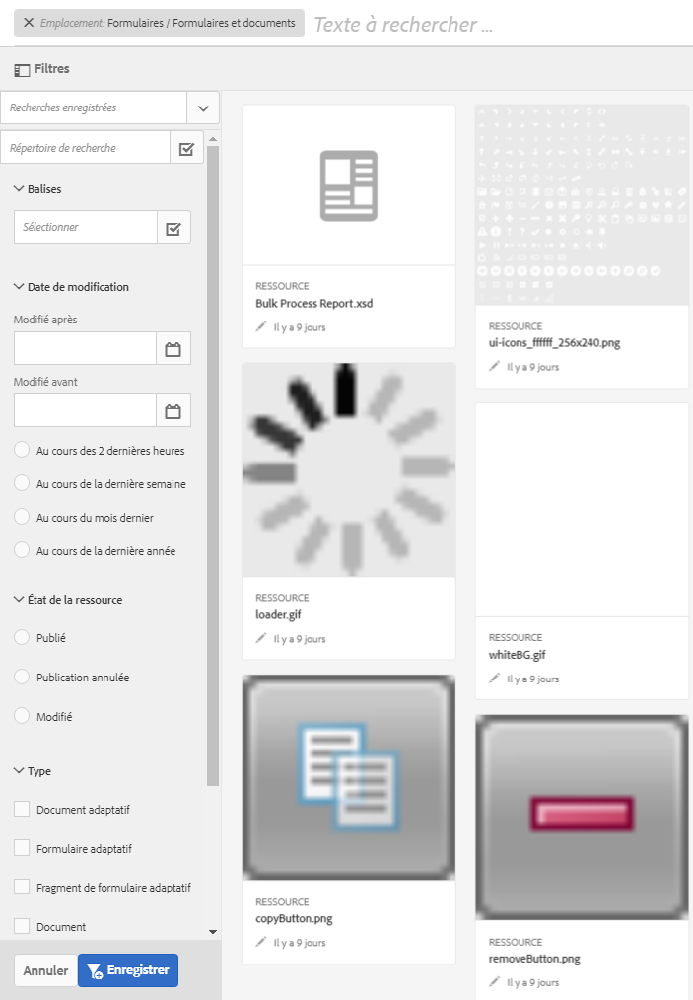

# Rechercher des formulaires et des ressources{#searching-for-forms-and-assets}

Vous pouvez rechercher vos formulaires ou ressources de formulaire à l’aide d’une chaîne de texte ou d’une chaîne de texte accompagnée de caractères génériques. Vous pouvez également préciser la recherche à l’aide des critères disponibles dans différentes catégories du panneau Rechercher.

Lorsque vous sélectionnez un ou plusieurs critères et spécifiez également une chaîne de texte, l’intersection du texte et des critères est renvoyée sous la forme de résultats de la recherche. La qualité des résultats est équivalente à celles des métadonnées de formulaires et de ressources fournies.

Cliquez sur  pour afficher ou masquer le panneau de recherche.

## Recherche de base {#basic-search}

La recherche de base constitue le type de recherche par défaut. Elle s’exécute sans spécifier aucun filtre. La recherche en texte intégral sur des propriétés de métadonnées est effectuée par AEM Forms.

Pour effectuer une recherche de base, saisissez la requête dans le champ de texte et appuyez ensuite sur Entrée. Vous pouvez également saisir le caractère générique (&#42;) pour faire correspondre un nombre indéfini de caractères.

Adobe Experience Manager recherche le texte saisi dans les propriétés de métadonnées et renvoie les résultats correspondants. Si vous saisissez plusieurs mots, l’opération de recherche correspond à la totalité du texte.

Tenez compte des points suivants au sujet de la recherche de base :

* La recherche est effectuée à l’aide des propriétés de métadonnées de formulaire et de ressource.
* Si vous saisissez plusieurs mots, l’opération de recherche correspond à la totalité du texte.
* La recherche ne respecte pas la casse. Par exemple, lorsque vous saisissez `geometrixx`, des ressources intitulées `Geometrixx`, `GEOMETRIXX` et `GeoMetRixx` sont reprises dans les résultats de la recherche.

* Les correspondances partielles d’un mot ne sont pas prises en charge. Pour effectuer une recherche en utilisant des chaînes partielles, utilisez le caractère générique &#42;. Toutefois, si la requête correspond à un mot complet, la ressource ou le formulaire correspondant s’affiche.
* Les espaces supplémentaires sont respectés et ne sont pas coupés lors de la recherche. Par exemple : `My form` n’est pas la même requête que `My form`.

* Si les données et les valeurs d’affichage des champs dans les propriétés de métadonnées sont différentes, vous ne pouvez pas utiliser ces valeurs comme paramètres de recherche. Par exemple, vous ne pouvez effectuer de recherche sur la base du statut, tel que Modifié ou Publié, car ces propriétés sont stockées dans un format différent.

## Recherche avancée {#advanced-search}

Dans les critères de recherche, outre la requête, vous pouvez spécifier certains paramètres de recherche pour améliorer l’efficacité et la précision de la recherche.

Champ de recherche et paramètres ou filtres du formulaire AEM et de recherche de ressources

### Chemin d&#39;accès à la ressource {#asset-path}

Le filtre de chemin d’accès aux ressources vous permet de limiter les résultats de la recherche au répertoire actuel. Si l’option Rechercher dans le répertoire actuel n’est pas sélectionnée, les résultats de la recherche contiennent des ressources provenant du répertoire de base. Si la page en cours n’est pas un répertoire et que l’option Rechercher dans le répertoire actuel est sélectionnée, la recherche renvoie les éléments figurant dans le répertoire parent.

### Modification des ressources {#asset-modification}

Sélectionnez l’une des options suivantes afin d’effectuer des recherches dans toutes les ressources modifiées au cours d’une période donnée.

| **Option** | **Description** |
|---|---|
| Il y a deux heures | Recherche parmi toutes les ressources qui ont été modifiées au cours des deux dernières heures. |
| Il y a une semaine | Recherche parmi toutes les ressources qui ont été modifiées au cours de la semaine écoulée. |
| Il y a un mois | Recherche parmi toutes les ressources qui ont été modifiées au cours du dernier mois. |
| Il y a un an | Recherche parmi toutes les ressources qui ont été modifiées au cours de l’année écoulée. |

### Statut de la ressource {#asset-status}

Vous pouvez rechercher des ressources en utilisant l’un des états suivants :

* **Publié** : recherche toutes les ressources publiées et non modifiées après la publication.

* **Dépublié** : recherche toutes les ressources qui ne sont jamais publiées.

* **Modifié** : recherche toutes les ressources qui sont modifiées ou dont la publication a été annulée après la publication.

### Type de ressource {#asset-type}

Vous pouvez choisir un grand nombre de types de ressources. La recherche renvoie tous les types de ressources sélectionnés réunis.

<table>
 <tbody>
  <tr>
   <th>Option</th> 
   <th>Description</th> 
  </tr>
  <tr>
   <td>Modèle de formulaire  </td> 
   <td>Recherche dans tous les modèles de formulaire.  </td> 
  </tr>
  <tr>
   <td>Formulaire PDF</td> 
   <td>Recherche dans tous les documents PDF.</td> 
  </tr>
  <tr>
   <td>Document</td> 
   <td>Recherche dans tous les documents.</td> 
  </tr>
  <tr>
   <td>Formulaire adaptatif  </td> 
   <td>Recherche dans tous les formulaires adaptatifs.</td> 
  </tr>
  <tr>
   <td>Ressource</td> 
   <td>Recherche dans toutes les ressources.  </td> 
  </tr>
 </tbody>
</table>

### Balises {#tags}

Les balises sont des libellés associés à des ressources pour identification. Lors de la recherche, sélectionnez un nombre de balises dans la liste déroulante ou ajoutez des balises personnalisées, si nécessaire. Un résultat de recherche contient l’intersection des balises sélectionnées.
